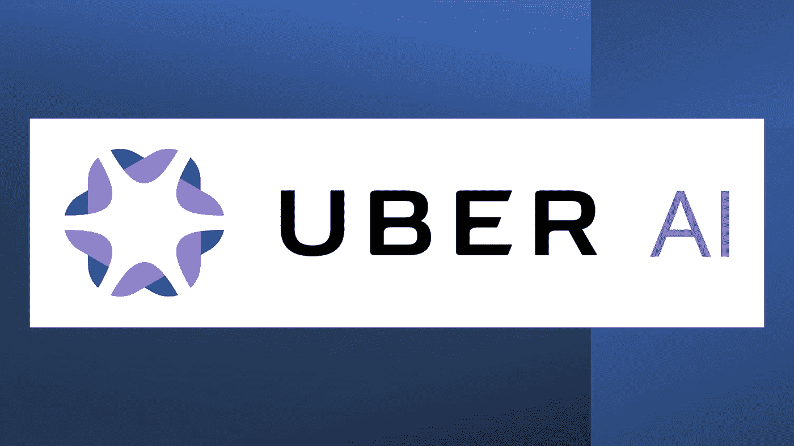
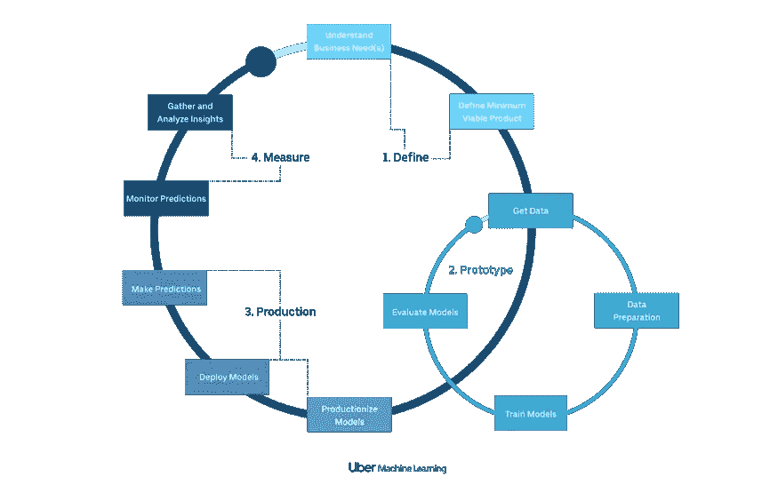
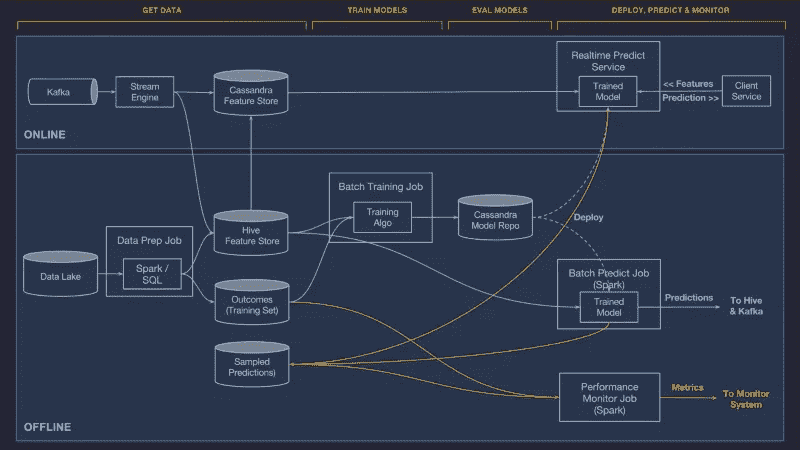

# 优步从大规模经营 ML 中学到的 ML 工程经验

> 原文：<https://pub.towardsai.net/ml-engineering-lessons-uber-learned-from-running-ml-at-scale-eb0f53ed9029?source=collection_archive---------1----------------------->

## 从优步洗钱基础设施最初几年的运作中得到的一些教训。

来源:[https://Jamal-Robinson . medium . com/how-Uber-organizations-around-artificial-intelligence-machine-learning-665 cdeb 946 BC](https://jamal-robinson.medium.com/how-uber-organizes-around-artificial-intelligence-machine-learning-665cdeb946bc)

> 我最近创办了一份专注于人工智能的教育时事通讯，已经有超过 125，000 名订户。《序列》是一份无废话(意思是没有炒作，没有新闻等)的 ML 导向时事通讯，需要 5 分钟阅读。目标是让你与机器学习项目、研究论文和概念保持同步。请通过订阅以下内容来尝试一下:

 [## 序列

### 与机器学习、人工智能和数据发展保持同步的最佳资源…

thesequence.substack.com](https://thesequence.substack.com/) 

大规模运行机器学习(ML)系统非常困难，对大多数公司来说仍然是一种新奇的体验。大规模 ML 工程中一些最有价值的最佳实践来自大型技术公司，这些公司一直在运行极其复杂的 ML 基础设施。

在过去的几年里，优步一直是开源机器学习技术最积极的贡献者之一。虽然谷歌或脸书等公司的贡献主要集中在 TensorFlow 或 PyTorch 等新的深度学习堆栈上，但优步工程团队真正关注的是在现实世界中大规模构建机器学习的工具和最佳实践。诸如[米开朗基罗](https://eng.uber.com/michelangelo/)、[霍罗沃德](https://github.com/uber/horovod)、 [PyML](https://towardsdatascience.com/uber-introduces-pyml-their-secret-weapon-for-rapid-machine-learning-development-c0f40009a617) 和 [Pyro](http://pyro.ai/) 等技术是优步对机器学习生态系统所做贡献的一些例子。由于只有少数公司开发大规模的机器学习解决方案，优步的经验和指导对于机器学习从业者来说变得更加有价值。

几年前，[优步工程团队公布了米开朗基罗平台](https://eng.uber.com/scaling-michelangelo/)前三年的运营评估。我仍然认为在最初的优步帖子中概述的经验教训是 ML 工程团队应该知道的最实用的技巧之一。如果我们删除所有米开朗基罗的细节，优步的帖子包含了一些不明显的，对开始机器学习之旅的组织有价值的教训。我将尝试以一种更通用的方式总结一些关键的要点，这种方式可以应用于任何主流的机器学习场景。

# 米开朗基罗是什么？

[米开朗基罗](https://eng.uber.com/michelangelo/)是优步机器学习栈的核心。从概念上讲，米开朗基罗可以被视为优步内部 ML 工作负载的 ML 即服务平台。从功能的角度来看，米开朗基罗自动化了 ML 模型生命周期的不同方面，允许不同的优步工程团队大规模地构建、部署、监控和操作 ML 模型。具体来说，米开朗基罗在一个非常复杂的工作流程中抽象了 ML 模型的生命周期:

来源:https://eng.uber.com/scaling-michelangelo/

米开朗基罗背后的架构使用了现代但复杂的堆栈，基于诸如 [HDFS](http://hadoop.apache.org/) 、[火花](https://spark.apache.org/)、[萨姆扎](http://samza.apache.org/)、[卡珊德拉](http://cassandra.apache.org/)、 [MLLib](https://spark.apache.org/mllib/) 、 [XGBoost](https://github.com/dmlc/xgboost) 和 [TensorFlow](https://www.tensorflow.org/) 等技术。

来源:[https://eng.uber.com/scaling-michelangelo/](https://eng.uber.com/scaling-michelangelo/)

米开朗基罗为优步不同部门的数百个机器学习场景提供了动力。例如，Uber Eats 使用在米开朗基罗上运行的机器学习模型来对餐厅推荐进行排名。同样，优步应用程序中令人难以置信的精确估计到达时间(ETA)是使用米开朗基罗上运行的令人难以置信的复杂机器学习模型计算的，这些模型可以逐段估计 ETA。

为了在数十个数据科学团队和数百个模型之间实现这种级别的可扩展性，米开朗基罗需要提供一个非常灵活和可扩展的架构以及相应的工程流程。米开朗基罗的第一个版本是在 2015 年部署的，三年后，数百个机器学习模型之后，优步学到了一些重要的经验。

# 1-培训需要自己的基础设施

如果您正在构建一个单一的模型，那么您很想利用相同的基础设施和工具来进行培训和开发。如果您正在构建一百个模型，这种方法是行不通的。优步的米开朗基罗使用一个名为[数据科学工作台(DSW)](https://eng.uber.com/dsw/) 的专有工具集来训练跨大型 GPU 集群和不同机器学习工具包的模型。除了一致的基础设施，米开朗基罗的 DSW 抽象了机器学习训练过程的常见任务，如数据转换、模型合成等。

# 2-需要监控模型

借用我在这个领域的一位导师的话，“做出愚蠢预测的模型比根本不预测的模型更糟糕”。即使在训练和评估数据上表现完美的模型，在面对新数据集时也可能开始做出愚蠢的预测。从这个角度来看，模型监控和工具是现实世界机器学习解决方案的关键组成部分。优步·米开朗基罗配置机器学习模型来记录生产中的预测，然后将它们与实际情况进行比较。该过程产生一系列可用于评估模型性能的准确性度量。

# 3-数据是最难得到正确的东西

在机器学习解决方案中，数据工程师花费相当大比例的时间对数据集运行提取和转换例程，以选择随后由训练和生产模型使用的特征。米开朗基罗简化这一过程的方法是建立一个公共特征库，允许不同的团队在他们的模型中共享高质量的特征。类似地，米开朗基罗提供了监测工具来评估特定的特征。

# 4-机器学习应该作为软件工程过程来衡量

我知道这听起来微不足道，但远非如此。大多数组织将他们的机器学习工作与其他软件工程任务分离开来。诚然，很难将传统的敏捷或瀑布式流程应用于机器学习解决方案，但有大量的软件工程实践与机器学习世界相关。优步坚持机器学习是一个软件工程过程的观点，并为米开朗基罗提供了一系列工具来执行机器学习模型的正确生命周期。

版本控制、测试或部署是优步的米开朗基罗严格执行的软件工程的一些方面。例如，一旦米开朗基罗认识到模型就像一个编译的软件库，它就会在一个严格的版本控制系统中跟踪模型的训练配置，就像你对库的源代码进行版本控制一样。同样，米开朗基罗运行全面的测试套件，在将模型部署到生产环境之前，根据维持数据集评估模型，以验证它们的正确功能。

# 5-自动化优化

在机器学习解决方案中，微调和优化超参数是一项永无止境的任务。很多时候，数据科学工程师花在寻找正确的超参数配置上的时间比构建模型本身还要多。为了应对这一挑战，优步的米开朗基罗推出了一款名为 AutoTune 的优化即服务工具，它使用最先进的黑盒贝叶斯优化算法来更有效地搜索一组最佳超参数。米开朗基罗的 AutoTune 的想法是使用机器学习来优化机器学习模型，让数据科学工程师将更多的时间集中在模型的实施上，而不是优化上。

从机器学习的角度来看，优步可以被认为是世界上最丰富的实验室环境之一。优步数据科学家所处理任务的规模和复杂程度在业内首屈一指。米开朗基罗的前三年运营无疑表明，实现大规模的机器学习解决方案仍然是一项令人难以置信的复杂工作。从米开朗基罗那里学到的经验对于开始机器学习之旅的组织来说是一个不可思议的洞察力来源。