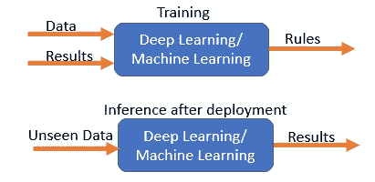
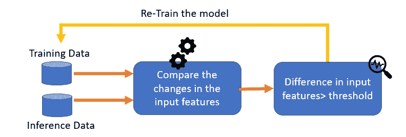

# 监控机器学习模型

> 原文：<https://pub.towardsai.net/monitoring-machine-learning-models-43c44397256c?source=collection_archive---------1----------------------->

## [机器学习](https://towardsai.net/p/category/machine-learning)

## 学习理解机器学习模型在生产中性能下降的根本原因

你会学到的

*   为什么 ML 模型部署后会降级？
*   数据漂移和概念漂移的区别
*   处理模型退化的不同技术

***你用出色的性能指标训练了一个 ML 模型，然后将其部署到生产中。该模型在生产中运行了一段时间，但是您的用户最近观察到该模型不能预测可靠的结果。***

*这个模型一定是怎么回事？是模型有问题，还是生产中的数据是根本原因？*

我们在机器学习/深度学习模型的训练过程中提供数据和结果。ML 模型在训练期间学习数据模式。学习的 ML 模型在部署到生产中之后，预测来自相同问题域的看不见的数据。

***什么会导致部署模型的性能下降？***

数据是机器学习模型的氧气，由于业务的动态行为，数据会不断变化。由于输入数据的变化，部署的机器学习模型的性能可能会下降。

以下原因可能会导致数据发生变化

*   **为训练和推理收集数据的方式发生变化**。收集数据的不同环境导致训练数据集不同于推断数据。这也被称为**偏斜。**
*   **季节性等因素导致的数据趋势变化，**训练数据可能未能捕捉到数据中所有可能的季节性，或【COVID、气候变化等未知事件导致的数据趋势变化。市场趋势的变化，或新技术的变化，如新产品或应用程序的推出，客户消费模式的变化等。

因此，模型会因为两个原因而降级

*   **训练和发球之间的数据发生了变化，称为数据漂移**
*   **模型在训练过程中学习到的规则或数据模式可能已经更新，称为概念漂移**

## 数据漂移:**训练数据和发球**之间的投入数据分布**差异**

*   **自变量 P(X)的分布发生变化时的数据漂移。**
*   **训练数据**中不存在的因变量发生变化时的数据漂移。
*   当模式在训练和服务之间改变时，会发生模式偏斜。一个字符串变量突然变成了 int。

数据漂移

**数据集偏移是指数据随着时间推移而发生偏移。这里，对于训练数据集和服务数据集，输入和输出要素的联合概率是不同的。**

**协变量偏移是指训练数据集和服务数据集之间的输入变量分布发生变化。**

例如，预测产品的库存可能会因 COVID 等意外事件而改变。这将导致模型性能下降，除非模型的训练数据得到更新。

## 概念漂移:学习到的规则或数据模式发生了变化，或者概念的含义随着时间的推移发生了变化

*   **当输入数据和结果之间的关系在一段时间内发生变化时，就会出现概念漂移。**
*   **模型在训练期间学习的数据模式 P(Y|X)已经改变**
*   **由于观察到的、看不见的或不确定的数据变化，数据模式发生变化。**
*   **概念漂移是关于目标变量或地面真值标签的变化。**
*   **概念漂移是数据多样性的结果，这种多样性在用于训练模型的数据中没有被捕获**

概念漂移

比如你在猫和狗身上训练了 ML 模型，为了推理，你还在提供猫和狗的图像，但是模型在预测猫和狗的时候不一致。在分析您的错误结果后，您观察到 ML 模型仅在棕色狗和灰色猫上训练。你看不见的图像有黑色或白色的猫和狗；猫/狗图像的数据现在已经改变了特征。这就是**概念漂移**

**数据的变化或数据模式的变化可能恰好是**

*   **突如其来的**就像 COVID 改变了客户的消费数据模式，
*   **缓慢**喜欢采用新技术
*   **周期性变化**如季节性

## 处理模型退化的不同技术

*   **经常训练模型**:这种技术可以处理**数据随时间的逐渐变化，也有助于数据的周期性变化**。这是处理模型退化的最简单和最容易的方法。**训练数据可以是旧训练数据和作为实时推理的一部分捕获的新数据**的加权百分比，其中我们可以给予**更多权重给最近的数据**。
*   **在线学习**:用于评估数据流的概念漂移，其中数据是动态生成的。在这种情况下，使用 Kolmogorov-Smirnov 测试检查传入的数据分布是否不同于先前的数据分布。Kolmogorov-Smirnov 算法，这是一种为随时间逐渐变化的样本重新计算 KS 统计量的更快方法
*   **监控生产中的车型表现**:

监控生产中的模型性能，将实时模型性能与测试/验证数据集上的性能进行比较；如果性能差异大于阈值，则触发模型的重新训练。用于重新训练模型的数据应该包含旧的训练数据和实时推断数据。这种技术可以处理数据模式的任何突然变化、缓慢的数据变化以及任何周期性的数据变化。

*   **使用**分布度量，如 **KL-散度**、**推土机距离**和**海灵格距离，监控输入特征的漂移。**

使用 KL-Divergence 或运土机距离(EMD)或 Hellinger 距离连续监控训练数据集和实时推理数据集之间的输入特征变化。如果输入特征之间存在显著差异，则触发模型的重新训练。这种技术可以处理数据模式的任何突然变化、缓慢的数据变化以及任何周期性的数据变化。

## 结论:

业务中数据和数据模式的变化是唯一不变的事情。随着时间的推移，定型和服务之间的数据和数据模式变化会降低模型的性能，从而导致性能不稳定，降低模型的可靠性。持续监控实时模型在生产中的性能对于检测数据漂移和概念漂移至关重要，以确保模型在一段时间内处理不断变化的数据和数据模式的可靠性。

## 参考资料:

[使用增量 Kolmogorov-Smirnov 测试的快速无监督在线漂移检测——丹尼斯·多斯·雷斯、古斯塔沃·巴蒂斯塔、彼得·弗拉克、斯坦·马特温](https://www.kdd.org/kdd2016/papers/files/rpp0427-dos-reisA.pdf)

[https://neptune.ai/blog/concept-drift-best-practices](https://neptune.ai/blog/concept-drift-best-practices)