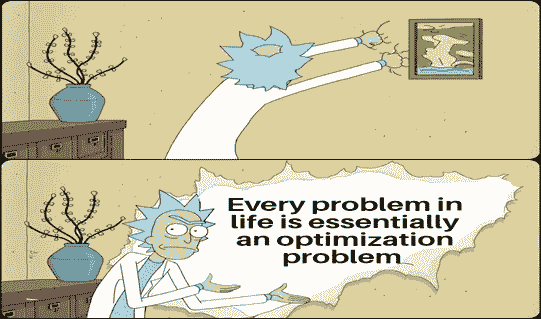
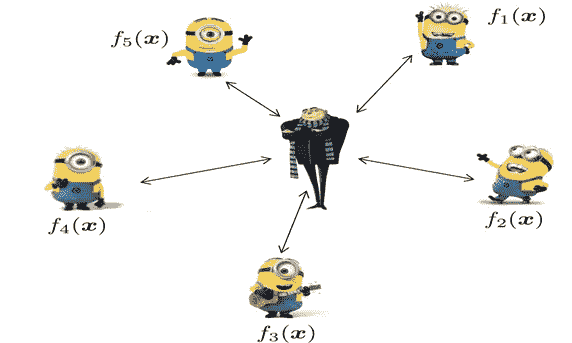
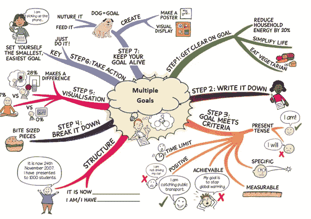
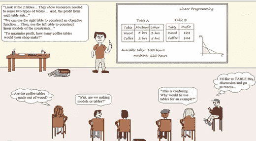
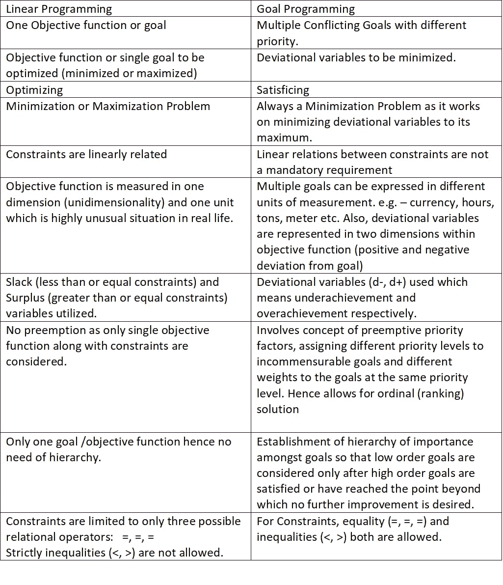
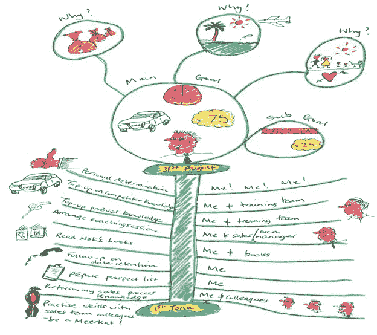
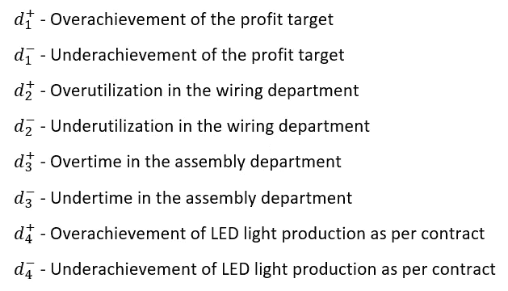
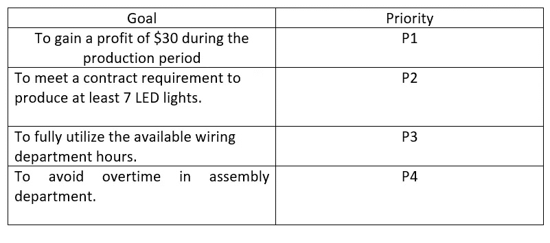
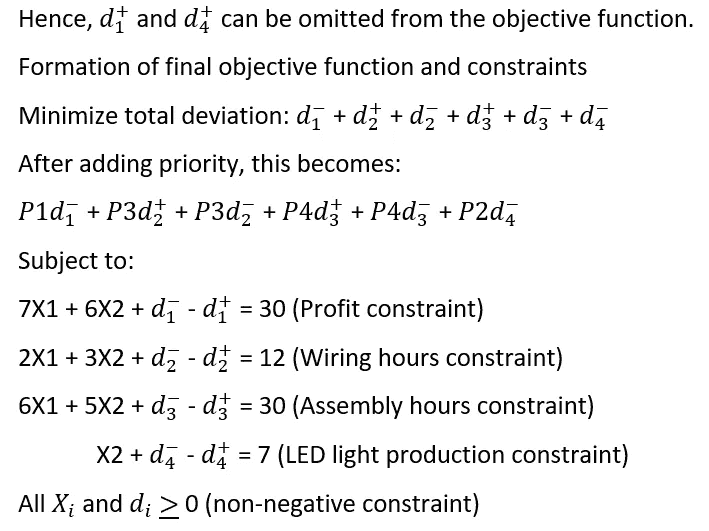
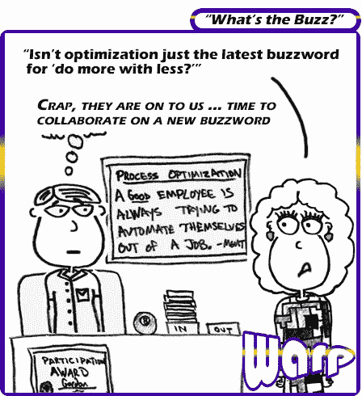

# 目标规划获胜而线性规划放弃的多目标优化…

> 原文：<https://pub.towardsai.net/multi-objective-optimization-problem-using-goal-programming-7bbfcaa0b3bd?source=collection_archive---------1----------------------->

## [优化](https://towardsai.net/p/category/optimization)

众所周知，从数学的角度来看，我们需要很好地理解数据科学的三大支柱是线性代数、统计和优化，它们在所有数据科学算法中使用得非常多。

来源:[https://www . Reddit . com/r/math 笑话/comments/f 05 kuv/lets _ mathematical _ optimize _ our _ life/](https://www.reddit.com/r/MathJokes/comments/f05kuv/lets_mathematically_optimize_our_life/)

据说优化是数据科学中使用的几乎所有机器学习和统计技术的核心。大多数机器学习算法的本质是建立一个优化模型，然后从给定的数据中学习目标函数中的参数。

在这篇文章中，我将详细解释使用目标编程的多目标优化问题公式。

来源:https://users.ece.cmu.edu/~yuejiec/MachineLearning.html

多目标优化也称为多目标规划或帕累托优化，处理涉及多个目标函数同时优化的优化问题。这已被应用于许多科学领域，包括工程、物流、营销、运输、经济学等。在这种情况下，需要在两个或多个冲突的目标之间进行权衡来做出最佳决策。

我们日常生活中最常见的几个例子是:

最小化成本和最大化舒适性，

和

最大化性能，同时最小化车辆的燃料消耗和危险污染物排放。

上述问题分别涉及两个和三个目标。但是在实际情况下，可以有三个以上的目标。

因此，为了理解如何开发和建模多目标优化问题，我们需要彻底理解目标规划。

让我们从维基百科中引用的目标编程的正式定义开始。

来源:[https://www.pinterest.com/pin/17099673557155171/](https://www.pinterest.com/pin/17099673557155171/)

目标规划是多目标优化的一个分支，而多目标优化又是多准则决策分析的一个分支。它可以被认为是线性规划的扩展或概括，以处理多个通常相互冲突的客观测量。

现在问题来了，为什么和什么时候我们会遇到多种客观情况，目标规划的必要性是什么？

在当今动态的业务环境中，大多数时候组织都有多个相互冲突的目标要实现。企业不仅寻求利润和收入最大化或成本最小化，而且还有其他非盈利目标，如社会责任、公共关系、工业和员工关系等。

来源:https://www.pinterest.com/pin/129337820520206879/

在这种情况下，目标规划假设最重要的，并作为一个强大的量化技术，能够处理多个决策标准。

但是为什么在这种情况下不使用线性规划呢？

来源:https://www.pinterest.ph/pin/314618723953095984/

为了理解这一点，让我们借助下表来看看线性规划和目标规划之间的区别。

线性规划与目标规划

来源:作者

现在既然熟悉了区别，就知道为什么线性规划不能用于多目标问题了？

让我们进一步讨论如何使用现实生活中的例子来开发目标编程模型。事实上，根据手头的问题制定正确的模型是多目标决策/优化中最困难的部分。相信我，一旦模型被正确地公式化，解决它，并提取结果是非常容易的。

来源:[https://www . performance inpeople . co . uk/blog/Introducing-Goal-Mapping/](https://www.performanceinpeople.co.uk/blog/Introducing-Goal-Mapping/)

我来重申一下目标规划问题的三个主要特点，我们在形成模型的时候需要牢记。

1.没有单一的目标，而是要实现多个目标。

2.目标规划模型都是极小化问题，因为偏差变量(超额完成和未完成)需要最小化。

3.在考虑下一个高优先目标之前，必须尽最大可能减少与高优先目标的偏离。

让我们通过一个例子来理解模型的形成

一家受欢迎的照明公司生产两种产品系列，彩色灯罩和 LED 灯。这两种产品都需要两步生产过程，包括接线和组装。给每个灯罩接线大约需要 2 个小时，给每个 LED 灯接线需要 3 个小时。灯罩和 LED 灯的最终组装分别需要 6 个小时和 5 个小时。生产能力是这样的，只有 12 小时的布线时间和 30 小时的组装时间可用。该公司严格要求最大限度地利用布线部门的工作时间，不得有任何浪费，同时也不希望装配部门加班。它从每个灯罩中获利 7 美元，从每个 LED 灯中获利 6 美元。此外，公司有合同义务完成至少 7 个 LED 灯的交付。

但与此同时，该公司正在向一个新的战略位置转移，并认为最初的利润最大化并不是一个现实的目标。管理层设定的利润水平为 30 美元，在此期间是令人满意的。

在生产时间有限的情况下，公司希望找到尽可能接近这一目标的产品组合。

在这个例子中，公司的目标是实现几个目标。让我先列出目标。

1.目标 1:在生产期间获得 30 美元的利润。

2.目标 2:充分利用布线部门的可用时间。

3.目标 3:避免组装部门加班。

4.目标 4:满足生产至少 7 个 LED 灯的合同要求。

接下来，我要设置偏差变量。

设置选择变量

X1 =生产的灯罩数量

X2 =生产的 LED 灯数量

根据业务和管理的相关性设置目标优先级。

因此，P1 比 P2 更重要，P2 比 P3 更重要，等等。

让我们考虑一下，如果超额完成利润目标和 LED 灯产量，不会影响业务和管理。

因此，现在我们的模型都是按照手头问题的要求设置和制定的。

我来总结一下目标编程模型制定步骤。

1.定义选择变量、常量和目标

模型形成的第一步是定义选择变量和右侧常数。右边的常数是指定的目标水平/值。它需要对问题进行仔细的分析，以确定对企业利益相关者/决策者制定的目标有一定影响的所有相关变量。

2.添加偏差变量

识别和设置偏差变量。这些变量代表低于(低于)或高于目标值(高于)的可能偏差。

3.确定优先级

与每个目标相关联的优先级应该被整齐地设定。例如——

优先级别 P1，如果最重要，应该放在第一位，其次是优先级别 P2，以此类推。

4.制定约束条件

应该基于选择变量之间的关系以及它们与目标集的关系来制定一组约束。

约束可以是可能影响目标但与目标不直接相关的系统约束，也可以是与目标直接相关的目标约束。

每个约束方程都是通过增加偏差变量而得到的。如果没有要添加的偏差变量，则创建一个带有偏差变量的新约束。

5.开发目标函数

为了建立一个目标函数，首先，先发制人的优先因子应该分配给与目标实现相关的偏差变量。第二，权重必须以相同的优先级分配给偏差变量。这里需要注意的一点是，相同优先级的目标必须是可度量的。

来源:[https://www . rosettatg . com/blog toon/2018/3/12/what-you-optimizing-for](https://www.rosettatg.com/blogtoon/2018/3/12/what-are-you-optimizing-for)

至此，我在文章的第 1 部分结束，该部分严格集中于使用目标编程的多目标优化问题的模型公式。

在第二部分，我将把它带到下一个层次，在那里我将主要集中于解决目标函数，以使用目标规划技术获得最优解。

希望你喜欢这篇文章。