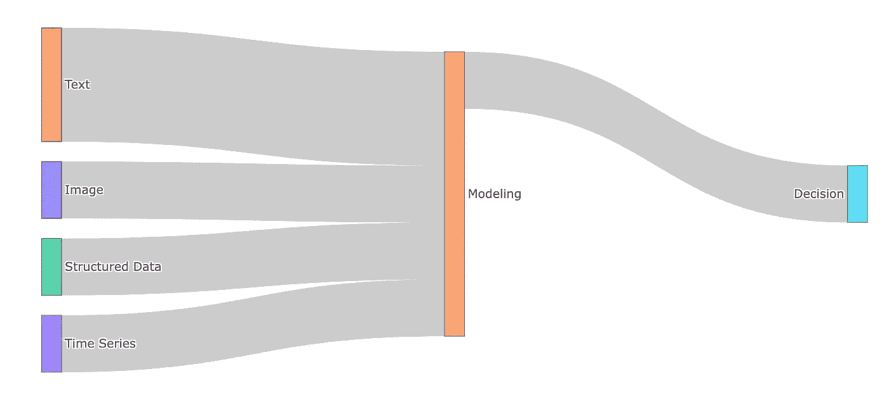
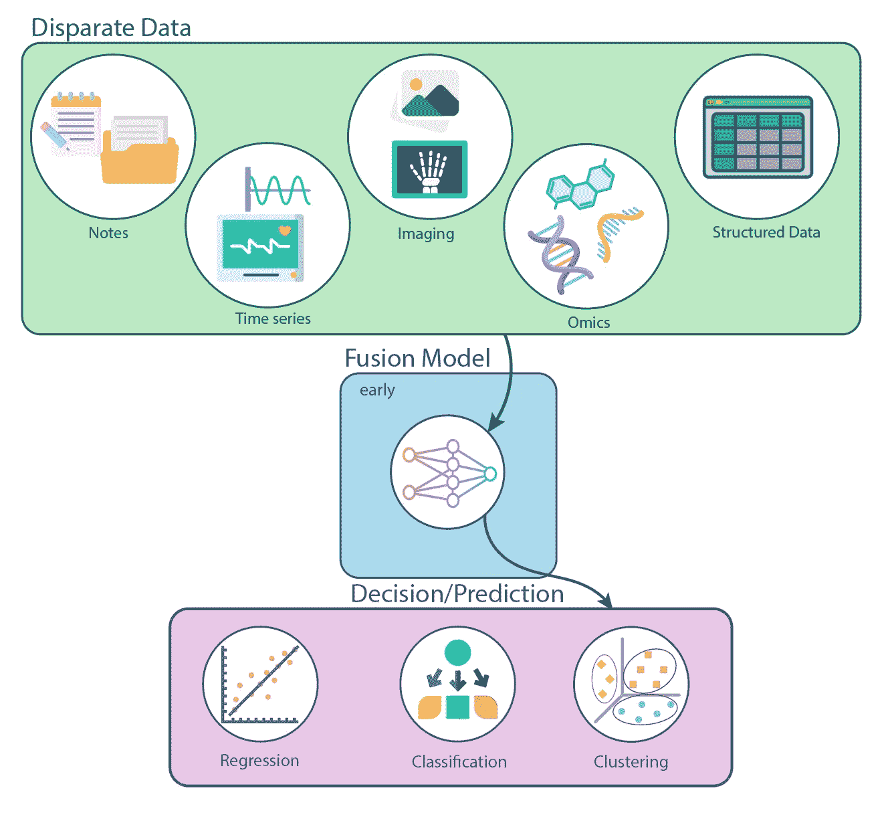
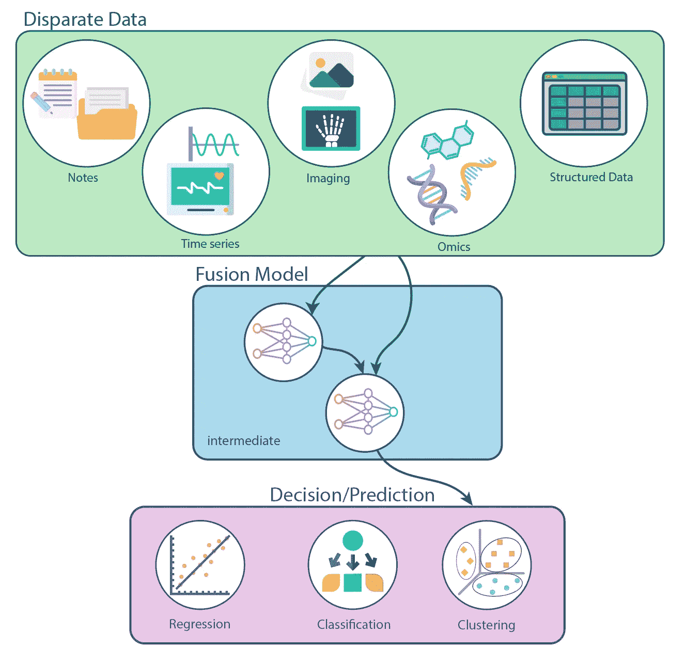
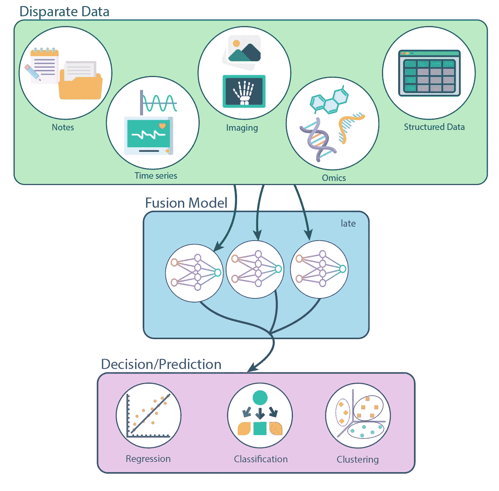
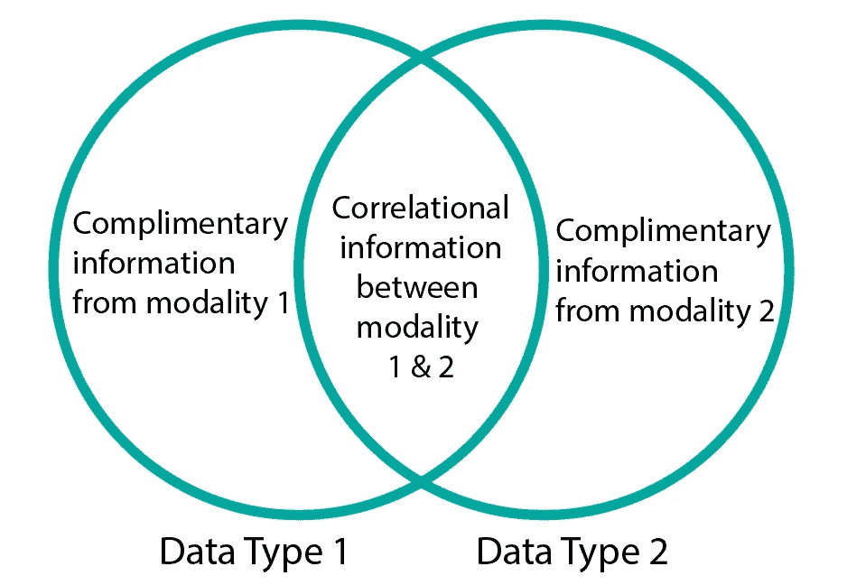
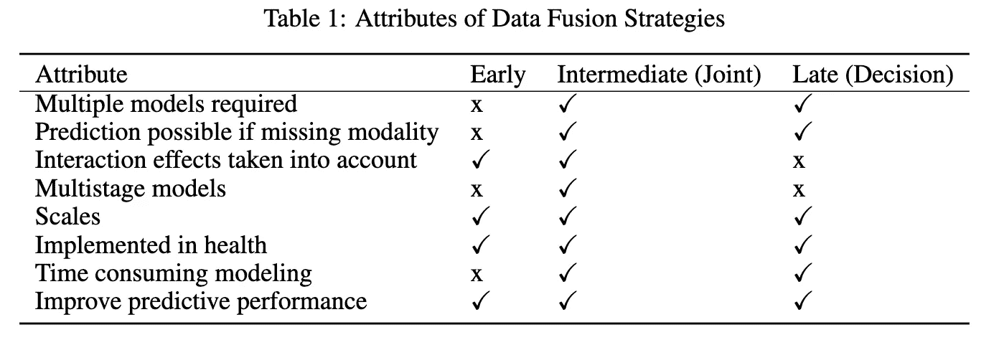

# 多模态机器学习:数据融合

> 原文：<https://pub.towardsai.net/multimodal-machine-learning-data-fusion-d1d8776e2cb0?source=collection_archive---------0----------------------->

随着机器学习和随之而来的实现越来越受欢迎，越来越多的人呼吁开发可部署和相关的决策支持工具。探索人类是如何做出大量决策的，它们很少依赖于单个数据点或单个信息源。这导致了多模态(多于 1 个)机器学习环境中的信息融合。我将使用的经典例子(由于我所受的培训)是一名医生，他正在进行“临床诊断”。这是医学界使用的一个术语，用来表示这是一种基于一系列实验室、体征和症状的诊断，当相互联系时，会产生一个决定/分类。

机器学习模型架构因融合策略而异。基于 3 种不同类型的信息融合，有 3 种主要方法用于执行多模态机器学习:

1.  早期融合
2.  中间/关节融合
3.  后期/决策融合

# 早期融合

在早期融合中，数据连接需要在输入到统一模型(接受一个模型中的所有信息)之前，在输入级别连接原始或提取(转换)的特征。数据可以通过多种方式连接，但是，早期的融合通常是通过连接或合并[1]，[2]。这可以在下面的图 1 中看到。虽然图 1-3 中描述的模型显示为神经网络(NN ),但这只是一种象形表示。实际上，这可能是许多不同的单一模型——随机森林、朴素贝叶斯、神经网络、SVM、CNN 或图形神经网络等。

为了在一个模型中容纳多种数据类型，数据转换是必要的。假设我们有两种不同类型的数据——来自乳腺癌患者的图像数据和结构化数据。在结构化数据中，我们有关于患者、年龄、性别以及其他实验室值和生理测量值的人口统计信息。假设与这些乳腺癌患者中的每一个相关联的图像数据是乳房 x 线照片或乳房超声。目前，这两种数据格式与同一型号不兼容。如果我们希望使用像随机森林这样简单但非线性的算法，我们可以通过对图像数据进行美国化来实现。这将需要确定图像中包含的特征的数字测量，例如估计的乳房密度(基于不透明度)、结节的数量和大小、结节的不规则性或其他图像形态。一旦变量都被转换到相同的特征空间，它们就可以被传递到我们选择的模型。

由于所需模型(1)的数量有限，早期融合是机器学习文献中最常见的。

图一。早期融合:作者的形象

# 中间融合

将早期融合与中间融合(也称为关节融合)进行比较，中间融合有多个训练的模型，其中一些以逐步的方式发生。这里，左边模型的输出成为后续模型(右边)的附加输入。与早期融合类似，在中间数据融合中，考虑了变量之间的交互影响。由于模型的逐步方式，来自第二模型的损失可以传播回第二模型，更新两个模型的权重。下面的图 2 提供了中间融合的概述。

执行中间融合需要更细致和繁琐的架构开发。例如，华(Hua)等人在检查糖尿病视网膜病变时使用了眼底照相，该眼底照相被传递到卷积神经网络(CNN)，然后传递到跳跃连接深度网络，而电子健康记录数据(EHR)首先被传递到跳跃连接深度网络[3]。然后将 2 个跳跃连接深度网络的输出传递给第 3 个跳跃连接深度网络，以评估进展的风险。在上述示例中，我们训练了 4 个不同的模型，最后一个模型结合了相同特征空间中的信息，以基于 2 组不同的数据创建预测。

图二。中间融合:作者的形象

# 晚期融合

后期融合中的模型架构在决策层聚集预测，因此有时被称为决策融合。在后期融合中，通常会训练多个算法模型(通常每个数据类型一个)。将这些多个模型组合成一个统一的决策，可以借鉴集成学习，因为这是有效发生的事情，但我们现在有多个基于“相似”数据训练的不同模型，而不是基于不同数据训练的多个模型。这可以在下面的图 3 中看到。

要聚合多个模型的输出，如在集成学习中，有多种技术。这些包括多数投票、平均投票和加权投票。为了使晚期融合起作用，所有的模型必须试图预测相同的结果。

后期融合需要训练大量的模型(取决于您正在集成的数据形式的数量)。后期融合的缺点是缺乏变量之间的直接交互作用，因为你不能基于成像数据更新文本数据模型的成本函数，因为来自模态的信息从不存在于同一模型中，除了训练多个模型以及决定适当的加权方案的花费之外。

图 3。晚期融合:作者图像

# 外卖食品

多模态机器学习如此重要的原因之一是，它允许我们利用**互补的**(唯一的)和**相关的**(冗余的)信息。冗余信息通过加强或进一步调整变量之间已经存在的关系来服务于我们的模型。

补充(唯一)信息成为附加信息，即如果我们在模型中使用单一数据形式，我们本来会没有的信息。你可以看看下面的文氏图，以了解如何对此进行概念化。如果我们加入更多的数据源，从 2 个增加到 3 个，等等，我们也可以扩展这个概念。

在比较不同类型的数据融合时，可以参考表 1。这大致基于[4]收集的信息，并通过我自己的工作进行了扩展。

信息融合/多模态机器学习重要的原因:

1.  当机器学习被用作决策支持工具时，特别是在卫生部门，应该试图模仿(并超越)医生的决策。医学上的许多诊断被称为“临床诊断”,这意味着它们是基于一组体征和症状。实际上，在这里利用多模态 ML 将模仿临床医生做出决定的方法(成像、实验室值、人口统计等。)所以很好地结合了现实世界的决策。这是非常恰当的，因为临床格式塔通常是通过经验得出的，除了基于生物学的模式识别系统，医生还是什么？
2.  通过机器学习的信息融合可以促进更好的预测。这已经在几篇机器学习论文中显示，这些论文在 ML 中执行早期、中期和晚期信息融合技术。在“大数据”时代，大数据不仅意味着大量数据，还意味着大量不同类型的数据，这并不令人惊讶。

多模态 ML 是一个相对较新的概念，但信息融合的概念不是。我希望这篇文章能发人深省，希望用户尽可能选择多模态方法。

此外，如果你喜欢看到这样的文章，并希望无限制地访问我的文章和所有由 Medium 提供的文章，请考虑使用下面的我的推荐链接注册。会员费为 5 美元/月；我赚一小笔佣金，这反过来有助于推动更多的内容和文章！

 [## 通过我的推荐链接加入 Medium-Adrienne Kline

### 作为一个媒体会员，你的会员费的一部分会给你阅读的作家，你可以完全接触到每一个故事…

medium.com](https://medium.com/@askline1/membership) 

## 参考

[1] Ramachandram，d .和 Taylor，G. W .深度多模态学习:最近进展和趋势的调查。 *IEEE 信号流程。弹匣*。2017, 34, 96–108.
【2】Kiela，d .，Grave，e .，Joulin，A. & Mikolov，t .高效大规模多模态分类。*在第三十二届人工智能大会上【18】、【2018】
【3】Hua，c .等，双峰学习通过跳跃连接深度网络三部曲进行糖尿病视网膜病变风险进展识别，国际医学信息学杂志，132，2019
【4】Huang SC，Pareek A，Seyyedi S，Banerjee I，Lungren MP，利用深度学习融合医学影像与电子健康记录:系统综述与实施指南， *NPJ 数字医学、3(1):1–9.**