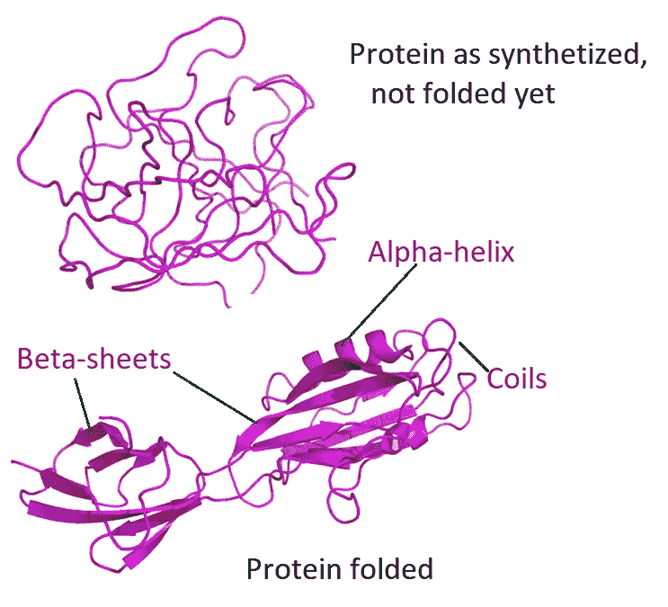
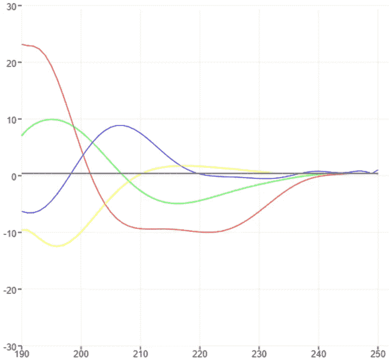
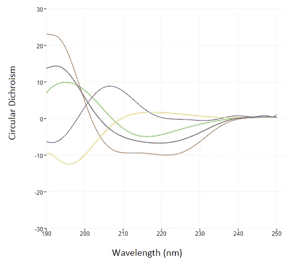
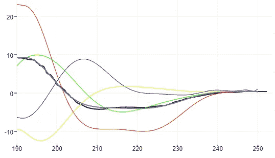
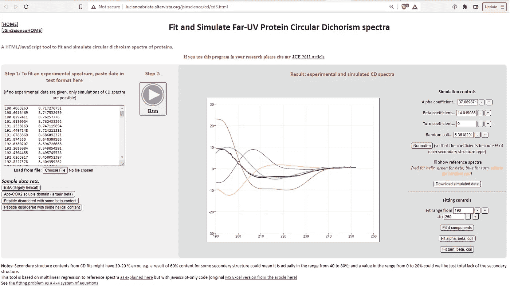

# 多元线性回归拟合数据的分数贡献

> 原文：<https://pub.towardsai.net/multiple-linear-regression-to-fit-fractional-contributions-to-data-316bdc7dc565?source=collection_archive---------4----------------------->

## [统计数据](https://towardsai.net/p/category/statistics)

## 我在这里用蛋白质生物技术中感兴趣的一个问题来举例说明多线性回归的核心:蛋白质圆二色光谱的分析，其中基础光谱需要线性拟合以再现实验光谱。一路上，我留下了一个免费的 web 应用程序用于光谱拟合和模拟。

# 简介:不是所有的问题都需要花哨的人工智能

在一个由花哨的机器学习模型主导的世界中，我们可能会忘记，对于一些应用程序，人们可以应用简单得多的方法。一个例子是主成分分析，我在前面讨论过，甚至展示了一个成熟的 web 应用程序:

 [## 主成分分析权威指南

### 一个教程剥离低层次的代码，您可以编辑和运行在您的浏览器，以了解 PCA 一劳永逸…

towardsdatascience.com](https://towardsdatascience.com/the-definitive-guide-to-principal-components-analysis-84cd73640302) [](https://towardsdatascience.com/a-free-online-tool-for-principal-components-analysis-with-full-graphical-output-c9b3725b4f98) [## 一个免费的在线主成分分析工具，提供完整的图形输出

### 完全在您的浏览器上运行，您不需要下载或安装任何东西，您的数据将保留在您的…

towardsdatascience.com](https://towardsdatascience.com/a-free-online-tool-for-principal-components-analysis-with-full-graphical-output-c9b3725b4f98) 

现在轮到看线性代数的另一个强大工具了:多元线性回归，即将数据集分解成其他变量的线性组合。

但是，我将展示一个基于我之前的两篇论文的具体案例应用，而不是通过核心数学，因为网络上有大量的资源。在这些论文中，我使用多线性回归将蛋白质的远紫外圆二色光谱解卷积为一组基础光谱的不同贡献:

[](https://pubs.acs.org/doi/abs/10.1021/ed200060t) [## 一个简单的电子表格程序来模拟和分析远紫外圆二色光谱…

### 在电子表格程序中实现了一个简单的算法来模拟蛋白质的圆二色光谱。

pubs.acs.org](https://pubs.acs.org/doi/abs/10.1021/ed200060t) [](https://arxiv.org/abs/2006.06275) [## 蛋白质圆二色光谱的在线交互拟合与模拟。

### 远紫外圆二色性(CD)光谱为分析蛋白质提供了一种快速、灵敏、无损的工具。

arxiv.org](https://arxiv.org/abs/2006.06275) 

# 问题是

蛋白质是主要的生物大分子之一，是由称为氨基酸的单元构成的聚合物。氨基酸有一个恒定的主链，通过主链它们可以聚合，还有不同的侧链。大多数蛋白质不是在溶液中自由摆动的弦，而是折叠的。蛋白质折叠的很大一部分由骨架部分的规则排列组成。例如，蛋白质可能合成为线性聚合物，但它在溶液中采用的结构包含螺旋片段、平片和一些非结构化区域:



作者卢西亚诺·阿布利亚塔的这个和所有其他数字。

螺旋部分被称为α螺旋，平片被称为β片，由相邻的β链组成。非结构化区域被称为线圈或环。

我们如何知道蛋白质的α-螺旋、β-折叠和卷曲的比例？这个问题在生物学、蛋白质生物技术等领域非常重要。当然，人们可以通过解决蛋白质的整个结构来回答这个问题；然而，这是非常繁琐和昂贵的工作——它给出的信息远远超过我们所要求的。现在，事实证明，一些更简单、更便宜、更快速的其他实验技术，让我们能够更有效地回答我们的问题。其中一种技术被称为“远紫外圆二色性光谱”。听起来很难，它的全物理确实很先进；然而，它对蛋白质的实际应用非常简单，正如你现在看到的。

## 圆二色性光谱

光谱学研究光如何与物质相互作用。例如，光可以被分子吸收，从而使它看起来像给定的颜色，这是没有被它吸收的所有颜色(波长)的组合。这就是简单的“吸收光谱学”，当规则光束被分子吸收时就会出现。

现在，事实证明人们可以制备具有几种特殊性质的光束。激光束就是一个例子。另一个例子是光被偏振，还有一个例子是光被圆偏振。圆偏振光可以在两个方向偏振。不做进一步的详细说明，事实证明具有特殊原子排列的分子倾向于不同地吸收左旋和右旋圆偏振光。

就像扫描吸收强度对波长构成“吸收光谱”，测量向左或向右圆偏振的光的吸收差异构成“圆二色谱”。

## 圆二色性和蛋白质结构

蛋白质骨架碰巧吸收紫外光，它们吸收左旋和右旋圆偏振光的方式不同，尤其是在与骨架吸收带相对应的区域。大约在 190 到 250 纳米之间，也就是电磁波谱中所谓的“远紫外”区域。

由于α螺旋具有特征性的远紫外圆二色性光谱，β折叠具有它们自己的特征，而卷曲也有它们自己的特征，结果证明远紫外圆二色性光谱提供了一种快速、灵敏、非破坏性的工具来根据这些结构成分分析蛋白质结构。

事实上，如果一个蛋白质纯粹由α螺旋、β折叠或卷曲组成，那么它在每种情况下看起来都很不同。纯结构的光谱看起来大致是这样的，如红色的α-螺旋，蓝色的β-折叠，黄色的卷曲(绿色的轨迹是一种独特的β-折叠，有时很重要):



四种主要结构的纯形式的光谱形状。

现在，如果您记录一个完整蛋白质的远紫外圆二色光谱，该蛋白质具有部分α、β和卷曲结构，如第一幅图中的示例蛋白质，您将获得纯光谱的混合物。例如，下图中灰色的轨迹是由 50%α-螺旋、40%β-折叠和 10%卷曲组成的蛋白质的光谱:



## 如何从圆二色光谱中计算%螺旋、%β和%螺旋？

我们在上面看到，原则上可以模拟给定蛋白质结构组成的光谱。然而，通常感兴趣的问题是相反的:给定一个实验光谱，我如何确定组成？换句话说，我需要多少α、β和 coil 才能使它们的纯形式光谱的加权组合与实验观察到的光谱相匹配？

在图形形式中，我想将实验光谱(黑色)与纯形式的所谓“基础”光谱相匹配:



实验光谱，黑色，适合(灰色)其组成部分(颜色)。

在上图中，我拟合了一种名为牛血清白蛋白的蛋白质的实验测量光谱，发现它由 65%的α螺旋，25%的β折叠和 10%的卷曲组成。至少根据这些基础光谱。

但是，是什么样的数学方法决定了哪种光谱的线性组合能最好地再现实验光谱呢？

# 解决方案

我们需要做的是将我们需要放置的系数拟合到基础光谱的线性组合中，以便“最大化预测光谱和实验光谱之间的相似性”。我们可以定义各种方法来“最大化相似性”；这类应用中最广泛使用的实际上是最小化:我们试图最小化预测光谱和实验光谱之间的差异。

但即使是“最小化差异”也可以有多种解释。最广泛使用的目标是最小化逐点差异的平方。如果你想象每一个光谱都可以用一个数字向量来表示(每个波长一个)，那么我们要最小化的就是下面这个:


其只不过是在每个波长(CDexp，wl)实验测量的圆二色性信号和每个结构类型和波长的基础光谱的线性组合之间的误差平方和。

## 最常见的情况:3 种结构类型

如果我们首先假设最常见的情况，其中在三个结构α、β和 coil 上进行拟合，那么我们可以建立这个等式:


我现在用θ表示 CD 信号，用λ表示波长，这是通常的做法。同时，E 代表我们希望最小化的误差总和。xα、xβ和 Xc 是我们要寻找的系数，即使 e 最小的系数。

最小化就是找出哪组 Xalpha、Xbeta 和 Xc 系数使 E 达到最小值。这相当于 E 在 xα、xβ和 Xc 维度上的导数为 0。这意味着我们可以建立这种形式的方程:


对于 xb7 和 Xc 也是如此。注意，为了从上一个等式得到这个等式，我简单地计算了(这里)xα的导数，并将其设为 0。

接下来，通过分配和重新排列术语，我们可以找到这个表达式:


从 xba 和 Xc 的导数集开始，同样可以找到这两个附加方程:


概括地说，我们已经推导出三个方程，其中有 3 个未知数(Xalpha、Xbeta 和 Xc)乘以基线光谱的乘积之和，除此之外别无其他。很简单。在右边，每个和等于实验圆二色性信号和基础光谱的乘积的和。所有总和都通过波长索引运行。

下一步是什么？好，我们有三个线性连接的未知数，所以我们可以通过任何我们想要的方法来解这个方程组。如果我们以矩阵形式设置数据，我们得到:


我们可以称这些矩阵为红色、绿色和蓝色。我们需要求解绿色矩阵的元素。通过矩阵求逆我们可以看到:


或者，我们可以使用 Cramer 的方法，基于计算行列式，在这种情况下很容易，因为它们只是 3×3 矩阵:

> Xalpha = Dalpha / Dredmatrix
> 
> xbta = Dbeta/dred matrix
> 
> Xc = Dc / Dredmatrix

其中，Dredmatrix 是红色矩阵的行列式，D-alpha、Dbeta 和 Dc 是看起来像 Dredmatrix 的矩阵的行列式，但其中第一、第二和第三列被上面矩阵形式方程的蓝色向量代替。

## 对装配程序进行编码

我解释的这一切可能看起来比实际更难。请看这段代码，当然是用 JavaScript 写的，因为它是一个现成的在线 web 应用程序的一部分(链接如下)。我放置了注释来解释每一步做了什么。

```
function fit_alfabetacoil()
{
   //coefs are the red matrix
   var coefs11=0, coefs12=0, coefs13=0
   var coefs21=0, coefs22=0, coefs23=0
   var coefs31=0, coefs32=0, coefs33=0//the blue vector
   var constants1=0, constants2=0, constants3=0 

   //This loop runs through all wavelengths
   //summing up the contents of the red matrix
   //and of the blue vector from the contents of
   //of the experimental data and the baseline spectra 
   //which are retrieved with a function called basis_cd
   //that takes as arguments the kind of structure
   //and the wavelength (explained below)
   //Note that xdata is a vector of wavelengths, and
   //ydata is a vector of CD intensities for (i=0;i<ndata;i=i+1)   {
     coefs11 = coefs11  + basis_cd(xdata[i],"alpha") * basis_cd(xdata[i],"alpha")
     coefs12 = coefs12  + basis_cd(xdata[i],"beta") * basis_cd(xdata[i],"alpha")
     coefs13 = coefs13  + basis_cd(xdata[i],"rc") * basis_cd(xdata[i],"alpha")

     coefs21 = coefs21  + basis_cd(xdata[i],"alpha") * basis_cd(xdata[i],"beta")
     coefs22 = coefs22  + basis_cd(xdata[i],"beta") * basis_cd(xdata[i],"beta")
     coefs23 = coefs23  + basis_cd(xdata[i],"rc") * basis_cd(xdata[i],"beta")

     coefs31 = coefs31  + basis_cd(xdata[i],"alpha") * basis_cd(xdata[i],"rc")
     coefs32 = coefs32  + basis_cd(xdata[i],"beta") * basis_cd(xdata[i],"rc")
     coefs33 = coefs33  + basis_cd(xdata[i],"rc") * basis_cd(xdata[i],"rc")

     constants1 = constants1 + basis_cd(xdata[i],"alpha") * ydata[i]
     constants2 = constants2 + basis_cd(xdata[i],"beta") * ydata[i]
     constants3 = constants3 + basis_cd(xdata[i],"rc") * ydata[i]
   }//These next lines compute the determinants of all the matrices
    deltaRedMatrix = coefs11 * (coefs22 * coefs33 - coefs32 * coefs23) - coefs12 * (coefs21 * coefs33 - coefs31 * coefs23) + coefs13 * (coefs21 * coefs32 - coefs31 * coefs22)

    deltaA = constants1 * (coefs22 * coefs33 - coefs32 * coefs23) - coefs12 * (constants2 * coefs33 - constants3 * coefs23) + coefs13 * (constants2 * coefs32 - constants3 * coefs22)

    deltaB = coefs11 * (constants2 * coefs33 - constants3 * coefs23) - constants1 * (coefs21 * coefs33 - coefs31 * coefs23) + coefs13 * (coefs21 * constants3 - coefs31 * constants2)

    deltaRC = coefs11 * (coefs22 * constants3 - coefs32 * constants2) - coefs12 * (coefs21 * constants3 - coefs31 * constants2) + constants1 * (coefs21 * coefs32 - coefs31 * coefs22)

    //And the last lines compute the final results, as fractions   
    ReturnAlpha = deltaA / deltaRedMatrix
    ReturnBeta = deltaB / deltaRedMatrix
    ReturnCoil = deltaRC / deltaRedMatrix
}
```

## 如何模拟纯基谱

正如你在上面的数学和代码中看到的，你需要知道纯结构在所有工作波长下的圆二色强度。在这里，我用多项式拟合公开数据来处理这个问题。这是通过名为 basis_cd 的函数完成的，您可以在这里看到它的内容:

```
function basis_cd(wavelength,structure)
{
   if (structure == "alpha")
   {
       signal = 7.27089674019501E-18 * Math.pow(wavelength,10) - 1.63282751503442E-14 * Math.pow(wavelength,9) + 1.64786777298595E-11 * Math.pow(wavelength,8) - 9.84175959744622E-09 * Math.pow(wavelength,7) + 3.85211889091252E-06 * Math.pow(wavelength,6) - 1.03245782924168E-03 * Math.pow(wavelength,5) + 0.19190243015954 * Math.pow(wavelength,4) - 24.4244919907991 * Math.pow(wavelength,3) + 2037.18080475746 * Math.pow(wavelength,2) - 100548.516559741 * wavelength + 2230060.04151075
       signal = signal*30000
   }else if (structure == "beta") {
       signal = -2.53794637234403E-18 * Math.pow(wavelength,10) + 5.61899389095424E-15 * Math.pow(wavelength,9) - 5.59118151750062E-12 * Math.pow(wavelength,8) + 3.29272089581372E-09 * Math.pow(wavelength,7) - 1.27092416556044E-06 * Math.pow(wavelength,6) + 3.35943314432255E-04 * Math.pow(wavelength,5) - 6.15861633716145E-02 * Math.pow(wavelength,4) + 7.73164864362657 * Math.pow(wavelength,3) - 636.143263740698 * Math.pow(wavelength,2) + 30975.2707887604 * wavelength - 677807.330017282
       signal = signal*30000
   }else if (structure == "turn") {
       signal =   -1.1154040447961029e+006 +   1.3363279240397867e+004 * wavelength  -3.6999724934207578e+001 * Math.pow(wavelength,2) +   3.0650375452618270e-002 * Math.pow(wavelength,3)   -1.6937829385991923e-004 * Math.pow(wavelength,4)   -2.4571457843881594e-006 * Math.pow(wavelength,5)   -6.8007334354978821e-009 * Math.pow(wavelength,6) +   1.2115114579887074e-010 * Math.pow(wavelength,7) +   1.2230843512055284e-013 * Math.pow(wavelength,8)   -2.6462654438845632e-015 * Math.pow(wavelength,9) +   1.0101792500331485e-018 * Math.pow(wavelength,10) +   8.7477370871193948e-020 * Math.pow(wavelength,11)   -1.6714591939717668e-022 * Math.pow(wavelength,12)   -9.1618700620234082e-025 * Math.pow(wavelength,13) +   5.7730213290463569e-028 * Math.pow(wavelength,14) +   2.4314682175098175e-030 * Math.pow(wavelength,15) +   2.4951308419016119e-032 * Math.pow(wavelength,16)   -2.8164512804566674e-034 * Math.pow(wavelength,17)   -5.9124293487635691e-037 * Math.pow(wavelength,18) +   5.0272282441912073e-039 * Math.pow(wavelength,19) +   2.9681942087959184e-041 * Math.pow(wavelength,20)   -8.2333471293072643e-044 * Math.pow(wavelength,21) +   1.5383650383270223e-046 * Math.pow(wavelength,22)   -1.0360087468492564e-048 * Math.pow(wavelength,23) +   1.8464246425769450e-051 * Math.pow(wavelength,24)   -1.0562510511267518e-054 * Math.pow(wavelength,25)   -5.9985642653704237e-056 * Math.pow(wavelength,26) +   2.8778722221334910e-058 * Math.pow(wavelength,27)  -7.1488178806694276e-062 * Math.pow(wavelength,28) +   2.3829501246471966e-063 * Math.pow(wavelength,29)   -2.7765960165464696e-065 * Math.pow(wavelength,30)  -9.1972996344790159e-068 * Math.pow(wavelength,31)  -7.3303478566322394e-071 * Math.pow(wavelength,32) +   3.1690552045600917e-072 * Math.pow(wavelength,33)  -1.2096880055776232e-075 * Math.pow(wavelength,34) +   7.7265950580511883e-078 * Math.pow(wavelength,35)  -3.8191784729309022e-080 * Math.pow(wavelength,36)   -1.6609008225507791e-082 * Math.pow(wavelength,37)  -1.9206439103174394e-084 * Math.pow(wavelength,38) +   2.9111296959736588e-087 * Math.pow(wavelength,39) +   4.0292703047111007e-089 * Math.pow(wavelength,40) +   1.3693274730697190e-091 * Math.pow(wavelength,41) +   1.8917474391262162e-094 * Math.pow(wavelength,42)  -1.4971893717421783e-096 * Math.pow(wavelength,43)  -1.2058758891333685e-098 * Math.pow(wavelength,44) +   4.9926774640295953e-102 * Math.pow(wavelength,45)   -1.6416496615501468e-103 * Math.pow(wavelength,46) +   4.4526805924633279e-106 * Math.pow(wavelength,47) +   3.0243922868018578e-108 * Math.pow(wavelength,48)   -1.3954090700727183e-110 * Math.pow(wavelength,49) +   7.2679824699898695e-114 * Math.pow(wavelength,50)   -5.9565669595062085e-116 * Math.pow(wavelength,51) +   1.0717150143395753e-118 * Math.pow(wavelength,52) +   3.3023212277993355e-121 * Math.pow(wavelength,53) +   9.4605654479530223e-123 * Math.pow(wavelength,54) +   2.3993296914988288e-125 * Math.pow(wavelength,55)   -2.0541300066304460e-128 * Math.pow(wavelength,56)   -1.5087048229912339e-130 * Math.pow(wavelength,57)   -1.8289491940598520e-132 * Math.pow(wavelength,58)   -4.0729295998754008e-135 * Math.pow(wavelength,59) +   5.9250117994427515e-137 * Math.pow(wavelength,60)   -3.3932380313766608e-139 * Math.pow(wavelength,61) +   4.8094800972825228e-142 * Math.pow(wavelength,62) +   1.7696740090901663e-144 * Math.pow(wavelength,63)  -3.2002410531234972e-147 * Math.pow(wavelength,64)
   }else if (structure == "rc") {
       signal= -1.6603998403172E-18 * Math.pow(wavelength,10) + 3.77764956561175E-15 * Math.pow(wavelength,9) - 3.86247107852678E-12 * Math.pow(wavelength,8) + 2.33714935193268E-09 * Math.pow(wavelength,7) - 9.26824208397782E-07 * Math.pow(wavelength,6) + 2.51692531821056E-04 * Math.pow(wavelength,5) - 4.74021175198809E-02 * Math.pow(wavelength,4) + 6.1134023680003 * Math.pow(wavelength,3) - 516.713088253122 * Math.pow(wavelength,2) + 25845.2673351998 * wavelength - 580939.072386969
       signal = signal*30000
   }
   return signal
}
```

# 一个完整的网络应用程序，不仅适合，而且模拟蛋白质圆二色光谱

我上面展示的数学和代码实际上是我编写的一个非常完整的网络应用程序的一部分，用来分析和模拟蛋白质远紫外圆二色光谱。



web 应用程序包括一个复制粘贴您自己的光谱以进行分析的地方，内嵌的图形，不仅适合我在文章中描述的三种结构而且适合四种结构的命令，在您改变结构组成时交互式模拟光谱的控件，甚至还有一个选择执行拟合的波长范围的工具——这在真实场景中非常有用，可以改进拟合，删除数据中的坏部分等。

您可以在此找到这款 web 应用的完整版本，甚至查看其完整源代码:

[](http://lucianoabriata.altervista.org/jsinscience/cd/cd3.html) [## 圆二色性向导

### 一个 HTML/JavaScript 工具，用于拟合和模拟蛋白质的圆二色光谱。

lucianoabriata.altervista.org](http://lucianoabriata.altervista.org/jsinscience/cd/cd3.html) 

如果你需要这个或其他工具的一些变体，或者任何其他类型的编程任务，蛋白质分析或建模等，请不要犹豫 [**联系我**](https://lucianoabriata.altervista.org/office/contact.html) 。我写了许多不同主题的网络程序——只要提出你的问题或建议！

# 进一步阅读

## 关于蛋白质，它们的结构，以及如何预测它们:

[](https://towardsdatascience.com/alphafold-based-databases-and-fully-fledged-easy-to-use-alphafold-interfaces-poised-to-baf865c6d75e) [## 基于 AlphaFold 的数据库和成熟的，易于使用的，在线 AlphaFold 界面准备…

### 不仅是计算生物学，还有实验生物学。对生物学中数据科学领域未来的思考。

towardsdatascience.com](https://towardsdatascience.com/alphafold-based-databases-and-fully-fledged-easy-to-use-alphafold-interfaces-poised-to-baf865c6d75e)  [## 这里是我所有关于蛋白质建模、CASP 和 AlphaFold 2 的同行评论和博客文章

### 我在这里整理了我所有的同行评议文章(一些论文，一些评论，一个观点)和博客文章，关于…

lucianosphere.medium.com](https://lucianosphere.medium.com/here-are-all-my-peer-reviewed-and-blog-articles-on-protein-modeling-casp-and-alphafold-2-d78f0a9feb61) 

## 关于蛋白质圆二色性

[](https://pubs.acs.org/doi/abs/10.1021/ed200060t) [## 一个简单的电子表格程序来模拟和分析远紫外圆二色光谱…

### 在电子表格程序中实现了一个简单的算法来模拟蛋白质的圆二色光谱。

pubs.acs.org](https://pubs.acs.org/doi/abs/10.1021/ed200060t) 

【https://en.wikipedia.org/wiki/Circular_dichroism 

需要对蛋白质进行圆二色实验？看看这个:

[](https://www.nature.com/articles/nprot.2006.202) [## 利用圆二色光谱估计蛋白质二级结构-性质方案

### 圆二色性(CD)是快速确定二级结构和折叠性质的极好工具。

www.nature.com](https://www.nature.com/articles/nprot.2006.202) 

## 获取更多在线数据分析工具

[](https://towardsdatascience.com/websites-for-statistics-and-data-analysis-on-every-device-ebf92bec3e53) [## 在每台设备上进行统计和数据分析的网站

### 我对网络浏览器中数据分析在线工具的选择。

towardsdatascience.com](https://towardsdatascience.com/websites-for-statistics-and-data-analysis-on-every-device-ebf92bec3e53) 

www.lucianoabriata.com*我写作并拍摄我广泛兴趣范围内的一切事物:自然、科学、技术、编程等等。* [***成为媒介会员***](https://lucianosphere.medium.com/membership) *访问其所有故事(我免费获得小额收入的平台的附属链接)和* [***订阅获取我的新故事***](https://lucianosphere.medium.com/subscribe) ***通过电子邮件*** *。到* ***咨询关于小职位*** *查看我的* [***服务页面这里***](https://lucianoabriata.altervista.org/services/index.html) *。你可以* [***这里联系我***](https://lucianoabriata.altervista.org/office/contact.html) ***。***