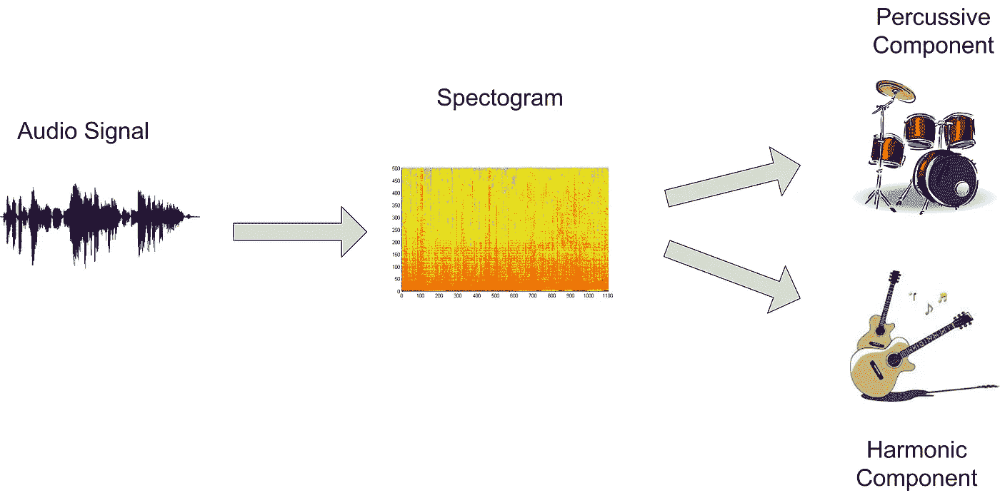
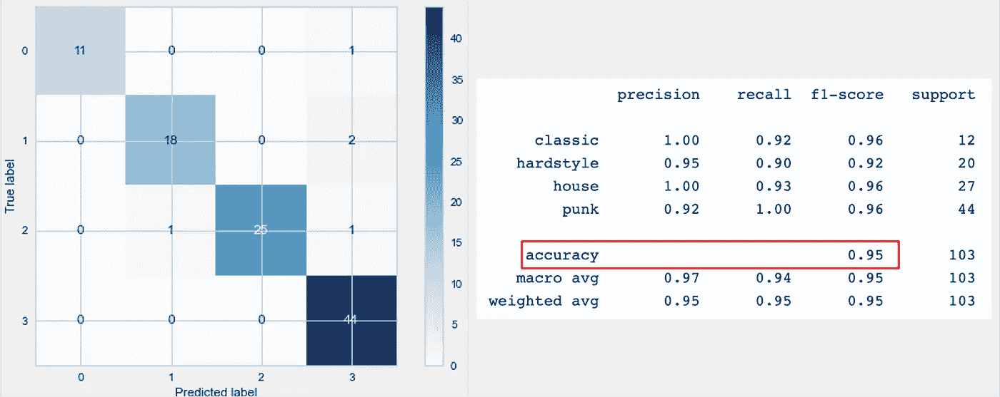
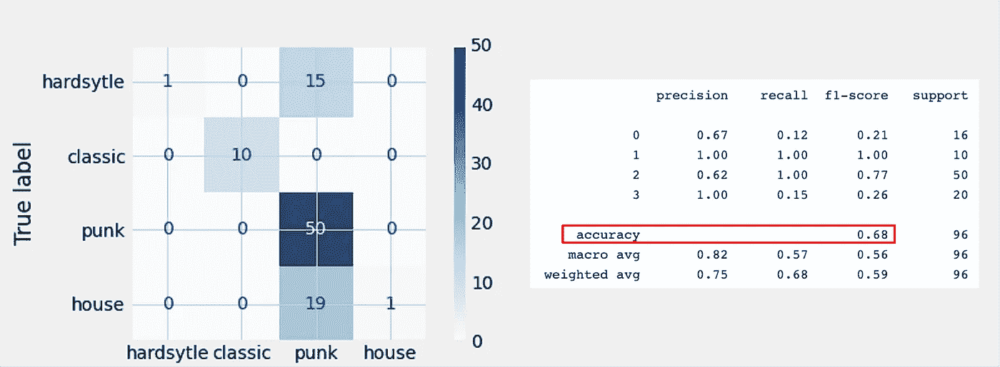

# 通过提取的音频特征+与 Spotify-API 的比较进行音乐流派预测

> 原文：<https://pub.towardsai.net/music-genre-prediction-by-extracted-audio-features-and-comparison-to-the-spotify-api-ebf82232e31a?source=collection_archive---------0----------------------->

## [机器学习](https://towardsai.net/p/category/machine-learning)

## 我们能从一首音乐中提取出比 Spotify 通过他们的 API 提供的特征更精确的流派分类吗？

[sgcdesignco](https://unsplash.com/@sgcreative?utm_source=medium&utm_medium=referral) 在 [Unsplash](https://unsplash.com?utm_source=medium&utm_medium=referral) 上的照片

毫无疑问，对我们来说，决定一首音乐是属于流派“*古典*”还是属于流派“*朋克摇滚*”是超级容易的。但是你怎么能教一台计算机在不同的流派之间做出决定呢？计算机或算法不知道莫扎特的柔和钢琴音符属于古典音乐类型，也不知道进来的电吉他即兴重复片段经常用于朋克摇滚类型。
当然，你可以告诉一个算法，莫扎特的所有音乐都属于古典流派，但是随着时间的推移在不同流派之间游走的艺术家，和一张专辑中属于不同流派的歌曲会发生什么？以玛奇恩·冈·凯利为例(顺便说一句，这是我最喜欢的电影之一。)为例，而他以前显然是属于说唱这一流派的。但他的最新专辑(截至 2020 年底)主要由更适合摇滚风格的歌曲组成。
此外，尽管本文对歌曲进行了分析，但是所使用的方法可以毫无问题地转移到其他信号处理任务中！由于大多数人喜欢音乐，我认为这个例子是最能说明问题的。

因此，如果你对如何使用 Python 来分析不同的信号(音乐曲目)，基于不同的流派对它们进行聚类，并最终将歌曲分类为 4 种不同的流派感兴趣，这比使用 Spotify 提供的功能要好得多，那么这篇文章就是为你准备的！

## 在我们开始之前，请不要跳过这一部分

*   这个项目包括信号处理方法和各种机器学习技术，如主成分分析和支持向量机。由于项目的规模，并不是每种方法都可以详细解释。
*   我也绝不是信号处理方法方面的专家，因此这里获得的结果只应被认为是第一个建议，当然也为优化提供了空间！
*   出于隐私和许可的原因，我不能提供原始的音乐数据。然而，我亲自使用伟大的命令行应用程序 **youtube-dl** ( [Github 链接](https://github.com/ytdl-org/youtube-dl))提取了这些歌曲。我用来提取歌曲的 Youtube 上的一个播放列表的例子是[这个是朋克摇滚歌曲](https://www.youtube.com/watch?v=NUTGr5t3MoY&list=PLpUmlJahfz1NieOw-QMBaVfxxUA1Fqfst)。
    然而，在与这篇文章相关的 GitHub 存储库中，有一个 *features.csv* ，其中包含了我使用的所有歌曲的所有提取特征。所以这个文件可以作为你自己分析的基础。

为了不扩大项目范围，满足了以下条件:

*   只使用了四种风格的歌曲，**朋克、古典、硬派和**豪斯。总共使用了 **311 首歌曲**，在四个流派中的分布大致相等(详细分布如下)。
*   在选择流派时，我试图选择非常不同的流派，以便在歌曲之间有一定的分离。这里的一个例外是 House 和 Hardstyle，它们在某些特征上是重叠的。这也是特意选择的，以便预测不太容易。
    由于摇滚&硬摇滚等流派之间的界限变得越来越模糊，每个人对这些流派的定义都有所不同，理论上每个流派都可以划分得更细。我选择了非常明确的类型。在流派的定义中同样重要的是，Spotify 上也有相同的流派，以便以后能够进行比较。

澄清这一点后，这里是我的 GitHub 页面的链接:

*   [GitHub 库](https://github.com/maxistaebler/towardsdatascience/tree/main/music-genre-prediction)

## 行动（或活动、袭击）计划

*   第一步，我将描述我是如何为 311 首歌曲中的每一首提取特征的，以及提取了哪些特征——所有这些都借助于一个例子。
*   然后可用的数据将通过一个简短的探索性数据分析呈现，我将解释降维的必要性。
*   在数据被降维后，我们将运行一个支持向量机，并尝试根据它们的声音特征将未见过的歌曲分类到四个流派中的一个。
*   此后，我将简要讨论如何使用 Spotify API 来提取 Spotify 上每首歌曲的特征。
    Spotify 特征也将被降维并用于训练支持向量机。
*   在最后一步中，将两个训练好的模型相互比较，并决定哪种方法给出更好的结果。

## 特征抽出

为了分析这些歌曲，从而能够创建描述给定声音的相应特征，我们将使用内置于`librosa`中的不同的*特征提取*工具。Librosa 是一个用于音乐和音频分析的 python 包。它提供了创建音乐信息检索系统所必需的构件。

一旦您使用曲库导入了一首歌曲，您就可以快速提取众多不同的特征来反映基础歌曲的特征。这方面的一个例子是分离歌曲的和声和乐器部分，这可以用几行 Python 代码来完成。

**但是为什么要进行这种分离呢？** 和声/打击乐分离的目的是将原始音乐信号分解为*和声*(即音高乐器)和*打击乐*(非音高乐器、打击乐)部分的信号。这种方法可以应用于音频混合软件，或者可以用作其他音乐信息检索方法的预处理，例如节奏分析或和弦/音调识别。该方法基于这样的假设，即谐波分量在声谱图上表现为水平线，而敲击声表现为垂直线。通过采用应用于声谱图的非线性图像滤波器来滤除该分量，所提出的方法是简单的、直观的，并且不对目标音乐的流派、风格或乐器进行任何先验假设。

就不同乐器对不同流派的重要性而言，分成这两个部分是绝对有意义的。像古典音乐这样的流派通常没有占主导地位的打击乐器，而是专注于钢琴或长笛这样的和声乐器。另一方面，Hardstyle 显然是由传入的鼓/低音节拍主导的。

[http://mir.ilsp.gr/harmonic_percussive_separation.html](http://mir.ilsp.gr/harmonic_percussive_separation.html)

**更多提取特征:**

*   **RMS 值及相关特性:**
    RMS(均方根)值是总波形的有效值。真的是曲线下的面积。在音频中，它是放大器可以提供的连续或音乐功率。
    使用 RMS 值使得计算更容易完成。
    底线:对于音频应用，我们的耳朵是均方根仪器，而不是峰值读数。因此，使用均方根值是有意义的，也是放大器通常的额定值。
*   **频谱质心:**它表示声音的“质量中心”所在的位置，并计算为声音中频率的加权平均值。如果音乐中的频率始终相同，那么，频谱质心将围绕一个中心，如果在声音的末端有高频，那么质心将朝向其末端。
*   **色度频率:**色度特征是一种有趣而强大的音乐音频表示，其中整个频谱被投影到代表音乐八度音阶的 12 个不同半音(或色度)的 12 个箱上。这是人类如何将颜色与音符联系起来的表现。换句话说，我们认为来自两个不同八度的相同音符是相同的颜色。因此，每个窗口有 12 个可能的值。A，A#，B，C，C#，D，D#，E，F，F#，G，G#。当然，它们并不相互排斥；因此，对于给定的时间框架，一个人可以有一个以上的笔记。但是为了简单起见，我们将只为特定窗口选择最突出的音符。让我们用色度图来显示色度矢量。
*   **光谱带宽:**

计算 p 阶频谱带宽

其中 *S(k)* 是频率仓 k 处的频谱幅度， *f(k)* 是仓 k 处的频率，fc 是频谱质心。当 p=2 时，这就像一个加权标准差。

*   **谱对比:**
    谱对比考虑了谱峰、谱谷，以及它们在各个频率子带中的差异。
    自动音乐类型分类对于数字音乐数据库的管理非常有帮助。提出了基于八进制的频谱对比度特征来表示音乐片段的频谱特征。它代表相对光谱分布，而不是平均光谱包络。实验表明，基于八度的谱对比度特征在音乐类型分类中表现良好。另一个对比实验表明，基于八度的谱对比度特征比以往音乐类型分类系统中常用的梅尔倒谱系数(MFCC)具有更好的音乐类型区分能力。
    声谱图 S 的每一帧被分成子带。对于每个子带，通过比较顶部分位数的平均能量(峰值能量)和底部分位数的平均能量(谷值能量)来估计能量对比。高对比度值通常对应于清晰的窄带信号，而低对比度值对应于宽带噪声。
*   **多项式特征:**
    获取将 n 阶多项式拟合到声谱图各列的系数。
*   **音调质心特征(tonnetz):**
    在音乐调律与和声中，tonnetz(德语:tone-network)是一种代表音调空间的概念点阵图，最早由莱昂哈德·欧拉于 1739 年描述。Tonnetz 的各种视觉表现可以用来展示欧洲古典音乐中的传统和声关系。
*   **过零率:**
    过零率是信号随符号变化的速率，即信号由正变负或由负变正的速率。这个特性已经在语音识别和音乐信息检索中大量使用。它通常具有较高的值，适用于像金属和摇滚这样的高敲击声。
*   **频谱衰减:**它是信号形状的量度。它表示总频谱能量的特定百分比(例如 85%)低于的频率。
*   **开始强度:**
    计算光谱通量开始强度包络。t 时刻的起始强度由
    `mean_f max(0, S[f, t] - ref[f, t - lag])`确定，其中 ref 为沿频率轴进行局部最大滤波后的 S。默认情况下，如果提供时间序列 y，S 将是对数幂 Mel 谱图。
*   **节拍信息:**
    动态编程节拍跟踪器。按照以下方法在三个阶段检测节拍:*测量开始强度，根据开始相关性估计节奏，挑选开始强度中与估计节奏近似一致的峰值*

## **特征提取的结果数据帧:**

作为提取步骤的结果，我们得到一个 28×311 的数据帧，它包含每首歌曲的 27 个特征。这里要提到的重要一点是**不是每个流派在数据集中都有相同数量的歌曲！**我们有如下分布:

*   0: 经典:37 (~ 13%)
*   1: 硬风格:60 (~ 19%)
*   房子:80 (~ 25%)
*   朋克:134 人(~ 43%)

这个 CSV 文件可以在我的 [GitHub](https://github.com/maxistaebler/towardsdatascience/tree/main/music-genre-prediction) 上找到或者直接在这里下载[。](https://raw.githubusercontent.com/maxistaebler/towardsdatascience/main/music-genre-prediction/data/features.csv)

## 探索性数据分析

现在我们已经提取了所有的特征，我们可以查看数据并为预测做准备。根据我的经验，首先要看的是数据的性质和不同协变量可能的相关性。

不同协变量的相关性

数据框架的性质——不同协变量大小的巨大差异

在我们分析这里显示的图片之前，我想指出的是，出于许可的原因，我也对个别歌曲的名称进行了匿名处理。单首歌曲的名称在这里仅由流派和每个流派的连续数字组成。查看这两个图，我们注意到，一方面，有些特征与其他特征密切相关，另一方面，单个特征的取值范围完全不同。一些协变量包含的值仅在 0.04 和 0.05 之间，而其他协变量的值超过 4000。这两个问题都很正常，很容易解决。

由于较大的值在当前版本中将对机器学习模型具有更大的影响，但是对于流派预测来说，不一定比具有较小范围值的协变量更重要，所以所有列都被缩放到 0 和 1 之间的范围。接下来，我们通过执行主成分分析(PCA)来最小化数据内的相关性。
这两种方法都是数据科学领域的绝对标准，并且已经在许多文章中进行了解释。因此，我将假定您了解这些方法。

这里有两篇很棒的文章，详细介绍了这两种方法:

*   [正常化](https://towardsdatascience.com/how-and-why-to-standardize-your-data-996926c2c832)由*塞拉菲姆·卢卡斯*
*   [PCA](https://towardsdatascience.com/understanding-pca-fae3e243731d) 由*饶彤彤*

归一化和降维的结果现在显示在这里。如果有兴趣，欢迎自行考察剧情。在这一点上，我想表明我是一个来自 Plotly 的交互式可视化的超级粉丝！如果你还不知道这个图书馆，你一定要花时间去探索它！绝对小费！

三种主要成分的三维散点图

广告之后，现在回到主题:
查看 PCA 图，我们看到虽然各个流派在某些地方重叠，但它们仍然形成了四个相对分离的簇。这已经是很好的迹象了！在进一步的检查中，我们可以从数据中得出进一步的结论，当从逻辑上并在四种流派和各自音乐的背景下考虑时，这些结论是绝对有意义的:

*   古典歌曲代表了一种离群值，并且远离所有其他聚类。与其他音乐相比，古典音乐也包含了一种完全不同的音乐类型和不同的乐器。
*   Hardstyle 和 House 比任何一种朋克风格都更相似。这也是绝对有道理的。Hardstyle 和 house 绝对比 punk 流派有更多的音乐成分。

人们当然可以从 PCA 图中得出进一步的见解和解释，例如聚类内的分散等。，但我把这个留给你。

**到目前为止的步骤总结:**
我们分析了 311 首歌曲，提取特征，清理，降维。因此，这些数据现在可以用于机器学习模型了。在我们找到并训练了一个合适的模型后，我们会将我们的模型与 Spotify API 进行比较，以评估整个过程。准备好了吗？我们走吧！

## 现在有趣的部分是:火车，一个模型

让我们面对它当我刚开始接触数据科学时，我认为一个项目的大部分工作都花在创建和评估机器学习模型上。哦，天啊…要是我知道就好了…任何和机器学习打过交道的人都知道，数据的准备工作占据了大部分工作。当然，数据的质量对于从模型中获得可靠和稳健的结果极其重要——但幸运的是，我们现在已经做到了这两点！

> 机器学习模型很简单:sh*t in，sh*t out！
> —我的数据挖掘教授

在这个项目的背景下，我测试了几个模型，但我想在这篇文章中只展示其中最好的。在这里，当然是请每一位读者自己做实验，寻找更好的模型！我也非常想知道利用现有的数据可以实现哪些其他或更好的分析！有这方面的可以随时联系我或者留言评论！

**SVM 进行分类**

为了避免不必要地夸大文章的篇幅，我将不再解释 SVM 是如何运作的，也不再解释我对 SVM 的决策过程。但是，如果你对如何评估分类和比较不同的模型感兴趣，欢迎你阅读我关于它的文章([数据科学评估度量标准—解开分类的算法](https://medium.com/towards-artificial-intelligence/data-science-evaluation-metrics-unravel-algorithms-267c55f09fa2))。

关于 SVM 的实现，我想指出的是，我能够通过分层训练和测试数据集实现更高的准确性。在传统的 *train_test_split* 中可以传递的参数负责处理这一点，并确保在每个训练和验证折叠中近似保留相对类频率。

为分类训练一个 SVM

在所有四种类型中，我们得到了平均 95%的预测准确率。从分类报告和混淆矩阵中可以看出，就精确度或召回率而言，各个流派甚至被完美地分类为“*”。
简而言之:Precision 表示选择了多少个相关项，recall 表示选择了多少个相关项。*

混淆矩阵和分类报告

95%的准确率已经很不错了，现在我们要弄清楚，利用 Spotify API 提供的功能和相同的机器学习模型&准备步骤，我们能获得什么样的准确率。

## Spotify API——强大的工具！

Spotify 和 AppleMusic 可能是西方世界最知名的音乐流媒体服务。然而，不为人知的是 Spotify 提供给每位付费用户的强大 API。你可以写一整篇关于你可以用这个 API 做什么的文章(也许我会写)，但是在这篇文章中，我想参考我的 GitHub 库中相应的笔记本，并且简单地解释一下我到底做了什么。还有许多关于如何使用 API 的文章。

在 Spotify 注册为开发者(任何人都可以这样做)并被分配 API 令牌后，您可以使用库 [***Spotify***](https://spotipy.readthedocs.io/en/2.16.1/) 来提取 Spotify 上任何可用歌曲的信息。下面是乐队 *Green Day* 的经典朋克经典*废人*的一个例子:

使用 Spotify 进行特征提取的 Python 代码

绿日的 Spotify 功能

下表显示了 Spotify 提供的功能。在 Spotify 的 API 文档中可以直接找到对这些功能的详细描述和解释。该文档还提供了一个交互式部分，您可以在其中分析自己的歌曲——请查看[ [SPOTIFY API 链接](https://developer.spotify.com/documentation/web-api/reference/tracks/get-audio-features/) ]。

无论如何，API 也提供了直接分析整个播放列表的可能性，并为播放列表中的每个曲目准确提取上面显示的这些特征。
因此，为了获得一个可比较的数据集，我在我的个人资料中创建了一个播放列表，其中包含我已经用于自己的特征提取的相同歌曲，然后用 API 对其进行解析。因为我现在还不确定是否允许我发表这些数据，所以我没有这样做。但是有了我提供的笔记本，你就可以通过自定义凭证，用自己的播放列表(或者 Spotify 预先制作的播放列表)创建自己的数据集了！该笔记本名为 *SPOTIFY_FEATURES.ipynb* 。

在执行相同的预处理步骤后，我们可以再次查看数据的前三个主要组成部分，并与我们自己提取的特征进行第一次比较:

链接:[https://chart-studio.plotly.com/~maximuskarlson/11](https://chart-studio.plotly.com/~maximuskarlson/11)

你一眼就能看出来，经典歌曲与其他三个流派的区分甚至比以前更加明显，但其余三个流派却极其重叠。朋克、豪斯和硬派之间没有明确的界限。因此，我们也期望在我们的 SVM 的实施中有低得多的准确度。这遵循与之前完全相同的方法，并提供以下结果:

Spotify 分类结果

正如预期的那样，分类的准确性要差得多。现在的机器学习模型，加上现在的特征，好像把大部分的歌都分配给了流派朋克。在任何情况下，总体精度都比具有自提取特征的模型差得多。

> 巨大成功
> —波拉特

## 摘要

在本文中，介绍了一种从音乐曲目中提取属性的方法，该方法允许比 Spotify 为每首歌曲提供的属性更精确地分类为四种风格。虽然 Spotify 只提供了 9 个功能，而不是我们自己的方法中的 27 个，但可以表明，这 9 个提供的功能并不真正适合将一首音乐分配给四个选定流派中的一个。
Spotify API 的巨大规模和可能性无疑是在这一领域进行进一步研究的良好起点。这个接口当然也适用于其他项目。

非常感谢您的关注！

**保持联系:**

领英:【https://www.linkedin.com/in/maximilianstaebler】T4推特:[https://twitter.com/ms_staebler](https://twitter.com/ms_staebler)