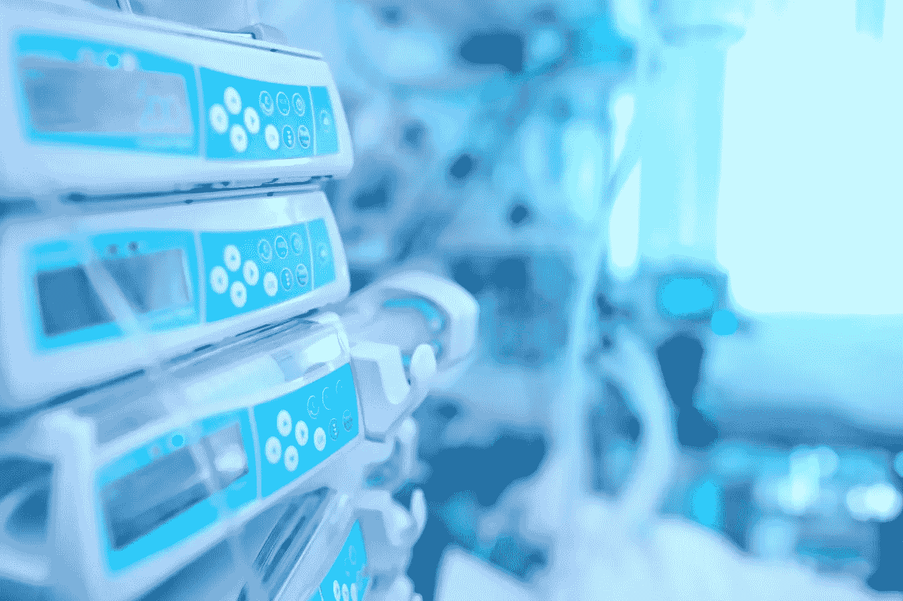

# 自然语言处理如何改进医疗设备的临床评估报告

> 原文：<https://pub.towardsai.net/natural-language-processing-932eaf7ab75c?source=collection_archive---------4----------------------->

## [自然语言处理](https://towardsai.net/p/category/nlp)

2017 年的欧盟医疗器械法规( [MDR](https://eumdr.com/) )(也称为法规(EU) 2017/745)对欧洲的医疗器械监管产生了巨大影响，包括更严格的制造商监管和增加的上市后监督。

虽然在法规(EU) 2017/745 生效之前批准的医疗器械已被授予三年过渡期，但该期限于今年 5 月 26 日结束。

这意味着所有制造商现在都必须遵守欧盟 MDR，包括创建和维护在欧洲上市和销售的任何医疗器械的详细临床评估报告(CER)。CERs 对于任何获得 [CE 标志](https://en.wikipedia.org/wiki/CE_marking#:~:text=CE%20marking%20is%20an%20administrative,indicator%20or%20a%20certification%20mark.)的设备都是必不可少的，这是一种标准化的标志，表明产品符合欧洲健康和安全标准。制造商还必须在设备的整个生命周期内定期更新 cer，作为其上市后监督活动的一部分。

由于监管的增加，组织现在面临的前景是，必须投入比以往更多的资源来创造 CER，并且在这些产品上市后很长一段时间内继续这样做。但是 cer 可能是极其资源密集和耗时的，并且通常需要专业知识。

然而，人工智能和机器学习(ML)技术，包括自然语言处理(NLP)，可以使 CER 创作更加高效、有效和负担得起。NLP 使医疗器械制造商能够掌握他们的 CER 报告要求，而不会陷入所需的许多详细步骤中。

## 什么是 CER？

答 [CER](https://www.emergobyul.com/resources/cer-quick-answers) 是对医疗器械的详细分析和评估，[包括](https://ec.europa.eu/docsroom/documents/17522/attachments/1/translations/en/renditions/native)技术规格、使用说明、潜在风险和安全性，使用临床数据证明益处大于与该器械(或类似器械)相关的任何风险。

由于需要大量的临床数据和相当严格的要求，cer 与[系统性文献综述](https://www.capestart.com/resources/blog/nlp-aided-systematic-literature-review-why-its-needed-and-how-it-works/) (SLR)流程非常相似，都需要大量的时间和精力来完成。

所有医疗器械制造商必须通过[向认证机构提交](https://www.emergobyul.com/resources/cer-quick-answers)医疗器械 ceR，作为其欧洲 CE 技术文件的一部分，从而完成并维护欧洲医疗器械的。

**每份临床评估报告的要素**

cer 通常包含各种元素的详细信息，包括器械及其用途的描述、制造商的任何治疗或诊断声明、临床数据和总结以及方法(用于评估文献准确性以及器械安全性和性能)。

每个 CER 都包含类似的步骤，必须经历欧盟委员会定义的几个独立阶段:

*   阶段 0:定义范围并计划临床评估
*   第 1 阶段:确定任何相关数据，包括来自上市前和上市后临床调查、风险管理活动、临床前研究、性能或安全性问题以及上市后监测(PMS)报告的数据
*   第二阶段:评估所有数据集的可信度、科学有效性、相关性和权重
*   第 3 阶段:分析数据并得出结论，特别是围绕符合基于性能和安全的基本要求
*   第四阶段:完成 CER

根据概述范围、方法和标准的 MEDDEV 2.7.1(第 4 版),定义范围的第一步通常涉及临床评估计划(CEP) [。该 CEP 必须记录材料、设计或制造工艺的任何变化，以及围绕器械的任何临床问题。](https://ec.europa.eu/docsroom/documents/17522/attachments/1/translations/en/renditions/native)

任何 CER 都不可避免地涉及对科学和医学文献的彻底搜索，使用手动搜索过程会花费大量时间。

## 创建最有效临床评估报告的技巧

欧盟委员会还列出了六个关键要素，这些要素必须包含在您的最终 CER 提案中:

1.  **执行摘要**:总结效益/风险概况并证明可接受性
2.  **范围**:确定 CER 涵盖哪些设备，包括详细的技术信息、产品名称、型号和尺寸
3.  **临床背景和当前知识**:从临床角度对该装置的背景进行大量研究，包括文献综述和当前可用选项的描述
4.  **待评估设备**:证明设备符合基本要求的证据，包括科学文献、公司自己的临床数据以及对临床数据的分析。
5.  **结论**:清晰的陈述，表明设备对预期用户的适用性以及效益/风险状况的可接受性。
6.  **下一次临床评估的日期:**所有 cer 必须定期更新，制造商必须定义并证明这些更新的频率。

虽然医疗器械新闻杂志[称](https://infomeddnews.com/writing-a-clinical-evaluation-report/)“从先前研究的文献中提取的临床数据是编制 CER 的一个有价值的工具”，但它也称“文献调查在一个系统的过程中进行是至关重要的。”这包括为您的文献综述准备一份全面的协议，包括:

*   定义输入(数据库、搜索词、排除标准)
*   定义安全和性能标准
*   根据标准系统地收集适当的文章
*   使用多个评审者基于客观框架分析数据

## 自然语言处理如何帮助临床评估审查

人工智能和人工智能技术可以提高 CER 制作所需的深度文献综述的速度、效率和准确性，包括利用医学数据库，包括 [Pubmed](https://pubmed.ncbi.nlm.nih.gov/) 、 [Embase](https://www.embase.com/) 和 [Cochrane](https://www.cochranelibrary.com/) 。

NLP 可以通过半自动化范围、方法和纳入标准定义的一些元素来加速临床评估计划(CEP)。NLP 还可以识别各种来源的相关数据，包括非结构化的自由文本，比手动方法快得多。一旦被识别，NLP 算法可以以任何需要的格式自动重组这些数据。

NLP 技术也非常适合开发基于相关数据的最有效的搜索协议，包括执行主动学习、应用限制或根据标准按相关性对搜索结果进行排序。对于面临堆积如山的临床和其他科学数据的研究机构来说，这可以消除数天甚至数周的手动工作。

使用手动流程创建合规的 cer 通常需要几个月的时间。但是，除了 CER 进程的复杂性和耗时性之外，还存在其他挑战。制造商通常很难找到合适的人——在临床评估法规、数据分析和医学写作标准方面拥有合适的技能和经验——并留住他们。CER 维护的重复性意味着它会分散您团队的注意力，使他们无法专注于核心业务活动。

NLP 辅助技术解决方案以及专业主题专家和机器学习工程师可以比手动方法更快、更准确地执行文献审查(和定期更新)，从而减少每次 CER 所需的时间、成本和工作量。

## CapeStart 差异

[CapeStart 在 CE 法规、医学写作、文献筛选和数据分析方面的主题专业知识与深厚的 ML 和 NLP 知识相结合，是您获得更高效、持续的临床评估报告的关键，不会让您的团队在几个月内陷入困境。](https://www.capestart.com/)

我们的 NLP 辅助解决方案可以处理大量非结构化数据，并提供快速、可行的见解来帮助决策。该解决方案运行精确的文献搜索，提取有价值的临床相关信息，节省收集证据的时间和精力。CapeStart 还与一家制造公司的多个团队密切合作，以获取正确的数据，确保证据始终能够及时纳入 ceR(尤其是在有特定截止日期的 CE 标志更新期间)。

CapeStart 的经验丰富的医学作家团队在构建效益/风险档案和为符合性评估提供临床证据方面拥有多年的经验，他们也可以在分析所有相关数据后自行构建评估报告。