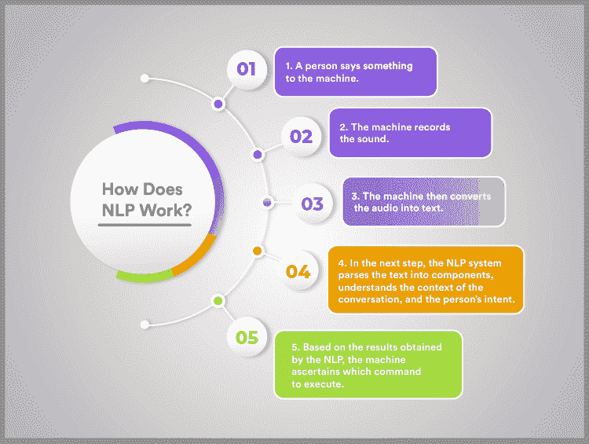
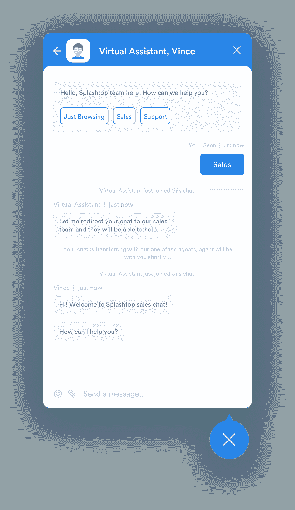

# 7 现代商业自然语言处理应用

> 原文：<https://pub.towardsai.net/natural-language-processing-applications-8de258c5a7d3?source=collection_archive---------6----------------------->

马库斯·斯皮斯克在 [Unsplash](https://unsplash.com?utm_source=medium&utm_medium=referral) 上的照片

## [自然语言处理](https://towardsai.net/p/category/nlp)

## 以下是我对一些现代商业自然语言处理应用的看法。

词，词，词…你有没有想过它们有多重要？很难想象我们的世界没有通信、信息、书籍、歌曲、电话交谈、电影等等。试着记住你每天在 Whatsapp 上收到的文本和语音数据的数量。

你有没有想过从这些数据中推导出意义，并以一种有意义的方式使用它？好消息是，随着技术的进步，现在可以用我们的语言执行额外的功能。

这些系统基于 NLP——自然语言处理——人工智能和计算语言学的完美结合。如今，利用现代自然语言处理应用程序对企业来说已经变得至关重要。

但是，在我们讨论现代自然语言处理的商业应用之前，让我们先来看看 NLP 的定义。

# 什么是自然语言处理？

如果你从来没有遇到过 NLP，只需打开谷歌，点击进入语音匹配，说一些，“好的，谷歌…”你可以在苹果的 Siri，微软的 Cortona 上试试类似的东西。一旦你说了什么，在基于 NLP 的破译人类语言的设备的帮助下，你会根据你的语音请求获得想要的信息。

简而言之，NLP 是机器处理你所说的事情，组织接收到的信息，确定适当的响应，并以你可以解码的语言做出响应的能力。

接下来的问题是，NLP 是如何工作的，NLP 是用来做什么的？

让我在下一节回答这个问题。

# 自然语言处理是如何工作的？

你有没有想过单词和短语对只能解码 0 和 1 的计算机意味着什么？教机器理解我们的交流可能不是一件容易的事情。嗯，是也不是，简而言之，机器借助自然语言算法理解的过程遵循这个过程:

来源:图片由作者提供。

总而言之，NLP 是创建算法的过程，该算法将文本转换为单词，然后根据单词在句子中的位置和功能对它们进行标记。为此，它将单词嵌入作为解决几个 NLP 问题的灵丹妙药。通过这种方式，它将人类语言有意义地转换成数字形式。这使得计算机能够理解隐含在我们语言中的细微差别。

这个想法是将每个单词转换成一组数字——一个存储包含单词含义的信息的 N 维向量。每个单词都被分配了一个唯一的向量/嵌入。然而，相似的单词最终具有彼此更接近的值。一个主要的例子是，单词“男人和男孩”的向量比“男孩和狮子”的向量具有更高的相似性

这样，NLP 服务于两个目的。第一个是增强其他 NLP 任务，如机器翻译。第二是确定单词和词组之间的相似性。当然，如果任务简单明了，一切都会进展顺利。然而，人类语言的美妙之处在于，人类的语言与机器人的语言有着显著的不同。对开发者来说，主要的困难是机器会逐字逐句地理解每个单词的意思。而人类的语言是非常饱和的，由多语义的词和隐藏的意思组成。

这就是技术进步导致企业探索这些现代自然语言处理应用程序以使他们的品牌获得巨大成功的地方。如前所述，现在让我们在下一节看看这些自然语言处理应用程序。

# 7 现代商业自然语言处理应用

## 1.情感分析

除了理解人们说的话之外，现在的机器还可以解码说话背后的情感背景。这就是俗称的[情绪分析](https://medium.com/towards-artificial-intelligence/sentiment-analysis-opinion-mining-with-python-nlp-tutorial-d1f173ca4e3c)。它经常被用来衡量客户的意见，监测公司的声誉，并通常了解客户是否满意你的产品或服务。

如今，情感分析经常被使用。不同的工具预测人们在社交媒体上对你的品牌的评价。这样，你就可以解读他们的观点。这项技术非常有前景。因此，它被认为是商业上最好的现代自然语言处理应用程序之一。

一个最好的例子是，华盛顿微软研究实验室的研究人员能够通过仔细查看她们的推特帖子来预测哪些女性有产后抑郁症的风险。令人印象深刻的是，这项研究是基于女性在分娩前几周所说的话。

一些使用情绪分析的著名公司有 [Lexalytics](https://www.lexalytics.com/technology/sentiment-analysis) 和 [Monkey Learn](https://monkeylearn.com/sentiment-analysis-online/) 。

## 2.聊天机器人

客户服务自动化为 NLP 的应用提供了极好的机会。使用 NLP 技术构建的聊天机器人提供了一个有利可图的机会，将人类从一般的查询中移除，并要求他们专注于更关键的客户问题。几年来，电子商务和客户支持部门一直在利用它们，并取得了巨大的成效。

NLP 驱动的聊天机器人可以在几秒钟内回答顾客的询问。它还可以通过让客户更容易确定他们想买什么以及改变潜在客户群来提高转化率，所有这些都是在采用对话语气的情况下进行的。

下面是一个例子，说明 Splashtop 如何利用收购聊天机器人将销售转换率提高了 35%。在这里，NLP 组件全面处理情况，而不是接受客户的逐字输入:

来源: [acquire.io](https://acquire.io/case-study/splashtop/)

一些使用 NLP 聊天机器人的著名公司有[收购](https://acquire.io/chatbot/)、 [IntelliTicks](https://www.intelliticks.com/) 、 [QuickReply.ai](https://www.quickreply.ai/) 、 [Kore。AI](https://kore.ai/) 和 [Haptik](https://www.haptik.ai/) 。

## 3.文本分类

文本分类是将自然语言文本归入一组预定义的相关类别的完美方法。执行此练习的最终目标是对大量数据中的信息进行分类。在这种现代自然语言处理应用程序的帮助下，增强不同系统的可搜索性成为可能。

文本分类是将自然语言文本归入一组预定义的相关类别的完美方法。执行此练习的最终目标是对大量数据中的信息进行分类。在这种现代自然语言处理应用程序的帮助下，增强不同系统的可搜索性成为可能。

一些文本分类示例包括对电子商务、博客、社交媒体应用和新闻应用上的内容进行标记。

不同的组织正在使用这种现代自然处理应用程序来管理非结构化文本。Lionbridge.ai 是一家主要致力于提供文本分类服务的公司。

## 4.市场情报

在文本分析的帮助下，NLP 可以以不同的方式增强市场智能。市场情报包括政府、公司和其他监管机构之间共享的市场知识或信息。你通过市场情报获得的信息可以帮助公司制定新的战略。这就是 NLP 可以帮助从原始业务数据中提取这些信息的地方。

在 NLP 的帮助下，您可以跟踪和监控市场情报报告。它可以是销售和营销数据、品牌声誉和产品数据的形式。NLP 文本分析从非结构化数据中提取关键见解，帮助公司做出明智的决策和制定未来战略。它甚至有助于揭示分散数据中的模式，这可用于进一步的审查。

我们看到自然语言处理应用程序在金融营销中使用市场智能。其原因是，NLP 提供全面的信息，如市场投标延迟的状态，并分析过去的收益/年度报告，以估计未来的增长。

自然语言处理应用在市场智能中有各种好处。它增强了数据访问并提高了数据质量，这有助于企业节省成本并提高其决策能力。

[Skl.ai](https://skyl.ai/) 是 power NLP 平台的一个主要示例，该平台通过借助情感分析、实体提取、实体分析和内容分类，从非结构化文本中收集信息，从而利用市场智能。

## 5.语音识别

我们，人类，被赋予了一种独特的能力，借助我们的言语，在外部世界表达我们的思想。语音识别是使机器能够理解人类语言的方法之一。

将语音识别作为商业自然语言处理应用的一部分的一些顶级公司有 [Nuance Communications](https://www.nuance.com/index.html) 、 [Google LLC](https://about.google/) 、[Amazon.com 公司](https://www.amazon.com/)和[苹果公司](https://www.apple.com/)

亚马逊的 Alexa、苹果的 Siri 和谷歌的语音助手是一些知名的语音助手，它们可以在使用 NLP 的语音识别技术的帮助下，毫不费力地破译我们日常任务的语音命令。

Nuance 是一个知名品牌，它开发了一个名为 Nina 的虚拟助手。它表现出色，有助于吸引更多的公司利用它们的服务。

在下面的 YouTube 视频中，仔细看看智能虚拟助理尼娜是如何工作的。

尼娜——智能虚拟助手

## 6.管理广告漏斗

你有没有想过你的客户到底需要什么？你的顾客到底在哪里寻找他/她的需求？所有这些问题都可以通过使用自然语言处理应用程序来管理广告漏斗来回答。

在 NLP 的帮助下，您可以在正确的地点和正确的时间进行智能定向和广告投放。在正确的时间为你的产品找到正确的人是任何企业的最终目标。NLP 匹配文本中的精确关键词，并帮助吸引正确的目标受众。虽然关键词匹配似乎是 NLP 的一项微不足道的任务，但它可以为企业带来丰厚的利润。

## 7.客户服务

每个组织都希望让顾客满意，以确保他们对品牌的忠诚度。然而，这并不容易。借助自然语言处理应用程序，尤其是针对客户服务的应用程序，您可以快速洞察目标受众的品味、偏好和认知。这就是 NLP 的语音分离功能发挥作用的地方，人工智能可以识别相应说话者的每个声音，并分别回答每个呼叫者。

在优秀的文本到语音系统的帮助下，即使是盲人也可以有效地使用客户服务。例如，在电话录音功能的帮助下，您可以获得关于特定客户的宝贵见解，并了解他/她对您的服务是开心还是难过。你甚至可以判断他们的需求和未来的要求。

在 NLP 的帮助下，有可能将呼叫者的语音翻译成工程师可以轻松检查的文本消息。总而言之，这是了解你的听众的脉搏的有效方法。

亚马逊就是一个将自然语言处理应用程序用于客户服务的公司的典型例子。该公司声称其收入的 35%来自通过推荐找到的顾客的购买。早先，关键词是产品推荐的主要焦点。

然而，随着时间的推移，零售商正在添加上下文、以前的搜索数据和其他因素来丰富他们的产品建议功能。因此，在 NLP 的帮助下，亚马逊的零售商获得了宝贵的见解，帮助他们进行这些组合，并当场获得建议。

# 总结想法

在过去十年左右的时间里，IT 行业在为他们的业务使用现代自然语言处理应用程序时，进行了大胆的尝试，并深入挖掘。

企业已经做了很多尝试，并开始有效地利用 NLP。然而，由于有大量的数据和流程可供处理，企业仍然需要一些时间来理解、审查和响应人类思维的需求。

# 作者简历:

Dhruv Mehta 是一名数字营销专家，提供数字时代的解决方案。在空闲时间，他喜欢写关于技术和营销的文章。他经常为调整你的业务做出贡献。在 [Twitter](https://twitter.com/digidhruv) 或 [LinkedIn](https://www.linkedin.com/in/thedvmehta/) 上与他联系。