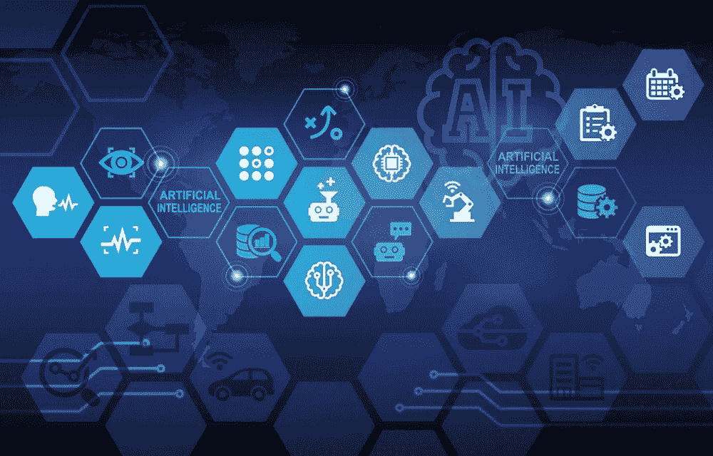

# NLP 辅助的系统性文献综述:为什么需要和如何工作

> 原文：<https://pub.towardsai.net/nlp-aided-systematic-literature-review-why-its-needed-and-how-it-works-d0f7ed6b557b?source=collection_archive---------4----------------------->

## [自然语言处理](https://towardsai.net/p/category/nlp)

从现有的大量医疗保健相关学术和临床文献中回答一个特定的、明确定义的研究问题可能极具挑战性。然而，这正是医疗保健系统文献综述( [SLRs](https://guides.hsict.library.utoronto.ca/c.php?g=430254&p=5018365#:~:text=How%20Long%20Does%20it%20Take,LINK%20to%20Types%20of%20Reviews.) )的目标，它使用系统的方法来批判性地评价和评估关于特定健康相关问题的大量定量和定性数据。

SLR 提供了关于特定研究问题的所有可用证据的详尽摘要，特别是与快速综述等其他综述类型相比，使关键决策者更容易获得这些证据。要获得最大价值，单反必须极其严格地进行。美国医学研究所(IOM)设计了 [21 项标准](https://www.ncbi.nlm.nih.gov/books/NBK209518/)，旨在指导医疗保健领域高质量单反相机的开发。

由于涉及到相当严格的要求，SLR 被认为是最高级别的证据，在医疗决策中起着至关重要的作用。它们也是循证医学实践( [EBM](https://www.hopkinsmedicine.org/gim/research/method/ebm.html) )的关键组成部分，这是一个将研究证据与临床专业知识和患者价值联系起来的跨学科过程。循证医学的实践还包括使用风险效益分析、荟萃分析和随机对照试验(RCT)。在进行 SLR 时，一项[基本任务](https://www.ncbi.nlm.nih.gov/pmc/articles/PMC6030513/)是从大型研究数据库中挖掘，以从手头的数百万份其他文件中识别 RCT(例如，2016 年 PubMed 上 2660 万篇文章中只有 1.6%是 RCT)。

但是生产高质量单反相机所需的时间和工作量可能会令人望而生畏。这就是使用自然语言处理(NLP)等人工智能技术的自动化可以发挥巨大作用的地方。

## 使用 NLP 实现单反自动化的需求

传统上单反需要很长时间来开发，并需要几个专业团队成员投入大量时间:根据布勒等人 2018 年的研究。艾尔。，每个项目平均总计 1，139 小时。甚至研究问题的开发也可能很耗时:许多专家建议使用 [PICO](https://libguides.murdoch.edu.au/systematic/PICO) (问题、干预、比较、结果)工具来改进这一过程。

多伦多大学[表示](https://guides.hsict.library.utoronto.ca/c.php?g=430254&p=5018365#:~:text=How%20Long%20Does%20it%20Take,LINK%20to%20Types%20of%20Reviews.)单反团队应该具备以下能力和专业技能:

*   具有临床/方法专业知识的主题专家
*   两名独立审查员
*   接受过 SLR 方法培训的信息专家/医学图书馆员
*   统计学家(如果包括荟萃分析)
*   解决有争议决定的决胜局

尽管需要大量的团队成员，单反仍然需要相当长的时间。加拿大西部大学估计完成一部单反相机需要 6 个月到 1.5 年的时间；麻省理工学院表示，由多个主题专家组成的团队应该根据主题“至少”计划 9 到 12 个月的时间。对于渴望被纳入单反的主要研究出版物来说，这个过程甚至更加缓慢:大多数出版物在平均 2.5 到 6.5 年的时间里没有被纳入单反。

SLR 发展的缓慢过程对准确性和相关性有重大影响:由于新的证据或发现，所有 SLR 的 23%在出版两年内被认为过时。

但是有很好的理由解释为什么他们需要这么长时间。SLR 涉及几个不同的耗时任务，包括搜索策略开发、搜索策略翻译、文档和搜索方法编写。医疗保健中严格的 SLR 的主要步骤[包括](https://guides.lib.uwo.ca/systematicreviews#:~:text=A%20systematic%20review%20is%20a,in%20its%20purpose%20and%20aim.):

*   制定一个具体的卫生保健研究问题
*   制定协议
*   进行搜索
*   选择和评估研究
*   提取相关数据，然后分析、总结和综合这些数据(通常是最耗时的步骤)
*   解释结果

众所周知，由于涉及大量的手工劳动，SLR 很难扩展，即使使用系统审查软件和专家团队来帮助管理这个过程。

## NLP 如何解决这些问题？

[NLP](https://systematicreviewsjournal.biomedcentral.com/articles/10.1186/s13643-015-0066-7) (包括文本挖掘)是一种利用计算机理解书面语言等非结构化数据的 AI。NLP 可以阅读和理解这些文本，提取用于自动化 SLR 任务的目标信息-帮助加速该过程的几个元素，包括指数级的信息提取。【2016 年的一项研究使用支持向量机分类器实现了高准确度，评论者只需阅读每份文件的 3.7 个句子(平均)，而不是整篇文件。

因为 NLP 算法[是](https://towardsdatascience.com/natural-language-processing-nlp-for-machine-learning-d44498845d5b)机器学习的一个领域，他们在处理越来越多的相关数据时学习，随着额外的[语料库](https://en.wikipedia.org/wiki/Text_corpus)和训练数据的处理，他们变得越来越擅长他们的任务。

使用 NLP 的信息抽取包括概念抽取(又名[命名实体识别](https://en.wikipedia.org/wiki/Named-entity_recognition))和关系抽取(又称[关联抽取](https://www.sciencedirect.com/science/article/abs/pii/S0022519319304813))。Jonnalagadda 等人。艾尔。说这些技术“已经被用于从生物医学文献中自动提取基因组和临床信息。”研究人员补充说，在 SLR 中自动提取数据可以“大大减少完成系统综述所需的时间，从而减少研究证据转化为临床实践的时滞。”

## 医疗保健 SLR 开发中的关键 NLP 任务

两个 NLP 功能特别适合 SLR 过程:我们已经提到的数据提取和文本分类。

1.  自动文本分类非常有用，因为它可以读取文档的内容，并根据特定的预定义参数对其进行分类，例如，确定特定文档是否为 RCT，从而节省了数小时的手动工作。文本分类主要涉及[两个主要任务](https://bmcbioinformatics.biomedcentral.com/articles/10.1186/1471-2105-12-S2-S5) : a)识别关键句子并忽略不相关的段落，b)对这些句子或段落进行分类，并基于预定的类别或标准对它们进行标记
2.  同时，数据提取基于感兴趣的变量识别文本或数字片段(例如特定报告的发现，或临床试验的受试者人数)，并从源文件中提取信息。

马歇尔等人。艾尔。[指出](https://systematicreviewsjournal.biomedcentral.com/articles/10.1186/s13643-019-1074-9)在审查过程中使用的最主要的文本分类类型是摘要筛选，它决定了文章是否符合审查的入选标准。机器学习算法也可以经过训练，使用抽象筛选来根据相关性对文档进行排序——这可能会为审阅者节省几十个小时。

## 医疗保健单反中使用的 NLP 模型

一些预先训练的 NLP 模型特别适合科学文本，并用于医疗保健单反的开发:

1.  [SciBERT](https://www.groundai.com/project/scibert-a-pretrained-language-model-for-scientific-text/3) 是一个预先训练好的语言模型，基于来自 Transformers ( [BERT](https://towardsdatascience.com/bert-explained-state-of-the-art-language-model-for-nlp-f8b21a9b6270) )的双向编码器表示，针对医疗应用进行了微调，拥有 1.14M 随机选择的[语义学者](https://www.semanticscholar.org/)论文。
2.  [BioBERT](https://web.stanford.edu/class/cs224n/reports/custom/report29.pdf) 根据预先训练好的生物医学语言表示模型进行生物医学文本挖掘。它通过许多来源进行训练和微调，包括英语维基百科、图书语料库、PubMed 摘要和 PMC 全文文章。BioBERT 的进一步微调使用生物医学命名实体识别数据集，如 NCBI 病(2014)和 BC4CHEMD (2015)。
3.  [ClinicalBERT](https://arxiv.org/abs/1904.05342) 是另一个基于 BERT 的语言模型，专注于医疗保健。它评估临床记录的表示，但主要用于临床领域。

当然，将 NLP 用于医疗保健单反并非没有挑战，尤其是英语(或任何其他语言)的复杂性。一些词语和陈述可能有难以置信的细微差别，而另一些词语和陈述根据上下文可能有多种含义。一些口语表达和字面意思完全不同。甚至语法也很难评估，这取决于作者和他们对语言的熟悉程度。

所有这些加起来就是令人眼花缭乱的大量可能的短语、单词和组合，任何 NLP 算法都必须以极快的速度进行评估。但是， [CapeStart 的](https://www.capestart.com/services/cutting-edge-software-development/machine-learning-for-innovation/)专家机器学习工程师、主题专家和数据科学家可以通过数据注释、定制机器学习模型开发和软件开发的组合来提供帮助。我们专注于医疗保健的自然语言处理和数据标注解决方案被一些世界上最具创新性的医疗公司用于一系列应用，包括医疗文本分类、命名实体识别、文本分析和主题建模。CapeStart 还提供适合复杂单反问题的预建模型。