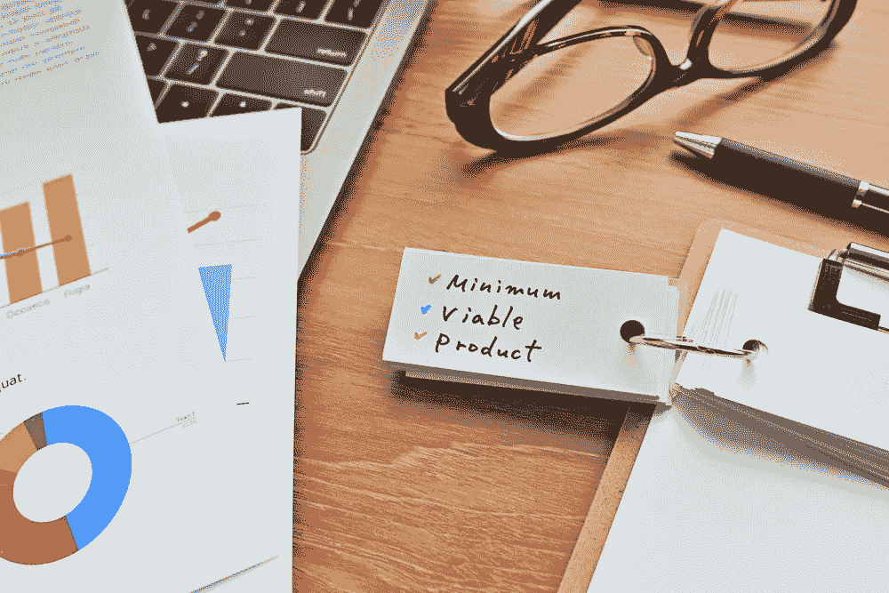
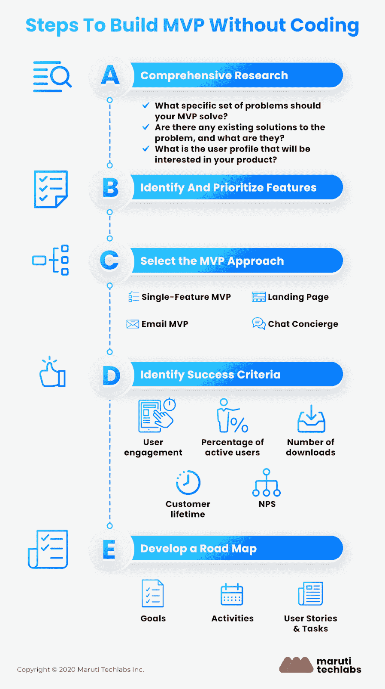

# 无代码 MVP——不用编码就能构建你的想法

> 原文：<https://pub.towardsai.net/no-code-mvp-build-your-idea-without-coding-faf74130a354?source=collection_archive---------0----------------------->

## [技术](https://towardsai.net/p/category/technology)

*成为一名企业家却不知道如何编码，这可能吗？*

你有一个关于产品/平台/应用/初创公司的好主意，你迫不及待地想发布和销售。但是在这之前，你必须通过你产品的最小可行版本来测试你的想法。

为了构建你的 MVP(最小可行产品)，你需要编码，对吗？不对！

你不需要编码印章来建立你的 MVP。你也不需要乞求工程师成为技术合伙人。

有了无代码 MVP，您可以更快地验证您的想法，并测试它是否有成功的潜力。让我们来探索一下如何不用写一行代码就能把你的商业想法转化成 MVP。

# 但是首先，究竟什么是 MVP？

MVP 或最小可行产品是面向目标受众的第一个产品版本。它本质上意味着你的产品的最基本的版本，你可以拿出给观众。

这里的想法是只关注足够的功能来测试你的概念的可行性，然后根据用户的反馈继续开发。

你可以把 MVP 想象成一个原型；唯一的目的是验证你的目标客户是否愿意为你提供给他们的解决方案付费。

使用 app MVP builder 来验证您满足客户的能力，您可以减少大量成本、时间和构建错误产品的风险。

总而言之，MVP 的三个主要特征是

*   具有足够的价值，客户最初愿意使用/购买它
*   向未来展示足够的优势，以留住早期采用者
*   提供一个反馈回路来指导未来的发展

# 理解无代码 MVP

一个没有编码的 [MVP 主要有两个重要的方面](https://marutitech.com/software-prototyping-services/)

*   没有依赖性

这意味着你不会依赖技术工程师的专业知识来构建任何东西。你不用为你的产品/服务的试验 MVP 写复杂的代码，这样可以节省很多时间。

*   假设

在构建 MVP 无代码时，你的假设应该是你想要学习的。不管你建立了什么，它应该有一个可证伪的假设，这样你就知道什么时候继续前进。

无代码 MVP 的两个优秀例子是 [Dropbox](https://www.dropbox.com/) 和 [Buffer](https://buffer.com/) ，其中 [Dropbox 做了一个视频](https://techcrunch.com/2011/10/19/dropbox-minimal-viable-product/)和 [Buffer 做了一个登陆页面](https://buffer.com/resources/idea-to-paying-customers-in-7-weeks-how-we-did-it/)。

他们都很快证实了他们的假设，即是否需要他们的产品，并获得了大量的预发布注册。

# MVP 开发周期

MVP 开发周期主要包括 4 个阶段:

*   思考——包括定义产品、创建原型以及在公司内部测试其可行性。
*   构建——包括创建适合用户测试的物理 MVP。
*   ship——包括逐渐向用户/市场发布 MVP，同时收集对产品新版本的反馈。
*   调整/改变——根据收到的反馈，启动一个持续的迭代过程，旨在改进产品。

# 无需编码构建 MVP 的分步指南

既然我们已经讨论了构建 MVP 的意义，那么让我们来讨论如何不用编码就能构建自己的 MVP

# A.综合研究

无代码 MVP 构建过程的第一步是深入了解问题及其解决方案。做到这一点的最佳方式是利用产品/市场契合方法，阐明目标客户、价值主张、功能集、未满足的需求和用户体验。

在此阶段，您必须回答的一些问题包括

*   你的 MVP 应该解决哪些具体问题？

这里的想法是理解产品将交付什么价值以及它将如何受益。确保了解客户的痛点或问题，以及他们获得或期望获得的收益。

*   **该问题是否有任何现有的解决方案，它们是什么？**

做全面的竞争对手研究将让你了解直接和间接竞争对手的陷阱，这样你就可以确保在你的产品中避免它们。

*   **什么样的用户会对你的产品感兴趣？**

在这个阶段，明确谁将购买你的产品同样重要。总有特定类别的用户有定制的需求和要求，来帮助你使产品尽可能面向用户。

# B.识别功能并确定其优先级

一旦研究完成，下一步就是确定并优先考虑你想在产品中拥有的特性。首先创建一个产品愿景，并列出在客户的特定使用环境中可能对其需求有价值的功能。

下一步应该是根据特性的重要性对其进行优先级排序。在 MVP 阶段，你只需要有一个最高优先级的特性，传达产品核心价值。

# C.选择 MVP 方法

最低可行产品的概念相当广泛，涵盖各种类型和方法。您需要从下面列出的方法中选择最合适的 MVP 方法——

**无产品 MVP 方法**

无代码 MVP 通常是一种用于验证想法并获得适当反馈的方法，不需要任何实际的编码。主要有两种方法来实现这个-

*   **意念可视化**

在这种方法中，您使用有针对性的营销活动来测试机会假设。请记住，创意可视化并不包含您未来产品的任何构件，这一点很重要。在这里，创意代表或解释了产品的外观和功能。

实现这种方法有多种方式，比如博客、登录页面、调查、广告活动、讲解视频等等。与其他 MVP 构建方法相比，这种方法的主要优势在于其时间和成本效益。

*   **先卖后建的方法。**

这种 MVP 无代码方法的前提是基于产品在实际构建之前的预售。这可以通过在任何合适的平台上发起众筹活动来实现，比如 [Kickstarter](https://www.kickstarter.com/) 。

这种方法的成功让你既可以验证你的想法的需求，也可以从贡献者那里筹集资金。这种方法的主要好处是，您可以从客户那里获得金钱上的承诺，这使您可以预见您的产品产生收入的各种可能性。

*   **单功能 MVP**

顾名思义，这里的产品应该基于一个最重要的特性。因为客户需要理解它的含义，所以重点应该完全放在核心功能上。这里的想法是构建一个没有编码的 MVP，以减少用户至少 60-80%的工作量。

*   **聊天礼宾**

许多 SaaS 服务允许你将实时聊天整合到你的网站中。它们允许您直接与客户聊天，以收集大量定性数据。

简而言之，礼宾 MVP 包括手动帮助您的客户完成他们的目标，以此来验证他们是否需要您提供的产品。

*   **登陆页面**

登录页面通常是一个单独的页面，它

1.  完整描述你的产品或服务
2.  说明你的 USP 或使用你的产品或服务的一些好处
3.  具有类似 CTA 的按钮，允许感兴趣的访问者点击阅读更多内容，加入邮件列表，购买产品或其他一些行动

使用登录页面的主要好处是，它们包含了为什么你的产品或服务足够吸引人的描述，并让你看到你独特的价值主张是否引起了目标受众的共鸣。

*   **电子邮件 MVP**

创建一封电子邮件比创建一个产品甚至是一个产品中的一个功能要简单得多，花费的精力也少得多。对于现有客户，您可以从手动创建一些电子邮件开始，以检查电子邮件的回复是否良好。如果得到了积极的回应，您可以继续构建相关的产品功能。

这里 MVP 的选择应该主要基于两个因素——要验证的想法和可用的资源。

# D.确定成功标准

要知道你的 MVP 是成功还是失败，这是另一个应该提前注意的重要方面。要做到这一点，关键步骤之一是指定成功标准和最可行的指标，包括以下内容

*   **用户参与度**

用户参与表明你的产品有多相关，并有助于评估其真正的潜力。此外，通过定义用户参与度，您可以根据需要修改 UX。

*   **活跃用户百分比**

你需要检查的不是下载的数量，而是有多少用户是活跃的，并考虑如何将被动的用户转化为参与用户。

*   **NPS**

NPS 或净推广者分数本质上是一个基于调查的指标，你需要直接询问用户关于 MVP 的有用性。

*   **下载数量**

这一指标对于移动应用至关重要。这里简单的逻辑就是，你的 app 下载次数越多，越受欢迎。

*   **客户生命周期**

这一指标本质上有助于了解用户在删除软件之前使用它的时间。

# E.制定路线图

准备路线图是进一步区分特性优先级和分解产品积压的关键步骤之一。理想情况下，产品路线图应包括四个部分，包括

*   **目标** —强调产品的关键愿景
*   **活动** —上述目标可以通过执行特定的活动来实现。
*   **用户故事&任务**——活动需要任务和特性的实现，这些任务和特性可以转换成用户故事。

有了详细的路线图，您就可以识别与您的产品相关的所有痛点和收益。

# 帮助您无需编码即可构建 MVP 的工具

这里有两种最常见的现成方法，可以用于构建 MVP 而无需编码

# 1. [WordPress](https://wordpress.org/)

WordPress 是建立各种不同网站的首选工具之一。事实上，世界上大多数网站都是在 WordPress 上运行的，而不是其他供应商。

WordPress 向你介绍了一个模板和主题的世界，你可以很容易地安装它们，而不需要知道任何编码——你很快就可以拥有一个功能齐全且直观的网站。此外，你一天内在 WordPress 上创建的网站的质量和标准将远远超过你自己创建的网站。

WordPress 的另一个值得注意的好处是它庞大的插件社区，允许你添加新的功能到你的网站，包括

*   电子商务元素
*   登录和用户帐户
*   评论的自动审核
*   搜索引擎优化

# 2.[购物化](https://www.shopify.com/)

Shopify 是一款非常棒的无代码工具，可以用来建立电子商务网站，推广、销售和运输您的产品。除了简单易用之外，它还为用户提供了多种模板可供选择。

Shopify 是一家完全可靠且经过验证的企业，大量在线企业依靠该平台来推动其在线商务。

# 3. [Webflow](https://webflow.com/)

Webflow 是一个强大的网站构建器，允许设计人员在不知道任何代码的情况下构建响应性网站。Webflow 本质上是一个 SaaS 平台，包括托管和 CMS 来帮助用户管理他们的内容。CMS 非常灵活，允许用户定义动态内容的结构和风格。

# 无代码 MVP 方法对产品开发的好处

MVP 方法的主要优势是

*   MVP 方法允许您快速发布迭代或版本，并帮助您从错误中学习。
*   它使您能够最大限度地降低产品开发成本
*   MVP 方法可以让你在产品完全部署之前就建立一个客户群

# 构建 MVP 时要避免的错误

推出新产品的过程总是有风险的，肯定会有一些错误。以下是在不编码的情况下构建 MVP 时需要避免的一些最常见的错误

*   追求完美

MVP no code 背后的关键思想是通过向目标受众提供一般信息来介绍您的产品。因此，重要的是要确保你的产品没有过多的功能来创建一个完整的产品。

如果产品被拒绝，包括时间、资源和金钱在内的一切都将付之东流。重要的是要记住，MVP 低代码不是关于构建一个完美的现成解决方案，而是关于用最少的功能集创建一个合适的或可行的产品。

*   不考虑用户反馈

你以 MVP 的形式构建的解决方案是为用户服务的，所以在开发的每个阶段考虑用户的反馈是非常重要的。随着收到的每一个用户反馈，你会更好地了解什么是好的，什么是需要改进的。

# 总结

把你的想法变成现实并不一定很难。如今，随着公司向顶级客户服务和加速数字化转型迈进，任何流程/工具都会缩短反馈回路。它要求商业利益相关者更多地参与到不可避免的未来中。因此，使用[无代码或低代码](https://marutitech.com/low-code-no-code-development/)构建 MVP 现在已经成为现实！

有了 MVP，你的业务/产品改进的下一个阶段是基于用户需求和反馈，而不仅仅是假设的场景。结果，没有代码 MVP 能让你更好地控制你的商业想法，让你第一手地了解客户的需求，确保产品对你的目标市场有用。

*最精彩的部分是什么？您无需编写任何代码就可以实现所有这些。*

使用你的 MVP 的[无代码开发，去看你的想法实现吧！你可以自己动手，也可以外包给我们的专家。在这里](https://marutitech.com/software-prototyping-services/)给我们留言[，我们的团队将从那里开始！](https://marutitech.com/contact-us/)