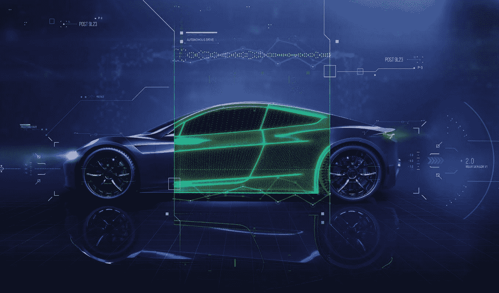

# 没有人只想要一辆车:如何在汽车竞争中生存

> 原文：<https://pub.towardsai.net/nobody-wants-just-a-car-how-to-survive-the-automotive-competition-977f696f7bb7?source=collection_archive---------2----------------------->

## [自动驾驶汽车](https://towardsai.net/p/category/self-driving-cars)

## 原始设备制造商应该考虑的事情，以增加他们在自动驾驶汽车时代保持竞争力的机会

根据[市场和市场](https://www.marketsandmarkets.com/Market-Reports/automotive-software-market-200707066.html)的研究，汽车软件生产将从 2020 年的 169 亿美元增长到 2025 年的 377 亿美元，CAGR 增长率为 16.9%。

移动行业不再是硬件第一，软件是可选的装饰品。在对高级安全应用、电气和电子元件以及连接性不断增长的需求的推动下，汽车软件开发正成为汽车制造商关注的焦点。纯粹用金属和机械系统制造汽车不足以赢得竞争。**人们不再只想要汽车。他们想要带轮子的智能设备。**

为此，传统 OEM 厂商应该像 IT 公司一样行事。但是除了一些明显的好处，这也带来了新的挑战。这些挑战包括需要即时更新(在整个开发过程中和产品发布后)、网络安全风险和功能安全挑战、合规性复杂性、需要处理大量数据以及需要寻找更先进的测试技术。

原始设备制造商如何克服所有这些挑战？以下是我从工程自动驾驶软件的丰富经验中学到的。

# 敏捷和 OTA 更新

除了拥有技术专长，像一个 IT 公司一样工作还包括将最新的方法论如敏捷整合到汽车软件开发过程中。为什么这如此重要？汽车制造商努力跟上不断变化的标准、客户需求和竞争的一个原因是，制造一辆汽车需要太长时间。技术进步要快得多。这就是敏捷发挥作用的地方。

敏捷方法围绕着跨职能团队，这些团队由拥有不同技能的成员组成，朝着共同的目标努力。通过自动化许多步骤，敏捷允许原始设备制造商专注于满足业务目标、产品质量指标和安全标准。

敏捷开发和联网汽车接收空中(OTA)软件更新的能力是一个不可战胜的组合，使原始设备制造商具有灵活性和适应性。OTA 功能不仅允许汽车制造商在上市前指出问题，还允许在产品发布后实时持续改进产品。

特斯拉是原始设备制造商如何成功利用敏捷和 OTA 更新的力量的完美例子。传统汽车制造商不得不在出现问题的情况下从市场上移除整个产品线，而特斯拉则作为一家软件公司，通过无线方式实时修复漏洞并进行更新。

这个故事的寓意是什么？敏捷和 OTA 更新不仅仅是另一种技术趋势。您客户的车辆*需要即时修复漏洞吗？*

# 高级数据处理技术

现代原始设备制造商面临的另一个挑战是大量的传感器数据，这对无缝驾驶体验至关重要。计算机视觉驱动的相机、雷达传感器、激光雷达传感器和其他传感器每小时可以共同产生高达 [25 千兆字节的数据](https://www.statista.com/chart/8018/connected-car-data-generation/)。这个数字还在增加。但是这些数据都去哪里了呢？

一旦收集到传感器数据，就会对其进行压缩，然后由人工智能(AI)算法进行处理。AI 的任务是识别任务关键型行动所需的数据，并在本地进行分析，同时将非关键数据发送到云端。

数据是自动驾驶车辆的血肉，自主程度越高，需要收集的数据就越多。因为这产生了处理挑战，所以需要昂贵的机器学习(ML)引擎。先进的[数据融合和数据压缩技术](https://www.intellias.com/the-way-of-data-how-sensor-fusion-and-data-compression-empower-autonomous-driving/?utm_source=towardsai.net&utm_medium=referral&utm_campaign=OO) **利用深度学习技术**高效处理数据流。这些技术将降低自动驾驶汽车的价格，使它们能够进入大众市场。

# 内置安全性

虽然数据是联网汽车的血肉，但这也是它们的弱点。让我打开包装。

连通性的兴起(包括收集大量数据)导致网络安全威胁急剧增加。网络犯罪分子可能会利用车辆的数据安全漏洞来窃取驾驶员的个人身份信息(包括财务信息)，甚至远程操纵转向和制动系统。所有这些都使司机的生命处于危险之中。

现代汽车工业准备好抵御所有这些威胁了吗？几乎没有。2017 年以来，汽车网络安全事件数量增长 [605%](https://www.helpnetsecurity.com/2020/01/06/automotive-cybersecurity-incidents/) 。这是否意味着汽车网络安全是一个无法实现的目标？当然不是。问题在于缺乏内在的安全性，这是通过设计在恶劣环境中工作的系统来实现的。迄今为止，这是构建安全系统的唯一方法。

从软件和硬件的角度来看，安全和保障不能被视为独立的要素，而应被视为一种工程实践，并从零开始实施，直至系统级。[安全编码标准](https://informationsecuritycontrol.blogspot.com/2019/01/owasp-secure-coding-practices-checklist.html)应该是北极星的开发流程。另外，记住测试不应该留到最后——严格的测试在整个产品开发周期中都是至关重要的。

# 数据合规性更加复杂

我不想这么说，但是在之前的部分我没有完全对你说实话。

事实上，**保护数据最可靠的方法就是不收集数据。鉴于此，您要么根本不收集数据，要么根据加州消费者隐私法( [CCPA](https://oag.ca.gov/privacy/ccpa) )和一般数据保护条例( [GDPR](https://gdpr-info.eu/) )中概述的限制收集数据。虽然这两种制度都保护用户数据，但它们之间存在某些差异。**

根据 CCPA 的规定，消费者有权知道收集了哪些关于他们的信息以及这些信息是如何处理的，有权限制或控制这些数据的使用，有权要求删除这些数据，有权选择不将其出售给第三方。GDPR 给予消费者对数据处理更多的控制权。例如，在 GDPR 下，在他们提供明确同意之前，你甚至不能收集司机的个人数据。此外，如果用户不同意对提供服务不重要的数据处理，提供商不能停止提供该服务。

CCPA 和 GDPR 都给原始设备制造商、车队运营商和汽车租赁提供商带来了沉重的负担。他们必须确保制度到位，让消费者行使自己的权利。那么，如何确保 100%的合规性呢？了解自己有哪些数据，评估数据泄露的风险，咨询专业人士。

# 先进的测试技术

虽然这是最后一点，但是测试不应该留到最后。

无人驾驶汽车仍未上路的主要原因之一是无法在每一种可能的场景中进行测试。这远远超出了确保您的汽车“知道”标准情况下的驾驶规则和行为模式。那些很难预测的病例呢？

答案是测试，测试，再测试，使用[先进的测试技术](https://www.intellias.com/three-ways-of-testing-adas-in-autonomous-cars-beyond-a-test-drive/?utm_source=towardsai.net&utm_medium=referral&utm_campaign=OO)，如模拟环境和在环方法。让我们详细考虑一下这些技术。

一个**模拟环境**模拟一个完整的驾驶场景，包括驾驶员、交通、[传感器刺激](https://www.researchgate.net/publication/326237248_Environment_perception_simulation_for_radar_stimulation_in_automated_driving_function_testing)和[车辆动力学](https://www.researchgate.net/publication/289450713_A_Realistic_Road_Model_for_Real-Time_Vehicle_Dynamics_Simulation)。这是一种安全有效的方式来验证车辆的许多方面，以及原型和实现新功能。

相反，**在环方法**旨在通过结合真实世界和模拟元素来测试单独的方面。根据测试的目的，这些方法分为以下几类:

*   **软件在环** (SIL)在没有实际硬件组件的模拟环境中测试软件。
*   **硬件在环** (HIL)将硬件元件放入模拟环境中进行测试。
*   **车辆在环** (VEHIL)是一种使用模拟道路上其他车辆的元件来测试车辆性能的方法。
*   **驾驶员在回路** (DIL)基于将真实驾驶员放入在虚拟环境中运行的模拟车辆中。

所有这些方法都被积极用于训练和测试高级驾驶辅助系统，并具有巨大的潜力来彻底改变自动驾驶汽车软件开发行业，使完全自动驾驶汽车成为现实。

# 谁将帮助您应对所有这些挑战？

自动驾驶汽车的嵌入式软件开发需要传统原始设备制造商目前不具备的能力。为了弥补这一点，企业收购了科技初创公司，就像通用汽车公司所做的那样。汽车巨头[在 2016 年收购了自动驾驶汽车初创公司 Cruise Automation](https://de.reuters.com/article/gm-cruiseautomation-idUKL1N16J01N) ，以推进自动驾驶汽车的发展，并在汽车市场上获得优势。

然而，不仅仅是原始设备制造商使用这种策略。2017 年，芯片制造商英特尔[收购了自动驾驶技术计算机视觉领域的领导者 Mobileye](https://techcrunch.com/2017/03/13/reports-intel-buying-mobileye-for-up-to-16b-to-expand-in-self-driving-tech/) 。Mobileye 涵盖了一系列技术，包括传感器融合、地图绘制、高清地图的众包数据以及驱动政策智能。

此次收购为英特尔带来了与汽车制造商的新关系，包括与奥迪和宝马等巨头的关系。对于英特尔、其消费者以及整个汽车行业来说，这是一个巨大的进步。

第二种选择是与软件开发公司合作开发[自动驾驶汽车软件](https://www.sourceseek.com/outsourcing-automotive-software-to-ukraine/)。

谈到外包，我建议在开发人员中寻找以下能力(除了自动驾驶软件开发方面的专业知识):

*   在云计算、人工智能驱动的解决方案和 AR/VR 软件方面拥有丰富的经验
*   全周期软件开发的专业知识
*   敏捷思维
*   熟悉 [ISO 27001/9001](https://www.schellman.com/blog/iso-9001-and-27001-the-relationship) 、ISO 26262、 [AUTOSAR 4.0](https://en.wikipedia.org/wiki/AUTOSAR) 、A-Spice、专有导航数据标准以及其他国际数据安全标准。

幸运的是，有足够多的汽车软件开发公司满足所有这些要求。如果你在寻找业内顶尖的服务提供商，你可以在 Medium 上发表的另一篇[文章](https://medium.com/@chelsie.may/top-10-connected-car-software-development-companies-f95fdbd065ab)中找到他们的列表。

# 结论

随着信息技术革命的到来，软件不再是车辆的附加元件。与任何其他智能设备类似，汽车现在是软件平台的商品硬件。这就是为什么软件已经成为成功的汽车项目的区分因素，带来了与数据处理、安全性和安全性、数据安全性合规性、测试以及发布产品和快速更新产品的需求相关的新挑战。

毫无疑问，所有这些要求对于传统的原始设备制造商来说是一个沉重的负担，这使得技术合作成为必要。