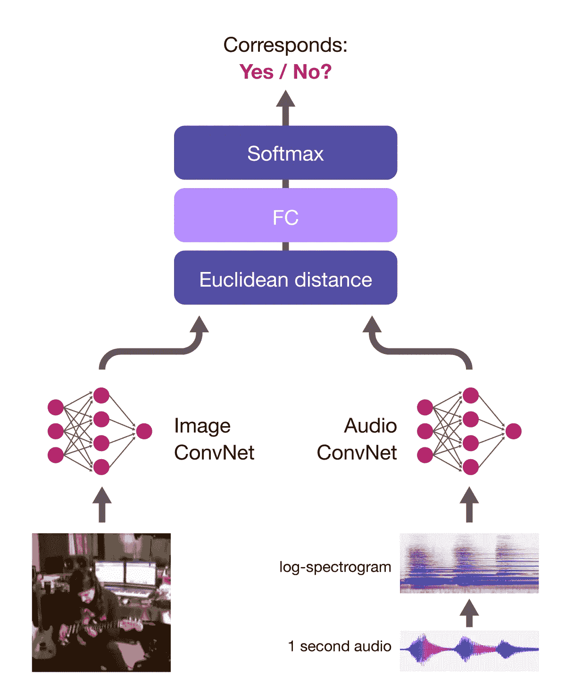
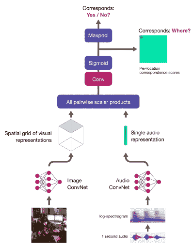

# 发出声音的物体:DeepMind 的研究显示了如何在一个模型中结合视觉和听觉

> 原文：<https://pub.towardsai.net/objects-that-sound-deepminds-research-show-how-to-combine-vision-and-audio-in-a-single-model-c4051ea21495?source=collection_archive---------1----------------------->

## [人工智能](https://towardsai.net/p/category/artificial-intelligence)

## 被称为 AVE-Net 的新架构仍然是多模态学习的一个重大突破。

来源:https://www.infoq.com/news/2020/09/ai-created-foley/

> 我最近创办了一份专注于人工智能的教育时事通讯，已经有超过 90，000 名订户。《序列》是一份无废话(意思是没有炒作，没有新闻等)的 ML 导向时事通讯，需要 5 分钟阅读。目标是让你与机器学习项目、研究论文和概念保持同步。请通过订阅以下内容来尝试一下:

 [## 序列

### 订阅人工智能世界中最相关的项目和研究论文。受到 85，000 多人的信任…

thesequence.substack.com](https://thesequence.substack.com/) 

因为我们是婴儿，我们直觉地发展了将来自不同认知传感器的输入相关联的能力，例如视觉、听觉和文本。当听交响乐时，我们会立即想象一个管弦乐队，或者当欣赏一幅风景画时，我们的大脑会将视觉与特定的声音联系起来。图像、声音和文本之间的关系是由负责分析特定认知输入的大脑不同部分之间的连接决定的。从这个意义上说，你可以说我们天生就能同时从多种认知信号中学习。尽管在图像、语言和声音分析等不同的深度学习领域取得了进步，但大多数神经网络仍然专注于单一的输入数据类型。几年前，Alphabet 子公司 DeepMind 的研究人员发表了一篇[研究论文](https://arxiv.org/abs/1712.06651)，提出了一种方法，可以同时分析音频和视觉输入，并在一个共同的环境中学习物体和声音之间的关系。

在标题[“发出声音的物体”](https://arxiv.org/abs/1712.06651)下，DeepMind 的研究论文专注于一个被称为跨模态学习的分支学科，该分支学科专注于研究图像、声音和文本之间的隐藏关系。跨模态学习已经在图像-文本关系领域取得了一些成功，但是在可以将图像和声音相关联的模型方面几乎没有什么进展。对此的解释非常简单，文本比音频更接近于语义注释。当分析所提供的图像说明的文本形式时，对象是直接可用的，然后问题是提供名词和图像中的空间区域之间的对应关系。在音频的情况下，获取语义不太直接。思考一下根据图像是否包含狗来分类图像和根据音频剪辑是否包含狗的声音来分类音频剪辑之间的区别。

解决跨模态学习问题的传统方法是使用技术学生监督网络，其中的“教师”已经使用大量的人工注释进行了训练。例如，在 ImageNet 上训练的视觉网络可以用于将 YouTube 视频的帧注释为“原声吉他”，这向“学生”音频网络提供训练数据，用于学习“原声吉他”听起来像什么。师生方法的挑战是图像和音频不是以相同的时间和空间顺序处理的，这引入了大量的上下文差异。此外，众所周知，师生模型的大规模实施成本很高，因为需要大量精选的训练数据集。

# AVC 和 AVE-Net

为了解决师生模型的局限性，DeepMind 团队依赖于一种被称为视听通信(AVC)的跨模式学习形式。AVC 方法采用视频帧和 1 秒音频的输入对，并尝试确定它们是否一致。使用前面的类比，AVC 模型将从头开始训练视觉和音频网络，使“原声吉他”的概念自然地出现在这两种模式中。

DeepMind 论文中介绍的特定 AVC 模型被称为视听嵌入网络(AVE-Net ),它采用由成对图像和 1 秒音频频谱图形成的输入数据集。该模型使用音频和视觉子网处理输入，然后是功能视觉层，该功能视觉层试图确定图像和声音之间是否存在关系。下图说明了 AVE-Net 神经网络体系结构。

图片来源:DeepMind

通过同时处理音频和视觉，AVE-Net 模型可以使用简单的欧几里德距离技术来确定两个子网络(音频、图像)之间的嵌入关系。最初的测试表明，AVE-Net 在检测物体和声音之间的双向相关性方面非常聪明，正如在以下视频中清楚看到的那样。

在第一波实验中，AVE-Net 在不同环境下的表现远远优于传统的跨通道学习模型。

# 你能告诉我是什么物体发出这种声音吗？

父母不断要求婴儿模仿不同物体或动物的声音。从认知上来说，这是一个发展婴儿跨模态学习能力的很好的练习。上一节中显示的 AVE-Net 架构在确定图像和声音域之间的相关性方面证明是有效的，但它仍然不能识别图像或视频帧中的哪些对象产生特定的声音。为了应对这一挑战，DeepMind 团队创建了一个 AVE-Net 模型的变体，它在更深的粒度级别上尝试将特定声音中的区域/对象和图像关联起来。该模型被称为视听对象定位(AVOL-Net)，它采用图像和声音对，并试图找到图像中解释特定声音的区域，而其他区域不应与其相关，应属于背景。

AVOL-Net 架构看起来类似于 AVE-Net 模型，只是在视觉网络上有所不同，它生成对应于图像向量中不同区域的视觉嵌入网格。音频和所有视觉嵌入之间的相似性揭示了发出声音的对象的位置，而最大相似性被用作对应得分。

图片来源:DeepMind

以下视频展示了 AVOL-Net 模型识别图像中与目标声音相对应的特定对象的有效性。

跨模态学习仍处于起步阶段，但 AVE-Net 和 AVOL-Net 等方法代表了深度学习领域的主要里程碑。这两种技术都能够学习在相同环境中运行的图像和声音之间的语义关系，而 AVOL-Net 模型能够将声音与图像中的特定对象相关联。诸如 AVE-Net 和 AVOL-Net 之类的方法在暴露于真实世界环境的人工智能(AI)代理中变得极其相关。