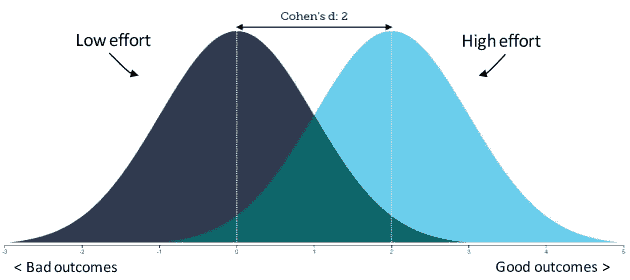
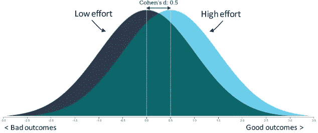
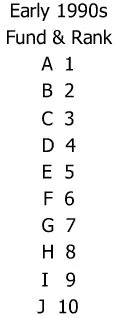
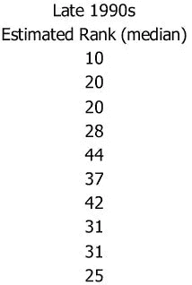
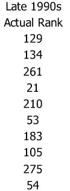
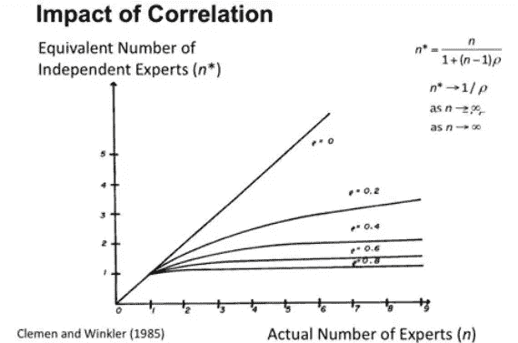

# 人员分析

> 原文：<https://pub.towardsai.net/people-analytics-57479fbd4946?source=collection_archive---------5----------------------->

## 比你的直觉要好

## 绩效评估——需要注意的事项

照片由[查尔斯先行者](https://unsplash.com/@charles_forerunner?utm_source=medium&utm_medium=referral)在 [Unsplash](https://unsplash.com?utm_source=medium&utm_medium=referral) 上拍摄

这篇文章比通常的要长一点。如果你对人员分析、绩效评估感兴趣，那么在我看来，这将是值得的。

eople analytics 是一种数据驱动的工作人员管理方法。企业领导人可以基于对数据的深入分析，而不是基于传统的个人关系、基于经验的决策和风险规避方法，来做出关于他们的人的决策。

人员分析涉及组织中所有与人员相关的问题，例如:

*   招聘/评估
*   保留
*   性能赋值
*   学习和发展
*   团队构成等。

**为什么是现在？**

这主要是因为我们在过去十年中取得的技术进步，这些进步带来了数据可用性、处理能力和分析工具等。

不仅是技术支持，而且越来越多的人认识到工作场所的行为偏差，越来越多的公司认识到他们最大的资产是人。

> 人们越来越认识到最大的资产是人

## 性能赋值

绩效评估的存在主要有两个原因:

*   反馈
*   奖励/惩罚

主要的挑战是，如果员工的情况不同，就很难对他们进行比较。

绩效评估中存在噪音(即，结果与员工的努力不完全相关)。挑战在于将技能和运气分开。

为了更好地理解这一点，让我们从假设所有员工都拥有同等的技能/能力开始。

对于任何给定水平的努力，由于员工无法控制的因素(竞争对手、团队成员、她的老板等)，可能会出现一系列结果

> 挑战在于将技能和运气分开。

在某些地方，这样做更容易

在某些情况下，这并不容易。

**简单模型**

现在我们如何理解这是性能还是运气？

性能有两个组成部分，`Real Ability + Luck,`换句话说，它可以正式表示为`y = x(true ability) + e (error)`。*误差，随机分布在零点附近*。

当我们对极限性能进行采样时，这意味着什么？认真的成功和失败的基础是什么？

*   极度成功= f(x)；x =(超群能力，正误差)
*   极端失效= f(x)；x =(能力低劣，负误差)

极度成功意味着这个人可能有超群的能力或者非常努力，但也意味着他们很幸运。*(误差为正。)*

而另一方面，极端的失败可能意味着能力低下，或者说他们没有非常努力，*(错误为负)*，或者说他们运气不好。

那会有什么后果呢？有一个非常重要的后果。也就是说，在随后的时期，误差不会再为负。它会回归到均值。你会认为它是零。

根据定义，误差为零。如果你在一段时间里有一个非常正的误差，你会期望在接下来的时间里误差变小。这是一个叫做回归均值的概念，也是绩效评估中最重要的
概念之一

# 回归均值:

> 每当我们基于一个属性的极值进行采样时，任何其他不完全相关的属性都会更接近平均值。

***它们可以是:***

*   不同时间点的表现—例如，每年的股票回报
*   同一实体中的不同品质，例如，一个人的骑车速度和学习能力

*例题(思考要点)*

几年前有一项关于 20 世纪 90 年代共同基金表现的研究。这项研究中有 283 只基金。该研究将 20 世纪 90 年代分为两部分，前半部分为 1990-1994 年，后半部分为 1995-1999 年。

图一

他们研究了本世纪前五年表现最好的十只基金，以及它们在 20 世纪 90 年代初的表现。，这些只是前 10 名的表现基金。 ***(图一)***

然后他们出去询问这些基金在随后几年的表现如何，

这是他们询问的人的预测和估计。

图 B

我们可以看到，他们并不期望公司也一样好，但他们期望回归到均值。 ***(图 B)***

显然，预计这些基金不会保持目前的状况，但估计会以平均排名第 25 位的速度移动。

然后他们观察实际发生了什么。到底发生了什么？

范围从 129，21，54。有趣的是，他们的平均排名是 142.5。

142.5 的意义是什么？这是研究中公司总数的一半。

换句话说，在 90 年代后半期，前 10 家公司的平均表现，对于这个样本来说，完全是平均水平。他们完全退步了。

如果是这样的话，那么在 90 年代上半期，这些公司的表现在多大程度上与技能和运气有关呢？等级平均值回归到第二阶段的平均值，表明没有技能。

 [## 回归均值:举例介绍

### 回归平均值是一种常见的统计现象，当我们观察世界时，它会误导我们。学习…

fs.blog](https://fs.blog/2015/07/regression-to-the-mean/) 

> 为什么“回归均值”是一个难以理解和遵守的概念？

## 结果偏差:

嗯，有几件事妨碍了我们。其中，我们有这个`**outcome bias**` **。**

我们倾向于相信好事发生在努力工作的人身上。糟糕的事情发生在工作表现不好的人身上。在此基础上，我们得出了一个过于强大的推论。我们开始根据结果而不是过程来判断决策和人。

这是一个真实而重要的问题，它阻碍了我们对这个概念的理解，即回归到世界的平均框架。

**后见之明偏差:**

接下来是`hindsight bias`。一旦我们看到某事发生，我们很难相信我们没有预料到它会发生。事实上，我们经常错误地认为我们已经预料到了那将会发生。

我们表现出后见之明偏差，如果这是我们对发生的事情进行推理的方式，那么我们不会意识到接下来发生的事情可能只是回归到均值。

**叙事寻求:**

我们想了解这个世界，我们想把点点滴滴联系起来，我们开始更好地相信事情，我们可以讲述时间 1 和时间 2 之间的因果关系。如果我们能说出一个因果故事，那么我们实际上对自己预测接下来会发生什么的能力非常有信心。

我们`seek stories`。这又一次阻碍了我们对统计过程的理解，而统计过程实际上推动了正在发生的事情。

所以，简而言之，我们理解过去。我们是感知动物，我们理解过去。仅仅回归均值没有太多意义，但它会妨碍我们预测接下来会发生什么。

我们试图找到将所有的点联系起来的故事。通过这样做，我们在这些故事中给了机会很小的一部分。

有时，我们根据多年来获得的知识来连接这些点，并向这些知识中添加一些经验有助于我们绘制这些线，但有时我们倾向于过度拟合这些线，我们将应该是非常直的网格、非常简约的连接变成了可能在未来复制的东西。

这可能是对过去非常令人满意的解释，但它是过度拟合的，对过去过度拟合的解释会对未来做出非常糟糕的预测。

# 样本量

现在让我们谈谈样本量，让我们从样本量的心理学开始，以激励我们使用数据来增加样本，并为我们使用小的直观样本提供一些警告。

一个简单的例子。这来自经典研究，参与者被问及以下问题。

您的组织有两个工厂，一个小工厂和一个大工厂，生产标准的计算机芯片。这两家工厂除了产量之外，其他方面都很相似。正常情况下，这种技术产生 1%的次品。每当一天生产中的次品数量超过 2%时，在质量控制日志中进行特别记录。您认为哪个工厂在季度末的质量控制日志中有更多的标记日？

通常大约 20%的人说是较小的植物，大约 30%的人说是较大的植物，然后大约一半的人说是相同的。因为事实上，既然所有的技术本质上都是一样的，为什么会有什么不同呢？

正确答案是什么？正确的答案当然是小工厂。因为你从小样本中得到更多的变异，我们在这里谈论的是变异。

这些是超出预期质量控制范围的生产结果。这些都与预期不同。小样本通常更多样化，人们不喜欢这样。

这是性能评估的一个主要问题，因为我们倾向于从小样本中得出过于强烈的结论。

更详细地看，样本均值收敛于总体
意味着随着样本量的增加**(中心极限定理)**。

一个例题。医院呢？在什么地方，你可能会看到某一天出生的男孩比女孩比例高得多，或者反之亦然？一个小的社区医院，也许每天有 4-5 个婴儿出生？或者镇上一家每天能接生 100 个婴儿的大医院。在每日样本中，您在哪里更容易看到总体均值的变化？

当然，小医院可以看到很大的变化。你甚至可能有一天在一个小医院里全是女孩，另一天全是男孩。在大医院里不太可能有这种情况。

我们倾向于认为，在一个小样本中所看到的是潜在人群的代表。我们不喜欢一个小样本能有很大的波动。事实上，并不能代表它所代表的人口。

这意味着我们应该非常小心，当我们只有一个小样本时，不要凭直觉判断它意味着什么。

T4 的文献承认了这种偏见。事实上，这些小数字之所以有趣，是因为它们没有规律可循，它们四处跳动。

人们认为小样本与潜在人群的特征非常相似，但事实上并非如此。这意味着人口的属性太容易推断，平均从样本。可变性的作用，偶然性的作用，在这些小样本中被忽略了。

> 学习是，几乎总是获得更多的数据，获得更大的样本，小心从小数字中得出的推论，并知道我们有一种基于小样本过快跳跃的偏见。

# 信号独立性:

> 一个大群体的平均预测可靠地超过了个人的平均预测。

一个例子。在历史上的县集市上，你可能会在围栏里养一头大奶牛。每一个来集市的人都能猜到这头牛的重量。有趣的是，尽管大多数人的猜测都是错误的，但他们的平均猜测却非常准确。

这不仅表现在县集市上，也表现在许多其他领域，所有这些赌注的结果是特质区域相互抵消。我可能会猜高一点，你可能会猜低一点。如果有足够多的你和我做这些猜测，那么我们就会非常接近真相。

获得更多的输入提供了一种方法，通过获得更多的信号，让更多的人参与进来，从更多的人那里获得更多的判断，从而更接近真相。这是更多公司应该做的事情。

但是有一个非常重要的警告。

> 人群的价值关键取决于他们的观点有多独立。

因此，举例来说，如果在县集市上，每个猜测奶牛体重的人在猜测之前都互相交谈，那么人群的价值就会大大降低。

那些特殊的错误就没那么特殊了。他们应该是亲戚。一个人大声争辩说，他知道这是什么品种的牛，或者他看到的最后一头牛，这是一个特殊的重量，他会影响每个人的看法。

他们的意见将不再是独立的，并且会洗掉这些独立信号的价值

所以，你需要的不仅仅是一群人。你需要一群尽可能相互独立的人。 ***独立在这里是指不相关的*** 。如果意见是相关的，那么每个附加意见的价值会迅速减少。

如果你有 100 个人的意见，如果他们高度相关，那么你可能只有 5 或 10 个人的意见。

1985 年，杜克大学的鲍勃·克莱门和鲍勃·温克勒做了一项研究，他们从数学上计算出，给定数量的专家对应的专家数量，以及这些专家的相关程度

这是他们的发现。如果相关性为 0，也就是说，如果专家是完全独立的，那么你增加的每一个专家都创造了等价的新价值。

当这些专家的意见变得相关时，甚至在 0.2，我们很快就失去了增加专家的价值。

例如，在上面的图表中，它显示当你从 0 专家到 9 专家，如果你有 0.2 的相关性，你永远不会超过 4。

当我们推动更多的意见，更多的评估时，我们必须同时保持这些意见的独立性。

那么，这种相关性从何而来呢？我们如何用我们熟悉的术语来思考信号
的独立性——在组织中？

嗯，最明显的是，当人们一起讨论这个问题时，它就会发生。当他们交谈的时候。当他们互相提出自己的想法和观点时。一旦发生这种情况，他们就不再有独立的意见。

当他们只是和同样的人说话时，就会发生这种事。他们可能彼此不说话，但是他们都与同一个第三方说话。或者他们有相同的朋友，或者他们以前在不同的晚上去吃饭。所有这些都打破了独立性，所有这些都增加了相关性。

甚至在背景相同的人身上也会发生。如果他们来自同一个地方。如果他们接受了同样的训练。如果他们有相同的顾问，导师，老师。如果他们有相同的经历。所有这些都会增加他们观点的相关性。

因此，所有这些都破坏了独立性，降低了为我们正在运行的任何流程添加额外声音的价值。

> 尽我们所能获取更多的声音。设计流程以尽可能保持这些声音的独立性。

# 结果与过程:

组织或个人应该考虑比他们通常考虑的决策/评估更广泛的目标。

举个例子，也许最重要的是，在取得任何成果的过程中，那个员工对其他员工产生了什么影响？他们对别人产生了什么影响？我们能把这种信息也纳入绩效评估吗

我们需要测量更多的东西。邦德、卡尔森和基尼的研究证实了这一点。发现人们考虑的目标太少。

 [## 生成目标:决策者能清楚地表达他们想要什么吗？

### 长期以来，目标被认为是合理决策的基础。这项研究考察了决策能力…

pubsonline.informs.org](https://pubsonline.informs.org/doi/abs/10.1287/mnsc.1070.0754?journalCode=mnsc) 

这项研究的总结是，如果你问人们他们想要完成什么。他们会列出几个目标。他们问了一大群人，然后你与最初列出目标的人分享所有可能的答案，他们会回去说，哦，是的，我忘了。他们自己只列出了大约一半他们最终认为相关的目标。

这项研究表明，尽管我们认为我们知道自己想要什么，但我们可能不善于关注正确的措施或目标来评估绩效或进行决策。

一般来说，环境中的不确定性越多，员工对确切结果的控制就越少，公司就越应该强调过程而不是结果。

因此，如果噪音越大，员工对结果的控制越少，就越应该根据过程而不是结果对他们进行评估。我们可以尝试通过使用分析来克服这一点，找出哪些过程往往会产生预期的结果。

你在这里寻找的是结果的最基本驱动力？可能只有过程中的最后一步被测量，而事实上，有一些中间步骤可能更重要和更基本，它们可以提供额外的性能测量。

一个曲棍球的例子来说明讨论中的观点。

很长一段时间以来，球队和球员都是根据进球来评估的，如果你试图判断一支球队是否真的很好，他们会看他们进了多少球。如果他们想评估一名球员是弱是强，他们会看这名球员在冰场上对进球的贡献。

但是我们能做得更好吗？原来曲棍球进球不多。有时进球得分是因为他们撞到了柱子然后往左，进球没有得分是因为他们撞到了柱子然后往右。

在实际发生的事情和玩家所能控制的事情之间有很多噪音。

> 每当有噪音的时候，我们必须小心我们给它加了多少重量。它并没有给我们一个非常可靠的信号来显示真正的努力，或其背后的真正能力。

那么他们做了什么？通过分析，他们认为射门比进球更能预测未来。如果你看看有多少球击中了球网。这是一个更好的预测和更可靠的措施。

当你想到这一点时，它会在游戏中和游戏中更加持久。一个球员或一支球队在一个时期投篮表现良好，在下一个时期比一个球员在前一个时期进球表现良好更有可能表现良好。这是一个更持久、更基本的措施。

随后，人们意识到真正重要的是控球，甚至不是投篮。投篮时又有那么多噪音，这是他们能找到的衡量球队或球员对控球的贡献的最佳标准。

拿着冰球的队伍是最有可能投篮的队伍。射门越多，进球越多。但是他们不得不向后看，寻找越来越基本的度量，你可以把这些看作过程度量。他们必须摆脱嘈杂的、结果性的目标衡量，转向更基本的、面向过程的、更可靠的衡量，即占有。

与我们的商业世界相比，销售组织能想出比传统的记账美元更基本的方法吗？例如，你能考虑导致这些美元入账的过程吗？

是否应该查看销售人员让其组织参与的投标数量？或者在此之前，他是为了获得预订美元的机会而建立关系吗？或者甚至可能更早。这是一个更早的过程。这是产生的联系的数量，我们必须准确地确定其中哪一个是最持久的。

这将因组织和行业而异，但我们的想法是利用数据来解决问题，并确定我们可以在流程的何处开始添加评估，以摆脱这些相对罕见的嘈杂结果衡量标准，至少在流程的早期用更基本的驱动因素来补充它们。

# 总结:

当我们进行绩效评估时，我们需要问自己下面的这些问题，还需要了解我们在上面看到的几个关键领域。

我的环境，或者我们正在评估的员工的环境，有多少像数学问题，有多少像彩票？

我们也需要明白我们有偏见。如果我们不了解回归的意义，我们会从过去发生的事情中直接预测。我们通常假设结果反映了潜在的努力或质量，并带有结果偏差。

我们倾向于相信我们在事情发生之前就知道它会发生，即使我们不知道，这是后见之明偏差。

我们有一个习惯，那就是建立一个能解释我们观察到的所有事件的故事。所有这些都限制了我们对机遇所扮演角色的欣赏。

最后，一些关键问题。

1.  差异是持久的还是随机的？
2.  我们怎么知道这不仅仅是好运气还是坏运气？
3.  样本是否足够大以得出有力的结论？
4.  怎样才能让样本变大？
5.  我们到底在看多少不同的信号？
6.  怎样才能让样本、评估、声音尽可能的独立？
7.  我们还关心什么？
8.  我们测量得够吗？
9.  有没有比我们现在测量的更基本的测量方法？

关键是坚持，大样本，独立评估，以及更根本的措施，更多的过程措施。我们可以将这些关键的
问题带到任何评估中，并改进决策过程。

灵感来自沃顿商学院关于人物分析的讲座。

由[向艾](https://towardsai.net/)发布。