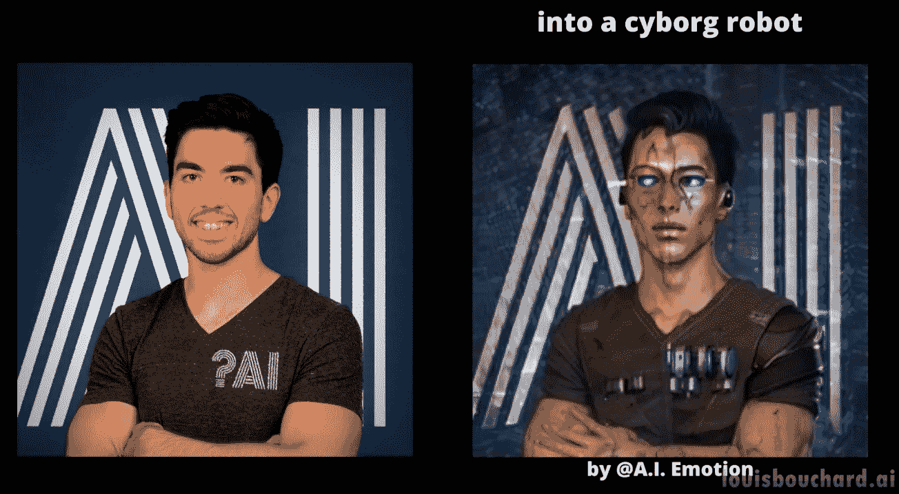
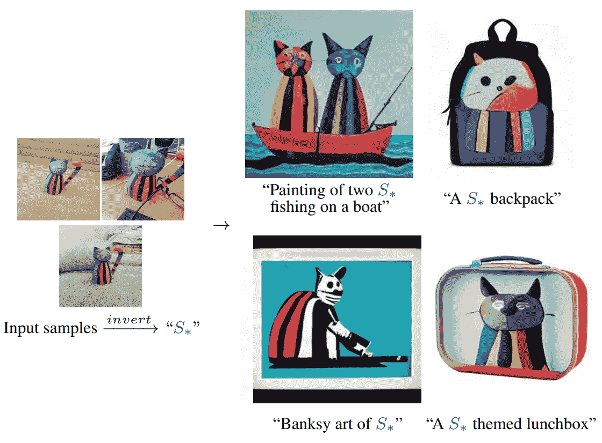
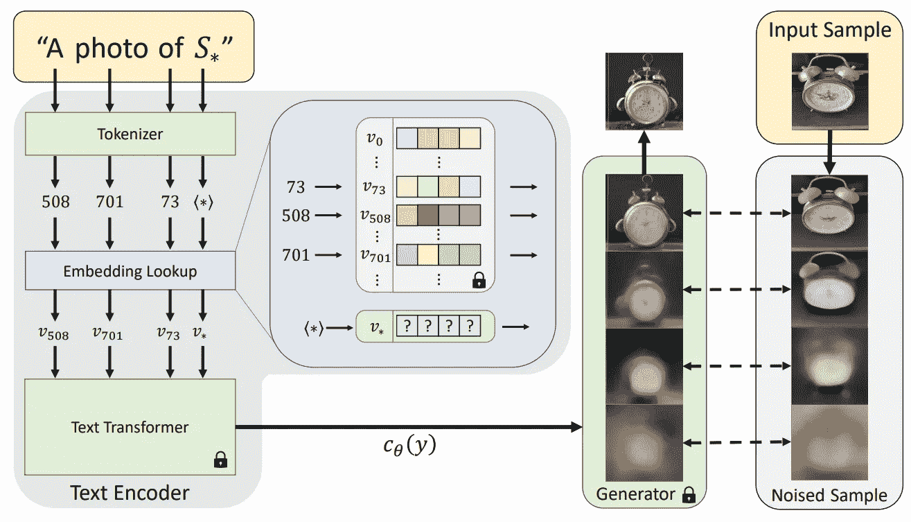
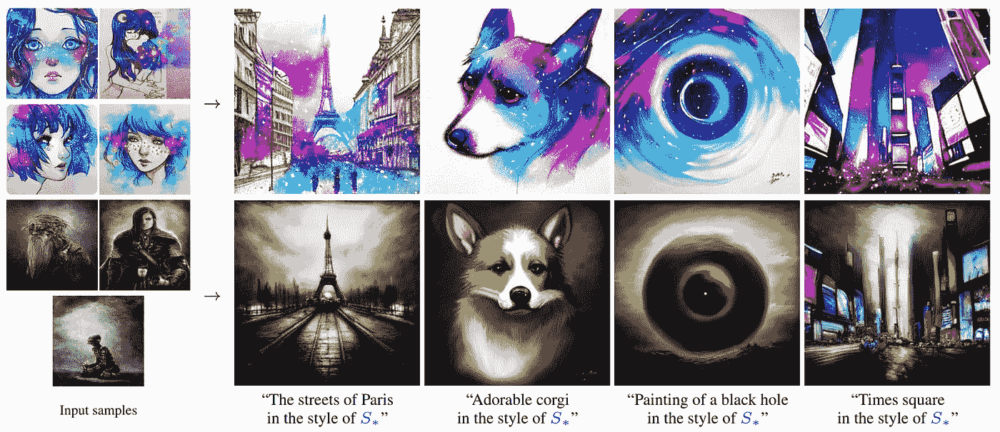

# 用您的图像个性化稳定扩散

> 原文：<https://pub.towardsai.net/personalizing-stable-diffusion-with-your-images-2535d30638ee?source=collection_archive---------1----------------------->

## 使用文本反转个性化文本到图像的生成

> 最初发表于 [louisbouchard.ai](https://www.louisbouchard.ai/imageworthoneword/) ，前两天在[我的博客上读到的！](https://www.louisbouchard.ai/imageworthoneword/)

## 观看视频

像 DALLE 或 stable diffusion 这样的文本到图像模型真的很酷，它允许我们通过简单的文本输入来生成精彩的图片。但是，如果给他们一张你的照片，让他们把它变成一幅画，会不会更酷呢？想象一下，能够发送任何一个物体、人甚至你的猫的图片，并要求模型将其转换为另一种风格，如将你自己变成电子人或变成你喜欢的艺术风格或将其添加到新的场景中。

基本上，如果有一个 DALLE 版本，我们可以用它来 photoshop 我们的图片，而不是随机生成，那该有多酷？拥有个性化的 DALLE，同时让控制代变得简单得多，因为“一个图像胜过千言万语”。这就像拥有一个像抖音算法一样个性化和令人上瘾的 DALLE 模型。

这是特拉维夫大学和英伟达的研究人员所做的工作。他们开发了一种调节文本到图像模型的方法，就像我上周提到的稳定扩散，用一些图像通过你将随图像一起发送的文字来代表任何物体或概念。将输入图像的对象转换成您想要的任何形式。

例子来自[的论文](https://arxiv.org/pdf/2208.01618v1.pdf)。

当然，结果仍然需要努力，但这只是第一篇解决如此惊人的任务的论文，它可能会彻底改变设计行业。正如一位出色的 YouTuber 同事所说:想象一下，接下来还有两篇论文。

那么，我们如何拍摄一组对象的图片，并根据文本条件输入生成新的图像，以添加样式或转换细节呢？

为了回答这个复杂的问题，让我们看看里农·加尔和他的团队想出了什么。输入图像被编码成他们所谓的伪单词，然后您可以在文本生成中使用它。因此论文名为“一幅图像抵得上一句话”。但是他们是怎么得到这个伪词的，又是什么呢？

他们从一个特定物体的三到五张照片开始。他们还使用预先训练的文本到图像模型(下图，右)。在这种情况下，他们使用潜在扩散，这个模型我在不到一周前就介绍过了，它接受任何类型的输入，如图像或文本，并从中生成新的图像。你可以把它看作一个更酷的开源 DALLE。如果你还没有看我的视频，你应该暂停这个，了解这个模型，然后回到这里。你会喜欢这个视频，并了解当前最热门的建筑！

模型概述。(右)是固定的预训练 X-to-image 生成器，而(左)是要训练的文本编码器。图片来自[纸](https://arxiv.org/pdf/2208.01618v1.pdf)。

这样，您就有了输入图像和根据文本或其他图像等输入生成图像的基本模型。但是你怎么处理你的物品的 3-5 张图片呢？你如何精确地控制模型的结果，使你的对象出现在世代中？

这都是在你的第二个模型的训练过程中完成的:文本编码器(上图，左图)。使用你预先训练好的固定图像生成器模型，在这种情况下是潜在扩散，已经能够拍摄照片并重建它，你想教你的文本编码器模型将你的伪词匹配到你的编码图像，或者换句话说，从你的五个图像中提取的你的表示。因此，你将把你的图像输入到你的图像生成器网络，反向训练你的文本编码器，找出什么样的假词或伪词最能代表你所有的编码图像。

基本上，找出如何在与我在之前的视频中描述的图像生成过程相同的空间中正确地表达你的概念。然后，从中提炼出一个伪字来指导后人。通过这种方式，你可以将你的概念注入到未来的任何一代中，并添加一些单词，以使用相同的预先训练的文本到图像模型来进一步调节这一代。因此，你只需训练一个小模型来理解你的图像在潜在空间中的位置，将它们转换成一个假词，用于常规的图像生成模型。您不必接触图像生成器模型，考虑到培训它们的成本有多高，这是一件大事！

瞧！这就是你如何教一个类似 DALLE 的模型生成你喜欢的对象的图像变化或执行强大的风格转换。

例子来自[的论文](https://arxiv.org/pdf/2208.01618v1.pdf)。

当然，这只是这种解决非常非常有趣的任务的新方法的概述，我邀请您阅读下面链接的他们的论文，以更深入地了解这种方法和挑战。

这是一个非常复杂的任务，而且还有很多限制，像理解一个假词中这样一个概念的时间，大致是 2 个小时。它也还不能完全理解这个概念，但是已经非常接近了。我们需要考虑的是，让这样的产品变得可访问也有很多风险。想象一下，能够嵌入一个特定的人的概念，并生成任何涉及这个人的东西。这个挺吓人的，这种技术指日可待。我很乐意在评论区听到你的想法，或者在我们的 Discord 服务器上讨论这个问题。

感谢您的阅读，下周我将带着另一篇精彩的论文与您见面！

## 参考

论文:Gal，r .，Alaluf，y .，Atzmon，y .，Patashnik，o .，Bermano，A.H .，Chechik，g .和 Cohen-Or，d .，2022。一幅图像抵得上一个词:使用文本反转个性化文本到图像的生成。[https://arxiv.org/pdf/2208.01618v1.pdf](https://arxiv.org/pdf/2208.01618v1.pdf)
代码:[https://textual-inversion.github.io/](https://textual-inversion.github.io/)我的时事通讯(一个新的人工智能应用每周解释给你的电子邮件！):[https://www.louisbouchard.ai/newsletter/](https://www.louisbouchard.ai/newsletter/)