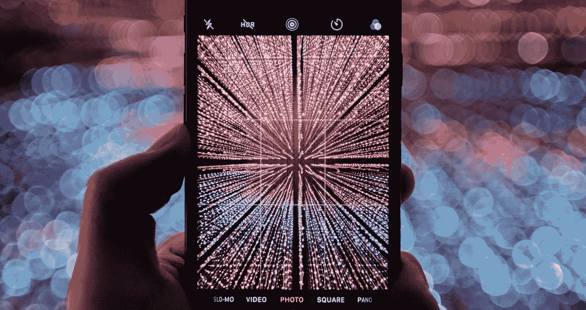

# 摄影+成像——好的、坏的和……哦，天哪！

> 原文：<https://pub.towardsai.net/photography-imaging-the-good-the-bad-and-the-oh-dear-29be5f45b9d6?source=collection_archive---------0----------------------->

来自[突发](https://burst.shopify.com/creative?utm_campaign=photo_credit&utm_content=Free+iPhone+Light+Art+Photography+Photo+%E2%80%94+High+Res+Pictures&utm_medium=referral&utm_source=credit)的 [Verne Ho](https://burst.shopify.com/@verneho?utm_campaign=photo_credit&utm_content=Free+iPhone+Light+Art+Photography+Photo+%E2%80%94+High+Res+Pictures&utm_medium=referral&utm_source=credit) 摄影。

## 摄影的技术革命| [走向人工智能](https://towardsai.net)

这个三集系列的第一集回顾了摄影 190 年的历史，以及它通过早期数字转换的技术演变。第二部分涵盖了摄影和计算机视觉领域的一系列最新技术发展。

在本系列的最后一部分，我们将介绍新技术带来的一些挑战、减轻挑战的努力以及可能的解决方案，最后是对未来机遇的思考。

第 2 部分中提到的许多技术呈现的功能并不一定是新的。多年来，人类已经能够使用软件或模拟方法来完成许多相同的任务。然而，手动排列像素的时间密集性限制了输出。但是，随着机器越来越能够以其众所周知的快节奏完成以前只有人类才能完成的任务，我们看到出于合法和可疑目的的产出大幅增加。这个问题很大程度上是一个*规模*的问题，因为虚假图像的数量激增，对我们媒体的完整性产生了明显的影响。

# 主观的眼睛

图像从来都不是现实的文字表达，这就带来了识别赝品的挑战。每一种视觉捕捉设备和表现媒介都有其固有的偏见和对现实的偏离。通过我们的感知、生理和生活经验，我们每个人都从略有不同的角度看待同一件事情。安塞尔·亚当斯有句名言:“电影底片相当于作曲家的配乐，印刷品相当于作曲家的演奏。每次表演都有细微的不同。”

无论是简单地过度曝光或曝光不足，还是去除分散注意力的元素，摄影师都可以随意使用他们的图像来阐明一个观点。即使在这个数字时代，每个品牌的相机的原始数据都会略有不同，渲染数据的软件对其表现有进一步的影响。更强大的硬件和软件算法正在捕获越来越多的高保真数据，但其输出受到越来越强大的编辑工具的影响，这些工具可以进行主观解释。

价值观在这个难题中也扮演了一个角色。恶意伪造和艺术编辑之间的区别并不总是很明显，这一点因人而异，例如时尚摄影如何被修饰以创造一些标准更理想的图像，但被其他人视为不切实际和有害的美丽写照。与此相关的是，对 iPhone 新的前置自拍相机的输出及其平滑面部特征的趋势的担忧被贴上了“ [Beautygate](https://www.businessinsider.com/beautygate-iphone-xs-camera-appears-to-apply-beauty-mode-to-selfies-2018-9) ”的标签，尽管苹果公司表示这一结果是由于先进的算法和“智能 HDR”即使是未经修改的图像，当它伴随着一个标题来暗示一个支持政治观点的背景时，也可以被用来歪曲。

# 我们在去…的高速公路上

可以说，意象总是具有主观性，我们已经学会将其过滤到我们的解释中。但是，新技术正在测试我们的信任和能力的极限，并补偿过去与现实的微妙变化。这项新技术有可能呈现一种截然不同且可信的描述，这种描述在电影中让我们开心，但在政治和社会领域却让我们感到恐惧。

为了防止政府滥用，出于对公民自由和错误结果的担忧，旧金山禁止市政机构使用面部识别，马萨诸塞州的萨默维尔和加利福尼亚州的奥克兰也是如此。事实上，这是一项正在快速发展的技术。尽管这项禁令存在争议，但它也具有前瞻性。一旦精灵被释放出来，就很难再把它放回瓶子里，而且这也不是第一次科技的发展速度超过了政策。一个[对伦敦警方面部识别系统](https://www.technologyreview.com/f/613922/london-polices-face-recognition-system-gets-it-wrong-81-of-the-time/)的独立评估确定结果在法庭挑战中不成立，因为它发现错误率为 81%。准确性肯定会提高，但面部识别的禁令和问题有望推动对其实施的健康政策辩论。

[DeepNude](https://www.vice.com/en_us/article/kzm59x/deepnude-app-creates-fake-nudes-of-any-woman) ，这款能够通过神经网络脱去女性衣服以产生逼真图像的软件曾短暂亮相，直到开发者同意移除访问权限，认识到它扩散的速度有多快，并承认它可能被滥用和造成伤害。不幸的是，这种或类似的软件不太可能永久消失。这种功能在医学上可能有有用的应用，例如，整形外科手术，但正确和不正确或恶意使用之间的距离如此之短，这说明了如何管理软件技术的挑战。

# 从造假中解救出来？

意象的改变并不新鲜。最早的例子之一是 1860 年亚伯拉罕·林肯的一张标志性照片，照片中他的头被放在另一个人的身体上。斯大林因用喷枪将他的敌人从照片中抹去而闻名。

但随着虚假媒体的传播，包括俄罗斯对 2016 年美国总统大选的干涉，报复色情和个人人格攻击的增加，识别可疑媒体的努力已经升级。在 2004 年左右，篡改图像的检测首次成为一个更大的焦点，自从使用了各种方法之后，这种检测得到了加强。包括脸书在内的许多公司意识到潜在的损害、风险和一定程度的责任，正在开发检测图像和视频造假的工具。甚至早期版本的扫描软件和 Photoshop 都有防止纸币复制的工具。

Adobe 和加州大学伯克利分校分享了[检测被篡改的人脸的初步成果](https://theblog.adobe.com/adobe-research-and-uc-berkeley-detecting-facial-manipulations-in-adobe-photoshop/)。美国政府正在通过 DARPA 的[媒体取证](https://www.darpa.mil/program/media-forensics)部门培育一个检测平台。其他组织也涌现出来抵御人工智能的横行，如人工智能基金会正在开发 [Reality Defender](https://aifoundation.com/responsibility/) ，一个提醒用户可疑假货的浏览器插件，以及 [SurfSafe](https://chrome.google.com/webstore/detail/surfsafe-join-the-fight-a/hbpagabeiphkfhbboacggckhkkipgdmh) ，一个由加州大学伯克利分校的几名本科生开发的 Chrome 插件，可以将一张图片与 100 多个可信网站进行比较。

《纽约时报》与 IBM Garage 合作，在新闻出处项目中尝试通过区块链技术保护图像和视频元数据。该方法可以使读者确定图像或视频的来源，以及媒体是否在发布后*被更改。*

打击假货不能完全通过机器人警察在互联网上巡逻来实现。对于内容制作工具的创建和分发，必须有一些所有权和责任。物理空间的建筑师认识到结构如何影响人类互动和社区的性质和质量。建筑的很大一部分致力于设计建筑和住宅，以提高生活质量。今天，软件架构师和工程师能够利用功能强大的开源软件，生产出易于全球分销的成品，而且几乎没有成本。没有理由为什么应用于物理空间的问题不能以类似的方式应用于软件。某种程度的自我监管将是明智的，既有利于社会利益，也能避免繁琐的外部监管和许可，而其他行业——建筑师、建筑商、律师和医疗行业——也面临着这些问题，它们对公共福利有很大影响。最近强调“同理心”是软件设计的一个价值，这是令人鼓舞的，但只是向前迈出的一小步。

预测一个有价值的工具的误用是具有挑战性的。在脸书、Twitter 和 Instagram 问世的时候，很难想象它们会成为今天的样子，以及它们带来的好处和挑战。然而，软件是一种工具，就像任何工具一样，它可以被用来做好事或坏事。在新软件的*设计、开发和发布*过程中，应该对潜在的危害进行深思熟虑。在某些情况下，自动监控使用中的工具可能有价值。

关于媒体和内容创作，一种方法可以是内容软件将编辑和日期的历史写入图像或视频文件中，以列举变化、可由开源工具读取的元数据，作为评估和验证的手段。这不是一个万无一失的方法，但它可能会阻止潮流，并提供一定程度的透明度。

侦测是一场猫捉老鼠的游戏，随着黑客找到新的破坏方式，这场游戏可能会没完没了。最终的解决方案需要多方面的方法，包括作者责任、政策、法律、专业工具和适度的怀疑。

# 什么，我担心？

公民社会依赖于准确的信息。美国宪法第一修正案作为我们民主社会的核心，有一个很好的理由来确保每个人都有表达真理的声音。随着时间的推移，各种法律挑战进一步界定了这一权利的界限，对伤害、欺诈或诽谤的言论加以限制。然而，在潜在匿名的在线场所引入接近光速运行的机器带来了巨大的挑战，特别是假图像和视频变得如此令人信服。一些人认为，美国和英国目前的政治极化，尤其是在英国退出欧盟问题上，在某种程度上是由于外部势力操纵了社交和新闻渠道的信息。在大范围内，假新闻和图像成为非常严重的问题。

人类的大脑已经进化到在深层情感层面处理图像。各种研究证明了安慰或威胁意象对心率和血压等生理指标的影响。我们选择把艺术品挂在家里的墙上，因为它对我们的情绪和幸福有影响。图像非常容易引起共鸣——对于我们来说，用对其真实性的怀疑这样的智力反应来取代我们的情感反应是一种挑战。

学术界和工业界理应在软件开发学科中灌输一种社会责任感，意识到对我们的社会和政治结构的潜在损害。允许我们对技术的迷恋推动其传播，而不考虑其影响的现状在许多方面损害了我们的福祉。在这方面，为社会和道德治理创造新的角色，补充已经侧重于隐私和安全的角色，将会有所帮助。

# **保持警惕**

从表面上看，摄影并没有死亡，而是充满了活力。一些趋势令人担忧，摄影作为一个整体可能更难定义——这门学科比过去包含了更多。

智能手机使得摄影被更广泛地用于记录和交流个人经历。在一个时间受限的时代，静态图像和视频已经成为事实上的*快速传递大量信息的手段，尽管在许多情况下，不如文字准确。*

在创作领域，摄影和成像受益于作为一种表现的思考。资源调配、位置、时机、剪辑和镜头背后的目标都是表演的一部分，并为理解提供了背景。曝光的时刻更多的是关于获取数据，而之前和之前的一切都有助于它的意义。

摄影和成像的下一步是什么？观察水晶球提供了一些线索。

*   [曲面图像传感器](https://arxiv.org/pdf/1706.07041)将显著提高图像质量。它们接近镜头的曲率，距离商业化不远，并有望解决当距离镜头轴的距离增加时分辨率和光线的一些失真和损失——这在今天的图像角落中很常见。
*   计算照片背后的机会才刚刚被挖掘出来。神经网络训练和算法将继续改进，实现更好的输出质量，这也是自动驾驶汽车的一个依赖因素。
*   展望未来，我们将看到更多数据融入算法，以创建更智能的成像平台和超越图像数据的新见解。将图像与空间数据相结合将实现对房间、地点和地形的空间感知，这除了实现附加功能之外，还提供了许多直接的好处，AR 和 VR 是显而易见的用途。
*   医疗应用提供了巨大的机会，特别是当大型摄影信息数据集与遗传数据、医疗和结果数据以及实验室结果和现有成像(如热扫描、CT 扫描和 MRI 扫描)等其他指标相结合时。神经网络将揭示健康和疾病的新关联和指标。当随着时间的推移纵向应用时，这有可能在个性化水平上获得医学见解，并更早地识别风险和检测疾病。

对于那些跟随你的人，谢谢你的阅读！可以肯定的是，我们的集体想象力和知识将带来其他有趣的发展，不仅影响医学，还会影响娱乐、艺术、商业、设计和环境。有趣的时光。敬请期待！