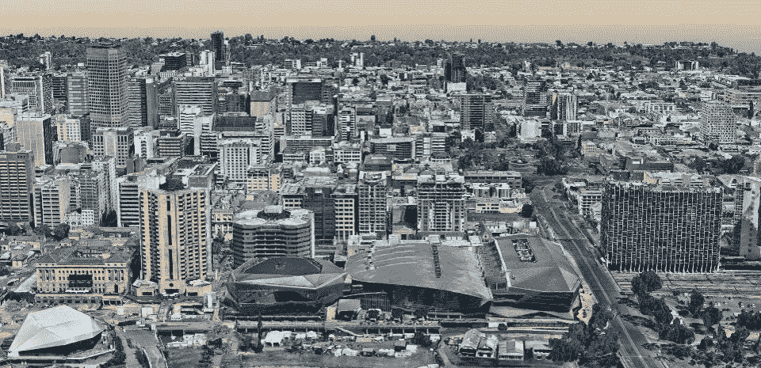

# 用人工智能和大数据规划更好的城市——第一部分

> 原文：<https://pub.towardsai.net/planning-better-cities-with-ai-and-big-data-part-one-dd22c85c4397?source=collection_archive---------4----------------------->

像阿德莱德这样的 3D 模型可以帮助城市规划者直观地看到一个发展项目在原地会是什么样子，这是一个有助于缓解城市空间日益拥挤的有用工具。

我们的城市正以不可控制的速度增长。联合国估计，现在有 33 个人口超过 1000 万的特大城市*(印度有 5 个，中国有 6 个——*——以上)，世界上最大的城市东京，人口接近 3750 万。随着城市向绿色空间蔓延，城市居民忍受着越来越拥挤和污染的环境，准确规划城市空间的功能比以往任何时候都更加重要。随着气候危机的逼近，数据和新技术可能是我们创造更适合居住和可持续发展的城市的最佳选择。**

**本系列的第一部分将重点关注可视化城市如何发展，如何更准确和可持续地规划城市，并探索智能技术如何让城市在现在和未来变得更高效。**

# ****一张完整的图片****

**要解开一个城市的复杂性，首先你必须了解住在那里的人。在规划一座城市或做出影响整体的小改变时，收集有关当地人口变化、人口统计、经济增长和衰退以及政治和社会忠诚的数据至关重要。[*Social Explorer*](https://www.socialexplorer.com/)是一家数据收集和可视化公司，允许用户将一个地区的不同数据点叠加在该城市或地区的地图上。将特定地区的收入、住房存量和经济活动等数据点可视化，可以让城市规划者衡量他们的城市正在如何发展，以及这些变化可能会如何影响其居民。总裁兼联合创始人 Andrew Beveridge 说:“*需要跟踪许多数据点，以正确地反映一个城市如何以及为什么会随着时间的推移而变化，**了解一个城市的基线数据可以让城市规划者做出决策，为其居住者提供最大的利益。***

> **随着城市变得越来越大，影响力越来越大，全面了解一个城市变得越来越重要([尤其是在欧洲](https://www.theguardian.com/cities/2019/nov/10/how-europes-cities-stole-continents-wealth))，智能技术可能是确保城市人口以可持续的方式获得适当服务的一种方式。**

**贝弗里奇说，寻求实施智能技术的城市规划者还必须确保“*政府和市民的利益围绕智能城市技术提供的真正价值和效用保持一致，*，否则任何“*智能*开发都将得不到充分利用，无法实现预期功能。使用技术来更好地了解和改善我们的城市——无论是数据驱动的分析还是智能城市计划——将有助于缓解世界各地发生的城市爆炸，并大大减少这些城市对我们地球的影响。**

# ****自上而下的数据****

**除了了解一个城市的居民和他们最迫切的需求，任何给定城市的大量属性——树木数量、交通联系、建筑物的高度和密度——在试图规划任何重大变化时也同样重要。 [*Nearmap*](https://www.nearmap.com/us/en) 提供高度详细的航空影像、3D 模型和历史数据，以帮助客户可视化给定的开发项目将如何适应其环境，并使用经过人类标签培训的人工智能来识别太阳能电池板和绿色空间等属性。绿色空间越来越被视为城市"宜居性"的一个重要因素-《经济学家》杂志连续第二年评选的"最适宜居住的城市"是维也纳，维也纳的绿色空间达到了惊人的 45.5%，仅次于欧洲的奥斯陆(68%)。首席执行官罗伯·纽曼说:“*CBD(中央商务区)正在变得更加绿色，有更多的屋顶花园和垂直花园，”T23，“但无论我们建造什么，都需要提供一定数量的绿色空间，需要为宜居空间做出贡献。*”**

**虽然监测城市的各种属性对于规划和改善现有空间非常重要，但我们的城市在能源和智能城市基础设施方面有着迫切的问题，需要在未来加以解决。为了应对可再生能源日益增长的重要性，[*near map*](https://www.nearmap.com/us/en/products/nearmap-on-opensolar)与太阳能平台 [*Open Solar*](https://www.opensolar.com/) 合作，创建了一个工具，允许客户设计太阳能电池板，就像它们在原位*出现一样*。虽然这不会直接增加太阳能电池板的数量，但它无疑为那些对该技术感兴趣的人消除了一些官僚障碍。正如纽曼指出的那样，识别城市的现有属性也是智能城市发展的关键:“ *5G 基站需要彼此相距几百米，并有一个视线范围。查看影像和属性，显而易见的选择是使用现有的电力和灯杆，而不增加新的基础设施。***

# ****规划下一代****

**让我们的城市更可持续、更宜居、更适合居民居住是一项紧迫的任务，因为预计到 2030 年，68%的世界人口将居住在城市地区。测量和监控人口和城市资产的关键指标将有助于我们认识到我们必须做什么，哪里需要改善，以及我们如何实施智能城市技术来帮助缓解城市持续增长带来的压力。**

***原载于 https://www.forbes.com***。****