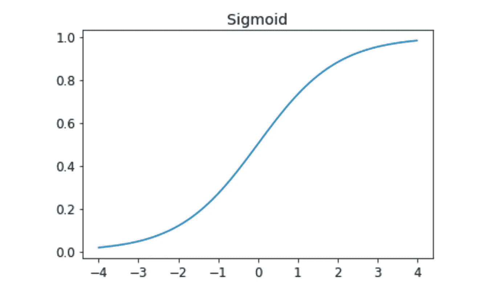
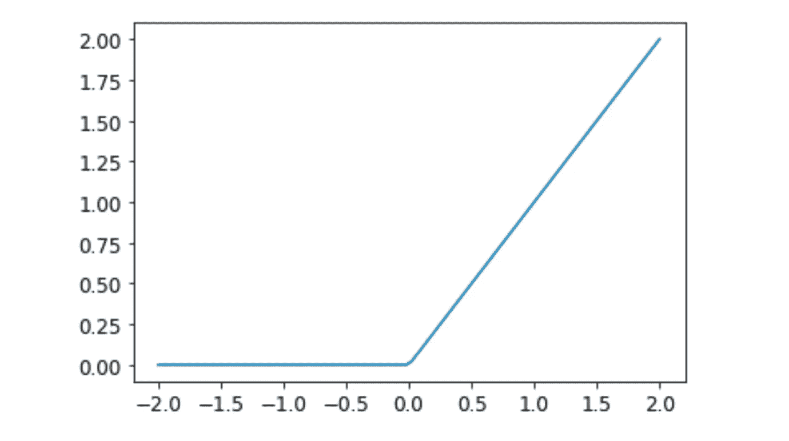

# Fastai 课程第 4 章 Linux 问答

> 原文：<https://pub.towardsai.net/programming-90d2ccb6eaa9?source=collection_archive---------3----------------------->

## [编程](https://towardsai.net/p/category/programming)

## 本章末尾的问卷答案


图片由[埃菲社](https://unsplash.com/@efekurnaz)提供

教科书的第四章概述了培训过程。它提供了测量损失、计算梯度和更新权重的详细介绍。它还涵盖了训练过程的一些机制，包括张量运算，激活函数，损失函数，优化函数和学习率。

> 我们花了很多周时间写问卷。这样做的原因是，因为我们试图思考我们希望你从每一章中学到什么。因此，如果您先阅读调查问卷，您可以了解我们认为您在继续下一章之前应该了解的内容，因此，请确保在继续下一章之前完成调查问卷。
> 
> —杰瑞米·霍华德，Fast.ai

## 1.灰度图像在计算机上是如何表现的？彩色图像怎么样？

G *rayscale 图像*是具有一个通道的图像，表示为二维矩阵。它包含表示图像中每个像素的光强度的像素值，其中 0 是黑色像素，255 是白色像素，所有介于两者之间的值是不同深浅的灰色像素。

*彩色图像*是具有三个通道的图像，表示为三维矩阵。它包含三个二维矩阵，这些矩阵包含代表图像中每个像素的颜色强度的像素值。其中每个矩阵是红色、绿色和蓝色的不同色调。

## 2.MNIST 样本数据集中的文件和文件夹是如何构成的？为什么？

数据集使用机器学习数据集的通用布局来构建。它使用单独的目录来存储训练集、验证集和/或测试集。它还在每个目录中使用单独的子目录来存储图像文件，其中子目录名称用作标签。

## 3.解释对数字进行分类的“像素相似度”方法是如何工作的。

*像素相似度*是机器学习中使用的一种方法，用于测量两幅或多幅图像之间的相似度。它计算每个图像子目录中所有图像的每个像素的平均像素值。它还将未知图像与已知图像的平均像素值进行比较，以确定该图像与每个已知图像的相似程度。

## 4.什么是列表理解？现在创建一个从列表中选择奇数并将它们加倍的函数。

*List Comprehension* 是 Python 中用于从现有列表创建列表的语法。它通过对现有列表中的每个项目执行操作来创建新列表。它还包含三个部分，包括表达式、for-loop 和方括号中声明的可选 if-condition。

## 5.什么是秩 3 张量？

*张量秩*描述了一个张量中的维数。它可以有 N 维，其中秩 0 是零维的标量，秩 1 是一维的向量，秩 2 是二维的矩阵，秩 3 是三维的长方体。它也可以由访问张量中的值所需的索引的数量来确定。

## 6.张量秩和形状有什么区别？从形状上怎么得出排名？

*张量形状*描述了张量中每个轴的长度。它包含有关等级、轴和索引的信息，其中轴的数量标识等级，维度的长度标识每个轴上可用的索引的数量。它也有助于可视化张量，这对更抽象的高阶张量很有用。

## 7.什么是 RMSE 和 L1 规范？

[平均绝对误差(MAE)](#5cae) 和[均方根误差(RMSE)](#f978) 是损失函数，用于计算预测值和实际值之间的差异。当预计误差呈线性变化以及处理极值时，最好使用 MAE，也称为 L1 范数。当预计误差呈非线性变化时，最好使用 RMSE，也称为 L2 范数。

## 8.你如何一次对数千个数字进行计算，比 Python 循环快几千倍？

*Numpy 数组*是一个多维矩阵，用于执行数值计算。它可以包含任何相同数据类型的元素，可以是数组的数组。它也可以在 CPU 上用 C 运行，执行计算的速度比 Python 快几千倍。

PyTorch 张量是一种特殊的数据结构，非常类似于 Numpy 数组，但是有一个附加的限制，可以释放额外的功能。它只能包含相同数据类型的元素，这些数据类型必须是基本数值类型。它既可以运行在执行计算速度比 Python 快几千倍的 CPU 上，也可以运行在执行计算速度比 Python 快几百万倍的 GPU 上。

## 9.创建一个包含从 1 到 9 的数字的 3×3 张量或数组。加倍吧。选择右下角的四个数字。

## 10.什么是广播？

*广播*是 NumPy 中的一个概念，用来描述在不同形状的数组上执行操作的能力。它提供了一种向量化操作的方法，因此循环发生在 C 语言中，执行计算的速度比 Python 快 1000 倍。它还需要数组中每个维度的形状相等，或者其中一个维度必须是 1。

## 11.指标通常是使用训练集还是验证集来计算的？为什么？

机器学习过程的模型评估阶段使用度量来评估使用验证集的已训练模型的性能。它使用度量来检测过度拟合，并调整超参数以提高模型的性能。它还使用最佳超参数训练新模型，以使用测试集评估模型的性能。

## 12.什么是 SGD？

*随机梯度下降(SGD)* 是机器学习中的一种算法，用于寻找对应于预测值和实际值之间最佳拟合的模型参数。它使用训练数据的随机实例计算梯度，并在每次迭代中更新模型参数，这消除了与梯度下降相关的计算负担。它还可以通过将模型移出局部最小值并移向全局最小值的方式来调整模型参数。

## 13.SGD 为什么使用小批量？

优化算法使用一个或多个数据项来计算梯度。它可以使用整个数据集的平均值，但这需要很长时间，并且可能不适合内存；或者它可以使用单个数据项，但这可能不精确且不稳定。它还可以使用少量数据项的小批量的平均值，这对于较大的批量来说更加准确和稳定。

## 14.SGD 中机器学习的七个步骤是什么？

想象一下，一辆车停在最低点，在山里迷路了。总是走下坡路是件好事，最终会到达目的地。知道迈出多大的一步并继续前进直到到达底部停车场也是很好的。

1.  初始化随机参数
2.  计算预测
3.  计算损失
4.  计算梯度
5.  更新权重
6.  转到第二步，重复这个过程
7.  当模型足够好时停止

## 15.我们如何初始化模型中的权重？

训练模型的第一步是初始化参数，也称为权重和偏差。它可以使用随机数进行初始化，这在大多数情况下是有效的，除了训练具有许多层的神经网络，这会导致爆炸或消失的梯度。也可以使用特殊的权重初始化技术进行初始化，该技术使用随机数，但确保梯度保持在合理的范围内。

## 16.什么是损失？

*损失*是机器学习中用来衡量预测错误程度的评估指标。它计算预测值和实际值之间的距离，其中零表示满分。还可以使用几种不同损失函数中的一种进行计算，损失函数根据模型是解决分类问题还是回归问题而变化。

## 17.为什么不能一直用高学习率？

*学习率*是一个超参数，在机器学习中用于控制在训练过程的每次迭代中调整权重的程度。它可能太低，这需要太长的训练时间，并使模型更有可能陷入局部最小值。它也可能太高，超过了全局最小值，并在没有达到它的情况下反弹。


## 18.什么是渐变？

梯度是一个向量，在机器学习中用于识别损失函数产生最陡上升的方向。它测量所有权重相对于误差变化的变化。它还用于在训练过程中更新权重，其中从权重中减去梯度和学习率的乘积。

## 19.你需要知道如何自己计算梯度吗？

不，不需要知道如何手动计算梯度。可以使用来自`PyTorch`库的`Tensor`类中的`requires_grad_`方法自动计算相关变量。它还标记了跟踪应用于张量的每个操作的变量，以便执行反向传播来计算梯度。

```
variable_name = Tensor(3.).requires_grad_()
```

## 20.为什么不能用精度作为损失函数？

[精确度](#16a3)不适合用作[损失函数](#40bf)，因为它只在模型预测改变时才会改变。它可以提高其预测的可信度，但除非预测实际发生变化，否则准确性将保持不变。它还产生几乎等于零的梯度，这阻止了参数在训练过程中更新。

## 21.画出 sigmoid 函数。它的外形有什么特别之处？

[sigmoid](http://eb44) 函数是一个激活函数，因其绘制时的形状类似字母“S”而得名。它有一条平滑的曲线，从高于 0.0 的值逐渐过渡到略低于 1.0 的值。它也只上升，这使得 SGD 更容易找到有意义的梯度。



## 22.损失函数和度量的区别是什么？

损失函数用于评估和诊断模型在训练过程的优化步骤中的学习情况。它对置信水平的微小变化做出响应，这有助于最小化损失，并监控过度拟合、欠拟合和收敛等情况。它还会针对数据集中的每个项目进行计算，并在每个时段结束时对所有损失值进行平均并报告总体平均值。

该度量用于评估模型，并在训练过程之后的评估过程中执行模型选择。它提供了对模型性能的解释，使人们更容易理解，这有助于在整个项目和项目涉众的目标的上下文中赋予性能意义。它还会在报告模型性能的每个时期结束时打印出来。

## 23.使用学习率计算新权重的功能是什么？

*优化器*是一种优化算法，用于机器学习，在训练过程的优化步骤中根据梯度更新权重。它以定义某种损失函数开始，以使用一个优化例程最小化损失结束。它还可以在几小时或几天内获得良好的准确性。

## 24.DataLoader 类是做什么的？

*数据加载器*是 PyTorch 中使用的一个类，用于将数据集预处理成模型期望的格式。它指定要加载的数据集，随机打乱数据集，创建小批量，并并行加载小批量。它还返回一个 dataloader 对象，该对象包含表示自变量和因变量批次的张量元组。

## 25.编写伪代码，显示 SGD 在每个时期采取的基本步骤。

## 26.创建一个函数，如果传递了两个参数[1，2，3，4]和' abcd '，则返回[(1，' a ')，(2，' b ')，(3，' c ')，(4，' d ']。输出数据结构有什么特别之处？

输出很特殊，因为它与 PyTorch 中使用的 Dataset 对象具有相同的数据结构。它包含一个元组列表，其中每个元组存储一个带有关联标签的项目。它还包含在每个索引处配对的第一个和第二个参数的所有项目和标签。

## 27.PyTorch 中的 view 是做什么的？

*视图*是 PyTorch 中使用的一种方法，用于在不改变张量内容的情况下重塑张量。它不创建数据的副本，这种副本允许高效的内存高效的整形、切片和基于元素的操作。它还与原始张量共享基础数据，这意味着对视图中数据的任何更改都将反映在原始张量中。

## 28.神经网络中的偏差参数是什么？我们为什么需要它们？

*偏差*是机器学习中使用的一个参数，用于抵消模型内部的输出，以更好地拟合训练过程中的数据。它将激活功能向左或向右移动，从而移动整个曲线来延迟或加速激活。在通过激活函数之前，它也被添加到输入和权重的乘积中。

```
parameters = sum(inputs * weights) + bias
```

## 29.Python 中的@运算符是做什么的？

*@* 是 Python 中用来在两个数组之间执行矩阵乘法的运算符。它执行与 NumPy 库中的 matmul 函数相同的操作。它还使得矩阵公式更容易阅读，这使得专家和非专家都更容易使用。

```
np.matmul(np.matmul(np.matmul(A, B), C), D)A @ B @ C @ D
```

## 30.逆向方法是做什么的？

*向后*是 PyTorch 中用来计算损耗梯度的方法。它使用 PyTorch 库中 Tensor 类中的 backward 方法执行反向传播。它还将渐变添加到当前存储在张量对象的 grad 属性中的任何其他渐变中。

## 31.为什么我们必须将梯度归零？

在 PyTorch 中，默认情况下，渐变在后续反向过程中累积。它有助于训练处理时间序列数据的递归神经网络，其中重复反向传播以随时间执行反向传播。对于大多数神经网络，在执行反向传递以正确更新参数之前，还必须手动将其设置为零。

```
learning_rate = 1e-5
parameters.data -= learning_rate * parameters.grad.data
parameters.grad = None
```

## 32.我们必须向学习者传递什么信息？

*学习器*是 Fastai 中用来训练模型的一个类。它指定了训练模型和执行迁移学习所需的数据加载器和模型对象。它还可以指定优化器函数、损失函数和其他已经有默认值的可选参数。

```
learner = Learner(dataloaders, model, loss_function, optimizer_function, metrics)
```

## 33.显示 Python 或伪代码，了解训练循环的基本步骤。

*训练*是机器学习中的一个过程，用于建立一个可以对未知数据做出准确预测的模型。它涉及架构、数据集、超参数、损失函数和优化器。它还包括将数据集分为训练、验证和测试数据，对数据进行预测，计算损失，以及更新权重。

```
for _ in range(epochs):
    prediction = model(x_batch, parameters)
    loss = loss(prediction, label)
    loss.backward()
    for parameterin parameters:
        parameter.grad.data += learning_rate * parameter.grad.data
        parameter.grad.data = None
```

## 34.什么是 ReLU？画一个从-2 到+2 的曲线图。

*矫正线性单元(ReLU)* 是机器学习中使用的激活函数，用于解决消失梯度问题。它激活所有正值的输入值，并用零替换所有负值。当有太多激活为零时，它还降低了模型正确训练的能力，因为零的梯度为零，这阻止了那些参数在反向过程中被更新。



## 35.什么是激活函数？

*激活函数*是在机器学习中用来决定输入是相关还是不相关的函数。它连接到人工网络中的每个神经元，并根据输入是否与模型的预测相关来确定是否激活。它还有助于将每个神经元的输出标准化到-1 和 1 之间的范围。

```
output = activation_function(parameters)
```

## 36.F.relu 和 nn 有什么区别？ReLU？

F.relu 是 PyTorch 中使用的一个函数，用于将校正的线性单位函数应用于在类中手动定义的模型中的图层。它必须在人工神经网络的类中手动定义，其中层和功能被定义为类属性。它也做与神经网络相同的事情。用顺序模块构建模型的 ReLU 类。

nn。ReLU 是 PyTorch 中使用的一个类，用于将修正的线性单位函数应用于使用顺序模块定义的模型中的层。它必须与代表构建人工神经网络的层和功能的其他顺序模块一起使用。它也做与 F.relu 函数相同的事情，通过定义类来构建模型。

## 37.通用逼近定理表明，只要使用一个非线性项，任何函数都可以被逼近到所需的程度。那么，为什么我们通常使用更多呢？

具有两层和非线性激活函数的人工神经网络可以逼近任何函数，但是使用更多层会有性能优势。事实证明，层数较多的小矩阵比层数较少的大矩阵表现更好。这也意味着模型将训练得更快，使用更少的参数，占用更少的内存。

> “希望这篇文章能帮助您获得👯‍♀️🏆👯‍♀️，记得订阅获取更多内容🏅"

## 后续步骤:

本文是帮助您从头到尾设置完成 Fast.ai 课程所需的一切的系列文章的一部分。它包含在教科书每章末尾提供问卷答案的指南。它还包含使用术语和命令的定义、说明和屏幕截图一步一步地浏览代码的指南。

```
**Linux:**
01\. [Install the Fastai Requirements](https://medium.com/p/116415a9df22)
02\. [Fastai Course Chapter 1 Q&A](https://medium.com/p/735f932def0a)
03\. [Fastai Course Chapter 1](https://medium.com/p/d69df3db69a7)
04\. [Fastai Course Chapter 2 Q&A](https://medium.com/p/af9dab3ce8c6)
05\. [Fastai Course Chapter 2](https://medium.com/p/42d7a406349)
06\. [Fastai Course Chapter 3 Q&A](https://medium.com/p/2df7f3a9711)
07\. Fastai Course Chapter 3
08\. [Fastai Course Chapter 4 Q&A](https://medium.com/p/90d2ccb6eaa9)
```

## 其他资源:

本文是帮助您设置开始使用人工智能、机器学习和深度学习所需的一切的系列文章的一部分。它包含扩展的指南，提供术语和命令的定义，帮助您了解正在发生的事情。它还包含简明指南，提供说明和屏幕截图，帮助您更快获得结果。

```
**Linux:**
01\. [Install and Manage Multiple Python Versions](https://medium.com/p/916990dabe4b)
02\. [Install the NVIDIA CUDA Driver, Toolkit, cuDNN, and TensorRT](https://medium.com/p/cd5b3a4f824)
03\. [Install the Jupyter Notebook Server](https://medium.com/p/b2c14c47b446)
04\. [Install Virtual Environments in Jupyter Notebook](https://medium.com/p/1556c8655506)
05\. [Install the Python Environment for AI and Machine Learning](https://medium.com/p/765678fcb4fb)**WSL2:**
01\. [Install Windows Subsystem for Linux 2](https://medium.com/p/cbdd835612fb)
02\. [Install and Manage Multiple Python Versions](https://medium.com/p/1131c4e50a58)
03\. [Install the NVIDIA CUDA Driver, Toolkit, cuDNN, and TensorRT](https://medium.com/p/9800abd74409) 
04\. [Install the Jupyter Notebook Server](https://medium.com/p/7c96b3705df1)
05\. [Install Virtual Environments in Jupyter Notebook](https://medium.com/p/3e6bf456041b)
06\. [Install the Python Environment for AI and Machine Learning](https://medium.com/p/612240cb8c0c)
07\. [Install Ubuntu Desktop With a Graphical User Interface](https://medium.com/p/95911ee2997f) (Bonus)**Windows 10:**
01\. [Install and Manage Multiple Python Versions](https://medium.com/p/c90098d7ba5a)
02\. [Install the NVIDIA CUDA Driver, Toolkit, cuDNN, and TensorRT](https://medium.com/p/55febc19b58)
03\. [Install the Jupyter Notebook Server](https://medium.com/p/e8f3e9436044)
04\. [Install Virtual Environments in Jupyter Notebook](https://medium.com/p/5c189856479)
05\. [Install the Python Environment for AI and Machine Learning](https://medium.com/p/23c34b2baf12)**Mac:** 01\. [Install and Manage Multiple Python Versions](https://medium.com/p/ca01a5e398d4)
02\. [Install the Jupyter Notebook Server](https://medium.com/p/2a276f679e0)
03\. [Install Virtual Environments in Jupyter Notebook](https://medium.com/p/e3de97491b3a)
04\. [Install the Python Environment for AI and Machine Learning](https://medium.com/p/2b2353d7bcc3)
```

## 词汇表:

*平均绝对误差(MAE)* 是用于衡量模型性能的损失函数。它计算预测值和实际值之差的绝对值的平均值。它还应该为训练集和测试集产生相似的分数，其中较低的分数表示更好的拟合，较大的分数差距表示过度拟合。


[ [归来](#09b6)

*均方根误差(RMSE)* 是一个损失函数，用来衡量模型的性能。它计算预测值和实际值之间的平方差的平均值的平方根。对于训练集和测试集，它也应该具有相似的分数，其中较低的分数表示更好的拟合，较大的分数差距表示过度拟合。

[ [Return](#09b6)


*分类准确度(Accuracy)* 是机器学习中使用的一种评估指标，用于衡量模型正确的频率。它可以通过将正确预测的数量(包括真阳性和真阴性)除以预测的总数(包括真阳性、真阴性、假阳性和假阴性)来计算。
[ [返回](#35cd)

*损失函数*是机器学习中使用的一个函数，用于评估模型的执行情况。当模型做出稍微好一点的预测时，它计算随着参数调整而变化的损失，以产生稍微好一点的损失。它还用于计算在训练过程中更新参数所需的梯度。
[ [返回](#35cd)

*Sigmoid* 是一个激活函数，用于预测二元和多标签分类问题中的概率。它将输入值转换为介于 0.0 和 1.0 之间的输出值，其中大数变为 1.0，负数变为 0.0。它还可以在非互斥输出上以高精度分别预测每个概率，但它会导致梯度消失。
[返回](#3098)