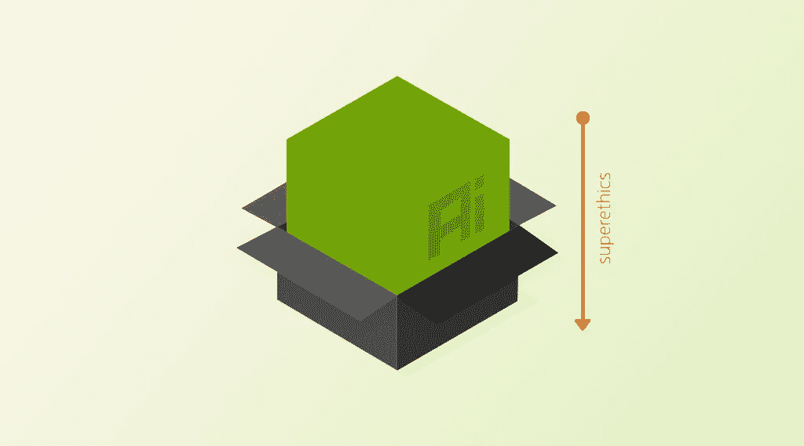

# 把人工智能放进超伦理的黑箱

> 原文：<https://pub.towardsai.net/putting-ai-into-a-black-box-of-superethics-893d1333090e?source=collection_archive---------0----------------------->

## 用机器学习畅想未来| [走向 AI](https://towardsai.net)

Paul Wilshaw 的插图

想象一下，在不久的将来，一名全科医生使用机器学习算法，根据患者的习惯、饮食、年龄、遗传史等来推荐患者的治疗方案。如果推荐的治疗失败了会怎么样？如果机器学习算法是基于一个复杂的神经网络，那么可能无法找出算法失败的原因。然而，如果是基于决策树或贝叶斯网络的机器学习器，对程序员的检查就透明得多(Hastie，Tibshirani 和 Friedman 2001)。

我们还没到那一步。然而，我们在创造有助于工作流的人工智能(AI)方面正在取得进展。

一个例子是 PlasmoTron，去 http://bit.ly/plasmotron[看它的运行，这是一个控制现有开源机器人移液机器人的计算机程序，使疟原虫的生长自动化。](http://bit.ly/plasmotron)

PlasmoTron——用于疟原虫研究的自动移液，由 Wellcome Trust Sanger 研究所博士后研究助理 Theo Sanderson 完成。

> 保持疟原虫存活需要很多时间。这不需要太多思考，但是训练有素的科学家花费大量时间只是将液体从一个管子转移到另一个管子，以保持寄生虫的存活。这就限制了一个人可以同时研究多少不同的寄生虫品系，也就限制了我们可以理解多少基因。

西奥桑德森，博士后研究员，惠康信托桑格研究所。

根据人工智能的一些定义，等离子体激元是智能的——它做出判断。尽管如此，在基本层面上，它只是遵循一套简单的规则来决定如何照顾它负责的寄生虫。该过程目前是半自动的，研究人员仍然需要将平板放入和取出培养箱。

毫无疑问，将精力从平凡的任务中解放出来是等离子体管和目前大量人工智能的目标。AI 和机器人技术的这种使用无疑是一种好处。关于机器人的普遍误解经常通过流行的虚构媒体传达，如《银翼杀手》和《终结者》电影。

一个人工智能全科医生提供医疗建议和药物，为社会提出道德伦理。是如何控制的？如果出现错误会怎样？一种理论是，人工智能被不断地监控和测试，并从当前的实践中吸取了更严格的道德规范。我们是否也可以将‘黑盒思维’应用于 AI 和机器人？黑匣子将航空死亡人数从 1912 年的 25%大幅降低至每 240 万次飞行中有一次事故的比率(Syed 2016)。一个特征在汽车行业变得越来越流行。借助仪表盘摄像头和车载电脑，SEAT Leon Cristobal 概念车将这一点进一步推向了一个潜在的黑匣子，在驾驶时记录数据和图像，然后在发生事故时将它们发送到你的智能手机上(SEAT 2017)。

人工智能具有难以想象的智能和能力的前景给人类带来了不寻常的挑战，即提出一种输出超道德行为的算法。这些问题可能看起来很有远见，但我们会遇到它们似乎是可以预见的；他们并不缺乏当今的研究方向。

**致谢**

感谢惠康信托桑格研究所的博士后研究员西奥·桑德森回答了我关于等离子体激元的许多问题。

埃莉诺拉·阿奎利尼给提奥的建议、忠告和推荐。

**参考文献**

哈斯蒂、特雷弗、罗伯特·蒂布拉尼和杰罗姆·弗里德曼。2001.统计学习的要素:数据挖掘、推理和预测。第一版。统计学中的斯普林格级数。纽约:斯普林格。

赛义德，硕士，2016。Matthew Syed 的 Joosr 黑盒思维指南:为什么大多数人从不从错误中吸取教训——但有些人做到了。第一版。英国:Joosr。

Opentrons。2017.Opentrons。【在线】可在:【http://opentrons.com 买到。【2017 年 12 月 13 日接入】。

Twitter @OpenTrons_。2017.@OpenTrons_。[在线]可在:[https://twitter.com/OpenTrons_/with_replies.](https://twitter.com/OpenTrons_/with_replies.)[2017 年 12 月 13 日访问]。

贝叶斯网络。(2018).贝叶斯网络介绍。[在线]Bayesserver.com。可从以下网址获取:[【https://www . Bayes server . com/docs/introduction/Bayesian-networks](https://www.bayesserver.com/docs/introduction/bayesian-networks)【2018 年 1 月 3 日获取】。

座位。2017.智慧城市的创新解决方案。[在线]见:[http://www . seat . com/corporate/news/events/smart-city-Expo-2017-Leon-cristobal . html](http://www.seat.com/corporate/news/events/smart-city-expo-2017-leon-cristobal.html.)【2018 年 1 月 3 日访问】。