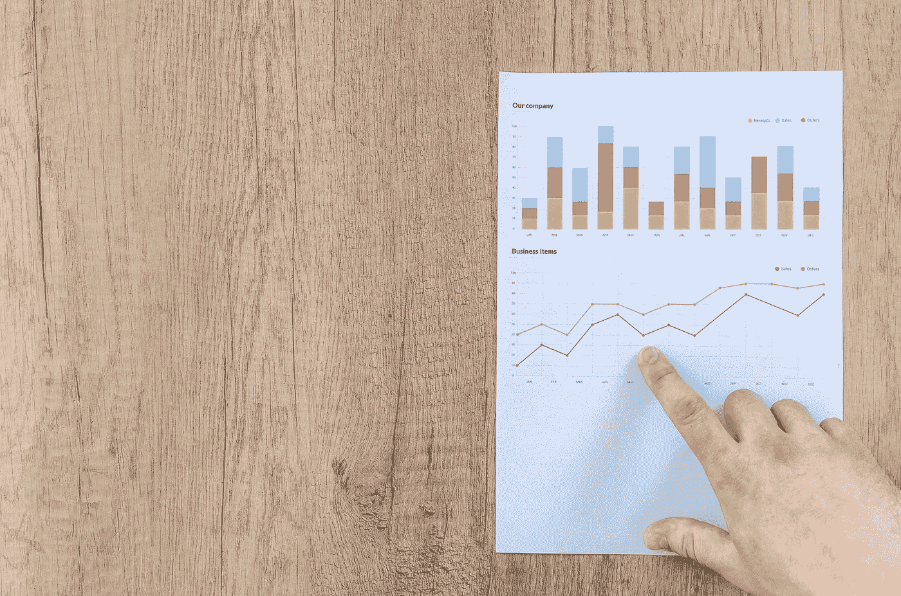
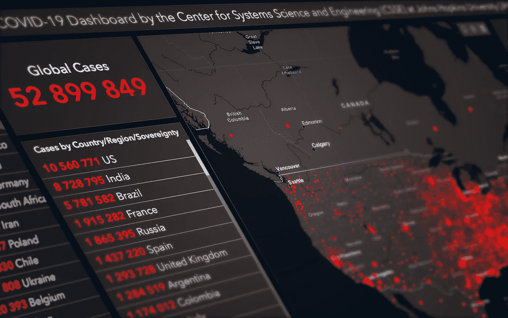

# 为任务关键型用例部署 Python 和 Tableau 及 Power BI

> 原文：<https://pub.towardsai.net/python-with-tableau-and-power-bi-for-mission-critical-use-cases-38c8e5c525fe?source=collection_archive---------1----------------------->

## Python 有与 Tableau 和 Power BI 集成的机会和用例

来自 Pexels 的安东尼·什克拉巴

让我们开门见山吧。

# **画面描述**

可视化工具允许用户轻松创建交互式图表、图形和其他可视化数据表示。

# **电源 BI 描述**

允许用户创建交互式数据可视化的商业智能工具。

来自 Pexels 的 Lukas

# **使用 Python 和 Tableau 的 10 个机会**

1.Tableau 是一个灵活的 Python 开发工具，它试图简化开发复杂应用程序和执行复杂数据分析的工作。

2.创建 Tableau 的拖放界面是为了简化可视化表示数据的工作，这可能使它成为开发数据驱动的应用程序的理想选择。

3.Tableau 为许多流行的 Python 库[2]提供了内置支持，这些库允许将现有的 Python 代码集成到您的应用程序中。

4.Tableau 的数据可视化功能允许您开发可以嵌入到应用程序中的交互式可视化。

5.Tableau 的计算和函数允许执行复杂的数据分析，允许您开发复杂的应用程序。

6.Tableau 与数据库的内置连接允许将数据直接导入应用程序进行分析。

7.Tableau 对 R 集成的支持(bonus 和 Python)允许您在应用程序中使用 R 统计编程语言的功能。

8.Tableau 将数据导出为流行格式的能力使您能够与其他人共享您的数据和分析。

9.Tableau 的许可选项允许您在组织内部署应用程序。

10.Tableau 的技术支持和在线资源可用于开始使用 Tableau 进行开发。

11.Tableau 可以处理大量数据，从而允许开发需要处理大型数据集的 Python 应用程序。

12.Tableau 的可视化是可伸缩的，因此您可以创建在小屏幕和大屏幕上都工作良好的可视化。

13.Tableau 提供了广泛的内置统计函数，允许开发需要执行复杂统计分析的 Python 应用程序。

14.Tableau 提供了广泛的映射函数，可以帮助开发处理地理数据的 Python 应用程序。

来自 Pexels 的 Atypeek Dgn

# **在 Power BI 中使用 Python 的 8 个机会**

1.Power BI 和 Python 可以开发一个数据分析和可视化工具，使开发人员能够处理多种类型的数据。

2.使用 Power BI 和 Python，开发人员可以连接到数据源，与数据进行交互，并创建可视化效果。

3.使用 Python 的 Power BI 可以清理和处理数据，并执行复杂的数据分析。

4.该工具还使开发人员能够创建自定义报告和 KPI，并与其他人共享他们的工作。

5.Power BI 和 Python 可以扩展并用于许多复杂的项目。

6.该工具旨在拥有一个用户友好的界面。

7.Power BI 提供了可用的文档和支持。

8.有一个 Power BI 用户社区可以利用 Python，您可以利用它来获得最佳实践。

来自 Unsplash 的安娜·萨莫伊洛娃

# **如何在 Tableau 中部署 Python**

Tableau 没有使用 Python 的内置功能。尽管如此，还是有一些方法可以将 Python 集成到 Tableau 的流程中:您可以使用 TabPy [3]，这是一个评估 Python 脚本并将结果发送回 Tableau 的外部服务。使用 TabPy 客户端库，可以直接在 Tableau 中运行 Python 代码。

来自皮沙贝的[杰拉德](https://pixabay.com/users/geralt-9301/)

# **如何在 Power BI 中部署 Python**

要在 Power BI 中部署 Python，必须首先在您的计算机上安装 Python 运行时。然后，您需要打开 Power BI 并单击“数据”选项卡。在这里，您需要单击“获取数据”按钮并选择“其他”选项。

一旦您选择了“其他”选项，您将需要选择 Python 选项。Power BI 将询问您想要运行的 Python 脚本。选择 Python 脚本后，Power BI 会询问您想要使用的参数。

输入参数后，需要点击“确定”按钮。然后，power BI 将执行 Python 脚本，并在 Power BI 窗口中显示结果。

来自 Pexels 的龟背竹

# **组织中 Tableau 的 10 个用例**

1.通过向经理提供对数据的访问，帮助他们做出更好的决策，否则这些数据会被埋在多个电子表格中。

2.帮助销售团队根据配额跟踪他们的进度和绩效。

3.帮助营销团队识别哪些营销活动是有效的。

4.帮助人力资源招聘人员确定空缺职位的潜在候选人。

5.帮助金融分析师发现数据中的趋势和异常。

6.帮助客户服务团队跟踪和分析客户反馈。

7.帮助产品经理跟踪和分析客户反馈，以做出产品决策。

8.帮助项目经理跟踪项目进度和绩效。

9.帮助 IT 团队跟踪和分析系统数据，以检测潜在问题。

10.帮助管理团队根据关键指标跟踪公司绩效。

来自 Pexels 的 Andrea Piacquadio

# **组织中 Power BI 的 10 个使用案例**

1)深入了解业务的各个方面:Power BI 可用于分析来自业务不同部分的数据，并获得有助于组织绩效的见解。

2)用于决策:通过深入了解业务的不同领域，Power BI 可以帮助组织做出决策。

3)跟踪 KPI 和绩效指标，了解组织在一段时间内的表现。

4)监控和分析社交媒体数据，了解人们对组织的看法。

5)跟踪客户行为，了解他们如何与组织及其产品和服务互动。

6)通过分析过去的数据来了解和预测未来的趋势。

7)监控和分析网站数据，以深入了解人们如何在线与组织互动。

8)通过分析模式和异常数据来检测和调查安全威胁。

9)通过分析数据来识别风险和合规性问题，从而实现合规性和风险管理。

10)开发可用于不同目的的自定义应用程序，如分析数据、跟踪 KPI 或监控和管理安全威胁。

如果您有任何编辑/修改建议或关于进一步扩展此主题的建议，请考虑与我分享您的想法。

# **另外，请考虑订阅我的每周简讯:**

 [## 周日报告#1

### 设计思维与 AI 的共生关系设计思维能向 AI 揭示什么，AI 又能如何拥抱…

pventures.substack.com](https://pventures.substack.com/) 

*参考文献。*

*1。*[*https://www.tableau.com/why-tableau/what-is-tableau*](https://www.tableau.com/why-tableau/what-is-tableau)

*2。*[*https://www . tableau . com/about/blog/2019/4/leverage-power-tableau-and-python-prescriptive-analytics-104906*](https://www.tableau.com/about/blog/2019/4/leverage-power-tableau-and-python-prescriptive-analytics-104906)

*3。【https://tableau.github.io/TabPy/】*