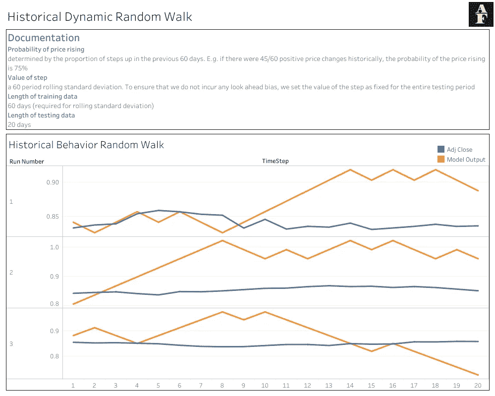
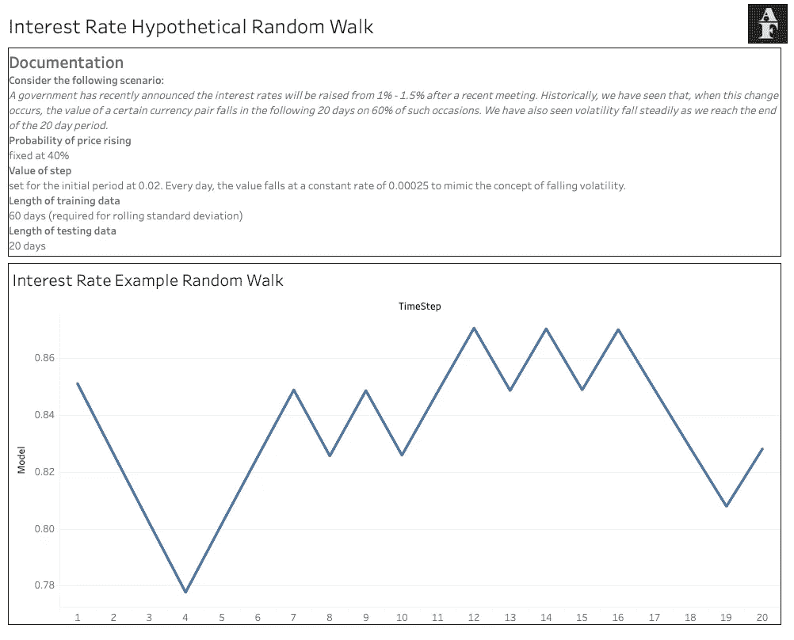

# 金融市场的随机游走模型

> 原文：<https://pub.towardsai.net/random-walk-models-for-the-financial-markets-780eedcd73d5?source=collection_archive---------3----------------------->

## [数据可视化](https://towardsai.net/p/category/data-visualization)

由[巴尔库拉斯·尼科斯](https://unsplash.com/@ba1kouras?utm_source=unsplash&utm_medium=referral&utm_content=creditCopyText)在 [Unsplash](https://unsplash.com/s/photos/random-walk?utm_source=unsplash&utm_medium=referral&utm_content=creditCopyText) 上拍摄

时间序列分析的总体目标是能够建立一个模型，识别时间序列中的所有自相关，并使用它来创建趋势预测。我们希望能够利用我们认为与未来走势相关的过去行为的所有信息，并希望剩下的只是添加某种形式的不相关误差函数，这种函数是从一种常见分布中推导出来的。虽然，特别是在金融市场中，由于许多其他因素的影响，这种精确度水平更像是一种最佳/无法达到的解决方案，但主要目标仍然是我们可以努力实现的。通过时间序列分析，我们改变上述问题，提出以下问题->我们可以使用多少过去的行为来模拟未来的价格，我们可以添加哪些外部因素和误差成分来模拟剩下的部分？

任何时间序列分析的起点之一是产生一个随机游走模型。虽然它们的智能会因你提供多少信息来确定它们应该前进的方向而有所不同，但随机漫步模型为不同类型的预测提供了一个强大的框架。我们可以使用随机游走模型来创建一个基准，根据这个基准我们可以对将来使用的其他更复杂的模型进行评级。我们也可以使用这个模型作为复杂的模型本身，通过提供智能来确定价格上涨或下跌的概率。

## 理论

随机游走模型的一个好处是其基本理论相对简单。在一个句子中，随机游走模型将通过获取前一个观察值并随机上下调整它来创建新的观察值。通常，这个随机步骤是残差值，即在我们的模型中出现的误差，我们希望这些误差是独立的同分布变量，因为我们已经尽可能多地提取了自相关性(如果你对自相关性的概念不太清楚，你可以查看我的另一篇文章，其中有更详细的解释[此处](/how-to-utilize-autocorrelation-for-the-financial-markets-f02edb46c39b))。因此，这些值都很小，无法解释我们所预期的来自外部宏观原因的数据大幅度变化。我们还可以看到，我们通过使用之前的观察作为我们预测的起点来保持我们的时间序列的相关性。

## 建筑模型

如果我们决定让这个模型完全随机，即每一步有 50%的机会向上移动，50%的机会向下移动，我们就有了一个基准。我们可以用这个来衡量其他模型，看看它们是否比没有任何智能的模型表现得更好。为了提供一个完全“随机”的随机漫步模型的例子，我在下面概述了一个策略。

作者图片

在这个模型中构建智能反映在我们分配给向上或向下一步的概率中。如果我们知道价格朝某个方向移动的可能性更大，那么按照逻辑，我们应该改变概率。概率的使用意味着我们也可以解释价格朝着与我们预期相反的方向变动。

作者图片

分配新的概率可能来自各种来源，并不是一项简单的任务。我们可以使用历史行为，即在过去 x 次观察中上升或下降的步数，作为我们概率的代理。我们还可以使用宏观观察，例如*在过去 20 年中，每当政府将利率降低超过 1%，接下来的一周就会看到该国的货币利率在 10 次中有 6 次下降，因此我们下降的概率为 60%。*我们还可以使用多种特征的组合，每种特征都有自己的权重，可能通过某种形式的线性回归来计算。

下面的仪表板提供了一个简单的假设示例，其中，根据以前的行为，我们确定了一种货币利率变化期间上升或下降的百分比。请注意，我们还引入了另一种计算步骤值的方法。考虑这个参数也很重要。我们可能知道我们预期价格的走向，我们也可能知道我们预期一对货币升值或贬值的价值，但我们还需要确定它到达那里的速度。市场上的价格不会每天都有相同的变动，因此在计算这些步骤时也需要加入一些智能。下述方法的替代方法可以是计算期望值的范围，并使用该范围内的随机发生器来确定该特定时间段的步长值。

作者图片

这只是对随机漫步模型的介绍，但是我希望你能看到使用这个框架和建立复杂模型的巨大空间。随机游走允许你将大量外部行为纳入其预测中，这在研究像金融市场那样复杂和多维的时间序列时非常有益。