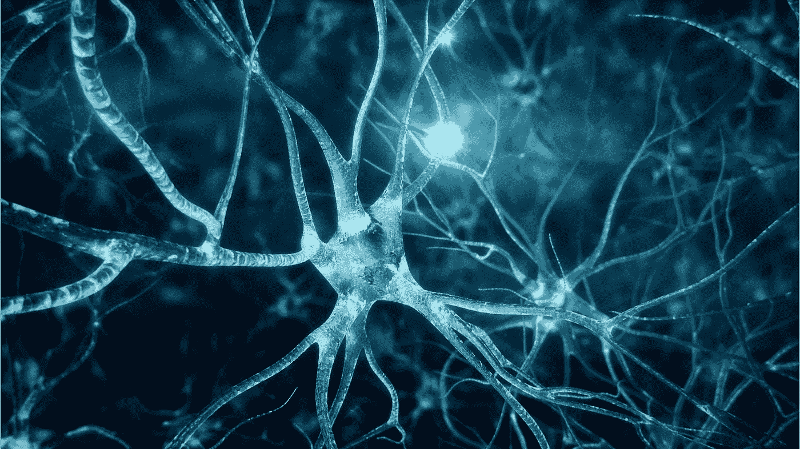
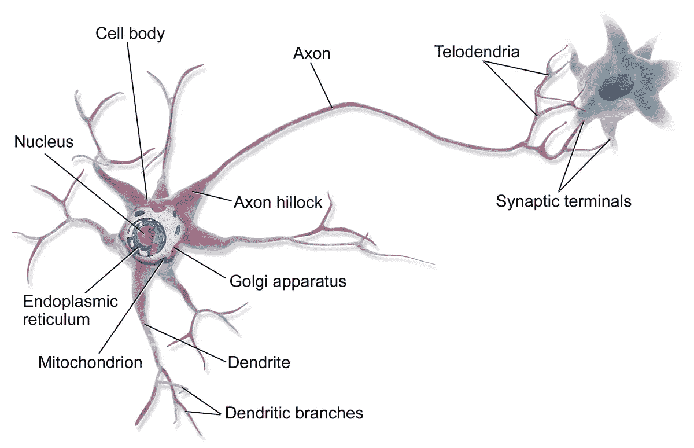
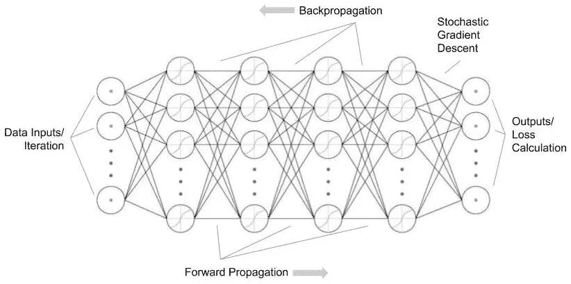
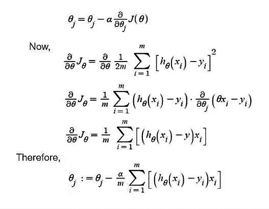

# 真实神经网络 vs 人工神经网络，有什么区别？

> 原文：<https://pub.towardsai.net/real-neural-networks-vs-artificial-neural-networks-what-is-the-difference-ec53b9fc414e?source=collection_archive---------2----------------------->

## 神经网络

## 神经网络真的是基于我们的神经结构吗？

> 在 discord 上加入我们的 [**免费**编程社区，在 Pyhton Kai 结识其他程序员！](https://discord.com/invite/dG2D2zXeXB)

在过去的 10 年里，世界计算能力变得如此先进和可用，以至于几十年前就已经概念化的机器学习最终成为可能，每个人都可以使用。

> 生下艾的时候，我们惊叹于自己的辉煌。
> 
> **-莫斐斯，黑客帝国**

虽然听起来很有诗意，但这离现实不远了，因为这个预言是以神经网络的形式具体化的。与需要人工干预来执行特征选择的经典机器学习模型相比，神经网络会自行选择特征。

我们大脑中的神经元

一旦数据被转换以适应神经网络(这是一个圣经式的挑战，尤其是对新开发人员来说)，模型就会自行处理特征选择，执行逐案分析，而不是找到理解数据的总体规则。这对于物体检测或人脸识别等过于复杂的问题变得非常有用:将人类从训练过程中剔除会使神经网络更加强大和自动化。

## 通用人工智能

请注意，神经网络在训练时，很容易训练过多或过少。除了使用蛮力，网络没有办法理解如何自己被训练最佳量，因此需要掌握神经网络数学的合格开发人员需要监督模型的训练，从数据收集到训练模型。

如果你没有编码经验，请注意，在当前的技术下，无论你多么有创造力，这个问题都无法解决。你需要一个人的头脑(受过教育的头脑)来创建一个神经网络，因为无论我们投入多少计算能力，都没有一个自我进化的模拟神经结构可以从当前的模型中出现。总之，虽然通用人工智能的想法是可能的，但我们距离开发它还有几十年的时间。

## 神经网络与我们的大脑有多相似？

这当然给我们带来了一个问题:如果神经网络的工作方式类似于我们的大脑，我们难道不能创建一个巨大的神经网络，其潜力与我们的物理中央处理器相同吗？

虽然从我开始专攻 AI 开始，我就一遍又一遍地听到这句话，但我越研究越明白这根本不准确，而在本文中，我将详细解释这种说法背后的原因。

# 真实神经元与模拟神经元

首先，模拟神经网络并不能完全模拟我们的大脑。到目前为止，即使有世界上最先进的技术，这也是不可能的。相反，他们模拟了它的抽象。

这让我们可以直接比较物理神经元和模拟神经元。真正的神经元比我们想象的要复杂得多。

## **真实神经元的解剖**

真实神经元的解剖

由于 DNA 具有压缩存储信息的能力，一个真实细胞的复杂性是如此之高，甚至对我们来说几乎是模糊的。每一个神经元都可以承载一个包含大量压缩信息的电信号。

信息以电脉冲的形式传递给另一个神经元，这要归功于一种称为突触的连接，并通过轴突传递。

## **模拟神经元的解剖**

模拟神经元的解剖

为了模拟物理神经元，我们将其简化为数据结构:默认情况下，每个模拟的神经元最多可以包含两个数字。这比现实世界简单多了。所以说模拟神经元是基于物理神经元是不准确的。

反向传播正在进行

我们试图模拟的是**网络内的信息流**，因为数据在大脑和人工神经网络中反向传播。这只不过是一个简单的抽象。

## 信息流

第二件事，人工神经网络使用数学过程来转换数据。尽管我们的大脑可能很先进，但它不会将信息存储为变量，而且肯定不会根据微积分规则对连续值进行计算。

梯度下降图像

在神经网络中，随着神经网络变得越来越专业化以理解它所输入的数据的模式，计算被迭代地执行。

使用链式法则的梯度下降公式

抱歉让你失望了，但是我们的大脑并不坚持数学的准确性。这使得物理的和模拟的信息流成为两个完全不同的过程。

## 结论

虽然公众的看法旨在提出人工智能是所有仍然困扰人类的问题的未来解决方案，但在奇点的形式下，我可以向你保证，无论我们拥有多少计算能力，都没有模型可以达到甚至接近一般人工智能的概念。