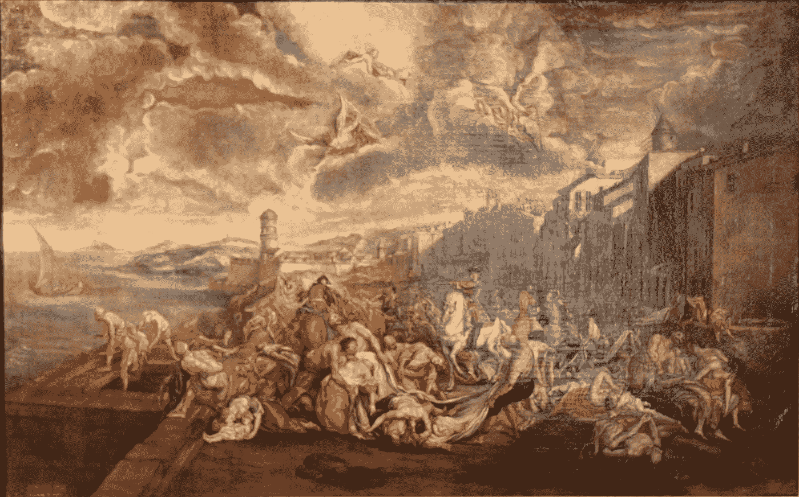

# 从疫情回来…和艾一起

> 原文：<https://pub.towardsai.net/rebounding-from-the-pandemic-with-ai-7b25655f130f?source=collection_archive---------2----------------------->

## [人工智能](https://towardsai.net/p/category/artificial-intelligence)，[新闻](https://towardsai.net/p/category/news)

## 我们的过去教给我们的未来

图片来自[维基共享资源](https://commons.wikimedia.org/wiki/File:Peste-Musée_d%27histoire-Marseille.jpg)

虽然 2020 年可能会作为世界停止运转的一年被人们记住，但我们有理由对 2021 年我们和人工智能(AI)的未来感到乐观。

回顾过去可能会让我们安心。16 世纪中期，我的祖国意大利遭受了黑死病的蹂躏。当然，有许多负面影响，但它也被认为是文艺复兴的种子。现在，文艺复兴被认为是我们现代社会最丰富的时期之一，它被认为诞生了一种新的、创新的思维方式，将意大利从中世纪的僵化中解放出来。想想这一切都发生在托斯卡纳，欧洲受瘟疫影响最严重的地区之一。

快进到 700 年前的今天，我们看到了人们与人工智能联系方式的历史性变化的种子，清除了人们对这项技术同样僵化的先入之见。

就在几个月前，人工智能还让人既惊叹又害怕。但今天，围绕 AI 的对话发生了巨大变化。全球疫情暴露了制造业等行业对人工智能和自动化的需求，这些行业的运营因社会距离要求和其他限制而停止。随着世界范围内工厂的关闭，对新技术——尤其是人工智能——的需求飙升，以保持事情正常运行。

**1。制造商将设法理解他们的 IIoT 数据。**

那么，2021 年，我们和人工智能将会面临什么？

**2。当涉及到质量检查等任务时，人工智能将增加人类劳动力。**

制造商将继续接受工业 4.0 倡议，但现在有了更大的紧迫性和更具体的目标。今天的工厂车间将变得比以往更加复杂。随着工业物联网(IIoT)成为规范，制造商需要能够从其机器(即传感器和摄像头)收集的数据中提取可行见解的工具和技术。我相信人工智能将是这里的解决方案，帮助制造商理解所有这些数据。然后，他们将能够利用这些见解在新常态下保持竞争力，并为未来任何可能的经济动荡做好准备。

**3。制造商将优先投资于价格低廉的轻量级解决方案，以加速其工业 4.0 计划。**

自动化还远远没有达到在没有人类监督的情况下工作进展所需的水平。在新的一年里，我相信我们会看到制造商，物流公司和其他人力密集型产业转向人工智能，以加快旨在减轻负担和协助人类完成任务的技术的采用。我预测，质量检查——已经是人工智能在制造业的五大应用之一——将在未来一年得到更大的采用和广泛的部署。

**4。边缘人工智能将击败云。**

我们将看到人工智能以廉价和轻量级硬件的形式部署。众所周知，2020 年是动荡的一年，经济前景是这样的，资本密集型的复杂解决方案将被轻量级的，也许只有软件的，更便宜的解决方案所取代。这将允许制造商在短期内实现 ROI，而无需大量前期投资。这也将给予他们所需的灵活性，以应对供应链和客户需求的波动——我们已经看到这种情况在整个疫情以更大的规模出现。

**5。制造商将依靠具有解释能力的人工智能来学习人工智能如何以及为什么做出决策。**

在云和边缘人工智能的斗争中，后者将因经济(更便宜)、延迟(更快)和安全(内部=更安全)的原因而占上风，将越来越多的人工智能置于传感器级别(例如，在摄像头上)，在那里它将立即投入使用。

人类将把注意力转向为什么 AI 会做出它所做的决定。当我们思考人工智能的可解释性时，它经常在偏见和其他伦理挑战的背景下被谈论。但随着人工智能的成熟，变得更加精确、可靠，并在现实世界中找到更多应用，我们将看到人们开始质疑其背后的原因。

原因？信任:人类不愿意把权力交给他们不完全理解的自动系统。例如，在制造环境中，人工智能将需要准确并“解释”为什么一种产品被分类为“正常”或“有缺陷”，以便人类操作员可以建立对系统的信心和信任，并让它完成工作。

就像 14 世纪的意大利一样，我们现在所经历的艰难时期释放出划时代的变化，迫使我们重新思考我们的优先事项。2021 年将是我们认识人工智能的一年:一个强大、可靠和透明的工具，我们的社会和制造业需要它来增加人类的工作，再也不会措手不及。

【https://www.forbes.com】最初发表于**。**