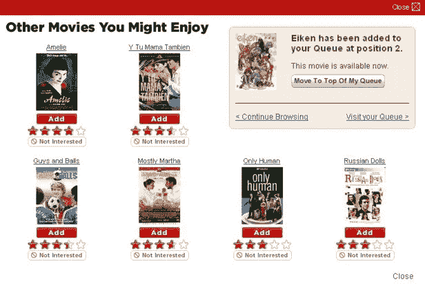
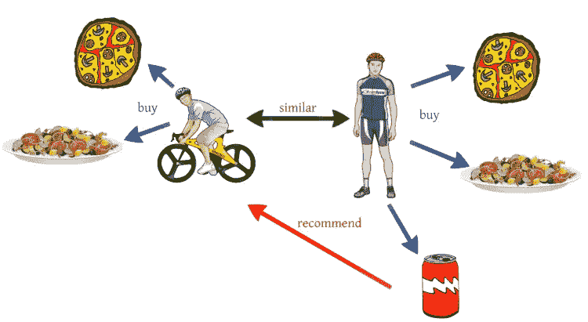

# 推荐系统

> 原文：<https://pub.towardsai.net/recommendation-systems-104bdfe3f93f?source=collection_archive---------0----------------------->

## 深入推荐系统

## 什么是推荐引擎？

**维基定义:** *推荐引擎是* [*信息过滤系统*](http://en.wikipedia.org/wiki/Information_filtering_system) *的一个子类，旨在预测用户对某个项目的“评分”或“偏好”。*

**我的定义:** *推荐引擎是一个黑匣子，它分析一些用户集合，并显示单个用户可能喜欢的项目。*

## 离线推荐引擎

**—您的家人和朋友作为服装推荐引擎**

— **你的教授作为图书推荐引擎:**

— **你的朋友作为电影推荐引擎:**

请注意，所有这些“离线推荐者”都对你有所了解。他们知道你的风格、品味或研究领域，因此可以做出更明智的决定，向你推荐最有益的东西。这种个性化——基于“了解”你——是在线推荐者想要效仿的。

## 在线推荐引擎

**脸书:《你可能认识的人》**

[脸书](https://dataconomy.com/tag/facebook/)用户推荐系统向你可能认识的脸书用户推荐下线。该系统是在个人数据共同的朋友，你在哪里上学，工作地点和共同的网络(网页，小组等)上训练的。)，了解谁可能在您的离线&离线网络中。

网飞:“你可能喜欢的其他电影”

当你填写你的口味偏好或评价电影和电视节目时，你在帮助网飞从成千上万的选择中筛选出你更喜欢看的节目。网飞算法用来做出此类建议的因素包括:

*   电影和电视节目的类型
*   您的流媒体历史记录，以及您之前的评分。
*   与你有相似爱好的所有网飞会员的综合评分。

**LinkedIn:“你可能感兴趣的工作”**

“你可能感兴趣的工作”功能显示了在 LinkedIn[上发布的在某些方面与你的个人资料相匹配的工作。这些推荐是根据你之前的经历中的标题和描述，以及其他用户已经“认可”的技能来显示的。](https://dataconomy.com/tag/linkedin/)

**亚马逊:“买了这件商品的顾客也买了…**

亚马逊的算法处理其数百万顾客篮子中的数据，以计算出哪些商品经常一起购买。这可以带来巨大的回报——例如，如果你正在购买一件电器，并看到它下面需要的电缆或电池的推荐，你很可能会从亚马逊购买核心产品*和配件*。

## 为什么我们应该使用推荐引擎？

用[史蒂夫·乔布斯](http://www.forbes.com/sites/chunkamui/2011/10/17/five-dangerous-lessons-to-learn-from-steve-jobs/)的不朽名言来说:“很多时候，人们不知道他们想要什么，直到你展示给他们看。”顾客可能喜欢你的电影，你的产品，你的职位空缺，但是他们可能不知道它的存在。推荐系统的工作是向客户/用户展示全新的产品和可能性，他们不会想到自己直接搜索。

## 推荐引擎有哪些不同的类型？

让我向您介绍三种非常重要的推荐系统:

*   协同过滤
*   基于内容的过滤
*   混合推荐系统

**协同过滤**

协同过滤方法基于收集和分析关于用户行为、活动或偏好的大量信息，并基于用户与其他用户的相似性来预测用户会喜欢什么。协同过滤方法的一个关键优点是它不依赖于机器可分析的内容，因此它能够准确地推荐诸如电影之类的复杂项目，而不需要“理解”项目本身。在推荐系统中，许多算法已经被用于测量用户相似性或项目相似性。例如，k-最近邻(k-NN)方法和皮尔逊相关。

**基于内容的过滤**

基于内容的过滤方法基于项目的描述和用户偏好的配置文件。在基于内容的推荐系统中，关键字用于描述项目；此外，还建立了一个用户简档来指示该用户喜欢的项目类型。换句话说，这些算法试图推荐与用户过去喜欢的(或现在正在检查的)项目相似的项目。具体地，将各种候选项目与用户先前评级的项目进行比较，并推荐最匹配的项目。这种方法源于信息检索和信息过滤研究。

**混合推荐系统**

最近的研究表明，结合协同过滤和基于内容的过滤的混合方法在某些情况下可能更有效。混合方法可以通过多种方式实现，分别进行基于内容和基于协作的预测，然后将它们结合起来，将基于内容的功能添加到基于协作的方法中(反之亦然)，或者将这些方法统一到一个模型中。几项研究从经验上比较了混合方法与纯协作和基于内容的方法的性能，并证明了混合方法可以提供比纯方法更准确的推荐。这些方法还可以用来克服推荐系统中的一些常见问题，如冷启动和稀疏性问题。

网飞是混合系统的一个很好的例子。他们通过比较相似用户的观看和搜索习惯(即协同过滤)以及通过提供与用户评价高的电影具有共同特征的电影(基于内容的过滤)来进行推荐。

我希望你喜欢这篇文章。在下一期文章中，我将在更大的范围内详细介绍这三个推荐系统，并学习如何实现它们。有什么问题吗？请在下方留言评论。