# 递归神经网络:一种非常特殊的记忆

> 原文：<https://pub.towardsai.net/recurrent-neural-networks-a-very-special-kind-of-mnemonist-cd0b0a41fe75?source=collection_archive---------1----------------------->

## 保存信息是另一种记忆方式

尼克·希利尔在 [Unsplash](https://unsplash.com?utm_source=medium&utm_medium=referral) 上的照片

*在挤满人的会议室里，当编辑意识到其中一名记者没有做任何笔记时，他停顿了一下。他很惊讶地问为什么，更惊讶的是，他听着记者背诵每一个字，就好像是在什么地方记下的一样。不久之后，记者所罗门·谢雷舍夫斯基拜访了一位记忆专家，问他为什么他应该做笔记而不是记住他听到的所有东西。事实上，他想知道为什么任何人都应该做笔记，而不是仅仅依靠他们的记忆。* [*心理学家亚历山大·卢里亚*](https://en.wikipedia.org/wiki/Alexander_Luria) *和所罗门谈了快 30 年。在此期间，亚历山大见证了所罗门是如何轻松地运用记忆背诵整首诗、一系列数字和单词、复杂的数学公式，以及整本书中用外语写成的段落。亚历山大记录了他与所罗门的所有经历和谈话，这启发了许多其他的研究项目，* [*随笔*](https://www.newyorker.com/books/page-turner/the-mystery-of-s-the-man-with-an-impossible-memory)*[*电影*](https://www.imdb.com/title/tt0187590/)*甚至还有一部* [*短篇小说*](https://en.wikipedia.org/wiki/Funes_the_Memorious) *作者是伟大的* [*博尔赫斯*](https://en.wikipedia.org/wiki/Jorge_Luis_Borges) *。它也启发了这篇关于记忆学家、递归神经网络和解释机器学习算法背后的直觉的必然趋势的文章。**

# *介绍*

*记忆主义者有一种奇怪的能力，能够记住大量的信息，比如一系列的数字或书中的段落。有些人，如所罗门·舍列舍夫斯基，天生如此，而其他人则依靠被称为记忆术的规则或技巧来帮助他们记住一长串数据。不管是天生的还是训练有素的，记忆力强的人都能记住大到任何正常人都不可能记住的数据集。在上一届[美国记忆锦标赛](https://www.usamemorychampionship.com/)中，最后的比赛包括在短短 5 分钟内记住 104 张扑克牌的顺序！他们是怎么做到的？虽然解释他们大脑内部发生的事情绝对具有挑战性，并且不是本文的目的，但在记忆学家和递归神经网络之间建立类比是可能的。让我们从人工神经网络开始；它们是什么，它们是如何工作的？*

# *传统人工神经网络*

*人工神经网络(ANN)是一组接收和传输信号的连接单元(神经元)。人工神经网络的工作方式类似于我们大脑中神经元的交流过程。当一组输入数据通过分布在不同层的单元网络时，这一切就开始了。然后，根据每个单元的激活函数以及连接所有单元的权重和偏差来转换输入数据。网络的最后一层获取输出，并将其与实际观察到的数据进行比较。输出和实际数据之间的差异用于调整连接所有单元的权重和偏差。这种调整被重复多次，直到人工神经网络被“训练”好。因此，人工神经网络中的学习过程由多次迭代组成，其中网络的权重和偏差被改变，直到人工神经网络能够以相当程度的置信度再现观察到的数据。发生在大脑中的学习过程和编码到人工神经网络中的学习过程是完全不同的。这种差异一直是许多其他研究项目和[文章](https://towardsdatascience.com/do-artificial-neural-networks-really-learn-e6c3a4b09b55)中讨论的主要话题。尽管存在差异，但人工神经网络是深度学习的基础，也是每天使用的多种人工智能应用和过程背后的关键。*

*人工神经网络的工作方式在其他[资料](https://en.wikipedia.org/wiki/Artificial_neural_network)中有广泛的介绍，在继续阅读本文之前，最好对人工神经网络有一个扎实的了解。下面是对人工神经网络工作原理的一个非常简单的解释:图 1 显示了一个具有输入层、一个隐藏层(或中间层)和一个输出层的人工神经网络图。注意每个单元是如何通过权重和偏差的网络连接起来的。两个输入值通过相应的权重和偏差相乘并求和后，进入隐藏层中的单个单元。一旦进入该单元，激活功能就根据预先建立的功能转换输入值。这个单元的输出现在是输出层中下一个单元的输入。下一层的权重和偏差以及激活函数这次也适用。因此，在 **a1** 与权重和偏差相乘并求和后，它进入最后一个单元，在那里，在应用激活函数后，它被转换为 **a2** 。*

*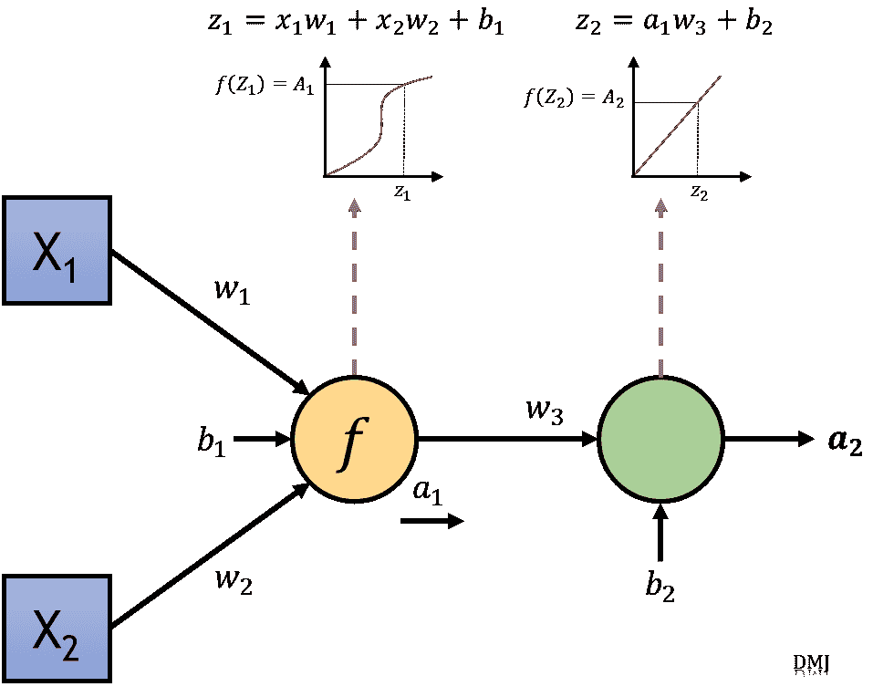*

*图一。单隐层人工神经网络。作者制作的图像。*

*前面解释的过程称为转发传播。另一方面，反向传播是根据输出值和观察值之间的差异修改权重和偏差的过程。这些差异在人工神经网络的所有层和连接中传播。向前和向后传播的循环重复多次，直到输出和观察值之间的差异最小化。结果是一组权重和偏差，它们获取输入数据并将其转换为观察值或它们的良好近似值。*

# *递归神经网络*

*至此，所描述的神经网络可以根据一组输入值识别模式并预测输出。到目前为止，还没有提到输入数据的显示顺序。一个序列呢？像上面描述的人工神经网络能知道一长串数字后面的下一个数字是什么吗？如果输入数据的顺序很重要呢？在递归神经网络(RNN)中，数据呈现的顺序会影响网络参数。作为记忆学家，rnn 被训练来复制长的数据序列。然后使用 rnn 来预测下一个值。有许多类型的 rnn 比这里将要解释的更高级:例如[长短期记忆(LSTM)](https://en.wikipedia.org/wiki/Long_short-term_memory) 和[门控循环单元(GRU)](https://en.wikipedia.org/wiki/Gated_recurrent_unit) 。RNNs 的一些应用是时间序列预测、语言建模、语音识别和机器翻译。这些应用程序在输入数据的呈现方式上是相似的:RNN 获取一系列数字或单词，并预测下一个最有可能的数字或单词。与人工神经网络相反，人工神经网络有某种记忆，它使用以前的值来预测下一个值。这种“记忆”是如何工作的？*

*rnn 的常见图表类似于图 2。RNN 的滚动版本显示了一个包含 4 个单元的输入图层、递归隐藏图层和输出图层的网络。这个递归隐藏层与输入层中的每个单元进行交互，并将来自每个交互的信息传递到下一个。这显示在 RNN 的展开版本中。*

*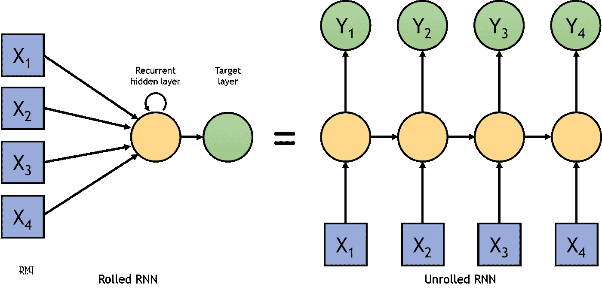*

*图二。递归神经网络的滚动图和展开图。作者制作的图像。*

*前面的图表在许多与 RNNs 相关的资料和文章中使用。图 3 给出了另一种可视化方法。与 ANN 中所做的相反，输入层中的单元不是同时读取的。相反，它们中的每一个都依次进入隐藏层中的单元。这意味着 X1 使用权重(w1)和偏差(b1)连接到隐藏层，然后根据单元的激活函数进行变换。在这之后，X2 遵循同样的过程，然后是 X3 和 X4。RNN 的关键是信息如何从一个单元转移到另一个单元，这代表了这个网络的“记忆”组件。与隐藏层(a1，a2，a3)的每个交互的输出也包括在计算中。请注意，每个输入单元如何乘以权重，与偏差相加，然后与前一个单元输出的“循环权重”(wr)相加。所以，a2 依赖于 X2、w1、b1 和 a1；a3 取决于 X3、w1、b1 和 a2；a4 取决于 X4、w1、b1 和 a3。RNN 中的存储器包括记录来自先前输入单元的激活值。*

*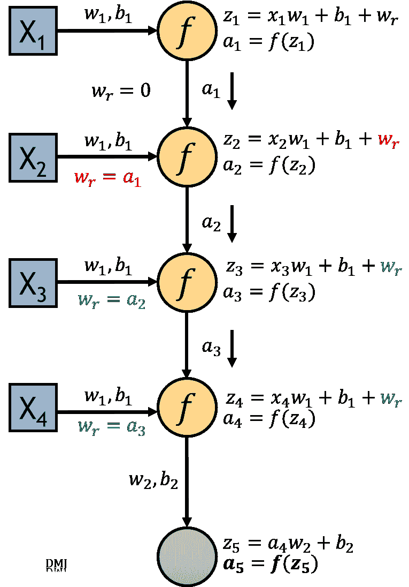*

*图 3。展开的递归神经网络的另一种可视化。作者制作的图像。*

*RNN 的另一个重要特征是其权重和偏差在各图层间共享。这意味着输入层中的所有单元以相同的权重和偏差相乘并求和，而在人工神经网络中，不同层中单元之间的每个连接具有不同的权重。这个细节在训练 RNN 的时候很重要:更少的重量和更少的偏差意味着需要调整的参数更少，通常这将导致更快的训练过程。*

*与其他类型的网络一样，RNN 在隐藏层中可以包括多个单元，而不是一个。拥有更多单元将增加与隐藏层相关的权重和偏差的数量。然而，单元数量的增加也可以提高 RNN 的性能。图 4 显示了一个 RNN，它在隐藏层中包含两个单元，在输入层中包含两个单元。重要的是要注意隐藏层现在如何包含 6 个权重和 2 个偏差。有 2 个权重与输入层和隐藏层之间的连接相关，4 个“循环”权重与隐藏层中单元之间的连接相关。如前所述，这 4 个权重在与输入层的交互中携带输出隐藏层单元的信息。*

*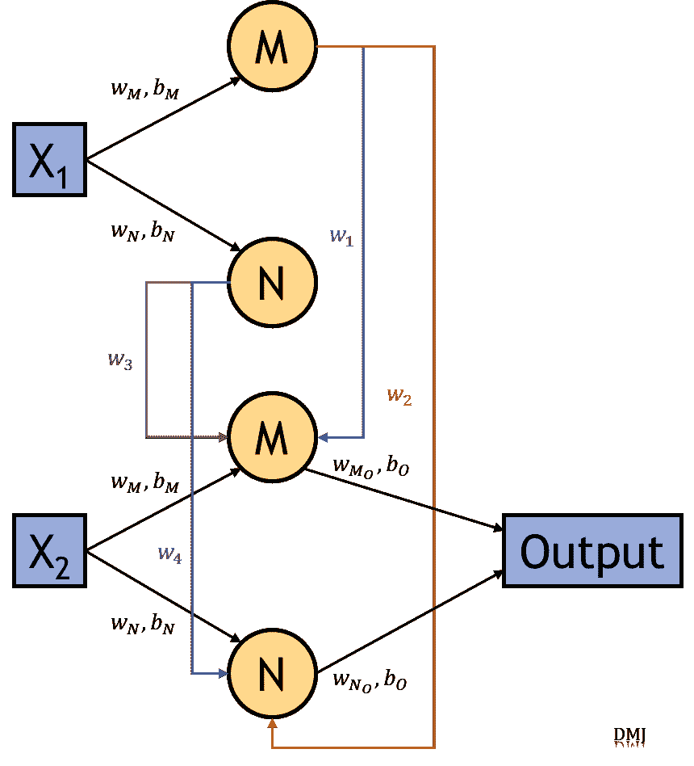*

*图 4。隐层有两个单元的展开递归神经网络。作者制作的图像。*

# *人工神经网络和神经网络之间的更多差异*

*神经网络的多种应用之一是建立回归模型，目的是以后用它来预测新值。这也可以通过[线性](https://towardsdatascience.com/a-beautiful-way-of-looking-at-linear-regressions-a4df174cdce)和[非线性](https://towardsdatascience.com/the-interesting-world-of-non-linear-regressions-eb0c405fdc97)回归来完成。在如图 5 所示的数据集中，人工神经网络可以对 **x** 和 **y** 之间的行为进行建模，从而在模型被训练之后，可以根据 **x** (输入)的新值计算出 **y** (目标)的新值。训练人工神经网络的结果是一组权重和偏差，能够再现输入和目标变量的行为。这种关系越是非线性，ANN 中需要的单元和层数就越多。因此，在这种情况下，人工神经网络将同时使用输入变量和目标变量。另一方面，RNN 将目标变量的行为建模为一系列数字。*

*在 RNN 中，目标变量根据序列长度分组。图 5 所示的例子使用了长度为 3 的序列。这意味着使用三个值作为输入，后面的第四个值是目标。用虚线方框突出显示的区域包含 7 个数据点。对于长度为 3 的序列，可以定义 4 组输入和目标。在每个集合中，输入由 3 个值组成，目标包含一个值。因此，序列长度定义了可以使用多少输入和目标来训练和测试 RNN。例如，在 1000 个点的数据集和长度为 5 的序列中，输入/目标对的数量将是 995。*

*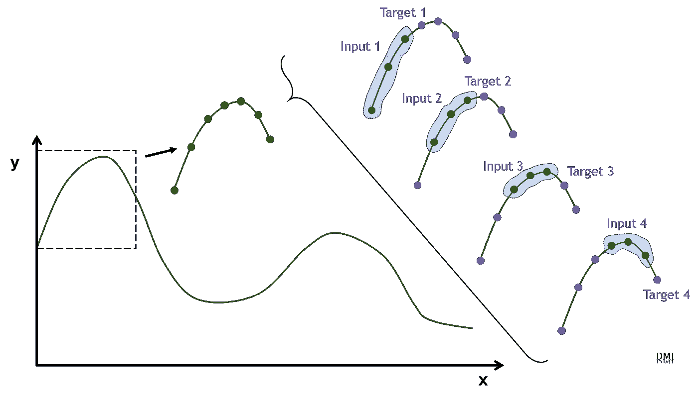*

*图 5。序列长度如何定义递归神经网络中的输入和目标集的示例。作者制作的图像。*

*图 5 显示了 RNN 的数据准备过程不同于人工神经网络的数据准备过程。在 RNN 中，数据在进入网络之前需要根据序列长度进行分离。一旦数据准备就绪，RNN 将分别处理每一个序列。在每个过程中，RNN 都会将输出与目标值进行比较。一旦处理完所有序列，计算出它们的输出并与目标值进行比较，RNN 将测量出与期望值的差距。然后，在反向传播过程中使用该差异来确定新的权重和偏差。*

# *正向传播*

*任何网络的第一步都是使用权重和偏差在各层之间传播输入。图 6 显示了这个过程在 RNN 中是如何工作的。此示例显示了一个具有单一单元隐藏层的 RNN，其输入由 3 个值组成。该层的激活函数是双曲正切(tanh)。在隐藏层之后，有一个输出层，具有单个单元和线性激活函数。所有用红色书写的等式和数字代表在每个单元进行的计算。请注意，隐藏层的第一个单元不包含 wr 值。但是，对于其余的单位，该值始终存在。wr 代表该网络的存储器组件，因为它跟踪先前的激活。*

*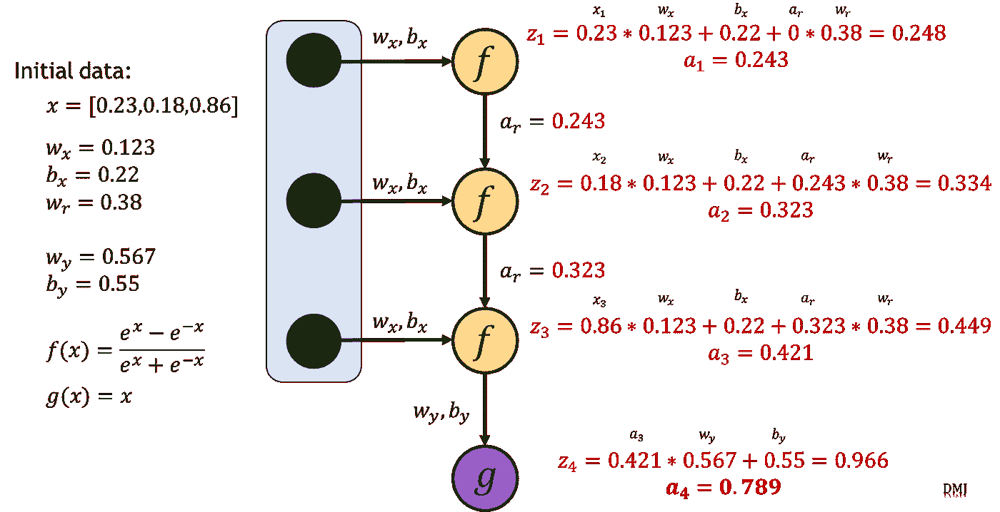*

*图 6。递归神经网络中的前向传播。作者制作的图像。*

*与其他类型的网络一样，前向传播后的下一步是将输出与目标值进行比较。这是通过使用误差函数如均方误差(MSE)来实现的。为每个输出-目标对计算该函数，然后损失函数为迭代计算单个损失值。损失表明输出与期望值的接近程度。损耗值也用于反向传播过程的开始。*

# *反向传播*

*反向传播或反向传播可能是人工神经网络中最复杂的部分。这一过程背后的主要思想是在权重和偏差网络中分配输出和目标之间的差异。分布或反向传播损耗的方法之一是使用梯度下降。这可能不是所有情况下的最佳解决方案。然而，它是最常见的反向投影算法之一。在这一点上需要注意的是，反向传播不是神经网络的唯一训练算法。寻找权重和偏差的最佳组合的问题本质上是一个优化问题，可以使用进化算法或任何其他类型的[无导数优化算法](https://link.springer.com/article/10.1007/s10898-012-9951-y)来解决。用梯度下降来解释反向传播过程是理解正在发生的事情的一个好方法，但是它不应该作为唯一的解决方案。*

# *穿越时间的反向传播(BPTT)*

*RNN 中的反向传播过程类似于人工神经网络中的反向传播过程。然而，在 RNN 中，反向传播过程考虑到在每次迭代中有多个正向传播过程。所以后推是对每个时间上向后的序列进行的，这就是为什么它被称为 BPTT。这个过程的细节在这个 [Python 笔记本](https://github.com/manfrezord/MediumArticles/blob/main/RNN/RNN_Notebook.ipynb)和其他[来源](https://axon.cs.byu.edu/Dan/678/papers/Recurrent/Werbos.pdf)中有更好的解释。BPTT 的主要结果是每个权重和偏差的梯度。然后从权重/偏差的原始值中减去该梯度，以生成将在下一次迭代中使用的新的权重/偏差。在该过程结束时，应该调整权重和偏差，以使 RNN 的输出类似于目标值。*

*训练 RNN 不是一件容易的事情。尽管使用 BPPT 算法很容易计算梯度，但是与早期的隐藏激活相比，损失函数的导数可能非常大。由于损失函数对这些微小的变化非常敏感，它变得不连续(Sutskever，2013)。除此之外，RNN 还提出了消失和爆炸梯度的问题。这可以通过将渐变裁剪为默认值来解决。*

# *实际例子*

*这一节包含了 RNN 在回归问题中应用的一些例子。如前所述，这不是 RNNs 的唯一应用，但在着手解决其他更具挑战性的问题之前，这是理解该过程的良好起点。**这里呈现的所有例子在这个** [**Python 笔记本**](https://github.com/manfrezord/MediumArticles/blob/main/RNN/RNN_Notebook.ipynb) 里都有完整的解释。除了完整的解释之外，这本 [Python 笔记本](https://github.com/manfrezord/MediumArticles/blob/main/RNN/RNN_Notebook.ipynb)包含了一步一步构建的 RNN。这个 RNN 包含一个单独的隐藏层(tanh)和一个输出层(identity)。隐藏层中的单元数量可以在代码中更改。图 7 显示了 RNN 的示意图。像这样的 RNN 通常被称为香草 RNN，它将在下面的例子中使用。*

*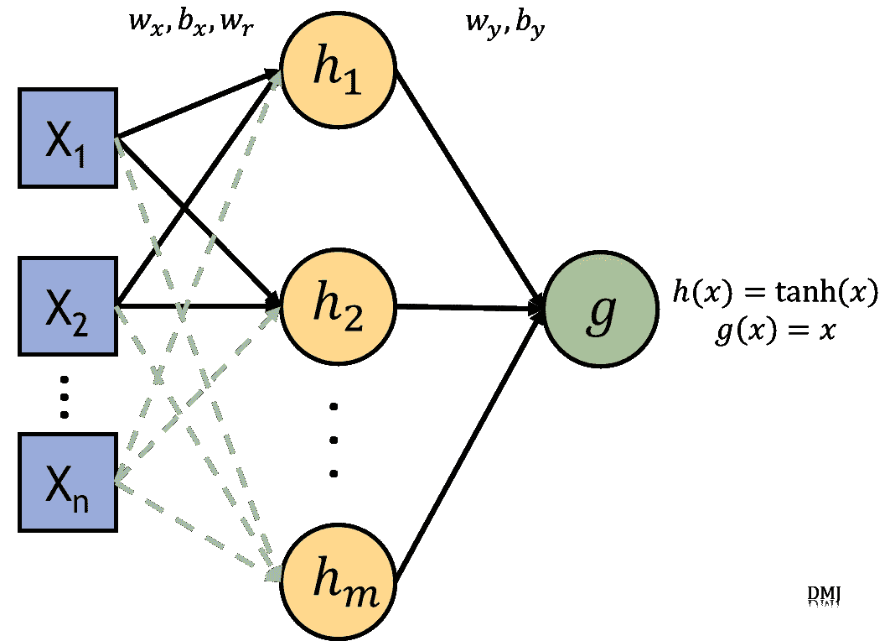*

*图 7。本文示例中使用的递归神经网络。作者制作的图像。*

# *sin(x)函数*

*这是一个非常简单的第一个例子。我们的想法是找到一个能够重现 sin(x)函数行为的 RNN。主要输入是根据 sin(x)的 x 和 y 值的表。图 8 显示了该函数的曲线图。以下部分介绍了不同的方法来模拟这个功能:香草 RNN，[凯拉斯 RNN](https://www.tensorflow.org/guide/keras/rnn) ，和[多层感知器回归器](https://scikit-learn.org/stable/modules/generated/sklearn.neural_network.MLPRegressor.html) (sklearn)。*

*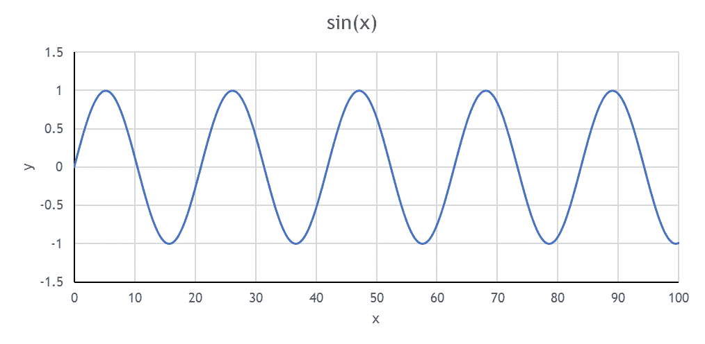*

*图 8。正弦(x)函数*

# *香草 RNN*

*在实施此 RNN 之前，有几件事应该做为准备。第一个是将数据转换成合适的格式，以便 RNN 算法可以读取。图 8 中的数据可以提取为一个有两列的表格:一列是自变量，一列是因变量。RNN 的输入只包含因变量列。序列长度定义了使用多少个分区来划分列。图 9 显示了在具有 7 个值的数据集中，序列长度为 3 会生成 4 个样本。这些是将进入 RNN 的样品。*

*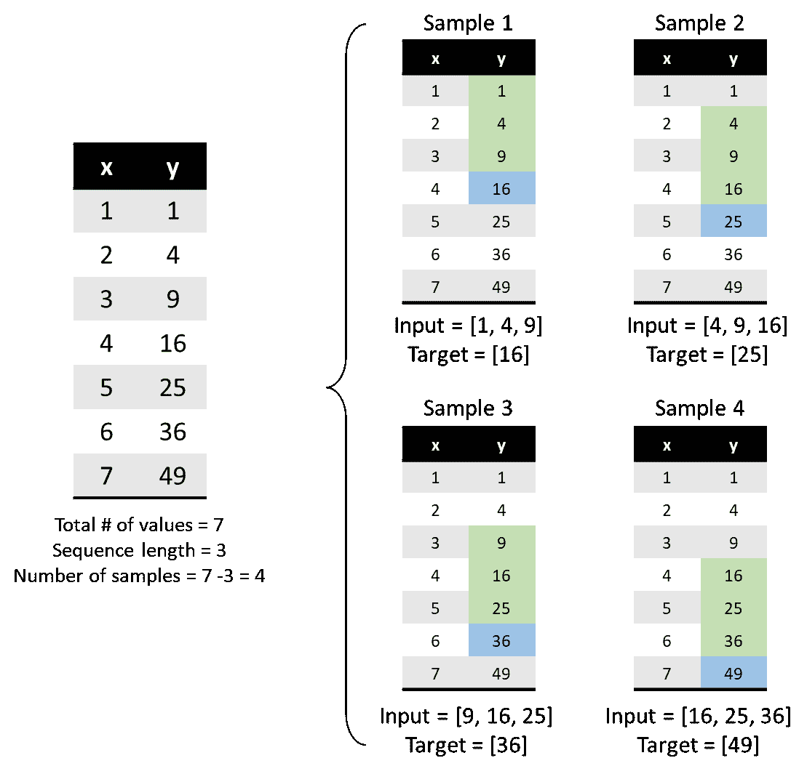*

*图 9。递归神经网络中数据准备阶段如何工作的示例。作者制作的图像。*

*普通 RNN Python 代码中包含的第一个子函数叫做“PrepareData”。这个子函数获取一个. csv 文件，该文件带有一个类似于图 9 左侧的表，并将它转换成多个数组。这是机器学习算法中的一种常见做法，用于在不生成新数据的情况下确定算法的有效性。关于此步骤的最后一个要点是，在将数据输入 RNN 之前，需要对数据进行缩放。在本例中，所有数据都被缩放到最小值-1 和最大值 1。然而，也可以使用其他类型的缩放过程。*

*在缩放后的数据进入 RNN 之前，需要初始化参数。初始化过程为权重分配随机值，为偏差分配零。为此，了解 RNN 体系结构很重要，因为这将定义初始化时需要多少值。这个例子涉及 5 个参数:wx，bx，wr，wy 和 by。前三个与隐藏层相关，后两个与输出层相关。初始化参数后，输入数据进入网络并触发转发传播、计算损耗和反向传播的循环。*

*图 10 显示了使用 sin(x)函数训练普通 RNN 的结果。普通 RNN 在逼近目标点方面做得相当好。值得注意的是，图 11 所示的结果被重新调整以匹配输入数据。这意味着在计算输出后，值从[-1，1]标度转换为其原始形式。香草 RNN 的第一个例子是在隐藏层中使用长度为 2 的序列和一个单元。使用这种配置，RNN 包含隐藏层的 2 个权重和 1 个偏差，以及输出层的 1 个权重和 1 个偏差。总共有 5 个参数。*

*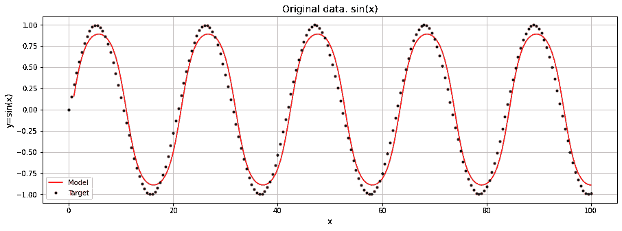*

*图 10。用 sin(x)函数训练香草 RNN 的结果*

*图 11 显示了 RNN 训练过程中损失函数的行为。损失函数从高值开始，并逐渐减小，直到达到最小值。在这一点上，重要的是要提到，香草 RNN 的定义方式使得结果对参数的初始值高度敏感。RNNs 的其他实现(比如 Keras 的实现)处理这个问题。在这个普通的 RNN 中，不同的参数初始组合会导致不同的结果。*

*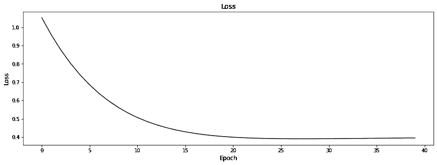*

*图 11。使用 sin(x)数据的标准 RNN 训练过程的损失函数*

# *克拉斯*

*图 12 显示了使用 Keras 库训练 RNN 的结果。这些结果与图 10 所示的结果相当，因为 RNN 在隐藏层中包含一个具有双曲正切激活函数和序列长度为 2 的单元。Keras 中定义的 RNN 的工作方式使得它们不太依赖于初始参数集，这是在传统 RNN 中没有解决的问题。*

*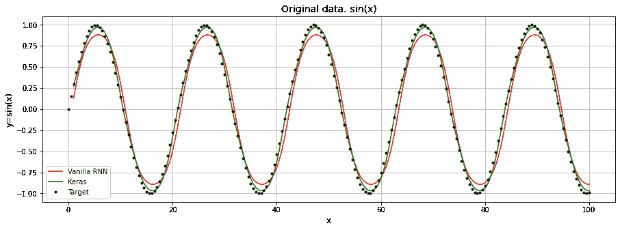*

*图 12。sin(x)数据集的普通 RNN 和 Keras 结果的比较*

# *多层感知器回归器(MLPR)*

*sin(x)函数也可以用传统的人工神经网络来建模。然而，它将需要更多的参数来调整。图 14 所示的人工神经网络使用了三个隐藏层，每个层有 25、15 和 5 个单元。重要的是要记住，这个人工神经网络将横轴上的 x 值作为输入数据。该人工神经网络不考虑目标值的顺序，因为它直接处理输入(x)和输出(y)之间的关系。*

*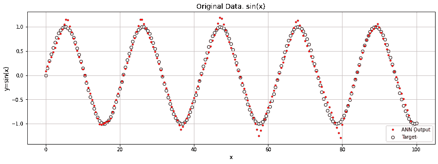*

*图 13。使用 sin(x)函数训练 MLPR 的结果*

# *油井的产油率*

*到目前为止给出的例子都涉及 sin(x ),这是一个非常简单的函数。然而，RNNs 也可以用来表示更复杂的行为。下一节包含与油井月生产率相关的数据。此示例是测试 RNN 的好方法，因为数据不遵循任何模式或周期，并且不能用函数建模。*

# *香草 RNN*

*对于这个普通 RNN 的应用程序，序列长度是 15，隐藏层中的单元数是 1(图 14)。请注意，尽管数据有明显的下降趋势，但这些点看起来确实不相关。然而，RNN 能够匹配某些点。最糟糕的是接近最后阶段，RNN 的结果与目标相差甚远。*

*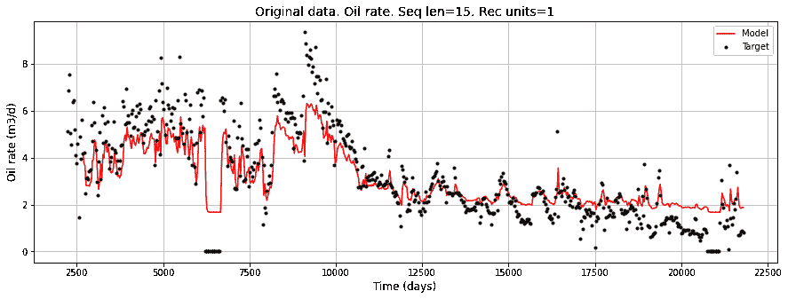*

*图 14。使用序列长度为 15 且在隐藏层中有一个单位的采油率数据集对普通 RNN 进行定型的结果*

*图 15 显示了训练普通 RNN 来再现采油速度日期的结果，但是这次在隐藏层中使用了 5 和 2 个单位的序列长度。结果似乎比以前稍好。与其他类型的神经网络一样，调整元参数会产生很大的不同。在与本文相关的 [Jupyter 笔记本](https://github.com/manfrezord/MediumArticles/blob/main/RNN/RNN_Notebook.ipynb)中，可以尝试隐藏层中单元、序列长度、学习速率和历元数的不同组合。*

*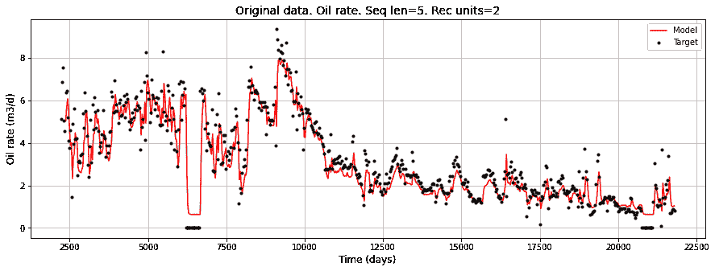*

*图 15。在隐藏层中使用长度为 5 和 2 个单位的序列，使用采油率数据集对普通 RNN 进行定型的结果*

# *克拉斯*

*使用 Keras 运行了一个与刚才呈现的场景类似的场景(图 16)。它在隐藏层中有 2 个单元，序列长度为 5。结果类似于香草 RNN，即使在最后阶段。*

*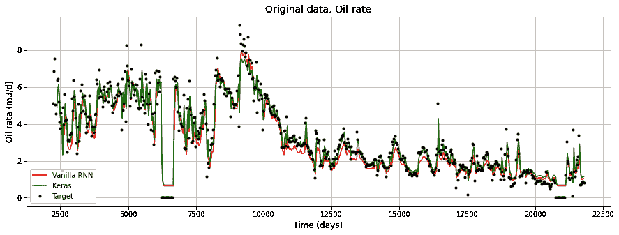*

*图 16。石油产量数据集的香草 RNN 和 Keras 结果之间的比较*

# *多层感知器回归器*

*图 17 显示了训练传统人工神经网络以再现油率数据集的结果。此示例使用三个隐藏层，每个层的大小分别为 100、50 和 25 个单位。人工神经网络很好地代表了油量的一般行为。然而，正如在前面的例子中发生的那样，数据中的小细节不能被人工神经网络识别。与 RNN 相比，这种性能更接近于通过非线性回归获得的结果。*

*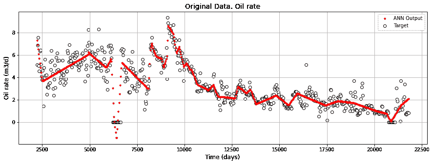*

*图 17。使用石油价格数据集训练 MLPR 的结果*

# *结论*

*本文的主要目的是清楚地解释 RNNs 是如何工作的，以及它们的前向和后向传播过程与传统的 ANN 有何不同。RNN 的主要特征与其循环单元有关。这些单元跟踪先前的激活，这给 rnn 一种特殊类型的“记忆”。这个特性允许 RNNs 比传统的 ann 再现更详细的行为。给出的例子显示了人工神经网络如何很好地再现一般趋势。然而，如果任务是再现逐点值，那么最好切换到 RNN。这解释了为什么 rnn 被用于语言建模、语音识别和其他类似的应用。因此，尽管 RNNs 的行为不如 Solomon Shereshevsky 的技能令人印象深刻，但它们仍然可以用来解决日常面临的许多问题。毕竟，不太可能需要一个能够回忆起 12 年前对话的人。更有用的是有一种算法，可以“猜测”在匆忙写下的短信中，下一个单词会是什么。*

# *参考*

*   *Rios，L. M .，& Sahinidis，N. V. (2013) [无导数优化:算法回顾和软件实现比较](https://link.springer.com/article/10.1007/s10898-012-9951-y)。全球最优化杂志。*
*   *苏茨基弗岛(2013 年)。训练递归神经网络。博士论文。多伦多大学*
*   *Werbos，P.J. (1990)通过时间反向传播:它做什么和如何做。IEEE 78(10)会议录，1990 年，1550-1560。*
*   *曼弗雷博士(2021)。[人工神经网络真的会学习吗？](https://towardsdatascience.com/do-artificial-neural-networks-really-learn-e6c3a4b09b55)。走向数据科学*
*   *神经网络的基础。皮尔逊*