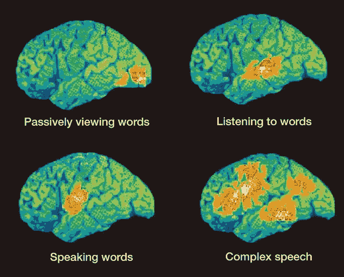
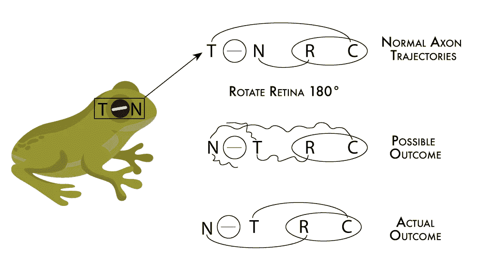
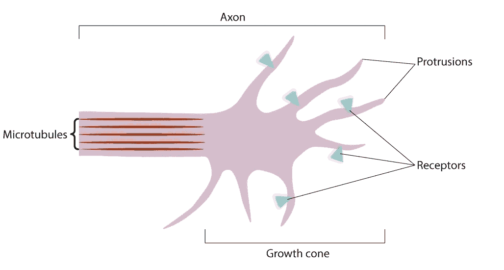
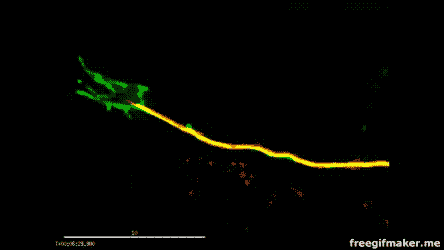

# 强化学习、大脑和心理学:神经科学基础 2

> 原文：<https://pub.towardsai.net/reinforcement-learning-brain-and-psychology-neuroscience-basics-2-a6cc8932584a?source=collection_archive---------1----------------------->

## [机器学习](https://towardsai.net/p/category/machine-learning)，[神经科学](https://towardsai.net/p/category/neuroscience)

## 神经递质、学习、记忆、寻路，以及所有这些是如何与人工智能算法相联系的。

作者图片

[上次](https://medium.com/towards-artificial-intelligence/reinforcement-learning-brain-and-psychology-neuroscience-basics-1-80c8386ddd2e)我们结束了突触，今天我们将完成神经科学导论。你看，这一切只是冰山一角。该系列的整个想法是至少了解一些关于我们的“神经网络”的东西，以便我们可以从中汲取灵感，甚至可能再造它。

所以今天你将了解不同种类的神经递质，我们身体的调节，青蛙的实验，以及轴突再生的能力。

我们开始吧。

# 神经递质

**神经递质**是化学信使，将信息从神经细胞通过突触传递到目标细胞。目标可以是另一个神经细胞，或者肌肉细胞，或者腺体细胞(一组合成物质的细胞)。它们是神经细胞制造的化学物质，专门用来传递信息。神经递质可以是肽，但它们主要是氨基酸或核苷酸。每一个突触都可能有多种类型的神经递质。

在[上一篇文章](https://medium.com/towards-artificial-intelligence/reinforcement-learning-brain-and-psychology-neuroscience-basics-1-80c8386ddd2e)中，我们说过存在兴奋性和抑制性突触，但突触是由它们产生的神经递质定义的。于是就有了**兴奋性**和*抑制性*神经递质。

*兴奋性神经递质*的例子有**谷氨酸**(参与警觉)**腺嘌呤**(参与困倦)。例如，咖啡因的作用之一就是抵消腺嘌呤的影响。

至于*抑制性*的*、*的有，比如**GABA**(γ-氨基丁酸)和**甘氨酸**这两种主要的中枢神经系统*神经递质*。*γ-氨基丁酸*在其他功能中，是一种抗焦虑*神经递质*，因此γ-氨基丁酸*活性增加可以起到镇静作用。而*甘氨酸*参与了允许运动、视觉和听觉的运动和感觉信息的处理。*

还有*神经递质***既兴奋又抑制**。比如**乙酰胆碱**，它参与神经肌肉连接，也存在于中枢神经系统中，**血清素**和**多巴胺**，它们都有点让你感觉良好，我们会在下一篇文章中谈到多巴胺。

你可能已经猜到了，但我会明确地指出，*神经递质*移动神经元的*动作电位*。*抑制性*使动作电位值(我真的无法停止用数学术语思考它)远离触发阈值*兴奋性*反之亦然。

# 受体

如果某样东西发送了这些神经递质(基本信号)，那么一定有其他东西接收到了它。神经递质影响它们将要做的事情的方式是通过结合适当的受体。有许多类型的受体，每个突触可以有不止一种类型的受体。但是我们坚持最基本的，所以这里有两个类你一定要知道。

第一个是**离子型受体**(离子通道)，它们是结合*神经递质*并开放的受体。并且它们具有非常快速的响应(在毫秒范围内)。

第二类是**代谢型受体**，它们不是离子通道，它们实际上是通过结合*神经递质*来激活第二信使系统，进而打开离子通道。而他们的反应要慢得多(往往远大于一秒)。

同样，一种*神经递质*可以激活不止一种受体。这隐含在一个概念中，即*神经递质*可能既是*抑制性的*又是*兴奋性的。*例如，*血清素*结合多达不少于 14 个受体。而一个神经元可以表达一整串*血清素*受体。

如你所见，我们的身体倾向于多对多的联系。想象一下规模(数百万和数十亿的神经元、突触、树突、神经递质和受体)，你可能会明白为什么我们不能模拟我们的大脑。

## 规章制度

我们已经说过，我们的身体倾向于有更多的*化学突触*而不是*电突触*，因为化学突触是高度可调控的。所以现在我们正在专门谈论这些*化学突触*，以及它们如何微调我们的神经系统对来自我们体内和体外的最小刺激的反应。

至少据我们所知，有几种方法可以调节突触，但它们都与改变*神经递质*的数量有关。

第一个是**降解**，这意味着当*神经递质*被释放时，在某些情况下，它会被特定的酶降解，例如，有一种特定的酶会分解*乙酰胆碱*。注意这个系统是多么温和，如果酶被抑制，你会呼吸休克，你不能再呼吸了，因为当你呼吸时，你必须通过神经激活和失活肌肉。乙酰胆碱会激活你的肌肉。

另一种改变*神经递质*数量的方式是**突触前细胞*再摄取***(重吸收)。当*神经递质*被释放时，它可以被*突触前*细胞吸收，这是一种谨慎的做法，因为该细胞不再需要继续合成*神经递质*。对于*血清素*和*多巴胺*来说正是如此。在某些情况下，你可以调节神经递质的合成数量。以这种方式调节的一大类*神经递质*是**内啡肽** ，它们是身体的天然鸦片，基本上是疼痛调节器。

所有这些过程都是可调节的，既可用于调节正常的*突触*，也可在所有情况下用于药物治疗目标。**长话短说，我们的身体会改变*神经递质的数量*作为对刺激的反应，但药物也会改变它们的数量。**

以神经毒气为例。第二次世界大战期间，美国使用了一种叫做沙林的毒气来对付躲在地下的日本军队。这种气体会抑制*乙酰胆碱酯酶*，而这种酶本应在突触间隙分解*乙酰胆碱*。因此受体受到*乙酰胆碱*的反复刺激，导致至呼吸麻痹而死亡。

然而，可以用乙酰胆碱的竞争性抑制剂**阿托品***来对抗。与受体结合，阻止*乙酰胆碱*结合，从而避免死亡。美国士兵就是这样保护自己免受毒气伤害的，他们手里拿着几瓶*阿托品*。因此，如果发生神经毒气袭击，如果你给自己注射*阿托品*，就会阻止*乙酰胆碱*发挥作用而存活下来，然而，你可能会有点萎靡不振。*

*另一种调节突触后细胞受刺激频率的方法是通过调节受体。直观地说，如果受体多了，神经传递素 T29 就有了更多的结合位点，从而能发出更强的信号。*

*有三种方法可以做到这一点，你可以改变受体的数量，对一种*神经传递素的亲和力*和受体的反应性。而这三件事都与学习、记忆和上瘾有关，这些变化非常缓慢，它们会在几分钟、几天、几周内发生。*

*改变所有这些与受体有关的参数的结果之一是，在很长一段时间里，你真的改变了突触的工作方式。这实际上就是惯例。你可以通过这些参数反复模拟突触来调整突触的工作方式。比如说，当你弹吉他的时候，你会一点一点地改变允许你参与这项活动的突触。*

*因此，有两种可能的结果，其中的突触反应变化，由于重复的突触刺激。要么是**反应增强**要么是**反应减弱**。*反应增强*发生在兴奋性突触，这意味着动作电位更有可能发生，这个过程被称为**长时程增强**。*反应减弱*则发生在抑制性突触，这个过程被称为**长期抑郁**。*

*这被认为是记忆的工作方式。就强化学习而言，让你获得更高回报的联系越来越强，反之亦然，让你犯错的联系越来越弱。就像在人工神经网络中一样，神经元的权重越低，对结果的影响就越小。*

# *电路*

*我们应该谈论的另一个概念是**神经回路**。可以说，我们大脑中的神经元不仅仅作为单个单元独自行动，而是形成利益群体。*

*看看这些大脑扫描，我们在每一项任务中使用了不同的大脑区域。成千上万的神经元被用来处理你所看到和所说的事情。我们只在表面测量了大脑的活动，也称为神经皮层，想象一下在更深处会发生什么。*

**

*大脑活动，作者图片*

*然而，这里真正的问题是*回路*是如何形成的，以及神经元如何知道在哪里连接。我们来逻辑思考一下，要么是随机过程，听起来有点哑，要么是引导过程，听起来好多了。
有人可能会争辩说进化就是关于突变，而突变是随机的，那么为什么愚蠢地认为在几十亿年里我们随机发展了所有的*神经回路*？事实是，我们在不断发展我们内部的新联系，正如我们已经说过的，大脑可以由于学习和完善新技能而发生显著变化。不仅如此，有许多重要的过程必须被恢复，以防被破坏，那么一个随机的过程如何帮助恢复，只是随机地做一些事情，直到它最终工作？*

*长话短说，经过多年的研究，我们体内设置路径和连接的随机过程(如果建立了连接，则生存)和引导过程(告诉去哪里)都被证明是正确的。*

## *斯佩里蛙视网膜旋转实验*

*这个领域最著名的实验之一是由罗杰·斯佩里在 20 世纪 60 年代进行的。他取出一只青蛙，挖出它的眼睛，旋转 180 度，然后放回原处，观察神经连接是否以及如何恢复。纯青蛙，对吧？*

*青蛙的视网膜有两个区域，实际上也是我们的，靠近鼻子的**鼻侧**和另一侧的**颞侧**。这些区域分别连接到**视顶盖**的两个区域，视顶盖在许多其他功能中负责引导眼球运动。在实验过程中，这些连接被切断，过了一段时间后，扰流器自己恢复了。*

**

*斯佩里的青蛙实验，作者图片*

*一种可能的结果是，负责铺设这些路径的轴突，随机偶然发现大脑的某个区域并与之连接，但事实证明轴突“知道”在哪里生长。这就是为什么这只青蛙能够恢复视力和眼球运动，帕里因此实验获得了诺贝尔奖。所以，我猜，大家都赢了。*

*不仅神经元(轴突)的引导发生在我们身体的发育和修复过程中，而且科学家认为它也发生在学习新技能的过程中。所以我们中的一些人可能有一个比其他人更复杂的系统。这非常符合我们正在进行的关于计算机系统和人类大脑的比喻，一个具有多种功能的系统通常比欠发达的同类系统更复杂和先进，因此不断学习新技能和拓宽视野可能是一个非常好的想法。*

## *生长锥*

*人们发现，**神经母细胞**，基本上是一个正在形成的神经元，在其发育过程中发出被称为**的神经突**，这些神经突最初看起来是一样的，但后来其中一个变成轴突，其余的变成树突。这是当**先锋轴突**(第一个发现目标)形成时，其他的沿着相同的路径产生一束轴突、或**束**，它们一起形成神经。*

*但是*先驱轴突*是如何寻找路径的呢？在轴突的最顶端，有一个叫做**的东西，即生长锥**，它类似于某种探测器。*

**

*生长锥，作者图片*

***微管**既稳定轴突，又像小铁轨一样将物质运进运出细胞体。在最顶端，它们与这些非常动态的手指状**突起**相互交叉，我很快会给你看一个视频，它们突出是因为聚合肌动蛋白(F-actin)。
在*生长锥*的表面有**受体**，它正在采样环境中的*配体*，如果*配体*是有利的，它们将稳定那些*突起*并使它们更多地发生。*

**生长锥*对轴突生长至关重要，它就像一个导航系统，捕捉吸引轴突的信号或排斥轴突的信号。环境中肌动蛋白的增加产生了**吸引信号**并使*生长锥*延伸。至于**排斥信号**，由于 F-肌动蛋白变成 G-肌动蛋白或未聚合肌动蛋白，*生长锥*塌陷。
配体*在与受体结合时实际上是指导信号，它导致信号转导，因此轴突生长。**

**

*轴突寻路，图片作者*

*这让我想起了我们在计算机科学中实现的搜索算法。它朝一个方向走，意识到启发式算法在那里不起作用，就切换到一条新的道路，并重复它，直到找到路径。*

# *结论*

*神经科学是一个惊人的、令人难以置信的、极其复杂的研究领域。我已经尽可能多地告诉你我们的大脑，但我不是专家，所以可能会有不准确之处。然而，我敦促你探索这个主题，并从中汲取灵感。*

*下次我们将讨论多巴胺，我们身体的奖励系统，以及强化学习中的奖励功能，敬请关注。*

**跟我连线上* [*推特*](https://twitter.com/poddiachyi) *，*[*LinkedIn*](https://www.linkedin.com/in/poddiachyi/)*，* [*脸书*](https://www.facebook.com/poddiachyi) *，并关注上*[*GitHub*](https://github.com/Poddiachyi)*！**

## *来源*

*[1]黑兹尔·西夫、泰勒·杰克斯和迪维娅·辛哈。 *7.013 生物学导论。*2013 年春季。麻省理工学院:麻省理工学院开放课件，[https://ocw.mit.edu](https://ocw.mit.edu/courses/biology/7-013-introductory-biology-spring-2013)。许可:[知识共享协议 BY-NC-SA](https://creativecommons.org/licenses/by-nc-sa/4.0/) 。*

*[2]理查德萨顿和安德鲁巴尔托。2018.*强化学习:简介*。布拉德福图书，剑桥，马萨诸塞州，美国。*

*[https://en.wikipedia.org/wiki/Neuroscience](https://en.wikipedia.org/wiki/Neuroscience)*

*[4]彼得·达扬和 L. F .艾伯特。2005.*理论神经科学:神经系统的计算和数学建模*。麻省理工学院出版社。*