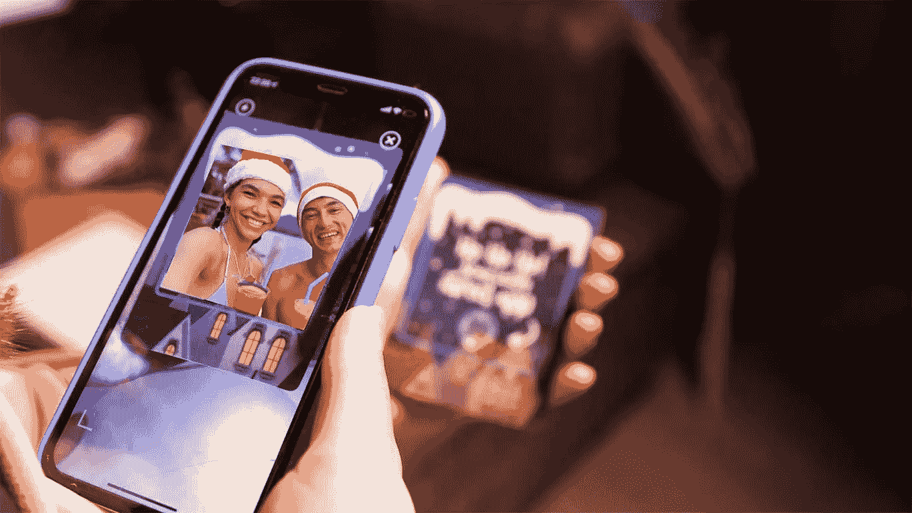
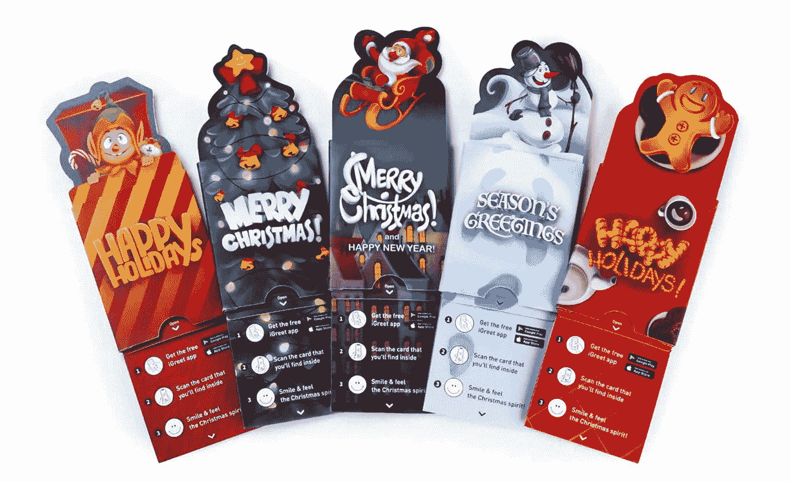

# 通过增强现实重塑贺卡

> 原文：<https://pub.towardsai.net/reinventing-greeting-cards-through-augmented-reality-interview-with-igreet-founder-6017f4d52dd2?source=collection_archive---------1----------------------->

## iGreet 创始人访谈

随着假日季节的迅速临近，世界各地的贺卡公司都卷起袖子，准备迎接一年中最繁忙的时刻。然而，位于保加利亚的 iGreet 公司希望扰乱市场。

通过基于增强现实的贺卡，该公司旨在吸引现代消费者，并提供传统贺卡的独特之处。

首席执行官维乔·季米特洛夫(Vicho Dimitrov)想出了一份独特的情人节礼物，这一想法发展成为一家创业公司，4 年后仍在蓬勃发展。

# 什么是 iGreet，它与市场上的其他贺卡有何不同？

Dimitrov 说:“iGreet 卡在各个方面都不一样。“我们最初的想法是，通过使用增强现实技术，在贺卡市场创造一些全新的东西。”

iGreet 卡不仅仅是书面信息，还包括节日主题的图形、写信息的空间以及卡中间独特的二维码。发送者创建**一条** **个性化** **视频消息**，并使用 iGreet 的应用程序将其链接到该二维码。每张卡片上都有节日主题的图案，以及如何观看视频信息的说明。通过[计算机视觉处理](https://lionbridge.ai/articles/what-is-computer-vision/)，iGreet 提供了传统贺卡的现代化。

“iGreet 通过使用最新的印刷、包装和软件技术，改变了人们对传统贺卡的看法，传统贺卡在 400 多年的历史中一直没有太大变化。”

一方面，传统贺卡有自己的吸引力。“实体贺卡总会有电子贺卡或社交信息所没有的元素。季米特洛夫说:“手里拿着一张卡的实际体验，购买和交付卡的想法。"但是他们的信息已经变得乏味和重复，与分享真诚的情感背道而驰."

虽然 iGreet 的核心是一张贺卡，但通过增强现实将数字和物理媒体相结合是一种新的方法。随着技术的发展，我们已经看到了实体媒体的消失和电子书、纯在线新闻出版物、纯数字视频游戏等数字媒体的兴起。

iGreet 的方法不是完全摆脱物理，而是将两者融合在一起。“我们的卡片让人们有机会在每次拿起卡片观看视频时，看到他们手中亲人的情绪。卡片上的信息可以被看到和听到，卡片可以被感觉和闻到——随着更多的感官被激活，这一时刻变得更有影响力和更令人难忘。这是分享情感和缩短距离的独特方式。"

# 现在的贺卡市场出了什么问题？

“目前，由于不断发展的电子通信，如社交媒体、信使和电子邮件，传统市场正在衰落，”季米特洛夫说。"用户只需点击一下，就可以在几秒钟内发送情感信息。"

“我们看到对创新产品和服务的需求不断增长，如按需印刷的贺卡、弹出式卡片、手工制作的卡片等。但是如果你从整体来看，考虑到所有的问候服务，市场正在增加！那我们做了什么？我们结合了所有这些！你可以从实体店或网上购买高科技的 iGreet 卡，你可以对它进行个性化设置，还可以写传统的信息。”

# iGreet 值不值这个成本？

在 iGreet 的 Kickstarter 页面上，它说你可以以 25 美元或每张卡 5 美元的价格获得 5 张 iGreet 卡。在霍尔马克网站上快速搜索显示，最便宜的圣诞卡每张大约 2 美元。对于我们这些犹豫今年是否使用 iGreet 的人来说，是什么让 iGreet 卡值得付出额外的成本呢？

“iGreet 卡是一款独一无二的产品，经历了大量的开发工作。季米特洛夫说:“我们甚至不会考虑将它与普通的 2 美元卡进行比较。”**贺曼贺卡重复着同样空洞的信息和陈旧的图像，没有创新或灵感。如果有的话，他们缺乏圣诞精神，是纯粹的消费主义和资本主义的努力。你知道吗**那些 2 美元的贺曼贺卡上的加价大约是 2000%**？每张卡才花了 10 美分！”**

“iGreet 与高端定制卡更具可比性。弹出式卡片的价格在 10 到 15 美元之间。当你分解它们时，它们也相当简单，但至少它们提供了一些不同的东西。iGreet 走得更远，它依赖于一个由独特的惊喜包装、原创设计和软件后端(iOS 和 Android 应用程序以及服务器)组成的生态系统。有了这个，他们让用户发送他们诚实的圣诞精神的真实体现。

# 视频信息会永远存在吗？

对于一个日益商业化的节日，大多数消费者会想要一张更加个性化的贺卡。很可能会有一个不错的需求，让你用除了花钱以外的方式向你爱的人表达你的感激之情。

然而，传统贺卡的一个可取之处是它们是实体的。信息通常手写在卡片上。你可以拿起一张 10 年前的卡片，读一读永远印在卡片上的爱人的话。虽然 iGreet 配有实体卡，但录制的视频可以无限期观看吗？

“是的，当然！可以，这也是 iGreet 卡的宗旨。您可以无限期观看您的视频。所以有一天你会在抽屉里发现一张 iGreet 卡，看到那条你可能已经忘记的视频信息，”季米特洛夫说。“由于不断开发云服务和我们的视频压缩算法，我们能够承诺这一点。”

# 到目前为止，iGreet 的公众接受度如何？

“开始时有许多挑战、问题和疑虑，但幸运的是，从一开始它就迅速发展起来，我们在贺卡进入商店的第一天就开始销售！”季米特洛夫说。“从那以后，我们的销售额逐月增长。目前，我们的主要市场是保加利亚和德国。最近，我们也开始在亚马逊上销售。”

iGreet 是传统贺卡的一个雄心勃勃的独特替代品。该公司自 2015 年成立以来，今年对他们来说也是一个好年景。此外，他们在 Kickstarter 上的**20，000 美元目标在不到一个小时**内就实现了。对于今年有兴趣尝试 iGreet 的人，你可以通过 [iGreet 的 Kickstarter 页面](https://www.kickstarter.com/projects/igreet/augmented-reality-christmas-cards-that-come-to-life?ref=9vd15r&utm_source=prm&utm_medium=lionbridge%20AI)购买。

寻找更多关于增强现实和机器学习的阅读？查看[一个混合现实:微软 HoloLens 将如何改变世界](https://lionbridge.ai/articles/a-mixed-reality-how-the-microsoft-hololens-will-change-the-world/)，[什么是图像标注？](https://hackernoon.com/what-is-image-annotation-an-intro-to-5-image-annotation-services-yt6n3xfj)和[什么是面部识别？](https://lionbridge.ai/articles/what-is-facial-recognition/)

别忘了[订阅我的简讯](https://lionbridge.ai/ai-newsletter-subscription/)了解增强现实、人工智能和机器学习的所有最新动态。