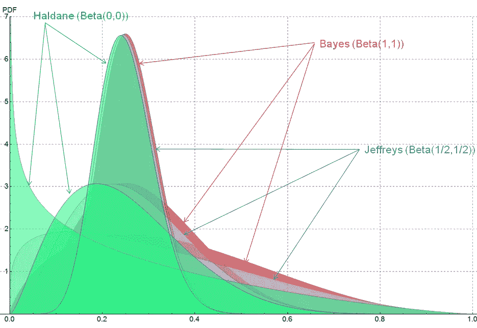

# 宗教信仰和推荐系统:同一问题的解决方案？

> 原文：<https://pub.towardsai.net/religious-beliefs-and-recommender-systems-solutions-to-the-same-problem-e07b603afd8c?source=collection_archive---------2----------------------->

## [人工智能](https://towardsai.net/p/category/artificial-intelligence)，哲学，[观点](https://towardsai.net/p/category/opinion)

## 或者:为什么你不应该这么快就将自己的实践推理和批判性思维能力外包出去

宗教信仰和推荐系统都旨在简化复杂世界中的决策任务。照片由[阿毛里·古铁雷斯](https://unsplash.com/@amaury_guti?utm_source=medium&utm_medium=referral)在 [Unsplash](https://unsplash.com?utm_source=medium&utm_medium=referral) 拍摄

从表面上看，宗教和推荐系统似乎毫无共同之处。一个是历史和社会现象，为我们最深刻的信念和信仰提供道德基础。另一个是最近的，相当平凡的技术，主要目的是给我们更好的搜索结果，广告，或电影推荐。宗教回答了大问题，而推荐系统回答了小问题。

然而，我在这里要说的是，两者都是处理不确定性和信息过载的方法，尽管方式非常不同。宗教思想和推荐系统是解决同一个基本问题的两种方式:在混乱、不确定的环境中导航时，协调并引导我们的行动朝着特定的目标前进。但是积极寻找不确定的情况会有什么好处吗？信息过载总是坏事吗？当我们 100 年后回顾今天时，我们可能会想:

> 推荐系统最终会在复杂的信息环境中为我们做宗教在复杂的自然环境中为我们做的事情吗？

## 推荐系统与信息过载

推荐系统可以被看作是互联网上信息过载问题的解决方案。换句话说，推荐系统可以被视为一种*认知*技术，它过滤掉不相关的信息，从而在*数字现实*中为我们周围的复杂*数字信息*的泥沼提供有意义的结构。这种认知技术也具有真正的商业价值，主要的[行为大数据(BBD)](https://www.tandfonline.com/doi/abs/10.1080/08982112.2016.1210979) 平台上无处不在的推荐系统就证明了这一点，比如网飞、Spotify、Youtube 和脸书等等。推荐系统也可以被描述为*元产品*——它是一种目的在于推荐其他产品的产品。

有趣的是，上述过程模拟了人脑中发生的事情，从而通过有意识的访问“选择”无意识的感知信息。在意识的研究中，这被称为*选择性注意*，主要在无意识水平上运作。根据神经科学家斯塔尼斯拉斯·德阿纳的说法，“注意力是意识的门户。”换句话说，在有意识地获取精神内容之前，必须进行一些选择性过滤。

因此，信息过载的现象并不是生活在数字时代的独有现象。大脑已经这样做了几百万年了。今天的问题不是*获取*信息，而是获取*正确的*信息。我们已经看到，这是一个过滤或选择目前与我们最相关的东西的问题。棘手的问题是找出最相关的是什么！如果我们是史前狩猎采集者，相关信息可能与附近食肉动物的声音或毒蛇的记忆有关。但是时代变了。

## 人类对信息加工闭合的需求

减少不确定性似乎是人类的一种基本需求，这种需求自人类第一批漫游群体形成社会集体并相互讲述创世神话以来就一直存在。这些故事使原本复杂的自然环境变得简单，充满了混乱和不可预测性。有了这些简单的信念，我们就能够相对较好地推断出*(足以复制！)对各种各样的自然事件和生物有什么期望。这使得决策变得更加容易。*

今天，心理学家把这个问题称为认知超负荷问题之一。社会心理学家[阿里·克鲁格兰斯基](https://en.wikipedia.org/wiki/Arie_W._Kruglanski)声称我们对*信息处理闭合*有一种基本需求，并且天生有动力去寻找“模糊情况”的答案任何曾经兴奋地在谷歌上搜索一些晦涩的琐事问题的人可能都会同意克鲁格兰斯基的观点。克鲁格兰斯基声称，在信息不封闭的状态下，我们倾向于“冻结或抓住”。达成结论意味着能够做出决定并采取行动，但这样做我们可能会错过更好、更准确的信息。我们可以*利用*我们现在拥有的不完善的信息，或者*探索*潜在的更好的选择，冒着错过黄金机会窗口的风险。

这里只是人类传统上处理不确定性的各种方式中的一小部分:

*   **试探法** ( *选择满足约束 x* 的第一个)
*   **偏见** ( *我不喜欢美国人*
*   **刻板** ( *亚洲人擅长数学)*

与信息处理封闭性相关的还有我们通常所说的“封闭”和“开放”的特征那些思想开放的人可能会在决定采取行动之前停下来，收集更多的信息，并咨询他人。相比之下，那些“思维密切”得分高的人会倾向于寻找快速、简单的信息来源，以缓解不确定性带来的认知不适。

我相信我们都能想到一些流行的新闻媒体以这种方式呈现信息。简单的政治故事*解释*观察到的“数据”(例如，新闻事件)被用来帮助人们应对民主政府的复杂性。本·诺瓦克的书《希特勒与绑架逻辑:暴君的策略》是一个很好的案例，通过巧妙的绑架式故事讲述了大规模操纵的可能性。

> 在推荐系统的语言中，我们可能会把思想开放称为“意外收获”，而把思想封闭称为被困在“过滤泡沫”中。

如果推荐系统的主要目标是删除给定用户的不相关信息，那么什么算不相关呢？个性化的*过程*将这个过滤过程与对一个人潜在兴趣和偏好的推断联系起来。例如，如果我知道你在搜索 12 月去巴塞罗那的航班，也许你更喜欢海滩而不是雪山。对于推荐系统的设计者来说，要解决的基本问题是:我如何预测我的顾客或用户的兴趣或偏好？

## 自我不确定性:在数字时代敢于认识自己

好吧，所以也许我们的天性就是想要达到信息处理的封闭性。规范性问题仍然存在:*我们应该吗？沉迷于不确定性和怀疑会有什么好处吗？*

伊曼纽尔·康德在他 1784 年的论文中提出什么是启蒙？“要求我们知道*是为了*，从而拒绝所有基于诉诸教条、信仰或权威的真理主张。他写道:“启蒙是人类从自身引发的不成熟中脱颖而出。”长久以来，我们毫无疑问地接受了别人告诉我们的东西。对康德来说，倾听了解意味着正视不确定性，并试图运用你的智力进行批判性思考，即使这样做可能很危险或不受社会欢迎。

在康德看来，自由和自主的关键是从基本原则出发，不受历史、政治、社会或宗教压迫力量的影响，勇于为自己思考和推理。康德的 [*道德形而上学的基础*](https://en.wikipedia.org/wiki/Groundwork_of_the_Metaphysic_of_Morals) 探索了我们作为基本的、人类普遍的、团结的理性能力，并为我们提供了道德的理论基础——作为行动指南，其原则将被任何合理/理性的思想家所接受。

即使我们天生倾向于诉诸信仰、权威和习惯，康德也会说，实现我们人类的潜力需要更多。他会恳求我们用我们独特的推理能力去思考和理解我们周围事物的本质。

## 伦理不确定性:你是谁？你该怎么办？

生活中一些最紧迫的决定必须在几乎完全不确定的情况下做出，这一事实似乎不太可能改变。然而，这些类型的情况与推荐系统当前部署的情况非常不同。这些情况通常涉及一些琐碎的决定，比如在 Youtube 上看什么视频，或者在 Instagram 上关注哪些账户。

尽管如此，我建议我们不要盲目地接受在不需要的地方使用推荐系统。在我看来，学会面对不确定性做出艰难的决定是美好生活所必需的技能。正如康德所言，我们应该*敢于知道*并宣称我们自己的实际推理能力，而不是依赖那些负责人(企业和数据科学家)的教条和权威来构建推荐系统。

为什么盲目依赖自动推荐对人类发展可能是一件坏事？推荐系统，从其逻辑极端来看，代表了一种道德外包的形式，在两个关键的、相互关联的领域中的实践推理的外包:

> 1)关于哪种类型的人变得更好和更坏的实际推理
> 
> 2)关于哪些动作执行起来更好和更差的实际推理

实践推理的这些方面是相关的，因为只有当我们决定了什么是好人，我们才能开始以适当的方式去成为这样的人。难怪在现代生活中，许多人从未花时间去考虑他们想成为什么样的人。没有宗教信仰的指引，这类问题很容易引发生存危机。[萨特有一句名言*存在先于本质*](https://en.wikipedia.org/wiki/Existentialism) :我们生于这个世界，没有上帝的指引，我们面临着艰巨而可怕的任务，要弄清楚我们在这个世界上到底是什么。海德格尔也通过他的[此在](https://en.wikipedia.org/wiki/Dasein) 概念来解决这个问题。

然而在亚里士多德时代，这类存在主义问题处于人类生活和经验的前沿和中心。亚里士多德认为，真正幸福的人只有在积累并表现出一生的美德行为倾向后，才能在临终时得到正确的评判。一个有道德的人被定义为一个行为正直的人，不需要权衡每种情况的利弊。

如果我们把这些存在和做的基本问题分配给推荐系统设计者的“教条”和“权威”，那么我们就失去了作为一个有反思判断能力的人意味着什么的一个重要方面。在极限情况下，将这类问题外包给这类算法的设计者有可能将我们变成纯粹的肉体自动机，其目的并不比它们在 GDP 增长和股市估值进步中的集体作用更大。

## 上帝:复杂问题的简单答案

自然界是一个复杂而不确定的地方。科学的历史和进化证明了这一事实。我们不断更新我们对现实*的最佳描述。毫不奇怪，宗教的一个主要功能是给我们一个基本而简单的认知工具，用于理解我们周围的*复杂自然过程*，如飓风、流星雨、天体运动等等。同样，基督教神学的传统旨在解释邪恶如何与一个显然全知、全善、全能的上帝共存。*

*让我们来看一个宗教如何减少不确定性的突出例子。《创世纪》讲述了一个极其简单的故事，关于可以想象的最复杂的事件:世界的创造。衡量其简单性的一个标准是，一个小孩子也能理解它。同时，宇宙学家和地质学家告诉我们[地球大约有 45 亿岁了](https://www.scientificamerican.com/article/how-science-figured-out-the-age-of-the-earth/)。事实上，如果没有我们对放射性衰变物理过程的现代科学理解，我们甚至可能不知道这个关于我们星球的基本事实。*

> *没有科学训练，你很难理解“同位素分析”这样的术语和 45 亿这样的数字，但很容易想象六天工作，七天休息一天。这就是爸爸每周做的事。*

*宗教也为其信徒提供了复杂道德争论的简单答案，例如在堕胎辩论中，必须面对棘手的人格问题。某样东西能成为一个人的 50%吗？那意味着什么？*

*通过遵循我们宗教的公认教义，我们可以对这些棘手的道德问题得到迅速而清晰的答案。例如，教皇本尼迪克特告诉他的天主教追随者，“生命始于受孕。被告知这一点后，我们认为堕胎在道德上是错误的不确定性完全消失了。由于这种道德不确定性的蒸发，我们现在能够将我们的精神能量集中在生活的其他领域。*

## *确定性的认知诱惑:个人身份的案例*

*有时复杂问题的简单答案实际上是必要的。例如，人必须被视为不连续的整体。毕竟在店里买不到*半个鸡蛋*。*

*著名的哲学家德里克·帕菲特反对将个人身份视为一种全有或全无的事情，其决定取决于“生存”问题例如，如果一个人要进行脑分裂或融合实验，*你*会活下来吗？会有两个*的你*？你们都没有吗？帕菲特认为这种思考身份的方式是没有成效的。*

**

*帕菲特把个人身份想象成可以“分支”成许多可能的未来自我的东西。个人身份将由当前自我与过去或未来自我之间的“关系”来定义。照片由[蒂姆·约翰逊](https://unsplash.com/@mangofantasy?utm_source=medium&utm_medium=referral)在 [Unsplash](https://unsplash.com?utm_source=medium&utm_medium=referral) 上拍摄*

*帕菲特提出了一个“关系-R”，它允许个人身份的*度*，通过心理连续性来操作。重要的是，这种关系不能是一对一的。换句话说，如果满足适当的条件，可能有两个人在心理上与另一个人是连续的。例如，我们在时间 *t* 的当前自我将与不同的过去自我(时间 *t-1* ， *t-2* ，…， *t-n* )处于不同程度的关系 R，这取决于我们当前与过去自我的心理连续性。例如，在创伤事件或宗教皈依之后，在帕菲特看来，幸存或死亡足以构成一个全新的不同的人。*

*当然，这种哲学观点在逻辑上很有吸引力，但在实践中(和法律上)是不可行的。只有一个人可以进监狱，即使我们可能会同意同一个人犯了 20 年的罪并经历了宗教皈依，在本质上是一个“新人”帕菲特可能会说，不同时期的这些自我之间有明显的心理联系，但信仰、价值观和行为的变化可能完全不同，比两个不同的人之间的变化更大。不幸的是，出于道德和法律的原因，我们不能把这个人分开(毕竟，我们在 divide 中称他为*)来反映这样的现实。因此，我们要为自己的行为承担社会和道德上的责任，即使这些行为是很久以前由一个与今天存在的人在心理上没有多少相似之处的人所犯下的。**

> *在现实世界中，必须做出决定。很多时候，现实世界只给我们两个选择:走还是留？买还是卖？爱还是恨？哭还是笑？胎儿还是人？*

## *贝叶斯大脑:宗教信仰更新的案例*

*你有没有想过为什么不能自己挠痒痒？*

*哲学家安迪·克拉克(Andy Clark)有一个著名的论点，即[人类大脑的交通主要是在生成概率密度函数](https://en.wikipedia.org/wiki/Bayesian_approaches_to_brain_function)中，当先前的预期遇到新的感官刺激时，该函数会通过一种基于神经的梯度下降形式进行更新。我们的大脑对低级感官输入进行某种形式的[预测编码](https://en.wikipedia.org/wiki/Predictive_coding)，当这些预测不成功时，我们的大脑会不断调整它们，直到它们成功。这种大脑功能的模型已经被用于解释知觉错觉(即根据“一次只能有一个物体存在于一个地方”的原则放置强先验)和精神分裂症等心理现象(即放错位置的先验)中的实验结果。*

*上述公式也可以解释感知和行动之间的联系。认知哲学家[雅各布·霍维](https://predictive-mind.net/ppp-contributors/Jakob_Hohwy)在他 2014 年的书*预测思维*中做了如下陈述:*

> *基本的想法是，大脑使用关于世界的特定假设
> ，预测如果这个
> 假设为真，感觉输入会是什么样的，然后有选择地对世界进行主动采样，以获得这个预测的感觉输入。换句话说，大脑产生了一个幻想，一组现在不符合当前感官输入的预测。这导致了一个预测错误，可以通过将幻想变成现实来最小化，即通过**行动**将自己带入预测的情境(pg。78，重点我的)。*

*对此，我要补充一点，宗教的先验信念是我们最深刻和最基本的信念。对于一个宗教人士来说，他们的全部经历都是通过这些信仰的透镜来看的。他们的宗教信仰以一种独特的方式影响着他们的经历，这种方式可以分辨是非，区分好坏。*

*在贝叶斯信念更新的语言中，宗教信息先验的影响完全淹没了可能性的影响，给我们留下了或多或少与先验形状相同的后验。因此，宗教人士不太可能改变她对任何问题的想法，因为她的宗教信仰可以用峰值先验来建模。*

*举个例子，如果我们想象一个问题的答案(例如，“地球有多老？”)作为一个离散的概率分布，集合的元素作为答案，几乎所有的质量将集中在我们宗教的公认智慧。我们会看到几乎所有的概率质量超过“60000 年前”，基本上没有超过 45 亿年前*的假设这就是宗教信仰塑造我们经历的力量。**

**下图展示了当使用具有不同 alpha 和 beta 参数的 Beta 分布建模时，这些先验分布的外观。请注意，图像是连续分布的，但我们的示例关注的是离散分布:目的只是为了突出这种分布可能呈现的各种形状。关键是，对于宗教和非宗教的人来说，先验的形式会有很大的不同。在极端情况下，怀疑论者会指定一个统一的先验。**

****

**宗教绝对主义者倾向于给一个话题的一个单一信仰分配一个非常高的概率质量。怀疑论者和相对主义者倾向于在他们的信念集上有平坦的、均匀的概率分布(相对主义)。来源:维基公共。**

## **天生的信徒和意向立场**

**虽然今天的宗教信仰在某些方面似乎已经过时了(你最后一次遵守利未记 19:19 中的命令不穿两种纤维制成的衣服是什么时候？)，它们是对自然界的行为做出有用推论的惊人的丰富手段。一个新兴的关于宗教认知科学的研究潮流可能会给我们提供一个解释，为什么宗教信仰如此容易获得而难以放弃。**

**认知科学家 Justin Barrett 声称我们是 ***天生的神灵(和上帝)信徒*** ，就像人类儿童是“天生的行走者”或说话者一样。巴雷特根据他从全世界儿童那里收集的研究数据，认为仅仅是父母的灌输不足以解释人类对宗教思想的偏好。很明显，孩子们来到这个世界时，已经有了一个信念结构，能够感知有意的行为，并把秩序和设计强加给这个世界。**

**为什么会这样？我认为这是为了在混乱时期提供安慰。在进化的时间尺度上，人类对他们在自然界所经历的许多事情背后的根本原因知之甚少。 [Barrett 和 Lanman (2008)](https://ora.ox.ac.uk/objects/uuid:823921d6-045d-490c-8c18-c51561577c88/download_file?safe_filename=The%2Bscience%2Bof%2Breligious%2Bbeliefs%2B&file_format=application%2Fpdf&type_of_work=Journal+article) 对宗教和复杂自然环境之间的联系解释如下:**

> **宗教自然源于普通人类认知系统与普通人类社会和自然环境的互动方式……宗教信仰的产生(至少部分原因)是因为它们是人类认知系统解决普通问题的自然产物。**

**因此，早期人类偶然发现了一种让复杂的自然过程变得可以解释，从而减少认知上的不适的方法:将[意向性代理](https://en.wikipedia.org/wiki/Intentionality)强加给它们。换句话说，他们通过从容易理解的信仰、欲望和目标的角度来理解自然事件，从而将心理的[民间心理](https://plato.stanford.edu/entries/folkpsych-theory/)归因于自然事件。因为我们也拥有同样的意向性代理，我们可以使用这种类比认知结构来对自然过程的原因和未来行为做出推论。因此，我们可以引导我们与生俱来的“心理理论”来解释和预测我们可能无法理解的各种自然现象。[丹尼尔·丹尼特](https://en.wikipedia.org/wiki/Daniel_Dennett)将这种方法称为“有意立场”，因为它为我们解释人的复杂行为提供了一个推理框架。**

**贾斯汀·巴雷特再次写道:**

> **由于是具有特殊知识和力量的代理人，神可能被用来推理巨大的财富和不幸，并与人类的道德失败或胜利相联系，作为否则无法解释的财富或不幸的原因。**

****

**把意向代理归于月亮的一个例子:月亮“想要”遮住太阳。照片由 [Jongsun Lee](https://unsplash.com/@sarahleejs?utm_source=medium&utm_medium=referral) 在 [Unsplash](https://unsplash.com?utm_source=medium&utm_medium=referral) 上拍摄**

## **现在怎么办？发展你的实际推理能力**

**所以，总结一下，推荐系统和宗教之间的联系是这样的:它们都是解决认知超载的方法。宗教通过对特定道德和形而上学信仰的强烈先验来减少不确定性，而推荐系统由于其设计者的经济利益(例如，最大化参与度、点击率和网站时间)，有效地对他们希望你做什么、看什么和买什么的强烈先验。这些先验以我们可能没有意识到的方式过滤和塑造了我们对现实的体验。**

**因此，你对数字现实的体验反映了数字平台设计者的目标和兴趣。你在这个数字现实中行动的可能性被这些平台*上的*数字启示*的分类所限制。因此，你有限的行动能力限制了你成为什么样的人的可能性。在数字现实中，你认为自己作为一个个体最独特、最具定义性的特征最终可能一文不值。当*意图*被忽略时，所有行为看起来都一样。***

*这自然提出了一个问题，是否有一天人们会对他们所接触的推荐系统的参数有更好的、个性化的控制。如果是这样，他们将需要能够回答这样的问题:他们希望成为什么样的人，某些个人价值观的优先性，以及哪种行为比其他人更好和更差。*

*正如我上面试图解释的那样，我们有充分的理由相信，我们人类对确定性有一种基本的心理需求，这可以解释我们对宗教的固有偏好。正如欧洲“黑暗时代”可以证明的那样，拥有强烈的宗教“前科”的明显代价是数百年的科学停滞。当宗教思想(至少在西方)开始衰落时，概率的正式概念出现了，这仅仅是巧合吗？即使在今天，一般人也很难理解概率的本质。天魔堂的问题难倒了一些认真聪明的人。统计学家仍在争论*实际上是*的概率。伟大的爱因斯坦不愿意相信“上帝掷骰子”*

*但随着西方的宗教狂热似乎在下降，推荐系统在数字环境中的使用似乎在增长——看不到尽头。数百万人，尤其是年轻人，每天都在 Youtube 和 Instagram 等平台和应用程序上使用推荐系统。例如，我们已经阅读了关于年轻人在进入极端主义 Youtube 内容的过滤泡沫后成为极端主义意识形态的牺牲品的新闻报道。减少信息过载是有代价的。这一代价可能是削弱一种宝贵的批判性思维能力，而这种能力对于一个健康、正常运转的民主国家来说是必不可少的。*

*康德将启蒙运动理解为“*敢知！”**

> *通过外包关于成为什么样的人和从事什么样的行动的实践推理的机会，我们正在限制我们最基本的人类能力之一的发展。*

*这并不是说你不应该使用推荐系统。它们非常方便。我也一直在用它们。相反，这仅仅是一个警告，这样做，你可能会失去思考、推理和面对不确定性的能力，而这种方式对人类来说并不自然。几十万年过去了，才有人想到去除了教条和迷信的思考本身可能是一种值得保护的宝贵能力。对于出生在数字时代之前的老年人来说，这可能无关紧要。但对于数字原住民来说，这种批判性思维和实践推理的能力可能会受到严重威胁。*

****我的建议*** :不要那么快就让公司剥夺了你锻炼实际推理能力的机会。作为一个人意味着拥有选择做什么样的人和做什么样的行为的能力。*