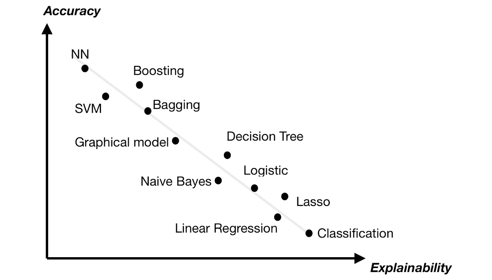

# 人工智能系统中的风险管理

> 原文：<https://pub.towardsai.net/risk-management-in-ai-based-systems-af6c5db4b034?source=collection_archive---------1----------------------->

## [人工智能](https://towardsai.net/p/category/artificial-intelligence)

## 通过降低各种风险使人工智能更安全

由[拍摄。文字学](https://unsplash.com/@philographism?utm_source=unsplash&utm_medium=referral&utm_content=creditCopyText)上 [Unsplash](https://unsplash.com/collections/8557115/ai-?utm_source=unsplash&utm_medium=referral&utm_content=creditCopyText)

无论应用哪种机器学习类型，监督学习、无监督学习还是强化学习，模型做出的决策总是存在不确定性的。不确定性的来源可以来自作为机器学习模型的输入的环境数据，或者来自模型本身，这取决于训练过程和所应用的算法。

风险是损失或受伤的可能性。风险管理意味着分析和识别潜在的风险，并减轻和管理它们以减少风险的负面影响。识别风险从风险分类开始，对应用程序环境中可能导致损失或伤害的风险类型进行分类。

在管理基于人工智能的系统的风险时，应考虑以下因素:

# 决策偏差:

人类选择的训练数据会增加基于人工智能的应用中的偏差。基于人工智能的系统可以敏感地做出可能因性别而异的决定。如果训练数据没有以相等的概率包含所有性别，则可能发生这种失败。在姓名、肤色、种族、年龄等方面也会产生偏见。

亚马逊结束了基于人工智能算法的招聘项目，该算法根据男性在简历中主要使用的词语来青睐候选人。训练数据的随机选择可以帮助避免 AI 算法的有偏见的决定。公平性评估是一种验证基于人工智能的应用程序做出的决策是否存在偏见的方法。[研究人员](https://arxiv.org/pdf/1703.00056.pdf)从技术角度定义公平，并对其进行衡量，以证明数据驱动的决策是否没有偏见。

# 可解释性

可解释的人工智能(XAI)是一个解释机器学习模型的新领域，以解释它们如何做出决策或产生输出。目的是深入了解机器学习模型。这个结论并不意味着像基于规则的系统一样理解整个内部逻辑。有两种方法可以增加可解释性。要么解释黑盒模型，要么创建玻璃盒模型。

为了理解模型的输出是如何从输入生成的，应该知道所有的模型参数和模型架构。玻璃箱模型是可以解释的，但不如黑箱模型准确。机器学习模型的可解释性和准确性之间存在权衡。

来源:[https://www . research gate . net/publication/332209054 _ explable _ Artificial _ Intelligence _ XAI](https://www.researchgate.net/publication/332209054_Explainable_Artificial_Intelligence_XAI)

# 模型漂移

与训练阶段相比，模型漂移导致机器学习模型在部署后的性能变化。模型性能的降低可能有许多原因，例如训练期间输入数据之间的相关性。纠正措施可以根据漂移类型、概念漂移或数据漂移而不同。

当输出变量的统计属性随时间变化时，就会发生概念漂移，其结果是预测或分类不准确。机器学习模型输入的数据中的意外变化会导致数据漂移。监控数据漂移是检测模型性能下降的最佳方法。

# 过度拟合

数据建模是开发基于人工智能的系统的非常早期的阶段。当所选数据是训练模型所需数据的一小部分时，就会发生过度拟合。过度拟合是机器学习模型中泛化错误的主要原因。正则化是减少过度拟合和泛化错误的解决方案。

作为数据一部分的噪声应该具有随机属性，以将其从数据中滤除。如果数据不足，噪声将被视为数据，导致模型性能下降。

# 隐私和对个人的依赖

基于人工智能的系统可能对涉及训练或输入数据的个人很敏感。如果机器学习模型使用相关的记录数据，有犯罪记录的人可能会受到歧视。在训练和操作阶段，数据泄露不应该发生在基于人工智能的应用程序中。个人数据的使用和生成需要个人的同意。

一般来说，系统不能做什么和必须做什么一样重要。因此，基于人工智能的系统必须接受测试，了解它们不允许做什么，不应该使用什么数据。

# 作为风险来源的开放环境

决定在系统中使用人工智能还是基于规则的系统取决于系统的复杂性。如果复杂性太高，基于规则的系统是不可能的，或者是昂贵的。更高的复杂性取决于影响系统的可能场景和环境数据的数量。先验依赖于许多参数，例如来自开放上下文并影响机器学习模型发展的环境参数。

# 网络安全

攻击者可以改变系统行为，是基于人工智能的系统的潜在风险。攻击者可以生成类似于训练数据的假数据来伪造模型输出。相比之下，像 GAN(生成对抗网络)这样的机器学习解决方案可以帮助保护系统。GAN 方法中的生成器模型生成假数据以创建稳健的鉴别器模型。

# 降低风险

缓解策略可以降低风险的可能性或风险的影响。最后，验证和确认方法证明缓解策略的质量和有效性，以支持产品发布。

验证和确认方法需要为所有的测试场景定义清晰和精确的验证标准。这些方法对于人工智能系统来说是必不可少的，因为并非所有的机器学习模型都完全解释了决策、预测或分类过程。

# 观点

随着本文对不同类型风险的更多关注，我们可以得出结论，基于人工智能的系统中的潜在风险需要广泛的技能。从事人工智能项目的公司应该紧急解决风险管理问题，并制定有效的缓解策略，以降低风险对社会的影响。拥有广泛领域知识以及机器学习算法和模型的专家。

专家应该识别潜在的风险，评估并找到缓解策略，并最终为产品的最终验收测试定义验证标准。目前，人工智能开发的重点是功能特征、能力和性能。尽管如此，我们需要向前迈出一步，建立一个专门的人工智能风险经理的公司组织。风险经理应该考虑机器学习模型整个生命周期中的所有潜在风险，从概念阶段到部署再到现场测试。

 [## 通过我的推荐链接加入媒体

### 作为一个媒体会员，你的会员费的一部分会给你阅读的作家，你可以完全接触到每一个故事…

medium.com](https://medium.com/@bhbenam/membership)