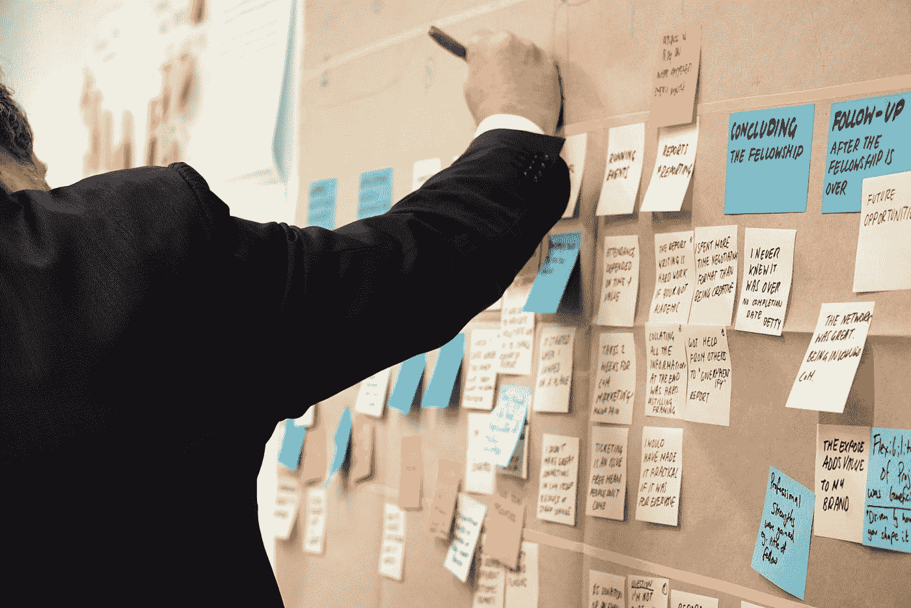
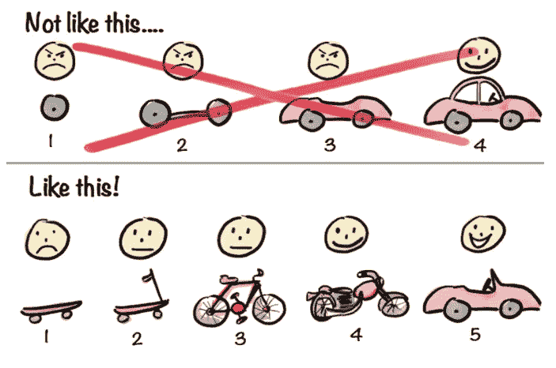

# scrum 101——增加您的价值

> 原文：<https://pub.towardsai.net/scrum-101-increase-your-value-8ab304d2a731?source=collection_archive---------1----------------------->

## 项目管理

## 一个易于实现、易于理解但难以掌握的框架

[Jo Szczepanska](https://unsplash.com/@joszczepanska?utm_source=medium&utm_medium=referral) 在 [Unsplash](https://unsplash.com/?utm_source=medium&utm_medium=referral) 上的照片

# 企业和团队需要问自己一个问题:我们是否足够敏捷？

客户、竞争对手、需求很多。每当我们落后时，我们更有可能退出比赛。质量和速度密不可分。我们需要在有限的能力(人力或设施资源)内提供这两方面的服务。那么，我们如何在毫无问题地满足需求的同时，最有效地利用我们的产能呢？当然，作为**敏捷的**。

这种转变首先从质疑和批评开始。让我们问自己这些问题:

*   我们能在**要求的时间**交货吗？
*   我们能在不失去人类注意力的情况下产生商业产出吗？
*   我们能否在业务产出中增加**创新**？
*   我们是否觉得**跟上了变化**？
*   我们**在危机情况下是否灵活**？
*   我们能总是比我们的竞争对手获得优势吗？
*   最重要的是，在做这些事情的同时，我们能有效地利用我们的**容量吗？**

如果所有问题都是肯定的，我们就可以以敏捷的方式管理我们的业务。一种**敏捷的**方法基于****倾听客户的心声、**持续交付、**团队合作、****和****创造变化。**”******

# ****那么什么是 Scrum 呢？****

****Scrum 是一个**框架**用来将敏捷方法转化为常规。它不是由严格的规则喂养的。它不希望激进的组织变革。不需要项目经理。****

****Scrum、 **Ken Schwaber、**和 **Jeff Sutherland** 的创始人描述如下:****

> ****S crum 是一个开发、交付和维护复杂产品的框架。这是一个环境，在这个环境中，人们可以处理复杂和适应性强的问题，同时开发出有生产力和创造性的最高价值产品。****

# ****Scrum 理论的主要组成部分****

****Scrum 构建在三个主要支柱上:**透明**、**观察、**和**适应**。****

******透明**是关于过程的可追溯性。团队所有成员必须会说通用语，有简单的监控标准，对****【完成】**的定义必须明确，确保工作做好。******

****实施流程的人员应遵循**观察**。他们应该监控出现的正确运动、障碍和偏差，并提高他们的预测能力。****

********

****由[Tru“Tru”kat sande](https://unsplash.com/@iamtru?utm_source=medium&utm_medium=referral)在 [Unsplash](https://unsplash.com/?utm_source=medium&utm_medium=referral) 上拍摄的照片****

******适应**是关于灵活性。跟上变化的环境是敏捷的最重要的条件。**如果出现与工作相关的偏差，以及当认为将失去控制时，应立即采取纠正和行动**。有时候这个动作要勇于重来。在这个过程中不应该有任何犹豫。****

****所有这三个步骤使得 Scrum 具有实验性。从错误中吸取教训，不要重复，**做得更好**，改正！****

# ****Scrum 团队是敏捷方法的基础****

****我们需要一个团队来实现 Scrum 框架。这个团队的名字很简单:**Scrum 团队**。Scrum 团队中有三个主要角色；**“产品负责人”、“Scrum 大师”、“开发团队”******

******产品负责人**有义务将工作产出的价值传递给高层。顾名思义，**他才是产品**的真正拥有者。他负责管理产品清单的客户或高级管理人员。****

****Scrum Master 负责确保整个团队，包括产品负责人，应用 Scrum 框架。他只是这个队的教练，仅此而已。****

******开发团队**，是真正的工人。他们是做这项工作的人。它由专业人士组成。团队应该能够**组织自己**，提供帮助，并分享他们的才能。****

********

****[优 X 创投](https://unsplash.com/@youxventures?utm_source=medium&utm_medium=referral)在 [Unsplash](https://unsplash.com/?utm_source=medium&utm_medium=referral) 上的照片****

****对于高效的 Scrum 团队来说，必须有 3 到 9 个人。在小团队中，功能会减少，在多人团队中，会出现混乱。****

# ****Scrum 仪式和事件****

******Sprint** 指的是 Scrum 团队的工作周期。虽然一般申请两周，但应该是**不到一个月**。在每次冲刺开始时，新的工作列表出现，在每次冲刺结束时，目标是结束该工作列表。sprints 中的特殊情况不会在外部工作列表或团队成员中改变。****

****Sprint Planning 是在整个 Scrum 团队的参与下决定下一次 Sprint 要做的工作的会议。确定如何开展这些工作是会议的主要成果之一。会议**不应超过 8 小时**。会议结束时，应形成主要目标。这被称为**冲刺目标**。比如“投入使用，本次冲刺结束时我们网站上可以下单的支付界面”可以定义为**一个冲刺目标**。****

******冲刺评审**是 scrum 团队和利益相关者在每个冲刺阶段结束时评审工作的会议。Scrum 团队向利益相关者展示完成的工作，并且**接收反馈**以增加产品的价值。这不是批准或尽职调查会议。会议**不应超过 4 小时。******

****sprint 回顾会是一个会议，让团队阐明他们在整个 Sprint 中经历的情况，以及头脑风暴的经历。团队自我批评，对出色完成的工作进行表扬。**改进点**确定，行动退出。这是一次很好的出院会。开放与合作非常重要。其最大持续时间**限制为 3 小时。******

********

****照片由[zdenk Macháek](https://unsplash.com/@zmachacek?utm_source=medium&utm_medium=referral)在 [Unsplash](https://unsplash.com/?utm_source=medium&utm_medium=referral) 上拍摄****

******每日 Scrum，**这个活动限定在 **15 分钟**，也许是最重要的仪式。顾名思义，团队应该每天聚在一起，计划接下来的 24 小时在**做什么。如果前一天有阻碍工作的障碍，应讨论团队中可以做些什么。**事件的时间不应改变，**且当天不应跳过。自组织团队的总部是日常 scrum 区域。******

# **从产品积压到冲刺积压的转变之旅**

**这个旅程的故事是 Scrum 的核心。一位顾客来到你的商店。客户陈述了他的主要需求，即"**从一个地方到另一个地方的交通工具。"****

**现在工作开始了！让我们首先来看看经典的产品和软件开发方法。**

**你让他开一辆车。你说你将在 6 个月内交付汽车。在这种情况下，客户将**不得不等待六个月**。当你问汽车的情况如何时，你必须说明**它还没有准备好**。在六个月内，顾客将不能得到一辆能从一个地方到另一个地方的汽车。在这个过程中，**他的需求不会得到满足**。六个月后收到车，又多了一个风险。它可能不喜欢这个产品！**

****

**Henrik Kniberg 的 MVP 产品开发插图**

**现在让我们看看敏捷方法。**

**你试图更深入地了解顾客。记住，客户向你要的是“从一个地方到另一个地方的交通工具”！也许一个**简单的滑板**就能做到这一点？让我们马上开始工作。**

**你问了他三个星期。三周过去了。你做了滑板，客户看到了产品。他不太喜欢它。没问题。**

**你又要了三周，给滑板加了方向盘。顾客没有发现产品不好。但他想要能坐在上面的东西。**又来了，没问题**。**

**你向她多要了三个星期，把滑板车变成了自行车。这一次顾客更喜欢这个产品了。他拿走了，用了一点，但又拿回来了。他说这实际上完成了他的工作，但是他的肌肉力量让他筋疲力尽。**

**你又要求三周。你给自行车加了一个引擎。顾客再次购买并使用产品。它完成了它的任务。他旅行了数英里。但是，他的预算多一点，想要更豪华的产品。但他喜欢这辆车是敞开的。**还是那句话，没问题。****

**现在，我们正在打造一款敞篷车，让顾客在最后阶段能获得更多舒适。他看到了产品，收到了产品，**非常喜欢**。**

*****那么这两种方法之间有什么变化呢？*****

*   **在敏捷方法中，**他在六个月前**开始利用产品，使用它，尝试它，并传达他的反馈。**
*   **在敏捷方法中，我们在**的每一次迭代**中开发产品，并根据确切的需求进行设计。尽管他不需要，但我们并没有直接交付一辆有盖汽车。在这里，我们发现客户实际上需要一辆敞篷车，并增加了产品的价值。**
*   **在敏捷方法中，中间的循环阶段可以完成客户的工作，是可以接受的。在这种情况下，我们将会白白制造有盖汽车，并且**错过了客户**的主要需求。**

**在这里，我们已经将“从一个地方到另一个地方的交通工具”的工作进行了拆分，这是我们的**产品积压**，我们将每个产品分成可用和有用的部分，以及踏板车、自行车、引擎等。我们创建了我们的 **sprint backlog** 。**

**这些是敏捷的一般原则。事实上，**并没有更复杂——没有**需要害怕。你可以在一个小团队、一个董事会、一些清晰和合作中体验 Scrum。**

**在我接下来的文章中，我会给出更多关于 Scrum 中可以使用的工具的信息，培训、认证和性能评估所需的方法。感谢您的阅读。**

**我的 Linkedin 个人资料；**

** [## ONUR OKYOL-Bahcesehir 大学-土耳其| LinkedIn

### 我在商业智能、数据科学和分析领域有超过 7 年的工作经验。我是做生意的…

www.linkedin.com](https://www.linkedin.com/in/onur-okyol-ba253b72/)**