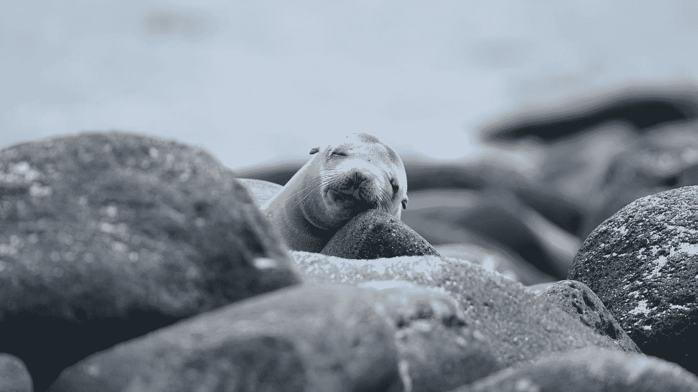
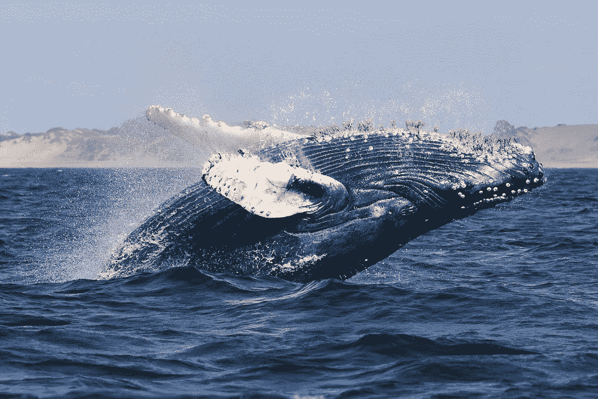

# 与波德曼达成集装箱化的 ML 交易

> 原文：<https://pub.towardsai.net/seal-the-containerized-ml-deal-with-podman-1741c5d1b870?source=collection_archive---------3----------------------->

## 带有新“Pods”的电影推荐服务演练

作者:[芝-王昊](https://www.linkedin.com/in/oscarwang114/)(Chih haow)(yung Linc)

# 概观

> pod man——下一代 Linux 容器工具

自 2013 年以来，“容器”的引入为应用程序开发领域带来了新的曙光。十多年来，公司已经接受了容器化的架构，这允许他们将软件打包到标准化的单元(容器)中。软件容器的一些优点是增加的可移植性、执行的低开销、更大的灵活性和更高的部署效率。

虽然 [docker](https://www.docker.com/) (2013 年)和 [Kubernetes](https://kubernetes.io/) (2014 年)一直是该领域的先驱和领先工具，但在 2019 年， [Podman](https://podman.io/) 的诞生将我们带到了集装箱技术的另一个进步。虽然机器学习(ML)模型部署有多种方式，但容器化的 ML 为我们提供了另一种将模型部署到智能应用程序中的方式。**在这篇文章中，我们将介绍你需要了解的关于 Podman 的知识，并通过一个简单的演示来实现一个电影推荐器。** **我们开始吧！**

# 波德曼是什么？

> 一群海豹被称为一个荚



照片由 [Mac Gaither](https://unsplash.com/@macgaither?utm_source=medium&utm_medium=referral) 在 [Unsplash](https://unsplash.com?utm_source=medium&utm_medium=referral) 上拍摄

如[波德曼官网](https://docs.podman.io/en/latest/index.html)所述:

> Podman 是一个无后台容器引擎，用于在您的 Linux 系统上开发、管理和运行开放容器倡议(OCI)容器和容器映像。

Podman 是短期 Pod 管理工具。它是一个容器引擎，可以处理容器和容器。更具体地说，容器引擎充当媒介，允许用户在容器上创建、构建、运行和维护应用程序。软件容器是将应用程序和代码捆绑在一个地方的软件单元，而 pod 是部署在同一主机上的一组容器。(类似一窝海豹的概念！)Podman 试图通过使软件应用程序可移植、快速和安全来解决软件应用程序部署的问题。**简而言之，Podman 是一个开源工具，旨在使使用开放容器倡议(OCI)构建应用程序更加容易。**

# 搬运工 vs 码头工



照片由[迈克·多尔蒂](https://unsplash.com/@mikedoherty)和[艾米·阿什](https://unsplash.com/@amyannaasher?utm_source=medium&utm_medium=referral)在 [Unsplash](https://unsplash.com?utm_source=medium&utm_medium=referral) 拍摄

虽然 docker 和 Podman 都是容器引擎，并且在许多方面都很相似。波德曼的一些进步包括:

*   **兼容性**:由于 Podman 利用 OCI 在操作系统上运行并维护容器，这使得它与 docker 等大多数容器引擎兼容。用户只需使用别名 docker=podman 转换 Docker 命令行界面(CLI ),使其与 podman 一起工作。(*见* [*链接*](https://developers.redhat.com/blog/2020/11/19/transitioning-from-docker-to-podman) 如何从码头工过渡到搬运工)
*   **无根**:对于 Podman 来说，用户可以选择通过 root 或者非特权用户运行。如果你想知道无根是什么意思，无根容器是用户没有管理权限的容器。此外，Podman 的 fork-exec 架构增加了一个额外的安全层，以确保主机上的安全性。额外的一层不仅使容器更加安全，而且还允许多个用户在同一台机器上运行。(详见[链接](https://developers.redhat.com/blog/2020/09/25/rootless-containers-with-podman-the-basics))
*   **无守护进程**:与 docker 容器引擎不同，Podman 不需要守护进程。Podman 允许用户通过启动容器作为子进程来执行命令。对于那些对“守护进程”这个短语感到困惑的人，可以把它想象成一个在后台默默运行的中心枢纽。该中心集线器以 root 权限运行。使用 docker 时，用户每次都要访问中心 hub。在 Podman 上，这个过程被跳过，因为每个用户都在自己的容器上运行。(在[链接](https://developers.redhat.com/blog/2018/11/20/buildah-podman-containers-without-daemons)了解更多关于没有守护进程的容器的信息)


照片由[斯蒂夫·亚当斯](https://unsplash.com/@sradams57?utm_source=medium&utm_medium=referral)和[塞巴斯蒂安·拉瓦雷](https://unsplash.com/@lavalaye?utm_source=medium&utm_medium=referral)在 [Unsplash](https://unsplash.com?utm_source=medium&utm_medium=referral) 上拍摄

当前版本的波德曼仍然存在一些缺点:

*   **Linux 首选** : Podman 是一个运行 Linux 容器的工具。对于 macOS 和 Windows，需要一个 Linux 盒子。
*   **非全合一**:与 docker 相比，Podman 依赖于不同的任务使用不同的工具。例如，Podman 使用 Buildah 构建图像容器。(在[链接](https://podman.io/blogs/2018/10/31/podman-buildah-relationship.html)了解更多关于 Buildah 和 Podman 关系的信息)
*   **不支持**:docker 上有特色的一些工具在 Podman 上还没有特色。例如，当涉及到管理不同主机上的不同容器时，docker 用户可以求助于 [docker swarm](https://docs.docker.com/engine/swarm/) ，而 Podman 用户则被冷落。
*   **没有足够的讨论/文档**:由于新成员波德曼相对来说是一个新手，所以围绕波德曼的讨论和文档(包括问题、议题等)很少。)都比 docker 的少。虽然随着时间的推移，这个问题可能会得到解决，但我们确实需要解决这个冷启动问题。(我们需要在[环节](https://github.com/containers/podman/discussions)进行更多讨论！)

# 集装箱电影推荐演示


照片由[埃里克·维特索](https://unsplash.com/@ewitsoe?utm_source=medium&utm_medium=referral)在 [Unsplash](https://unsplash.com?utm_source=medium&utm_medium=referral) 上拍摄

这是一个使用 Podman 运行容器的简单演示，这些容器提供一个推荐的电影 id 列表，给定一个用户 id。电影推荐模型使用协同过滤。由于模型训练部分不是重点，我们将把更多的重点放在部署容器上。为了提高性能，我们预先计算了所有用户的前 10 个推荐电影 id 的预测，并将结果缓存在容器中。我们还进行了简单的负载测试来比较性能。

1.  **运行单个容器**
2.  **用负载均衡器运行两个容器**

## 装置


[斯蒂夫·约翰森](https://unsplash.com/@steve_j?utm_source=medium&utm_medium=referral)在 [Unsplash](https://unsplash.com?utm_source=medium&utm_medium=referral) 上的照片

> 请注意，这个演示是在 AWS 小型 ubuntu 服务器上运行的，您可以随意在其他云服务器上运行您的实现。

在 Ubuntu 20.04 上安装 Podman:

```
sudo apt-get update -ysudo apt-get install curl wget gnupg2 -ysudo source /etc/os-release
sudo sh -c "echo 'deb [http://download.opensuse.org/repositories/devel:/kubic:/libcontainers:/stable/xUbuntu_${VERSION_ID}/](http://download.opensuse.org/repositories/devel:/kubic:/libcontainers:/stable/xUbuntu_${VERSION_ID}/) /' > /etc/apt/sources.list.d/devel:kubic:libcontainers:stable.list"wget -nv [https://download.opensuse.org/repositories/devel:kubic:libcontainers:stable/xUbuntu_${VERSION_ID}/Release.key](https://download.opensuse.org/repositories/devel:kubic:libcontainers:stable/xUbuntu_${VERSION_ID}/Release.key) -O- | sudo apt-key add -sudo apt-get update -qq -y
sudo apt-get -qq --yes install podman
```

安装开发依赖项:

```
pip install -r requirements.dev.txt
```

## 训练协同过滤模型


由 [Kelly Sikkema](https://unsplash.com/@kellysikkema?utm_source=medium&utm_medium=referral) 在 [Unsplash](https://unsplash.com?utm_source=medium&utm_medium=referral) 上拍摄的照片

运行`train_model.ipynb`来训练模型，并获得所有 610 个用户的前 10 个电影 id 的预测，保存在`top_n_movie_ids.pkl`中。

> 你可以在我们的 [Github](https://github.com/OscarWang114/podman-movie-demo) 上找到`train_model.ipynb`的文件。

# 用集装箱装

## 1.单个容器


[刘嘉玲](https://unsplash.com/@pic_parlance?utm_source=medium&utm_medium=referral)在 [Unsplash](https://unsplash.com?utm_source=medium&utm_medium=referral) 上的照片

构建一个映像并在后台运行一个名为`deployment`的容器:

```
podman build -t deployment .
podman run -d --name deployment -p 5000:5000 deployment
```

测试 API:

```
curl localhost:5000/recommend/10
# should return 1204,898,1237,1262,1272,1196,50,112552,318,904
```

使用 Apache Bench 执行简单的负载测试(200 个并发请求，总共 10000 个请求)

```
# if not installed, run `sudo apt install apache2-utils`
ab -n 10000 -c 200 [http://localhost:5000/recommend/10](http://localhost:5000/recommend/10)
```

来自 Apache Bench 的百分比结果:

> 请注意，服务器代码中特意添加了 100 毫秒的睡眠时间来模拟延迟

```
Percentage of the requests served within a certain time (ms)
  50%    309
  66%    317
  75%    323
  80%    327
  90%    350
  95%    381
  98%   1325
  99%   1349
 100%   3360 (longest request)
```

停下集装箱

```
podman stop deployment
```

## 2.带有负载平衡器的两个容器


照片由[刘嘉玲](https://unsplash.com/@pic_parlance?utm_source=medium&utm_medium=referral)在 [Unsplash](https://unsplash.com?utm_source=medium&utm_medium=referral) 上拍摄

创建一个名为`deployment_net`的波德曼网络

```
podman network create deployment_net
```

构建一个映像，并在后台运行两个名为`deployment1`和`deployment2`的容器。指定`--network deployment_net`以便容器驻留在相同的网络空间中:

```
podman build -t deployment .
podman run -d --name deployment1 --network deployment_net deployment
podman run -d --name deployment2 --network deployment_net deployment
```

构建并运行 NGINX 容器，作为前台的负载平衡器:

```
podman run -v `pwd`/nginx.conf:/etc/nginx/nginx.conf:Z -p 5000:5000 \
--name nginx --network deployment_net docker.io/library/nginx# If success, you should see "/docker-entrypoint.sh: Configuration complete; ready for start up"
```

在另一个 shell 会话中测试 API:

```
curl localhost:5000/recommend/10
# should return 1204,898,1237,1262,1272,1196,50,112552,318,904
```

用 Apache Bench 执行一个简单的负载测试(200 个并发请求，总共 10000 个请求)

```
# if not installed, run `sudo apt install apache2-utils`
ab -n 10000 -c 200 [http://localhost:5000/recommend/10](http://localhost:5000/recommend/10)
```

来自 Apache Bench 的百分比结果:

> 请注意，服务器代码中特意添加了 100 毫秒的睡眠时间来模拟延迟

```
Percentage of the requests served within a certain time (ms)
  50%    218
  66%    232
  75%    240
  80%    245
  90%    257
  95%    269
  98%    287
  99%    305
 100%    360 (longest request)
```

停下集装箱

1.  在 NGINX 容器的 shell 会话中按 Ctrl + C
2.  拦住另外两个集装箱

```
podman stop deployment1
podman stop deployment2
```

## 解决纷争

问题:`Error: error creating container storage: the container name "<name>" is already in use by "<id>". You have to remove that container to be able to reuse that name.: that name is already in use`。

解决方案:`podman rm --storage <id>`

# 收场白


Erik Mclean 在 [Unsplash](https://unsplash.com?utm_source=medium&utm_medium=referral) 上拍摄的照片

非常感谢您阅读我们的文章！从我们的演示中可以得出一个简短的结论:带有负载均衡器的两个容器的响应时间比一个容器要好。当我们有一个容器时，当 98%的请求在特定时间(1325 ms)内得到满足时，它就会遇到瓶颈。另一方面，具有负载平衡器的两个容器在 287 毫秒内工作良好。因此，在生产 ML 系统设置中，容器可用于提供更好的电影推荐流服务。

你可以在我们的 [Github](https://github.com/OscarWang114/podman-movie-demo) 上找到完整的代码。

# 参考

[1][https://podman.io/](https://podman.io/)

[2]梅塞格尔，b .，松冈，j .，波科尔尼·玛雅·科斯坦蒂尼，f .，波科尔尼，f .，科斯坦蒂尼，m .，辛格，K. (2021 年 5 月 13 日)。*构建容器化应用*。红帽开发者。于 2022 年 3 月 16 日从 https://developers.redhat.com/topics/containers 检索

[3] Jethva，H. (2021 年 11 月 25 日)。*如何在 ubuntu 20.04 上安装使用 Podman*。Atlantic.Net。2022 年 3 月 16 日检索，来自[https://www . Atlantic . net/dedicated-server-hosting/how-to-install-and-use-podman-on-Ubuntu-20-04/](https://www.atlantic.net/dedicated-server-hosting/how-to-install-and-use-podman-on-ubuntu-20-04/)

[4]斯托杜尔卡，J. (2021，10 月 20 日)。*协同过滤:矩阵分解推荐系统*。吉里·斯托杜尔卡。于 2022 年 3 月 16 日从[https://www.jiristodulka.com/post/recsys_cf/](https://www.jiristodulka.com/post/recsys_cf/)检索

[5]麦丘内，M. (2020 年，12 月 27 日)。*跟 Nginx 和 Podman* 乱搞。埃尔米科的笔记。检索于 2022 年 3 月 16 日，来自[https://notes . El miko . dev/2020/12/27/messing-around-with-nginx-pod man . html](https://notes.elmiko.dev/2020/12/27/messing-around-with-nginx-podman.html)