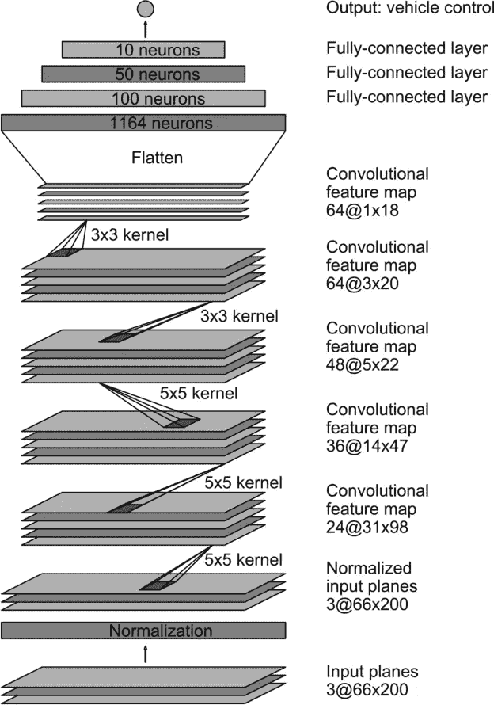
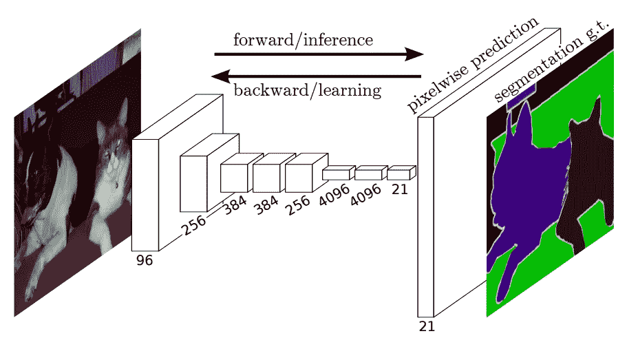
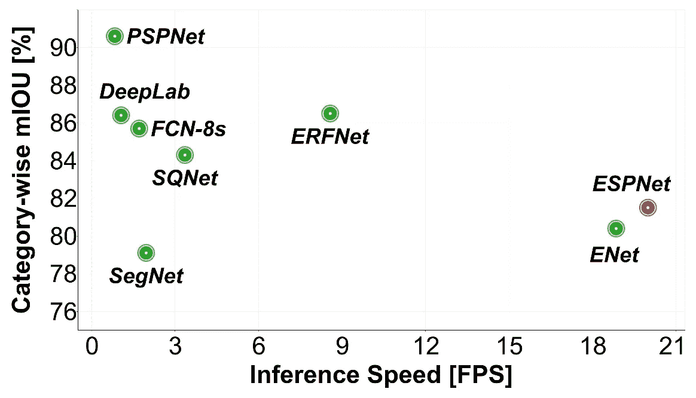
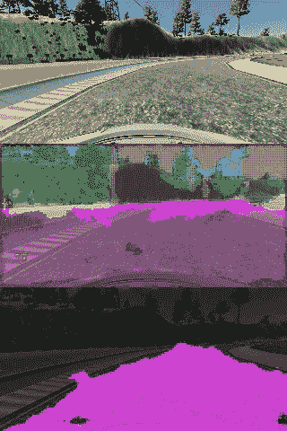
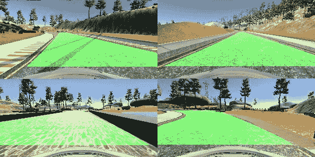
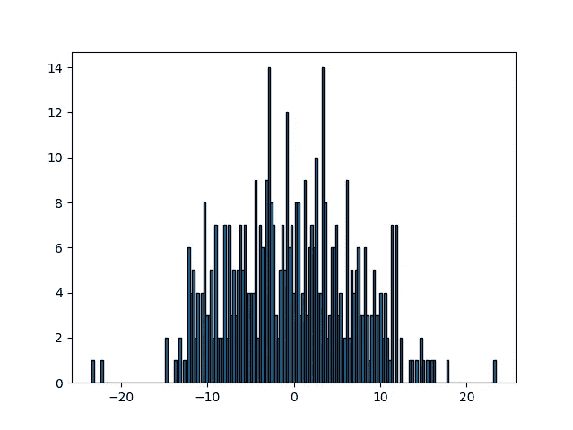
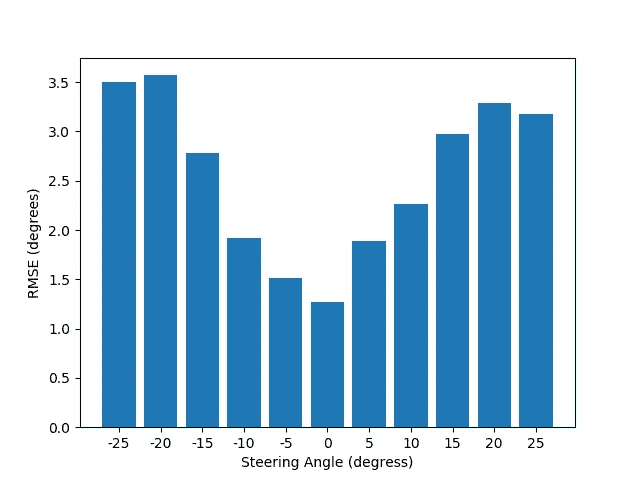
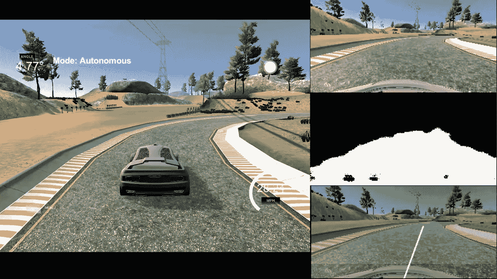

# 面向自动驾驶仿真的语义分割和深度学习

> 原文：<https://pub.towardsai.net/semantic-segmentation-deep-learning-for-autonomous-driving-simulation-part-1-271cd611eed3?source=collection_archive---------0----------------------->

## [深度学习](https://towardsai.net/p/category/machine-learning/deep-learning)、[自动驾驶汽车](https://towardsai.net/p/category/self-driving-cars)

# 总结(TL；博士)

我在 TensorFlow 中建立了一个语义分割模型，来预测转向角度，以实时驾驶虚拟汽车在赛道上行驶。这是一个初步的原型，用来探索和理解这种方法的优点，并最终在现实世界中进行测试。注意:这不是一个代码教程，我还没有决定在这个时候分享代码。这都是正在进行的工作！

左:模拟器视图，右上:摄像机视图，中右:道路像素预测，右下:去噪声的道路轮廓，白线代表推断的转向方向。

# 动机

2017 年从为期 9 个月的 Udacity 自动驾驶汽车纳米学位项目毕业后，我需要挠痒痒，进一步探索我在这个项目中学到的一些概念，看看它们如何适应现实世界的工作。我还认为，回顾我们在项目期间从事的 10 多个项目，并将一些分散的项目合成为一个更大、更有凝聚力的项目，以展示我所学到的东西，这将是一个好主意。

我最初的行为克隆神经网络模型在模拟器中工作

我记得我是如何在[行为克隆项目](https://github.com/J-Rojas/CarND-Behavioral-Cloning-P3)上工作的，这是我对深度学习的最初探索之一，我对如何训练神经网络来驾驶虚拟汽车在赛道上行驶非常着迷。我能够用数以千计的样本图像和从我自己驾驶的一些测试中收集的转向数据来训练一个模型。该项目的前提是，通过提供来自人自身驾驶活动的图像和转向数据，可以训练神经网络模仿人类驾驶员的转向行为，同时成功地在赛道上驾驶模拟车辆。此外，通过对这种训练数据进行足够的概括，可以训练虚拟汽车不仅绕过主要赛道，而且沿着几条赛道行驶，所有这些都使用相同的神经网络“模型”

# **背景成卷积神经网络**

ConvNets 是解释图像内容的强大工具。它们可以用于分类，即告诉我这是否是机器人的图像，子区域分类，即告诉我机器人在图像的哪个矩形区域，或者语义分割，即告诉我图像中的哪些像素代表机器人。对于卷积神经网络及其工作原理的概述，请看这篇优秀的文章。

> [https://br hrer . github . io/how _ convolatile _ neural _ networks _ work . html](https://brohrer.github.io/how_convolutional_neural_networks_work.html)

对于典型的分类问题，公式是将作为输入像素的 N 维向量的图像映射到作为分类概率向量的标签，每个概率表示该图像属于该类别类型的可能性。为了用机器人对图像进行分类，理想的结果是标签向量为[1.0，0.0]，假设第一类是“机器人”，第二类是“非机器人”

为了实现这种作为通用分类函数的公式，ConvNet 由卷积层和汇集层的重复序列组成，后面是密集层。随着网络的训练，输入图像被送入卷积层，卷积层用于查找局部子结构，然后进入汇集层，汇集层对图像进行二次采样，降低图像的分辨率，并在图像进入后续卷积层时进一步概化图像。重复该过程，直到达到完全连接(密集)的层，这是所有输入到确定数量的输出的大的线性组合。

典型 ConvNet 架构

对于最终的密集图层，输出是一组称为“logits”的值，表示每个识别类的未缩放分数。然后将这些输入到 softmax 激活层，并使用非线性函数将类似然性表示为一组归一化的概率。对于具有已知分类的给定图像，训练步骤对该图像应用独热标签向量，计算输出值和标签值之间的误差，然后将该误差作为损失函数反向传播，以在多次迭代中最小化。最终，每层的网络权重被调整为通过这种分层结构来“感知”类的各种特征。

NVIDIA 端到端架构

在行为克隆任务的最初范围内，我应用了 [NVidia 端到端 ConvNet 架构](https://devblogs.nvidia.com/deep-learning-self-driving-cars/)来解决从多个摄像头传感器图像确定转向角度的推断问题。这种方法是对 ConvNet 的一种有趣的使用，它解决了一个回归问题，而不是分类问题。该架构基本上与应用于分类问题的架构相同，其中没有 Softmax 激活层，并且只有一个输出值而不是 N 个类别概率的向量。在这种情况下，标签现在是一个转向角，而不是一个热点类向量。训练本质上与分类模型相同，卷积层级执行与子结构相同的解释，然而不同之处在于图像内的那些子结构中的模式的识别和去向将对作为最终转向角输出的非线性函数贡献输入。

# 缺点

在完成该项目并对模型进行了足够好的概括，使其能够在两条轨道上行驶，而不会脱离道路，降落在池塘中，或撞上悬崖表面后，我对创建这个卷积神经网络(即 ConvNet)模型感到满意，但仍对如何改进感到好奇。训练这种类型的架构有一些问题。

首先，它需要高度整理的数据才能正常工作，而这些数据很难收集。我的意思是，需要仔细收集和过滤训练数据，以便在所有可能的转向角度下，转向数据都是合适的。训练数据收集涉及人类在各种转弯场景中驾驶模拟车辆在轨道周围行驶，以收集足够多的转向角度来减少神经网络的过拟合。

虽然收集正确标记的各种数据是任何监督形式的机器学习所期望的，但行为克隆领域的主要挑战是教会网络如何“自我纠正”，因为它在某些可能的时刻不可避免地会偏离航向。这包括人类训练员收集如何在各种情况下将汽车开回道路中心的训练例子。当教人类驾驶汽车时，不需要如此明确，这不是直观的，因为训练者将不得不猜测这些校正示例应该如何变化以及收集多少来改进训练。为了使数据收集问题变得更加复杂，在收集校正示例时，训练者无疑将不得不驾驶汽车远离道路中心以设置校正场景。这些例子绝对必须从训练集中过滤掉，因为它们会与保持汽车在道路上行驶的目标相冲突。因此，这种方法需要对数据进行一些严格而复杂的过滤，以在建模的正确行为中实现高精度。

其次，这种方法适应性不强，容易出现人工训练错误。训练数据首先局限于人类驾驶汽车的程度，因此如果人类未能很好地处理不常见的情况，如急转弯，那么代理模型将开始学习这些糟糕的特性。更广泛地说，这个模型的训练方式使得系统的微调变得困难。例如，如果能够调整模型，使其在转弯时更积极或更不积极地转向，或者迫使汽车尽可能靠近车道中心，这将是非常有利的。然而，除非您从描述这些目标行为的一组不同的一致特征数据集中收集数据，否则在行为克隆方法中，这些都不是可调整的超参数。

第三，由于神经网络的隐藏层像一个看似不透明的“黑盒”一样工作，很难调试故障。例如，如果在赛道上转向时，汽车突然没有明显的原因就偏离了路线，很可能很难确定根本原因。对于行为克隆，神经网络“感知”什么以及它如何准确地解释这些图像的特征以生成车辆的转向角度，完全缺乏定义。本质上，网络由线性和非线性变换网格中的数千到数百万个参数组成的方程组成。诊断特定故障发生的原因包括以某种方式检查网络的隐藏层。

虽然有可视化隐藏层的技术，如[激活最大化，](https://raghakot.github.io/keras-vis/vis.visualization/#visualize_activation)它们更适合诊断分类问题，但对回归问题帮助不大。转向角由图像中跨像素的特征映射的非线性激活响应以及最终这些响应的加权和来确定，因此很难确定是什么导致了错误的结果。在这种情况下，通常的解决方案是分析输入数据中可能尚未识别的特征，并扩充数据集，然后重新训练以进一步推广模型。然而，这个网络的不透明和解释失败结果的困难是一个主要的缺点。

如果你很好奇，可以在下面的视频中找到一个很好的资源来解释为什么神经网络是“黑匣子”。

神经网络作为模拟具有局部极小值的“凹凸”多维表面的函数

# 走向语义分割

最初的行为克隆项目中使用的 ConvNet 旨在从相机像素直接生成转向角度。然而，在探索了其他网络架构之后，使用语义分段网络(简称 FCN)以不同的方式解决这个问题的潜力变得很有吸引力。

FCN 是对原始图像中的每个像素进行分类的网络。通过提供输入图像和标签图像来训练网络。标签图像具有与输入图像相同的大小尺寸，每个像素标识代表输入图像中相应像素的对象类别。在训练网络之后，网络的输出表示每个像素成为给定对象类的一部分的概率。例如，如果训练 FCN 来确定给定的一组 N 个输入像素的非道路和道路像素，则 FCN 输出将是 2*N 维向量，其中每个像素的概率表示道路或非道路表面的一部分。这可以扩展到许多类别，因此可以通过一次 FCN 来识别图像中的各种对象。

此外，fcn 由两个主要阶段组成，一个是编码阶段，代表典型的 ConvNet；另一个是解码阶段，代表 con vnet 的逆运算。通常这是通过组合 [1x1 卷积](https://www.coursera.org/learn/convolutional-neural-networks/lecture/ZTb8x/networks-in-networks-and-1x1-convolutions)和[转置卷积](https://towardsdatascience.com/types-of-convolutions-in-deep-learning-717013397f4d)来实现的，它们将 ConvNet 输出多路复用和上采样到输入图像的原始大小。由于这种下采样后跟随上采样的结构，它们被称为 [*全卷积网络*](https://people.eecs.berkeley.edu/~jonlong/long_shelhamer_fcn.pdf) *(简称*FCNs*)。*

全卷积网络架构

在利用摄像头传感器数据驾驶汽车的领域，FCNs 可以提供比原始 ConvNet 更大的优势。FCN 在故障期间将更容易调试，因为网络的输出可用于确定被分类为道路像素的一组像素，并因此可用于直接理解网络是否在给定的输入图像内正确感知道路。给定分类的道路像素，FCN 的输出还提供了道路形状的轮廓，这可用于确定性地计算转向方向，而不是通过原始解决方案中密集的神经网络层进行推断。这提供了算法解决方案或其他参数来控制汽车应该如何行驶，即靠近转弯边缘或靠近车道中心，而这在原始解决方案中是不可能的，因为没有直接可用的数据来确定道路形状，从而影响转向角。

使用 FCN 有一些缺点。它们更复杂，具有比 ConvNet 分类器/回归多得多的网络参数，因此需要更多的时间进行训练和推断。它们还需要更多的训练开销，因为 fcn 使用更复杂的标记数据，包括每个像素的分类，而不是传统分类情况下每个图像的单个值。标记分割的图像可能是劳动密集型活动，因为精确的标记可能需要由人执行的手动过程。

然而，伴随着所有新的复杂性而来的还有一个额外的优势 FCNs 可以用于在一个推理步骤中识别场景中的许多不同对象。通过向图像标签添加更多的类，网络可以对场景中更具体的对象实例进行分类，而几乎不需要额外的推理时间(尽管需要更多的内存)。对于自动驾驶，不仅可以对道路像素进行分类，还可以识别其他车辆、街道标志、行人和其他感兴趣的对象。

# 利用语义分割构建新的解决方案

鉴于使用 FCN 的优势，我很快就想建立一个新的原型来测试网络与原始解决方案相比的工作情况。我设想最终的解决方案可能以两种方式工作:

1.  FCN 将被提供相机图像并对道路像素进行分类。道路像素的轮廓将用于确定道路的几何形状。从那里，汽车的转向角可以用一些几何方程来确定。
2.  通过在 FCN 输出之后向网络添加额外的密集层，可以完全学习和预测转向角，而不是直接计算形状。

与原始解决方案相比，这些拟议解决方案的主要区别在于引入了 FCN 来确定道路的形状，从而消除了分析和培训过程中面临的大部分挑战。使用来自 FCN 输出的预测道路像素，了解网络的运行情况将变得容易得多。如果推断的转向角不正确，那么检查 FCN 输出将提供关于为什么的直接见解。此外，通过直接使用道路曲率而不是使用由不精确的人工转向收集的训练数据来计算转向角度，也可以消除训练数据收集问题，并且也可以开发参数解决方案。

对于第一遍，我决定研究(2 ),因为这在精神上等同于原始解决方案，转向角是网络的学习、推断输出。

# 建设和训练 FCN

首先，我通过阅读论文和浏览各种 GitHub 库做一些初步的研究，开始寻找一个合适的 FCN 架构。在从头开始建立和训练了一些网络之后，我知道这种方法会很耗时。构建原型的一种耗时较少的方法是使用迁移学习，即使用预先训练的网络，并用新的数据样本对其进行微调，而不是构建和训练一个网络。我研究期间的另一个目标是找到一种能够使用低端 GPU 实时运行的 FCN 架构。这不仅对于在模拟器中驾驶汽车是必不可少的，最终，我渴望在汽车中运行该架构，使实时性能至关重要。

在对各种论文进行了一些研究之后，我发现了 [ENet 架构](https://arxiv.org/pdf/1606.02147.pdf)，这是我能从原作者和其他几个人的 GitHub 仓库中找到的最快的 FCN 之一。该网络在 CityScapes 上进行预训练，这是一个由 5000 个语义分段的 dash cam 图像和城市驾驶标签组成的数据集。该网络在 NVIDIA TX1 平台上提供 15+ FPS，在城市景观上具有良好的准确性(8100 万)。这个网络本质上检查所有的需求框，并且在第一遍实现中非常有用。

各种语义分割网络的评估，准确率 vs 每秒帧数。

在一些相机模拟器图像上进行评估后，虽然不可怕，但网络的精确度不够高，无法在不进行微调的情况下使用。最重要的对象类别“道路”在一定程度上是正常的，但许多检测的错误程度足以影响道路形状的确定。目标是生成语义标注的输出，该输出通常遵循道路轮廓。这种准确性失败背后的原因是由于两个因素。ENet 是根据来自 CityScapes 数据集的真实 dash 相机图像进行预训练的，而不是来自虚拟赛道的模拟图像。因此，它被训练来检测的特征不包括模拟图像中的一些特征，如红白条纹路肩标记和鹅卵石桥。此外，CityScapes 图像分辨率(1024x512)也远高于模拟器摄像机输入(320x160)，这将导致特征检测的巨大差异，因为 ConvNet 图层[不是比例不变的](https://www.youtube.com/watch?v=teKLlqKlnS8)。

在平庸的初步评估结果之后，下一步是对网络进行微调。微调包括使用模拟器图像和标签进一步训练网络，同时减少检测到的对象类别的数量。CityScapes 数据集包括 19 个对象类和 1 个“其他”类，但是对于这个原型，只有 2 个类是必需的:road 和 other。因此，微调涉及减小解码器大小，并且还为新的训练数据生成语义分段的标签。使用 TensorFlow 对网络进行了 100 个时期的微调，其中 800 幅模拟器图像作为训练集，100 幅图像作为验证集。没有利用显著的数据增强(只有图像镜像)。在 NVidia 1050ti 上，训练时间大约需要 20 分钟。

上图:原图；中间:在城市景观上训练的原始 ENet 模型；下图:微调的 ENet 模型

上面显示的是微调前后的一些定性图像结果。上面的图像是原始样本，中间的图像显示原始 CityScapes 训练的 ENet 模型的结果，下面的图像显示微调后的结果。中间的图像正确地检测到大多数道路像素，以洋红色突出显示，但是错误地将红白路肩解释为道路的一部分。微调后的模型产生了更准确的结果，覆盖了几乎所有可驾驶区域，同时过滤掉了路肩。原始 ENet 模型中的非洋红色标注是非道路类类型的预测。微调后的车型只关注 2 类，公路(洋红色)和非公路。

# 自动化标签生成

语义分割网络的训练过程的基本部分是为训练图像集生成标签。手动创建图像标签是一个劳动密集型过程，需要一些图像处理工具和耐心。可以通过以下方式生成标签图像:在 Photoshop 等工具中打开训练图像，在图像上创建一个透明层，然后在需要分类的各种对象周围创建一个彩色轮廓，然后将该层导出到可以执行一键编码的工具中。轮廓需要紧密地围绕这些对象的轮廓，并且需要在图像之间保持一致，以获得最佳可能的收敛和推断准确性。不得不这样做几百次是一个史诗般的苦差事，并会因重复疲劳而引起准确性错误。

幸运的是，对于这个特殊的问题范围，分类只需要检测图像中的道路像素，而不需要检测其他复杂的形状。道路的轮廓相当分明。从沿着道路表面行进的相机的角度来看，它们通常是两条会聚线之间的连续区域，这两条会聚线朝向地平线上的消失点，或者如果道路是弯曲的，则朝向图像的边缘。汽车行驶的道路通常由混凝土制成，有白色或黄色的道路标记。有了这些特征，就有可能建立一种计算机视觉方法，用自动脚本来标记图像，从而节省人力并提高一致性。

虽然这种方法并不简单，但我能够生成一种算法，根据自适应色彩空间阈值来选择像素。该算法的基本工作原理是将图像转换到几个不同的颜色空间，然后动态调整落在这些边界内的像素值的一组下限和上限阈值。在这个初始过滤之后，我应用拓扑过滤器来定位相邻的像素区域，然后在区域边界绘制回归线来确定图像中道路的“边缘”。为此，我做了一个假设，所有相关的摄像机图像将要求自我车辆在道路表面上行驶，而不是在道路边界之外。我觉得这是一个出于训练目的的安全假设，因为这个代理的目标是在已知道路上驾驶汽车，而不是在越野时。

使用计算机视觉技术精确自动标记图像的各种情况。注意地面纹理、阴影和边缘条件的变化

你现在可能想知道*如果我能够通过检测道路像素来自动生成图像标签，那么为什么要费心生成一个神经网络来推断道路像素*？有几个原因。首先，标签生成器并不总是 100%正确的——尽管自动化解决方案极大地减少了人力，但仍有许多边缘情况需要手动标记。其次，与依赖计算机视觉方法相比，神经网络在发现许多道路类型的细微特征方面将更加优化和出色。因为准确性在训练中很重要，所以标签生成器的过滤性能比要求的实时性能慢得多。第三，如果更多的类别最终被添加到标签中，则可以重新训练神经网络来检测不仅仅是道路，而需要实现计算机视觉过滤器的集合来检测多个对象类别。由于支持额外的类类型，这无疑会运行得更慢。

# 训练转向模型

随着网络的 FCN 部分工作，下一步是训练模型的扩展，用于从 FCN 的输出推断转向角。基于深度学习的原理，我在这里的目标是创建一个更深的神经网络，网络的一部分检测道路像素，另一部分接收这些输出，并将它们用作生成转向角度的输入。

这部分网络的架构非常简单；这将是一个由两个密集层组成的前馈网络，第一层使用来自 FCN 输出的 softmax 像素概率作为新输入，第二层以单个输出神经元结束，代表转向角。在这两层之间，预激活函数作为非线性引入到模型中。此外，L2 正则化被添加到层中，以防止模型权重过度过拟合。

这部分网络的训练将只涉及这两个最终层，因此 FCN 层的权重被“冻结”，即变成只读的，因此损失函数的反向传播只遍历这两个层，而不是整个模型。我将在下面的评估中详细解释这种隔离的优势。这部分网络的标签是目标转向角，因此网络将学习给定道路像素输入的最佳转向角。

为了确定转向角度标签，我选择使用简单的启发式方法，而不是提供收集的人工操作的转向角度数据样本。这个简单的试探是采用用于训练 FCN 的道路标签，确定道路区域的左边缘和右边缘，然后计算穿过相机图像中所有水平行的两条线之间的中点集合。通过对相机方向的一些假设，这将给出道路的近似中心线。这条线上离摄像机足够远的点将代表汽车应该继续在道路上行驶的点。使用这个采样点和一些简单的三角学，从驾驶员的角度来看的角度转向角可以被近似。

如果你想一想一个人会如何凭直觉驾驶一辆汽车，这大概是[一个类似的转向模型](https://pdfs.semanticscholar.org/96d6/261b9fcdee6cbea7230689f471cff90096e3.pdf)。驾驶员的眼睛会聚焦在沿着道路路径的车辆前方相对足够远的点上。转向该点将使汽车保持在车道内，有足够的时间做出反应并应用最小的误差校正。然而，如果驾驶员连续选择车辆前方不远处的点，他们将为自己提供更少的反应时间来补偿其预定轨迹中的过冲或欠冲。在这种情况下，使用足够远的点进行估计是必不可少的，以便通过计算较长距离上的转向角增量来最小化误差。对于算法中使用的试探法，我选择了一个适当的“航向”点，该点在道路区域中检测到的水平线之前固定数量的像素。对于只有一条道路边缘可见的急转弯，航向点将成为可见道路边缘与相机图像边缘相交的点。

通过一种根据道路形状计算转向角度的方法，我能够使用 TensorFlow 训练模型。在收敛到验证集转向角的最小 RMSE 之前，该模型被训练 10-15 个时期。然而，要讨论的一个重要概念是处理标签失衡。为了正确地建立模型以在任何适当的角度转向，该模型必须在有效转向角度的整个范围内公平地训练。对于该数据集，可能的转向角比其他的多得多，导致转向角分布不平衡。例如，训练赛道有几个弯道和几个直道，导致在低角度比高角度转向的情况更多。另一个问题是假设推断是一个回归，有一个连续范围的值来推断，但只有有限数量的样本来训练。

角度分布:-25 到 25 度

为了处理分布和连续范围中的不平衡，引入了两个概念。为了处理连续性问题，转向角被分组为 1 度的离散范围，这是一个足够小的值，可以最小化角度误差。为了解决分布不均衡的问题，引入了一种在训练过程中影响损耗的方法。这里的想法是在反向传播期间用一组权重来缩放误差，使得不太可能的角度范围具有较大的影响，而更可能的值具有较小的影响。为了生成权重，使用 [*中值频率平衡*](https://stats.stackexchange.com/questions/284265/understanding-median-frequency-balancing) 的概念，通过标签样本分布来衡量反向传播过程中的训练损失。为了实现，创建具有 1 度仓大小的样本分布频率的直方图，并使用该直方图使用以下等式计算每个范围集合的一组权重:

> w(x)= median_frequency(X)/frequency(X)，
> 其中 median _ frequency(X)是整个样本分布的中值频率，frequency(X)是特定样本箱 X 的频率，w(X)是样本箱 X 的权重

# 估价

为了定量地评估网络的准确性，需要有一个转向角的地面真实测试集，以根据推理产生的值来计算损失。作为公平的比较，测试集是使用与生成训练和验证数据相同的自动标记技术生成的。在自动标记失败的情况下，使用人工标记的近似代替。下图按转向角分解了精度，以说明分布不平等。测试输出的 RMSE 相当高(误差都超过 1 度；对于较高的转向角，误差超过 3 度)，而验证则低得多。我只是用有限的数据进行了训练，并在此时对一条赛道进行了评估，所以这个模型过度拟合了数据，有一些改进的空间。

模型评估:不同转向角的 RMSE

我还录制了一段模型在赛道上运行的视频，作为定性评估。视频的右侧显示了摄像机传感器视图、FCN 输出和基于网络最后一层(白线)的转向角度输出的转向方向。您会注意到语义分割输出是不精确的；道路上有许多缺口，并且经常会有朝向地平线的不正确预测的路段。然而，可以从这些噪声数据中推断出道路的大致轮廓(见绿色覆盖图)。这是网络的后半部分被调谐到从这个 FCN 输出“感知”什么的表示。由此，将产生最终转向角的估计值。

你会注意到汽车确实左右摇摆，在视频的结尾非常明显。这是由于道路像素预测和转向角估计中的误差。对于道路预测，视频的结尾显示了模型在鹅卵石桥上行驶时产生噪音预测的证据。从桥到道路沥青的过渡似乎具有预测误差，这很可能导致汽车不正确地检测道路方向。为了解决这个问题，需要更多这种转变的数据或进一步的数据扩充来改进训练数据集。至于小的振荡，根本原因是模拟器将延迟引入到大约 0.25 秒的转向角更新中，作为对转动方向盘所需时间建模的适度努力。该模型没有被训练来对此进行估计和补偿，从而导致在预测之后转向更新的延迟，并最终超出预期轨迹。PID 控制器用于减少这种影响，但是进一步的调整是必要的。

除了性能之外，这个网络在训练和我对该调什么的理解上更容易控制和适应。例如，在预测中有大量的噪声，导致预测的角度有很大的变化。通过分析 FCN 的输出，我能够检查出像素中存在相当差且不稳定的预测，其根本原因是批处理规范化中的超参数设置错误。修正 FCN 预测后，下一个挑战是调整转向角度，这样就不会有太多的振荡。调整用于转向角训练的启发式算法并重新训练网络的第二部分有助于改善结果。

总之，这种方法有几个优点。首先，语义分段训练阶段与转向角度训练之间的隔离允许更容易地调整和调试故障情况。通过独立地调整网络的各层，训练者可以更好地控制正确推理输出的建模。其次，基于启发式的转向角建模方法避免了基于人的训练输入收集中的错误，并提供了另一个超参数来调整以获得更好的控制。第三，这种网络架构在增加检测新型物体及其位置(如其他车辆)的能力方面更具前瞻性。就缺点而言，这种网络结构不如原始网络优化，需要 GPU 加速以实现实时操作。此外，需要额外的预处理来标记训练数据，而在原始解决方案中，训练数据是未经处理的。

# **接下来的步骤**

在实现了创建这个新的语义分割网络的原型的目标之后，我的下一组目标如下:

1.  调查确定道路曲率的算法方法是否比神经网络更准确。这将涉及用计算机视觉算法替换 FCN 之后的网络的第二部分，以估计一段时间内的道路曲率。这可能导致创建更多的超参数，用于驱动代理的进一步定制控制。
2.  调查数据扩充对 FCN 的影响。用几何仿射变换、裁剪、颜色和对比度失真对训练图像进行更复杂的预处理可以帮助进一步推广语义分割模型，并提供更平滑和更准确的预测。
3.  在新的数据集和轨迹上测试这种方法。我想在其他模拟赛道和真实驾驶数据集上测试转向模型。

感谢阅读！