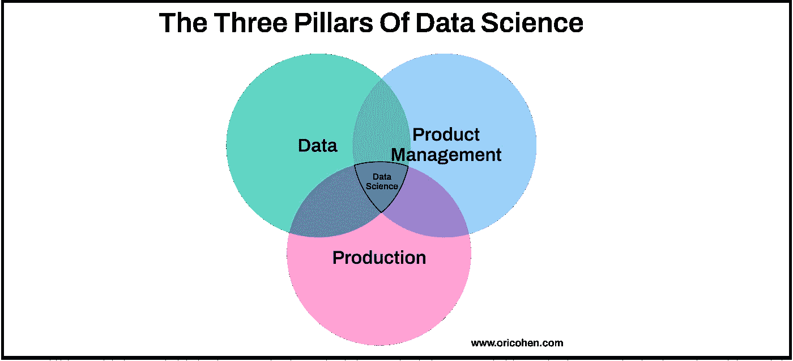

# 为成功建立数据科学团队

> 原文：<https://pub.towardsai.net/setting-up-data-science-teams-for-success-b1bee9765517?source=collection_archive---------3----------------------->

## 通过提供数据、产品和 ML 工程功能

图 1:数据科学的三大支柱，[Ori Cohen 博士](https://www.oricohen.com/)。

似乎每个公司都想拥有自己的数据科学(DS)团队，以便以传统方法无法实现的方式带来额外的价值。

在这篇短文中，我将讨论 DS 团队为了成功和繁荣所需要的三个支柱(图 1)。三大支柱是数据、产品管理和生产。如果你正在建立你的第一个 DS 团队，这些支柱和他们存在的结果将会是你经常经历的现实。

## 数据支柱

这是你需要的第一件事，甚至在招募你的第一个 DS 之前。数据科学家需要数据，这是显而易见的，因为它就在这个角色的名字里。为了让 DS 启动他们的工作，您需要以有用的格式、角色、权限和数据库访问为他们提供有价值的数据。或者，他们应该与数据工程师密切合作，最好是嵌入到团队中，以便为他们提供所需的数据。换句话说，不要让你的 ds 无所事事地等待数据。

一个典型场景的例子是，在公司雇用他们的第一个 DS 的第二天，或者在公司批准路线图的几个星期后，他们发现没有数据或者没有可用的数据。DS 必须从工程部门请求数据，这可能意味着优先化和路线图更改，这可能需要至少几个冲刺到一个季度。这也可能意味着大范围的公司变革，这可能会导致数月的数据方面的工作，而无法进行任何科学研究。

> 为了从数据科学中获得价值，您需要做的第一件事是提供数据访问。

所以在雇佣 DS 之前，确保你有他们的数据。如果你不知道你的数据是否足够，雇佣一个顾问来帮你调查。这个建议会让你在以后的工作中节省很多精力。

这个建议是双向的。在面试中，主管应该询问公司，在接受新职位之前，他们是否有可以开始工作的数据；对于他们的第一个 DS，公司必须足够成熟。

## 产品管理支柱

将机器学习业务问题产品化需要对业务问题、终端用户和算法解决方案有深刻的理解。一个 DS 团队就是一群对一个业务问题的产品化有很高亲和力，以产品为导向的人。他们有能力深入任何新领域，即吸收它并成为领域专家。

在许多情况下，在没有项目经理的情况下，数据科学家将充当产品经理(PM ),只是在一定程度上。担任项目经理角色的创始人或首席技术官也很常见。然而，他们都没有项目经理拥有的所有工具，他们也没有时间和资源来端到端地管理产品。这意味着项目可能没有经过严格的预验证过程，没有发现确切的商业价值和用例，或者没有定义良好的产品化计划。例如，在一个适当的预验证过程中，我们判断一个项目是否有真正的价值，而不仅仅是解决它的可行性；而且很常见的是看到单个 DS 解决积压的研究问题，而不是拒绝那些没有通过验证步骤的问题，也就是说，你最终在 ML 特性工厂中，没有理解项目的真正价值和影响。

> PM 将允许您的 DS 团队通过产品中的端到端集成来增加 DS 项目的价值和影响。

我怎么强调 DS 团队有多需要一个专门的项目经理都不为过。DS 职能是公司中较昂贵的职能之一，PM 将允许方法论支持业务问题优先化、KPI 定义和项目验证(想到数据驱动或市场验证)。缺乏项目前验证的情况比我们这个行业愿意承认的还要多。我们将对那些不应该放在首位的问题发起攻击并制定解决方案。这些事情的发生仅仅是因为我们没有那个充当看门人的项目经理。

## 生产支柱

“87%的 DS 项目达不到生产”我不完全确定是谁先说的，我也不一定相信现在 87%的项目达不到生产。这个数字可能要低很多。然而，如果你想让你的 DS 成功并有影响力，他们的项目必须通过任何可能的方式进入生产。

> DS 项目需要强大的数据工程和 MLOps 支持，以便完全交付和达到生产。

有各种形式的 ML 产品，并不局限于在产品内部集成一个特性，例如分析、洞察和使用模型输出作为数据。然而，将一个特性产品化可能是最常见的方面。一个组织必须有良知，并准备好提供支持功能和基础设施，以便将 DS 项目部署到生产中。在实践中，DS 团队等待后端、前端和 UI/UX 资源是非常常见的，当这种情况发生时，它会对 DS 团队产生不良影响，可能是因为他们未能将某个功能投入生产。但是，作为经理，我们有责任提供生产独立性和来自组织的适当的全周期支持。

## 摘要

希望这篇文章对你成功设置 DS 有所帮助；我强烈建议在数据科学团队中嵌入数据工程师和机器学习工程师，以便建立一个高绩效的团队，并提前规划三大支柱。遵循这些指导方针，让您的组织为 DS 职能做好准备，您成功的机会将会大大增加。

我要感谢以下为本文提供宝贵反馈的同事们，[尤瓦尔·福克斯](https://www.linkedin.com/in/yuvalfoox/)，[利奥拉·盖伊·戴维](https://www.linkedin.com/in/liora-guy-david-phd-98147129/)，[柳文欢·拉松](https://il.linkedin.com/in/oren-razon) & [阿萨夫·平哈斯](https://assaf-pinhasi.medium.com/)。

Ori Cohen 博士拥有计算机科学博士学位，主要研究机器学习。他是 [ML & DL 纲要](https://book.mlcompendium.com/)和[StateOfMLOps.com](http://www.stateofmlops.com)的作者，并且对 AIOps & MLOps 领域很感兴趣。现在，他是 Justt.ai 数据科学的高级数据总监。