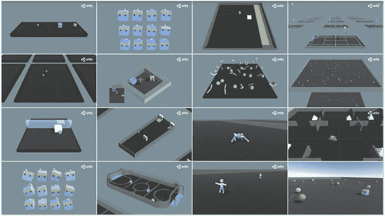
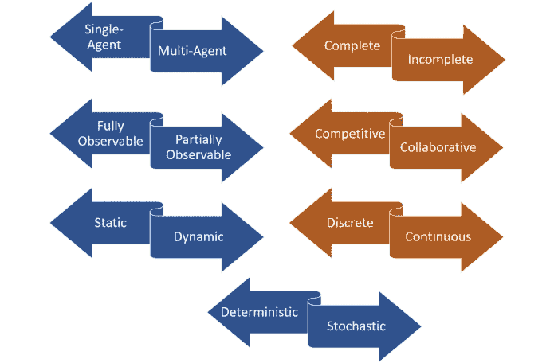

# 帮助理解机器学习环境的七个维度

> 原文：<https://pub.towardsai.net/seven-dimensions-that-help-understand-machine-learning-environments-699a81df3216?source=collection_archive---------3----------------------->

## 涉及的代理数量、观察的性质、随机性和动态性是帮助我们理解机器学习问题的一些特征。

来源:https://unity.com/products/machine-learning-agents

> 我最近创办了一份专注于人工智能的教育时事通讯，已经有超过 125，000 名订户。《序列》是一份无废话(意思是没有炒作，没有新闻等)的 ML 导向时事通讯，需要 5 分钟阅读。目标是让你与机器学习项目、研究论文和概念保持同步。请通过订阅以下内容来尝试一下:

 [## 序列

### 与机器学习、人工智能和数据发展保持同步的最佳资源…

thesequence.substack.com](https://thesequence.substack.com/) 

一开始，解决机器学习问题可能会感觉势不可挡。选择什么型号？哪种架构可能工作得最好？在一个主要由试错实验驱动的过程中，这些决策的结果极其重要。真正有助于驾驭决策宇宙的一个方面是清楚地理解问题的本质。在机器学习场景中，理解问题的一个重要部分是基于理解其环境。

每一个机器学习问题都是一个充满复杂性和独特挑战的新世界。很多时候，解决人工智能问题最具挑战性的方面不是找到解决方案，而是理解问题本身。这听起来很矛盾，即使是最有经验的人工智能专家也犯过在没有完全理解手头问题的情况下匆忙提出深度学习算法和奇异优化技术的错误。当我们考虑机器学习问题时，我们倾向于将我们的推理与两个主要方面联系起来:数据集和模型。然而，这种推理忽略了人工智能问题中最具挑战性的方面:环境。

在设计机器学习解决方案时，我们会花大量时间关注一些方面，例如学习算法的结构[例如:有监督的、无监督的、半监督的]，神经网络的架构[例如:卷积的、递归的…]，或者数据的特征[例如:有标记的、无标记的…]。然而，通常很少关注机器学习解决方案运行的环境的性质。事实证明，环境的特征是决定机器学习模型成败的首要因素。

区分机器学习环境有几个方面。数据的形状和频率、问题的性质以及在任何给定时间可用的知识量是区分一种类型的机器学习环境与另一种类型的机器学习环境的一些元素。对这些特征的深入研究将指导机器学习专家在算法选择、神经网络架构、优化技术和机器学习应用程序生命周期的许多其他相关方面的策略。理解机器学习环境是一项极其复杂的任务，但是有几个关键的方面提供了这种推理的清晰度。

# 对人工智能环境进行分类的七个关键维度

理解机器学习环境的最有效的方法之一是在一系列众所周知的维度上对其进行分类，这些维度通常只分为两三个类别。在可用于对机器学习环境进行分类的不同特征中，有七个关键的专有动态，它们提供了对 AI 代理所需的挑战和能力的快速理解。

# 1-单代理与多代理

对机器学习环境进行分类的一个最明显的维度是基于所涉及的代理的数量。今天，绝大多数机器学习模型都集中在涉及单个代理的环境中，但在多代理设置中有越来越多的扩展。在机器学习问题中引入多个代理提出了挑战，例如在单代理环境中不存在的合作或竞争动态。

# 2-完整与不完整

完整的人工智能环境是指，在任何给定的时间，代理都有足够的信息来完成问题的一个分支。国际象棋是一个完整的机器学习环境的经典例子。另一方面，扑克是一个不完整的环境，机器学习策略只能提前预测许多移动，相反，它们专注于在任何给定的时间找到一个好的“平衡”。大多数著名的纳什均衡原则在不完全的机器学习环境中特别相关。

# 3-完全可观察与部分可观察

完全可观察的机器学习环境可以访问完成目标任务所需的所有信息。图像识别在完全可观察的域中操作。部分可观察的环境，如在自动驾驶车辆场景中遇到的环境，处理部分信息，以解决机器学习问题。部分可观测的环境通常依靠统计技术来推断环境知识。

# 4-竞争与协作

竞争的机器学习环境为了优化一个特定的结果而让代理相互对抗。围棋或象棋等游戏是竞争性机器学习环境的例子。协作机器学习环境依赖于多个机器学习代理之间的合作。自动驾驶车辆或合作避免碰撞或智能家居传感器交互都是协作式机器学习环境的例子。许多多智能体环境，如视频游戏，包括合作和竞争动态，这使得它们从人工智能的角度来看特别具有挑战性。

# 5-静态与动态

静态人工智能环境依赖于不会随时间频繁变化的数据知识来源。语音分析是一个在静态机器学习环境中运行的问题。与该模型相反，动态机器学习环境，如无人机中的视觉机器学习系统，处理频繁变化的数据源。动态机器学习环境通常需要对机器学习代理进行更快、更有规律的训练。

# 6-离散与连续

离散机器学习环境是这样的环境，其中一组有限的(尽管是任意大的)可能性可以驱动任务的最终结果。国际象棋也被归类为离散的人工智能问题。连续机器学习环境依赖于未知且快速变化的数据源。多人视频游戏是连续机器学习环境的经典例子。

# 7-确定性与随机性

确定性机器学习环境是那些可以基于特定状态来确定结果的环境。就决定论而言，我们特指忽略不确定性的机器学习环境。大多数真实世界的机器学习环境都不是确定性的。相反，它们可以被归类为随机的。自动驾驶汽车是随机机器学习环境中最极端的例子之一，但在模拟环境甚至语音分析模型中可以找到更简单的设置。

理解机器学习环境是任何机器学习问题中最具挑战性的步骤之一。幸运的是，本文探讨的七个维度上的摩擦点通常会产生一个强大的人工智能环境分类，并有助于模型和架构的选择。虽然在机器学习架构和优化技术方面已经有了臭名昭著的进步，但环境分析仍然是人工智能生命周期的一个高度主观的方面。