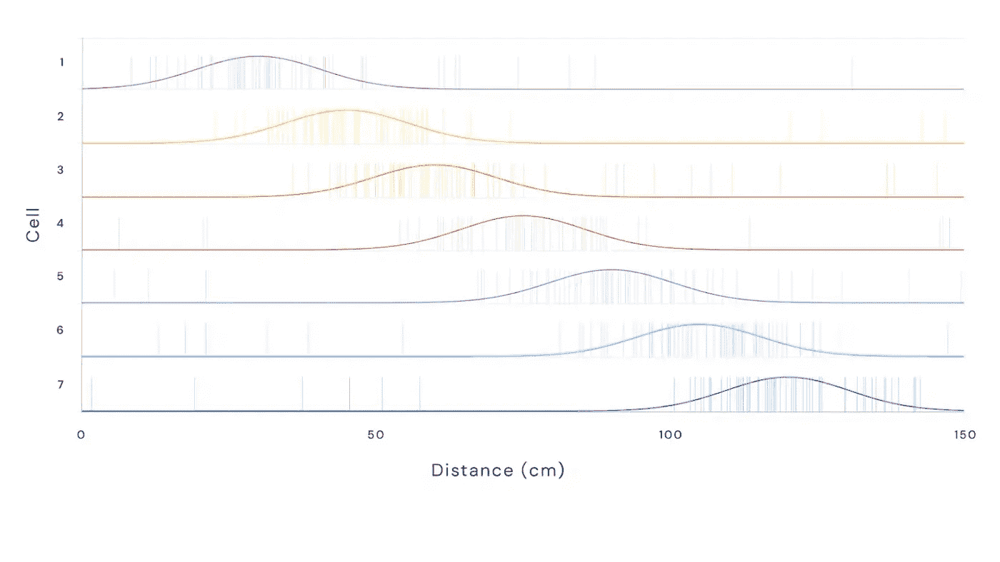
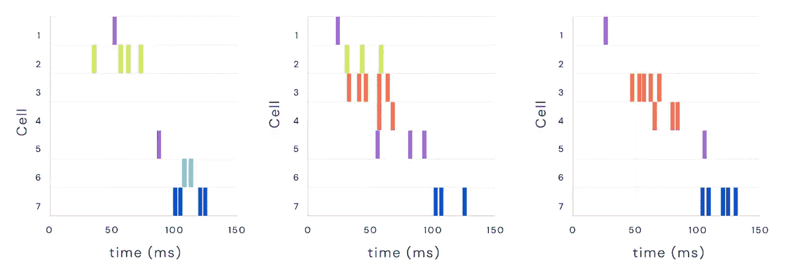
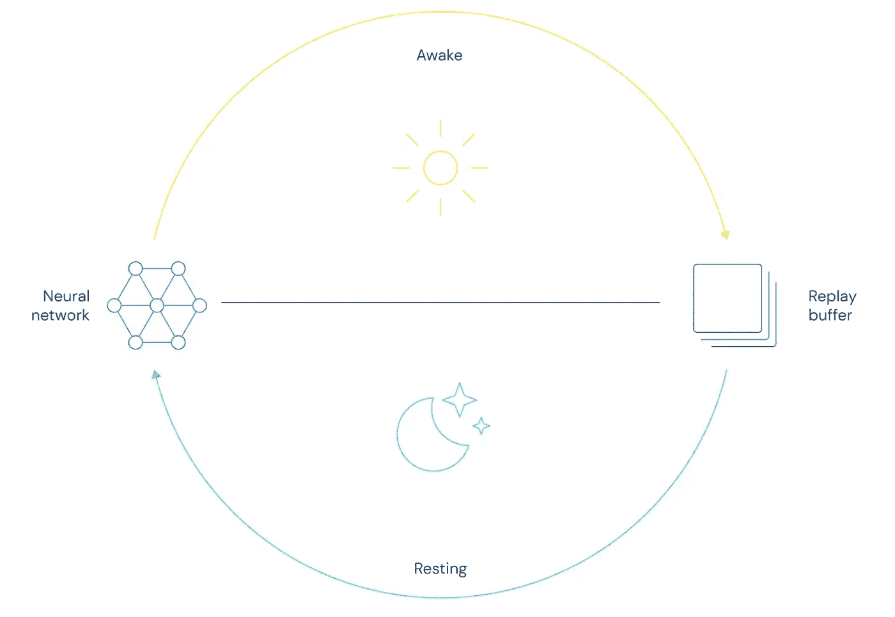
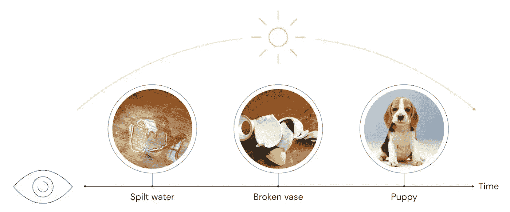
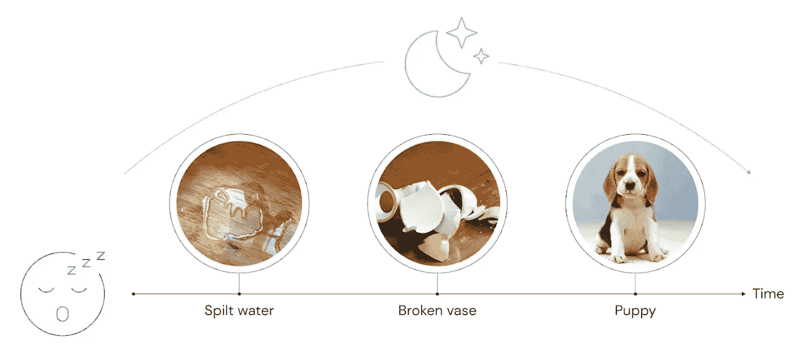
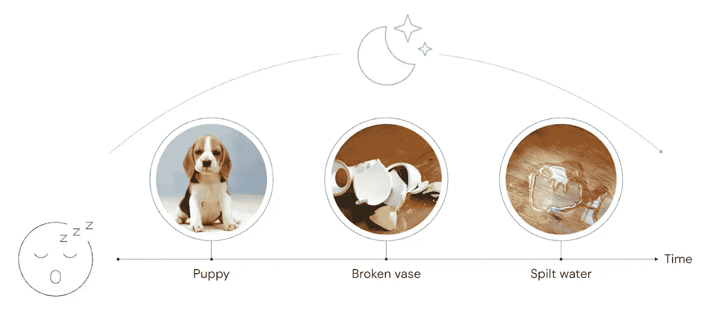
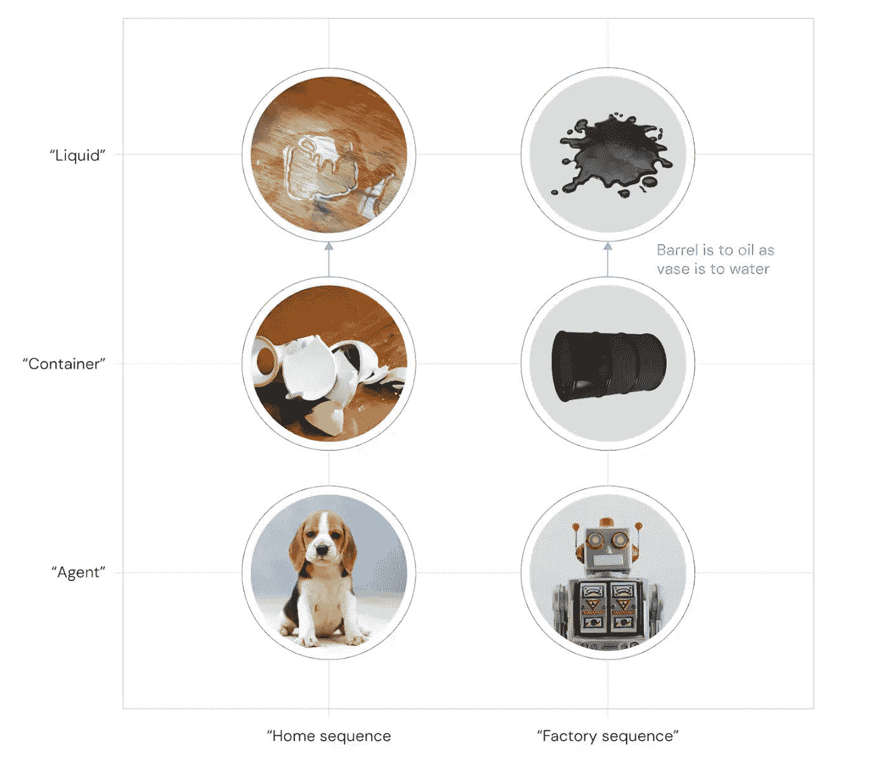

# 模拟海马体:DeepMind 如何构建能够重演过去经历的神经网络

> 原文：<https://pub.towardsai.net/simulating-the-hippocampus-how-deepmind-builds-neural-networks-that-can-replay-past-experiences-897405d913a8?source=collection_archive---------2----------------------->

## [深度学习](https://towardsai.net/p/category/machine-learning/deep-learning)

## DeepMind 的研究人员创建了一个模型，能够以模拟人类想象力的方式重演过去的经历。

来源:https://www.nature.com/articles/nature14236

> 我最近创办了一份专注于人工智能的教育时事通讯，已经有超过 70，000 名订户。《序列》是一份无废话(意思是没有炒作，没有新闻等)的 ML 导向时事通讯，需要 5 分钟阅读。目标是让你与机器学习项目、研究论文和概念保持同步。请通过订阅以下内容来尝试一下:

 [## 序列

### 该序列解释了主要的机器学习概念，让你与最相关的项目和最新的…

thesequence.substack.com](https://thesequence.substack.com/) 

运用从以往经验中提取的知识的能力是人类学习的神奇品质之一。我们的梦经常受到过去经历的影响，任何在过去遭受创伤经历的人都可以告诉你在新的情况下如何不断地看到它的闪现。人脑能够在缺乏数据的情况下，通过归纳过去的经验做出丰富的推断。这种经验的重演困扰了神经科学家几十年，因为它是我们学习过程的重要组成部分。在人工智能(AI)中，神经网络可以自发重放学习到的经验的想法似乎是一个幻想。最近，来自 DeepMind [的一组人工智能研究人员发表了一篇有趣的论文，描述了一种专注于精确完成这一任务的方法](https://www.cell.com/cell/fulltext/S0092-8674(19)30640-3?_returnURL=https%3A%2F%2Flinkinghub.elsevier.com%2Fretrieve%2Fpii%2FS0092867419306403%3Fshowall%3Dtrue)。

在神经科学中，大脑从过去的经历中进行推理的能力被称为重放。尽管经验重演背后的许多机制仍然未知，但神经科学研究已经在解释认知现象方面取得了很多进展。理解经验重演的神经科学根源对于在人工智能代理中重现其机制是至关重要的。

# 重放的神经科学理论

神经重放的起源可以归功于研究人员的工作，如诺贝尔医学奖获得者约翰·奥基夫。奥基夫博士致力于解释海马体在体验创造中的作用。海马体是大脑中的弯曲结构，是边缘系统的一部分，通常与新记忆和情绪的形成有关。因为大脑是偏侧对称的，你实际上有两个海马体。它们位于每只耳朵的正上方，距离你的头部大约一英寸半。

领先的神经科学理论表明，海马体的不同区域与不同类型的记忆有关。例如，海马体的后部参与空间记忆的处理。使用软件架构类比，海马体充当记忆的缓存系统；接收信息，登记信息，并在发送出去归档和存储在长期记忆中之前暂时存储信息。

回到 O'Keefe 博士的工作，他对神经科学研究的一个关键贡献是发现了位置细胞，这是一种基于特定环境条件(如给定位置)激活的海马细胞。奥基夫博士的一个实验中，老鼠跑了一条走廊或环形轨道的长度，因此研究人员可以很容易地确定哪个神经元编码了走廊内的每个位置。

来源:https://www.nature.com/articles/nature14236

实验结束后，科学家们在老鼠休息时记录了相同的神经元。在休息期间，这些细胞有时会以快速的序列自发放电，标示出动物先前跑过的同一条路径，但速度大大加快。他们称这些序列为经验回放。

来源:https://www.nature.com/articles/nature14236

尽管我们知道经验回放是学习过程的一个关键部分，但它的机制在人工智能系统中特别难以重现。这部分是因为体验重演依赖于其他认知机制，如刚刚开始在人工智能领域取得进展的概念抽象。然而，DeepMind 的团队认为我们已经足够开始了。

# 人工智能中的重放

从人工智能的不同领域来看，强化学习似乎特别适合整合经验重放机制。强化学习代理通过不断地与环境交互来建立知识，这允许它以比传统的监督模型更有效的方式记录和重放过去的经验。试图在强化学习代理中重现体验回放的一些早期工作可以追溯到 1992 年的一篇开创性论文，该论文对 2015 年控制雅达利游戏的 [DeepMind 的 DQN 网络的创建产生了影响](https://www.nature.com/articles/nature14236)。

从架构的角度来看，向强化学习网络中添加重放体验似乎相对简单。该领域的大多数解决方案依赖于额外的重放缓冲区，该缓冲区记录代理学习到的经验，并在特定时间回放这些经验。一些架构选择随机重放体验，而其他架构使用特定的首选顺序来优化代理的学习体验。

来源:https://www.nature.com/articles/nature14236

在强化学习模型中，经验重放的方式在人工智能主体的学习经验中起着关键作用。目前，两种最活跃的实验模式被称为电影和想象回放。为了解释这两种模式，让我们使用 DeepMind 论文中的一个类比:

假设你回到家，惊讶和沮丧地发现你漂亮的木地板上积满了水。走进餐厅，你发现一个打碎的花瓶。然后你听到一声呜咽，你瞥了一眼院子的门，看到你的狗看起来非常内疚。

基于先前架构的强化学习代理将在重放缓冲器中记录以下序列。

来源:[https://www.nature.com/articles/nature14236](https://www.nature.com/articles/nature14236)

电影回放体验将按照过去发生的确切顺序回放存储的记忆。在这种情况下，重放缓冲区将按照相同的顺序重放序列 e:“水，花瓶，狗”。在架构上，我们的模型将使用离线学习者代理来重演这些经历。

来源:[https://www.nature.com/articles/nature14236](https://www.nature.com/articles/nature14236)

在想象策略中，重播并不是按照经历的顺序排演事件。相反，它推断或想象事件之间的真实关系，并合成理解世界如何运作的有意义的序列。想象理论跳过了事件的确切顺序，而是推断出经历之间最正确的关联。就代理的架构而言，重放序列将取决于当前学习的模型。

来源:https://www.nature.com/articles/nature14236

从概念上讲，神经科学研究表明，电影回放将有助于加强神经元之间的联系，这些神经元按照经历的顺序代表不同的事件或地点。然而，想象回放可能是创造新序列的基础。DeepMind 团队推动了这种想象重放理论，并且强化学习代理能够基于以前的经验生成令人瞩目的新序列。

来源:https://www.nature.com/articles/nature14236

基于简单性，目前体验重放的实现大多遵循电影策略，但研究人员开始在类似想象策略的模型中取得进展。当然，经验重放模块的引入可以极大地促进强化学习代理的学习经验。更令人着迷的是，通过观察人工智能代理如何回放经验，我们可以对我们自己的人类认知产生新的见解。