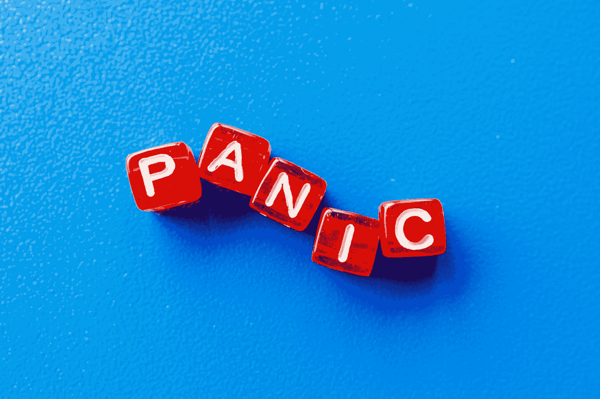

# 六个月后:数据科学(希望)从脸书的告密者那里学到了什么

> 原文：<https://pub.towardsai.net/six-months-later-what-data-science-hopefully-learned-from-facebooks-whistleblower-fe8049e5cac3?source=collection_archive---------4----------------------->

## 去年 10 月，一名数据科学家揭发了元宇宙脸书公司涉嫌有害和不道德的行为

九个月前，也就是 2021 年 10 月，一名脸书的告密者(一名数据科学家)与监管者、立法者和新闻出版物分享了公司内部文件，还在哥伦比亚广播公司的 *60 分钟*上分享了她的故事，引起了一场轩然大波。

这篇回顾性文章:

*   提醒我们围绕脸书泄密事件的重要事实和情况，
*   提出了该事件对数据科学家可能是最重要的教训，以及
*   概述了一种做法，可以避免脸书的举报者发现自己的道德困境。

> 作为数据科学家，我们有义务避免让他人以有害的方式使用我们的工作。

举报人[弗朗西丝·豪根](https://www.npr.org/2021/10/05/1043377310/facebook-whistleblower-frances-haugen-congress)对该公司提供了清晰而详细的见解，她说该公司在追逐金钱的过程中伤害儿童、鼓励分裂并破坏民主。

这不是一个游手好闲的前公司员工公开抱怨她以前工作的地方。Haugen 在 DC 华盛顿州国会山举行的参议院商业、科学和运输委员会消费者保护、产品安全和数据安全会议上提出了她的主张。

哈根为脸书工作了近两年，也在谷歌、Yelp 和 Pinterest 担任过职务。她告诉国会，脸书不遗余力地寻求最大化增长，不惜牺牲实施可能限制伤害的保障措施。

# 重要的事实和情况

Haugen 是一名数据科学家。

## 哈根研究了脸书的算法

让我们回顾一下围绕这一事件的重要事实。

在脸书，哈根研究了公司的算法。根据 Haugen 的说法，该算法放大了错误信息。Haugen 还声称美国的敌人利用了该算法。在她离开社交网络之前，她复制了数千页的机密文件，并与监管机构、立法者和华尔街日报分享。

## Haugen 分享了令人不快的数据支持的统计数据

Haugen 声称社交网络自己的研究显示了这个网站是如何有害的。[例如根据 BusinessInsider.com](https://www.businessinsider.com/facebook-knows-data-instagram-eating-disorders-suicidal-thoughts-whistleblower-2021-10):

*   一项研究发现，13.5%的英国少女在加入 Instagram 后报告了更频繁的自杀想法。
*   另一项研究发现，17%的少女报告说，在使用 Instagram 后，她们的饮食失调症恶化了。
*   32%的少女表示，如果她们已经对自己的身体感到糟糕，Instagram 会让她们感觉更糟。

这些指控尤其引人注目，因为据报道，脸书一直在开发一款为 13 岁以下儿童量身定制的 Instagram 产品。随后的报道称脸书已经停止了针对儿童的 Instagram 产品的开发工作。

> “很少有人具备所需的专业知识和信息来了解统计上正在发生的事情……而大多数有这种知识和信息的人都缺乏直言不讳的诚信。《凯茜·奥尼尔》(2016)。

那么，对于数据科学家来说，从这些事件中得到的最重要的教训是什么？

# 这一事件最重要的教训

为什么一个数据科学家会主动与联邦执法机构分享潜在的公司不法行为的证据？**数据科学家和其他数据专业人士有一系列道德义务，其中包括避免让他们的工作对他人造成伤害的责任。**

这很重要:作为数据科学家，我们有义务避免让他人以有害的方式使用我们的工作。

你可能会将道德困境与教育、金融、医疗保健和法律领域等职业联系起来。然而，数据科学也不例外。在工作中，数据科学家应该努力避免伦理上可疑的情况。

对数据科学家来说，这一事件最重要的教训可能是，我们有义务带着荣誉和诚信行事。我们有义务避免让他人以可能造成伤害的方式使用我们的作品。

到目前为止，法律或专业责任准则(除了一般的反欺诈禁令)中没有对数据科学家的正式义务。尽管没有特定于数据科学的职业行为准则，但在实践中，数据科学家需要遵守这一义务。如果我们不这样做，我们就有可能损害我们工作的信誉。更糟糕的是，如果我们不遵守这一义务，我们就有可能对他人造成真正的伤害。

我不是第一个呼吁数据科学家要有责任感的人。在某种程度上，Haugen 也通过她的行动呼吁数据科学家的责任感，她也不是第一个。

例如，凯茜·奥尼尔(Cathy O'Neil)关于 2000 年代末由数据科学驱动的金融崩溃的著名著作*中最重要的一句话是“*很少有人拥有所需的专业知识和信息来了解统计上正在发生的事情……大多数人缺乏直言不讳的诚信。*”*

# 有助于避免道德困境的实践

没有一种做法能完全避免道德困境。为了保护我们的工作免受道德风险，一系列的安全措施是必要的。本文提出的实践至少是一个起点。

这种做法的一个显著优势是，作为一个可以防止道德困境的起点，这是一种任何个人都可以实施的做法。任何一个数据科学家都可以实施这种实践，不管他的经验或背景如何。这种做法适用于任何组织中任何级别的任何数据科学家。

这个练习包括在任何和所有分析项目开始时问一个简单的问题。为了最有效地解决这个问题，你需要尽早并且经常问。

问题是“如果我们产生一个不讨好的结果会怎么样？”换句话说，“如果我们产生了一个让我们看起来很糟糕的结果，会发生什么？”伴随的问题也可能是，“如果我们产生一个或多个仅仅是不受欢迎的结果，我们该怎么办？”

发现一个不讨人喜欢或不受欢迎的结果并不是一个不寻常的分析结果。这样的结果几乎出现在任何实践领域，从制药研究到政治调查，再到其他科学学科。

当然，科学是一个过程。它是获取观察结果(数据)并利用这些观察结果来帮助我们理解世界(测试假设)的行为。如果数据不支持假设，假设可以被拒绝。或者，当可靠的数据和方法支持假设时，我们接受假设。

随着时间的推移，社区可以讨论我们的数据收集和假设检验的结果。可行的概念被付诸实践，不可行的则被抛弃。在某种程度上，理论变成了事实，无论你谈论的是化学、全球变暖还是数据，都是如此。

## 其他类似问题

"如果我们的发现证明你的观点是错误的或者破坏了你的立场，会发生什么？"你可能会问。“我们该怎么办？”“我们将如何进行？”

"如果我发现的东西显示钱被偷了会怎么样？"可能会导致不愉快的谈话。“你会如何回应？”“你还需要我或其他分析师提供哪些信息？”

或者，“如果数据显示你的说法不正确，会发生什么？”可能是开始不愉快对话的另一种方式。“我们会有什么选择？”"我们将如何决定我们前进的道路？"

“什么意思？”客户、老板或同事可能会问。

## 猜测可能的反应

假设你问了你的老板、同事或客户一个大问题:“如果我们发现的不讨人喜欢，会发生什么？”以下是你可能会想到的一些回答。

**最坏情况场景**

*   一个可能的回答可能是“无响应”客户或委托人可能会说“我不确定”或“我可以再打给你吗？”
*   另一种回应是拖延，说“让我们到了那条路再过吧。”
*   有些人可能会天真地回答:“那不会发生”或“那不可能发生”。
*   你可以想象一个糟糕的演员可能会说“埋没这些发现”，或者更糟的是，“把它们变成我们的优势——利用它们。”

**最佳情况场景**

*   梦想客户或委托人会这样回答:“如果我们发现一个不讨好的结果，我想马上知道。我们更希望了解自己的弱点，以便纠正自己。”
*   类似地，理想的客户或委托人会表达分享不讨好的结果的愿望，并把这作为一个机会来恰当地将调查结果联系起来。此外，客户将公开交流组织将采取什么行动来补救错误。

# 避免你自己的脸书时刻

目标是避免经历你自己的脸书- *像*告密者的时刻或经历。

没有一种策略可以完全避免道德困境。然而，提出我们的问题是可行的，因为它建立了一个基线响应，如果或者当项目发现不满意的结果时，分析师应该如何进行。

在分析之前问这个问题，进行这样的对话，也为是否或何时出现令人不快的结果建立了一个参考点。所以，与其让对话听起来像:

*“哦不，我们现在该怎么办？”*

对话会更接近于，

*“当我们上次讨论如何处理这类发现时，我们说我们想知道结果。我们还说，我们希望分享结果，我们希望将这些结果联系起来。此外，我们同意以此为契机，解释我们将采取哪些措施来补救错误。”*

尽早问这种问题(通常在分析过程中)会建立一种责任分配的意识。分析师将已经确定他或她认识到了道德义务感，团队也应该认识到道德义务感。

# 结论

本文研究了三个要点:

*   围绕 2021 年 10 月脸书告密者事件的事实和情况，
*   对数据科学家来说，这一事件最重要的教训是什么
*   这种做法可以避免脸书举报者发现自己所处的道德困境。

脸书在回应这些指控时到底说了些什么？一位名叫尼尔斯·波茨的高管告诉国家公共电台，他断然否认该公司试图创造一个两极分化的环境。

“在脸书，我们设计产品的目的是增加有意义的体验，”他告诉 NPR。“因此，无论这些是有意义的社交互动——我认为这是泄密者在她的‘60 分钟’采访中提到的变化——还是在平台上有积极的社交体验，这都是我们希望该产品最终提供的。这创造了一个环境，人们会来到脸书，来到 Instagram，享受更美好的时光。这确实是我们的底线。”

虽然它可能不像其他职业那样正式，但数据科学家确实有义务以道德和诚信的方式开展我们的工作。我们也有义务避免让他人以可能对任何人造成伤害的方式使用我们的作品。这些道德义务类似于其他专业人员的道德义务，如律师、医生和教师。

这些义务可能会造成不舒服的情况，但通过在开始之前以单个问题的形式创建一个期望基线，数据科学家可以帮助避免未来的道德困境。

> "如果我们产生一个令人不快的结果会怎么样？"“我们该怎么办？”“我们将如何进行？”

安德烈·梅特列夫在 [Unsplash](https://unsplash.com?utm_source=medium&utm_medium=referral) 上的照片

# 感谢阅读

你准备好了解更多关于数据科学职业的信息了吗？我进行一对一的职业辅导，并有一份每周电子邮件列表，帮助专业求职者获取数据。联系我了解更多信息。

感谢阅读。把你的想法和主意发给我。你可以写信只是为了说声嗨。如果你真的需要告诉我是怎么错的，我期待着尽快和你聊天。推特:[@ adamrossnelson](https://twitter.com/adamrossnelson)LinkedIn:[亚当罗斯尼尔森](https://www.linkedin.com/in/arnelson/)。