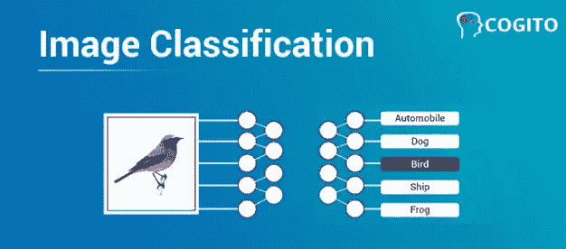

# 您忽略的六个警告可能会使影像分类数据集面临风险

> 原文：<https://pub.towardsai.net/six-warnings-you-ignore-that-might-put-image-classification-dataset-at-risk-303927854360?source=collection_archive---------2----------------------->

## [深度学习](https://towardsai.net/p/category/machine-learning/deep-learning)

俗话说“机会不会敲两次”，但在图像注释者的手中，这份清晰的传单将帮助数据科学家解决训练数据集中的差距，这些差距在整个图像清理过程中被忽略或忽视。

从事[图像分类](https://medium.com/cogitotech/what-is-the-difference-between-image-segmentation-and-classification-in-image-processing-303d1f660626)任务的图像注释者的唯一义务不仅仅是完成手头的图像标注任务。还可以告诉数据科学家以下警报，如果不立即处理，可能会在数据集中出现意想不到的危险。

**1。有过量的“重复”**

重复基本上表示数据集中有许多图片在数据集中的同一个类中重复/重复出现。

这可能是由多种因素造成的，例如数据科学家多次抓取同一主页上的照片，或者在两个不同的网页上出现相同的照片。

或者，数据科学家为自定义标签提供给标签团队的开放数据集没有得到正确清理。

不管是什么原因，重复的图像让数据科学家的机器学习模型很难进行归纳，因为它总是在学习相同的信息。

**2。模糊的图像，除非整个数据集都是模糊的。**

当处理计算机视觉用例时，由于缺乏视觉清晰度，机器学习模型将无法从模糊或像素化的图片中提取关于感兴趣的项目的规定信息或特征。

因此，贴标员必须告诉数据科学家有关情况，并允许他们采取适当的行动。

但是这里有一个问题:如果整个数据集是模糊的，那么数据科学家可能正在处理一个需要图像模糊的生产用例；在这种情况下，只需向数据科学家确认即可。

**3。不清楚的事例太多了。**

为学习特定任务而提供给任何机器学习模型的输入的质量是该模型的优势。

如果数据科学家给注释团队一个包含太多不明确实例的数据集，如下图所示。

数据标签员只需要向数据科学家表达他们的担忧，并向他或她询问下一组最佳指令。

**4。数据集中对特定类的偏向。**

这是数据标注者必须保持高度警惕的警告。

这就是为什么在标注图像分类数据集或任何其他计算机视觉数据集时，数据标注者应该记住这一点。

如果人们看到一个类别与其他类别相比具有过多数量的图像。

然后，他们必须尽快通知数据科学家团队。否则，该数据集将被用于创建机器学习模型，该模型支持数据集中具有最多图片的类别，而不是其他类别。

换句话说，机器学习模型会偏向那个特定的类。实施人工智能模型后，可能会导致收入损失或公共关系倒退。

**5。感兴趣的项目或要标记的类别看起来很模糊。**

这种情况在类级别比在图片级别更常见。结果，在做图片标注任务的时候。

如果数据标注器注意到数据集中要分类的感兴趣对象或类在图像上看起来模糊不清。

然后，他们应该简单地通知数据科学家，并征求他或她的意见。

数据科学家团队可能会决定替换或删除正在收集的图片。

**6。指定的感兴趣的对象或类别仅仅是部分可见的。**

俗话说，“一知半解是危险的”，这对世界上的每个计算机视觉数据集都是正确的。如果图像不清晰，可能会影响整体效果

在这种情况下，图像注释者应该通知数据科学家。以便她或他可以采取必要的步骤来解决他们的图像分类数据集中这些类型的缺失上下文图片。

**尾注**

我希望下一次数据科学家分配图像分类任务时，他或她会将这些信号的信息传递给他们的数据注释团队。它将最终帮助各种组织的机器学习团队开发数据集，提供感兴趣的对象的真实和完整的图像。Cogito Tech LLC 为 ML 和 AI 模型提供精确和高质量的训练数据集。