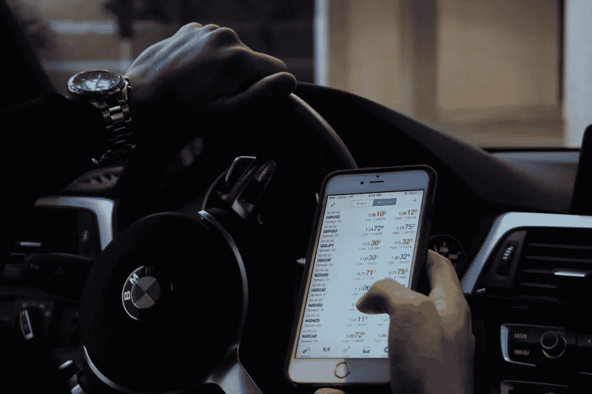

# 每个人都应该知道的加密货币的俚语

> 原文：<https://pub.towardsai.net/slang-terms-for-cryptocurrencies-everyone-should-know-c7f9f4bcd9d8?source=collection_archive---------0----------------------->

加密货币是一种数字货币，可以在没有政府或银行参与的情况下进行交易。另一方面，加密货币是使用加密过程生成的，允许用户安全地购买、出售和交换它们。

加密货币业务正在迅速扩张，随之而来的是新的行话。这里有一些需要注意的短语和术语。

# 1 HODL

“HODL”这个名字是在一个早期的比特币论坛上发明的，当时有人误读了“持有”这个词为了达到幽默效果，这个短语被采用并代替了正确书写的单词。

一些人把它误认为是一个缩写，意思是“抓紧时间”，这符合维持贸易地位的概念。

# 2 倾卸和泵送(又名拉毯)

当一群投资者以低价持有一枚硬币的大部分供应量时，这就是所谓的抛售。他们在很大程度上基于虚假信息推动炒作，这增加了市场需求，推动价格上涨(泵)。

在新投资者增加了初始资本后，他们会出售所有资产以快速获利。这种抛售经常将价格推至不可逆转的低点，因为他们拥有相当大份额的供应(倾销)。

# 3.包夹

皮包持有者本质上被描述为一个投资者，他持有一种正在贬值的货币的股份。这些投资者要么没有意识到他们头寸的贬值，要么一心等待更好的卖出时机。他们成为袋持有者，因为他们是失败投资的最终持有者。

这在我上面提到的有故障的泵和转储场景中很常见。另一方面，这些袋固定器可以在多种条件下针对任何市场进行制造。

# 4 发呆

短语“mooning”在加密货币世界中用于描述硬币的价格上涨或显著收益。作为一种口号或炒作诱导短语，人们已经开始说像“我们前往月球”或“登上月球火箭。”

这并不重要，但很幽默，因为“mooning”也可能指某人公开暴露自己的屁股。

# 5 FUD

缩写 FUD 代表“恐惧、不确定和怀疑”传播关于硬币未来的谣言的人被称为“捏造者”并散布谣言。应避免不必要的 fud，因为它可能引发大规模抛售，并显著降低硬币的价值。

# 6 手方块

“钻石手”一词指的是投资者对价格波动或其他表明他们的投资处于危险之中的警告信号无动于衷。即使头寸贬值，一些交易者也会坚持到底。他们相信他们的投资总会收回，他们希望有可观的回报。

这是投资者损失大笔资金的最常见方式之一。然而，有些时候持有亏损的投资可能是明智之举。

这是我经历过的事情。我决定以相当大的损失卖掉亏损的投资。一年后，同样的股票价值是我卖出时的 8 倍；如果我有一双钻石手，我会赚一大笔钱！

# 7 只纸手

一个有纸手(也称为弱手)的投资者在第一个困难信号出现时卖出他们的股票。由于负面消息、价格下跌或直觉，他们会毫不犹豫地卖出和退出。

在许多情况下，有纸手的交易者在市场上的风险承受能力如此之低，以至于他们会因为在价格上涨前卖出而失去可观的利润。

请记住，拥有纸手并不总是一件可怕的事情。一些交易者真的相信“新手就是纸手”不要让任何人说服你持有一项投资超过你所能接受的时间，因为股市是动荡和不可预测的。

# 8 SAT

比特币加密货币的最小指定单位是 Satoshi。一个 Satoshi 等于 0.00000001 个比特币或一个比特币的一亿分之一。

比特币的创始人中本聪是这个短语的名字。2008 年，他发布了比特币白皮书，并为当今最昂贵、最知名的加密货币创建了最初的参考系统。

# 结论

我希望这些定义可以帮助你们中的一些人更好地理解一些当前的俚语和行话。

这些术语中的许多也适用于其他市场。然而，它们通常用于加密货币行业。