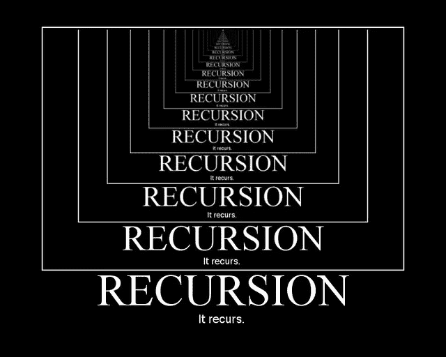

# SQL —从中级到超级英雄

> 原文：<https://pub.towardsai.net/sql-from-intermediate-to-superhero-26b4e6cdcf53?source=collection_archive---------0----------------------->

## [编程](https://towardsai.net/p/category/programming)

# 用于高级分析的实用 SQL

来源:https://www.maximizemarketresearch.com/advance-analytics/

SQL 是一种用于查询和管理数据库中数据的编程语言，已经成为现代分析的支柱。

> “SQL 是最糟糕的数据库查询形式，
> 
> 除了所有其他的形式。”—卢卡斯·埃德尔

在 SQL 中有很棒的资源和一些高级主题，如性能优化。

然而，对于使用 SQL 的高级分析，没有一个最佳去处。在本文中，我收集了关于使用 SQL 进行分析的高级模式的资源(列在底部)。

值得注意的是，许多数据库缺乏某些功能，因此您将通过理解思维方式获得最大收益。

# 一般模式

*   **统计模式:** [SQL 设计模式](https://www.amazon.com/SQL-Design-Patterns-Programming-Tropashko/dp/B0140EZKJW)有专门的两章，可以找到 [1](https://vadimtropashko.files.wordpress.com/2014/01/book_sql_chap1_v2.pdf) 和 [2](https://vadimtropashko.files.wordpress.com/2007/02/ch3.pdf) 。
*   **窗口函数模式:**关于窗口函数高级用法的介绍可以在这里找到[。](https://www.slideshare.net/EyalTrabelsi/advance-sql-window-functions-patterns-and-tricks)
*   **编写 sane SQL:** 关于 SQL 异常、最佳实践和执行顺序的介绍可以在这里找到[。](https://www.slideshare.net/EyalTrabelsi/bring-sanity-back-to-sql-advance-sql)
*   **使用字符串:**关于如何正确使用字符串的演示可以在[这里](https://www.slideshare.net/EyalTrabelsi/advance-sql-session-strings)找到。

来源:[https://en.wikipedia.org/wiki/The_Starry_Night](https://en.wikipedia.org/wiki/The_Starry_Night)

# 分层遍历模式

*   **递归:**这里有一个很棒的视频讲解。
*   **树搜索模式:** [SQL 设计模式](https://www.amazon.com/SQL-Design-Patterns-Programming-Tropashko/dp/B0140EZKJW)有专门的章节可以在[这里](https://vadimtropashko.files.wordpress.com/2011/07/ch5.pdf)找到。
*   **图搜索模式:** [SQL 设计模式](https://www.amazon.com/SQL-Design-Patterns-Programming-Tropashko/dp/B0140EZKJW)有专门的章节可以在[这里](https://vadimtropashko.files.wordpress.com/2014/01/book_sql_chap6_v1.pdf)找到。

来源:[https://www.flickr.com/photos/torley/2361164281](https://www.flickr.com/photos/torley/2361164281)

# 数据科学模式

值得注意的是，有更好的方法来做这些事情(例如使用 python)。

*   **NLP:** 一些基本的 NLP 可以在 [1](http://www.silota.com/docs/recipes/sql-nps-customer-loyalty-survey-analysis.html) 和 [2](https://www.periscopedata.com/blog/text-analysis-with-trump-tweets) 中找到。
*   **回归:**线性回归示例示例见 [1](http://www.silota.com/docs/recipes/sql-linear-regression.html) 和 [2](https://www.periscopedata.com/blog/movie-trendlines) 。
*   **时间衰变:**这里可以找到一个很棒的例子。
*   **其他:**潜望镜数据好像用 SQL 实现了一些机器学习的方法，比如[最近邻](https://www.periscopedata.com/blog/finding-nearest-neighbors-in-sql)和 [K-mean 聚类](https://www.periscopedata.com/blog/multi-dimensional-clustering-using-k-means-postgres)。

来源:[gigabit magazine . com/ai/report-predicts-ai-spending-reach-almost-980 亿-2023](http://gigabitmagazine.com/ai/report-predicts-ai-spending-reach-almost-98bn-2023)

# 遗言

这篇文章有点像高级 SQL 模式，如果没有:

*   SQL 设计模式:SQL 编程专家指南(一本很棒的书！)作者上传了一些章节到他的博客。
*   [Silota 博客](http://www.silota.com/docs/recipes/)有一个 SQL 技巧的概要。
*   [潜望镜-数据博客](https://www.periscopedata.com/blog)简直是一个伟大的博客。

我希望你觉得有趣和有用。我乐于接受任何建设性的反馈。