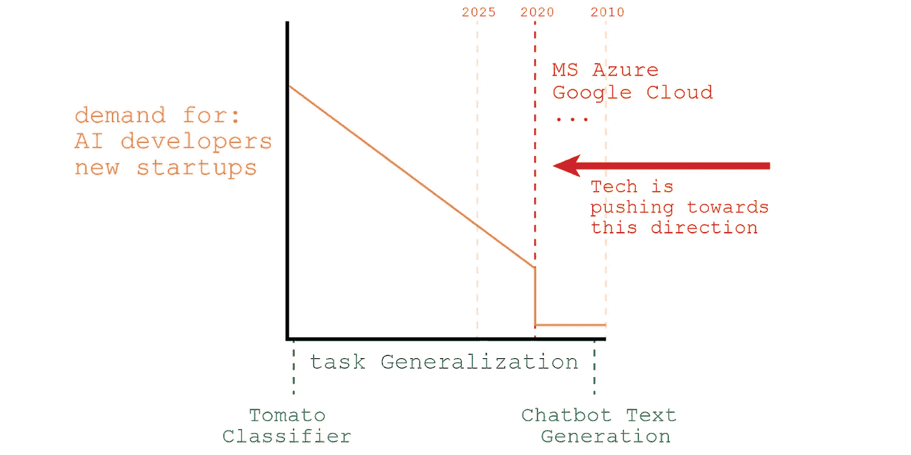
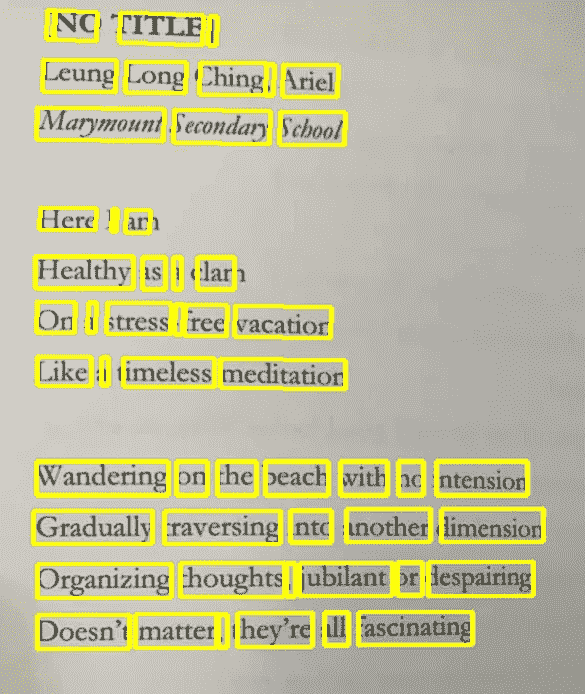

# 2020 年人工智能的状态:行业发展方向

> 原文：<https://pub.towardsai.net/state-of-ai-in-2020-where-the-industry-is-evolving-ea80c89b99ff?source=collection_archive---------2----------------------->

## [人工智能](https://towardsai.net/p/category/artificial-intelligence)，商业战略，[技术](https://towardsai.net/p/category/technology)

## 通用人工智能工具如何推动开发者的需求

人工智能是变化最快的行业之一。在这个领域获得足够多的经验后，我一直在写一系列关于人工智能颠覆的文章:

*   [人工智能的破坏已经开始了](https://medium.com/towards-artificial-intelligence/the-ai-disruption-is-starting-already-cd1a00e38148)
*   人工智能行业还没有为颠覆做好准备

在我看来，对于个人开发者来说，这个行业并不一定处于一个舒适的位置。如果你足够幸运地被一家科技巨头或成功的创业公司聘用，你就不会遇到那些想通过创造新产品进入市场的人所面临的问题。



一个关于行业需求变化的模型

专家们可能担心的是对人工智能开发者需求的转变。需求是任何行业发展的驱动力。能够预测需求让人们(从投资者到想要进入这个行业的人，各种各样的人)处于竞争地位。

## 需求会减少吗？

至少，这是我的声明。上周，我正在对如何使用 OCR 技术进行深入研究。不幸的是，我花了几个小时尝试了网上许多最可靠的开源软件都没有成功。结果非常令人失望，尤其是因为我必须手动编辑每一张图像的参数(RGB、大小、旋转……)，才能获得一个勉强可以接受的结果。为了达到一个普通的结果，需要大量的时间来适应不同的情况。

在额外的搜索中，我发现了谷歌云图像检测 API。至少可以说，结果非同寻常。开源产品和技术巨头工具之间没有可比性。这个工具是出售的，虽然价格很便宜。然而，作为一名个人开发者，我使用该技术的唯一目的是访问 API。



朋友发送的图片

```
Google API estimation:
[NO TITLE]
Leung Long Ching, Ariel
Marymount Secondary School
...
```

在编写了正确的代码来在检测到的单词周围画出方框之后(说起来容易，我向你保证……)，就这样了。我不需要从头开始创建神经网络，也不需要分类器，收集训练数据…

## 2010–2016

每个人工智能工程师/团队都必须从零开始创建软件，或者至少在互联网上获得一些预先制作的材料。肯定没有使用其他公司生产的任何完全可用的软件。开发成本很高，需要足够的培训数据，而这些数据并不总是免费的。此外，每个人工智能库(尤其是深度学习)都需要比今天多得多的工作，包括潜在的错误。

## 现在

任何程序员都可以连接到 Google Cloud APIs 来利用他们的工具。没有建筑成本或时间成本。价格降到最低。这项技术几乎人人都可以使用。微软 Azure 或 AWS 等其他服务也在不断使用，市场上还有许多其他正在崛起的服务。

# 工具是从零开始开发的吗？

当然，也有例外。其中之一就是自动驾驶。每个大公司都试图从零开始构建自己的软件，而不是使用另一个竞争对手的技术。已有工具的存在并不能完全消除构建新工具的需求，但肯定会对开放市场产生影响。事实上，大公司并不是唯一建造这些巨大图书馆的公司。但是，尽管大公司有能力从头开始构建，小公司可能更喜欢使用预制工具。这足以减少大量的需求。

# 结论

人工智能行业正在迅速转变为一种削减开发人员和工程师的技术(这听起来可能是负面的，但我不是在表达我对此的看法，只是事情是如何发展的)。

开发商如何适应这种市场转变？针对不同的利基市场。到目前为止，市场上可用的预制工具并不专门针对非常具体的问题。

例如，我可以使用谷歌云视觉几乎完美地检测物体。从沙拉中，它会立即检测出图像中物体的位置。然而，如果有一家公司需要更具体的分类器，比如能够区分不同种类的西红柿(根据形状、颜色……)，谷歌视觉(还)没有这种功能。

通过选择一个更小但更专业的利基市场，开发商能够在竞争中脱颖而出。

## 任务越一般化，需求越低。