# 通过真正的人工智能数据管理平台实现最先进的数据标签

> 原文：<https://pub.towardsai.net/state-of-the-art-data-labeling-with-a-true-ai-powered-data-management-platform-18d973f7af78?source=collection_archive---------1----------------------->

本教程是由人工智能驱动的企业级培训数据平台 [Superb AI](https://www.superb-ai.com) 为您带来的。来源:美国国家航空航天局在 [Unsplash](https://unsplash.com/photos/Q1p7bh3SHj8) 上对原始数据的衍生

## [数据科学](https://towardsai.net/p/category/data-science)、[机器学习](https://towardsai.net/p/category/machine-learning)、[教程](https://towardsai.net/p/category/tutorial)

## 深入了解大型非结构化数据集的数据标注工作流的真正一流自动化

**作者:** [罗伯特·伊里翁多](https://mktg.best/vguzs)

D 数据标记是机器学习工作流程的重要组成部分，尤其是数据预处理，其中输入和输出数据都被标记以进行分类，从而为计划的数据处理提供学习基础。

我们使用数据标签来识别原始数据，例如图像、视频、文本等中的对象。它通过粘贴一个或多个重要的信息标签来产生上下文，以便模型可以从中学习。有时由于低效的数据标记，它最终会占用大量时间，并且它代表了机器学习工作流的瓶颈。

[**Superb AI**](https://www.superb-ai.com/) ，一家新颖的 B2B SaaS 创业公司，拥有一个高度发达的数据平台，可以解决企业在整个机器学习工作流程中面临的挑战，特别是冷启动和大型非结构化数据集的数据标记。

他们的平台不仅处理数据收集和转换，而且在机器学习生命周期的基础和可能最具挑战性的阶段，包括数据准备、数据标记和数据管理工作流，它真正带来了一种实现真正自动化的新方法。

与竞争对手不同，Superb AI 的机器学习数据平台在其工作流程中不需要人工智能的帮助，节省了无数的人工时间，并朝着数据管理工作流程迈进，大大减少了人在回路(HITL)的工作量。

早在 2018 年，Superb AI 就以一项名为“人在回路(HITL)”的杰出数据标签服务开始了它的旅程 HITL 是人工智能的一个分支，它加强人类和机器的智能，以建立机器学习模型。

传统的人在回路策略涉及几个繁琐的环节，如用给定的数据集对算法进行训练、调整和测试。Superb AI 的策略比传统的人在回路策略更具创新性，也更直截了当，可以帮助企业和创业公司以 10 倍的速度构建机器学习系统[ [3](https://blog.superb-ai.com/superb-ai-suite-machine-learning-data-platform/) ]。

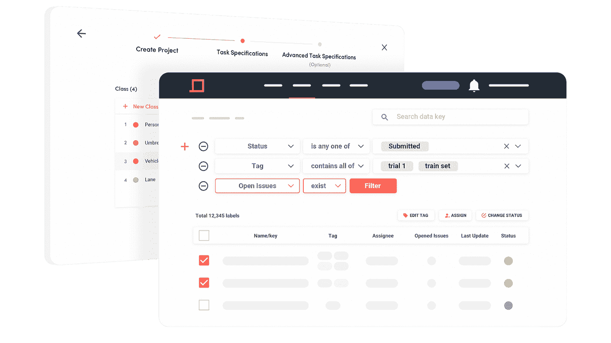

来源:[高超 AI](https://blog.superb-ai.com/superb-ai-2019-in-review/) ，图片经允许使用。

> 收集、标注和交付高质量的数据集可能会花费您数周甚至数月的时间。借助 [**卓越的人工智能**](https://ws.towardsai.net/superbai) ，在一小时内用一个小的地面真实数据集训练我们的迁移学习自动标记模型，**在几分钟内批量标记大规模数据集，审核质量，并在几天内完成交付！你还在等什么？ [**免费报名**](https://ws.towardsai.net/superbai) **。****

毫无疑问，高超的人工智能有助于自动化数据标注过程，由于其革命性的平台，**机器学习模型的构建速度比传统方法更快**。

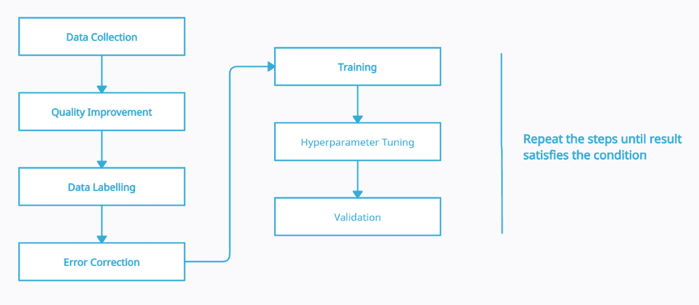

人在回路(HITL)过程|图片由作者提供。

# 什么是机器学习中的冷启动？

**冷启动**是数据科学中一个具有挑战性的问题，涉及到自动化数据建模的构建。具体来说，当 ML 模型不能标记还没有收集足够信息的数据时。标记数据的可用性和利用来标记看不见的历史数据是监督机器学习的基础。不标注过去的数据，不容易标注未来的数据。这个问题在机器学习工作流中普遍存在。

冷启动问题有三种情况:

*   新社区。
*   新项目。
*   新用户。

令人惊讶的是，这个名字来源于汽车在冬天容易遇到的问题。当天气寒冷时，汽车的发动机启动起来会有挑战，但一旦达到最佳驾驶温度，它就会平稳运行。

在数据科学中，“**冷启动问题**通常意味着模型的条件不是最佳的，无法提供最佳结果。

# 为什么标记大量非结构化数据是一项挑战？

也被称为大数据标签的**诅咒**。非结构化数据不能整齐地适应由固定模式设计的数据库，如姓名、电话、电子邮件等。非结构化数据是与模式无关的数据，它不受限于模式的特定结构及其关系。非结构化数据可能是相关信息的一个巨大而有价值的来源，但它并不仅仅适应旧形式的数据存储和分析。

标记海量非结构化数据面临五大挑战:

*   数据集性质。
*   劳动力管理和能力。
*   经济障碍。
*   数据隐私。
*   智能工具。

如今，大型非结构化数据可能具有海量数据。管理所有能够处理大量非结构化数据的员工，同时仍然以整个工作流模型的高质量为目标，这是一项令人厌倦的任务。非结构化数据面临以下几个问题:

*   确保贴标机和数据科学家之间的持续沟通和协作以保持质量、验证和模型培训是一项挑战。
*   贴标签机之间可能存在地理和文化上的差距，他们可能无法准确地标注数据。
*   贴标机很难产生一致的高质量数据。
*   这是一个涉及标签和质量保证的昂贵过程。
*   这是一个耗时的过程，在机器学习中更是如此，当我们训练和调整模型以提高数据质量和模型性能时，需要迭代和发展数据特征。

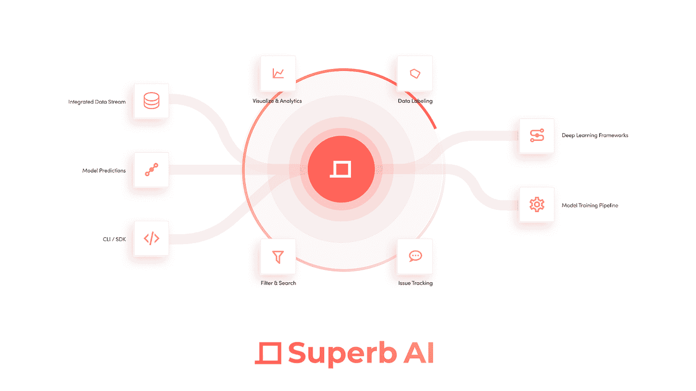

源自 Superb AI 网站的截图，突出了他们的机器学习套件。

# Superb AI 的平台如何帮助数据标注

Superb AI 有一套独特的数据标注方法。例如，我们可以标记一个包含数百到数千个对象的**地面真实数据集**。根据目标检测任务的复杂性，我们可以利用他们的迁移学习模型，对大数据集进行批量标记。一旦完成，人工审核者使用审核工具来微调和交付标记的数据集。

除了在大量数据的标记过程中提供极好的支持之外。Superb AI 的数据标签平台也让我们能够与人类标签员合作，产生高度准确的地面真相标签——正如你可能知道的那样，产生准确的标签是机器学习工作流程中的初始和最关键的步骤之一。

# 在 Superb AI 的平台中标记数据的步骤

Superb AI 的平台在使用和执行数据标记方面简单明了且用户友好。请按照以下步骤开始:

## 用 Superb AI 注册账户

*   进入 [**注册页面**](https://suite.superb-ai.com/auth/create?source=docs) 创建账户。
*   填写下面显示的表格以创建帐户:

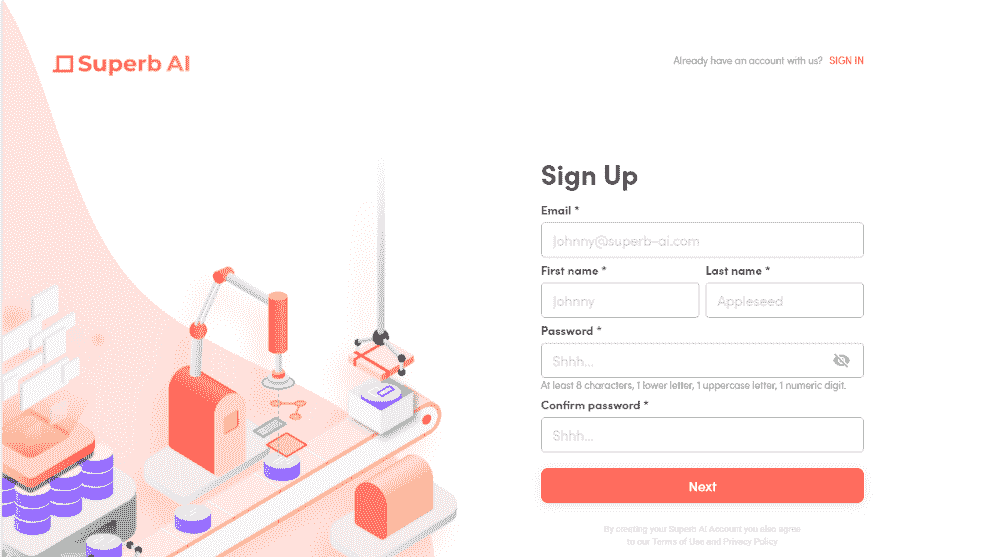

截图来自 Superb AI 的平台。

## 注册

*   登录超级 AI 的套件账号。它将显示以下仪表板:

截图来自 Superb AI 的平台。

该仪表板提供三个重要部分:

*   项目列表
*   数据表
*   我的账户

## 项目列表—添加项目

此部分显示所有已创建的项目，并提供创建新项目的功能。它定义了创建和管理数据标签的方法。

添加项目的步骤:

*   点击**新建项目**按钮。
*   填写随后要求的详细信息以创建新项目:

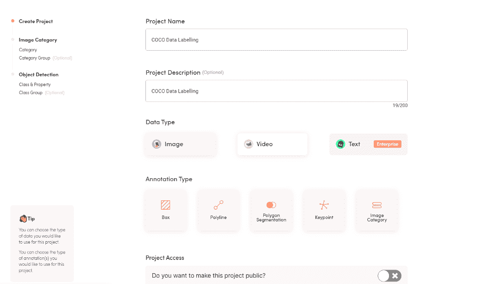

截图来自 Superb AI 的平台。

图像数据类型提供以下注释类型:

1.  箱子
2.  多叉线
3.  多边形分割
4.  关键点
5.  图像类别

创建类别，如下所示:

*   **注意:**类别仅针对**图像分类相关的**任务创建。

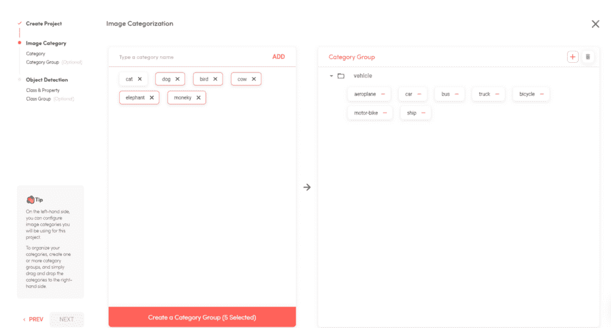

截图来自 Superb AI 的平台。

## **创建类别组**

*   选择所有类别并移至**类别组。**
*   给出**类别组**的名称。

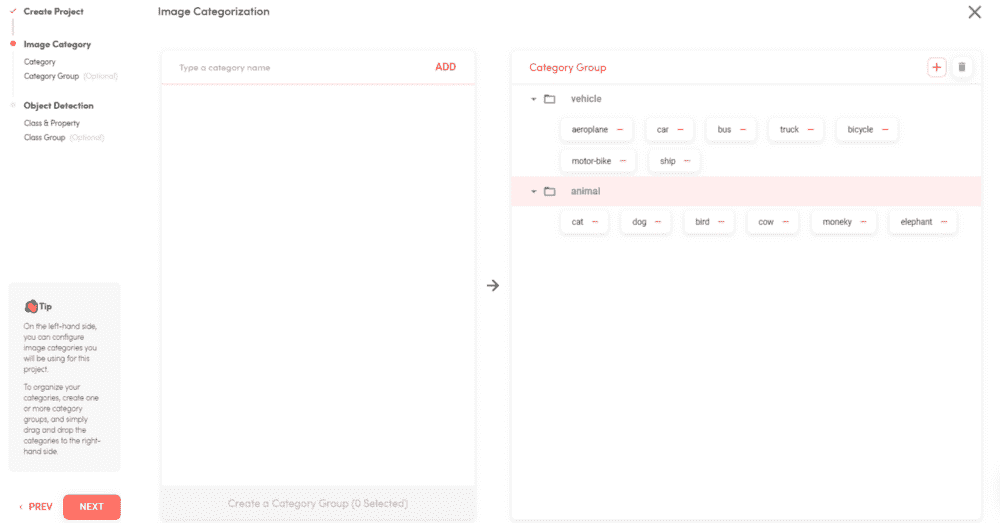

截图来自 Superb AI 的平台。

## **创建一个对象检测类**

对象检测类允许创建一种对象类。每个注释都允许选择注释类别的类型，如车辆、衣服、人物和其他，这将使我们能够为每个类别选择注释类型。

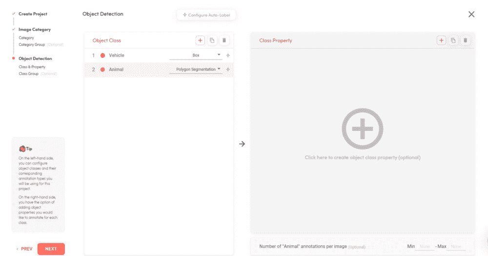

截图来自 Superb AI 的平台。

## **创建班级组**

*   **注意:**只有当数据集中的一个对象类中可能有许多子类时，才需要创建类组。例如，交通标志、停车标志、限速标志等等。

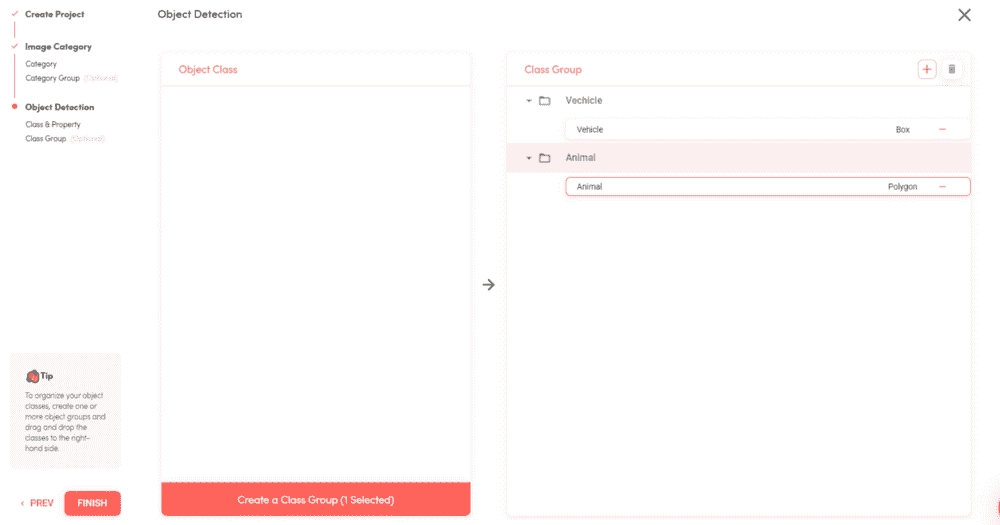

截图来自 Superb AI 的平台。

在创建了类组之后，Superb AI 给了我们一个完整的项目概述，如下所示:

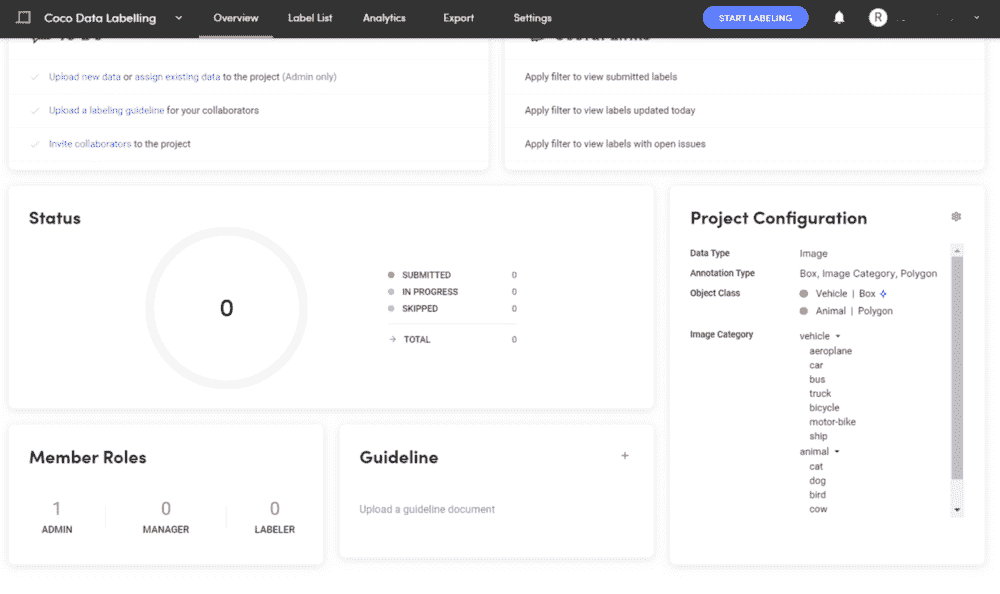

截图来自 Superb AI 的平台。

## 添加数据集

Superb AI 提供了三种上传数据集的选择，无论是通过**上传文件**，上传 **CSV** ，还是使用**云上传。** Superb AI 的云上传功能可以轻松地与您的云存储提供商集成，例如， **AWS S3、GCP、**或 **Google Drive** :

*   通过点击**数据列表**选项卡，我们得到以下上传数据集的选项:

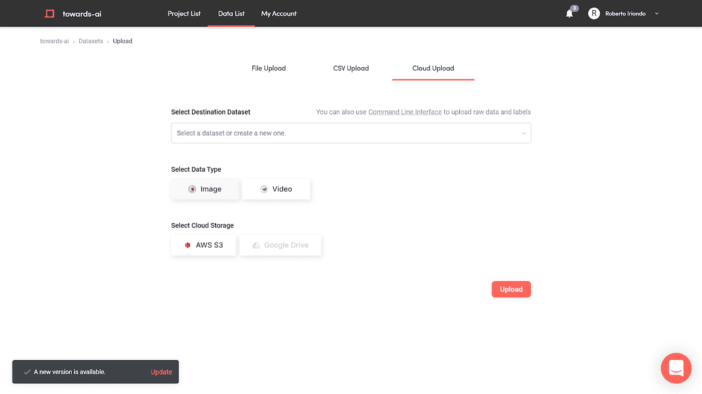

截图来自 Superb AI 的平台。

例如，要将亚马逊 S3 与高超的人工智能集成，请点击 **AWS S3** ，然后**添加 S3 集成**。接下来，我们被要求连接我们的 S3 桶作为套件的数据源。为此，点击**添加**，并按照提示连接您的 S3 桶。

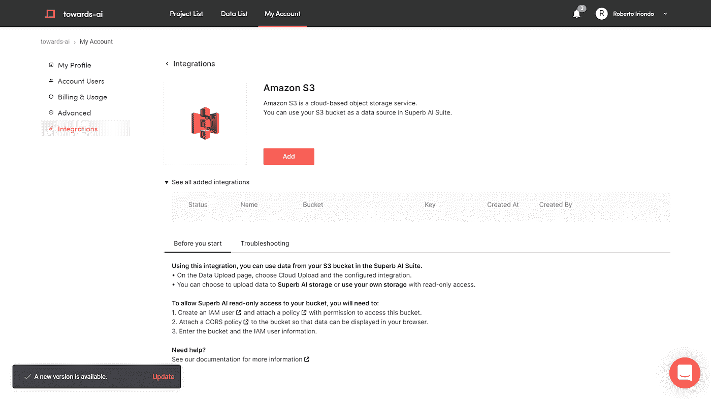

截图来自 Superb AI 的平台。

当从云中上传数据集时，一个简洁的选项允许我们选择是将我们的图像直接存储在 Superb AI 的服务器上，还是以只读方式处理。只读允许完整的平台功能，而无需在平台上物理存储映像。这在处理敏感数据和出于安全目的时尤其有用。

## 将上传的数据分配给项目

*   点击**数据列表**选项卡→点击**分配到项目**按钮。

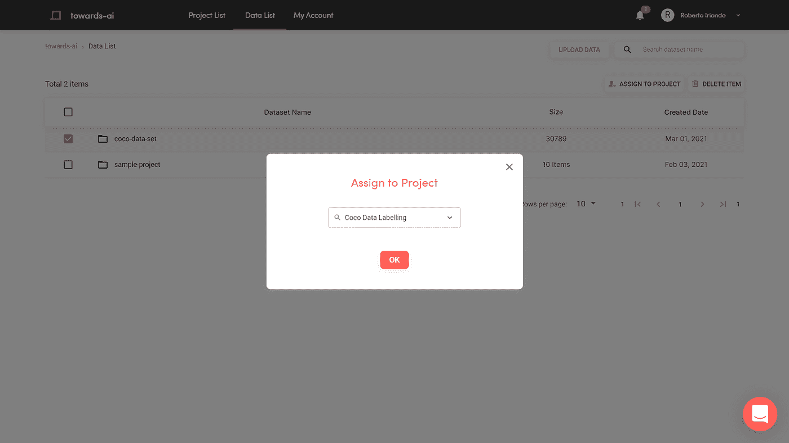

截图来自 Superb AI 的平台。

## 开始标记

将上传的数据分配给项目后，我们可以开始标记数据。要开始数据标记过程，请遵循以下步骤:

*   打开项目→点击**开始标注**。

截图来自 Superb AI 的平台。

*   打开标签面板→点击开始标签列表。
*   打开标签面板→点击打开标签列表→ **给我分配一个新标签** → **选择图像**。

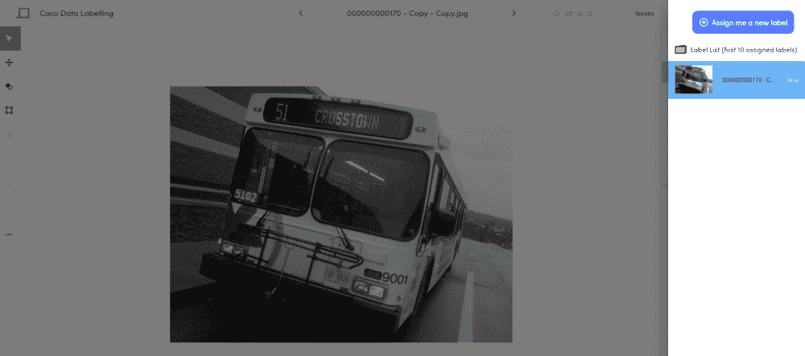

截图来自 Superb AI 的平台。

*   选择**类别→【车辆】** →选择**类别** → **公交车**
*   点击**提交**

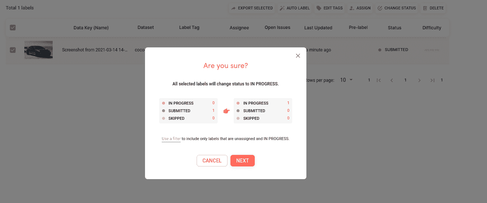

截图来自 Superb AI 的平台。

点击下一个的**，整个对话框出现，我们可以在其中选择成员并向其他成员分配任务。Superb AI 为你提供了各种发布选项，无论是简单的最新图片还是由 Superb AI 的不确定性估计计算出的标签不确定性。后者允许识别硬示例，以便团队可以快速分配进行人工审查，从而创建流畅、主动的学习工作流。**

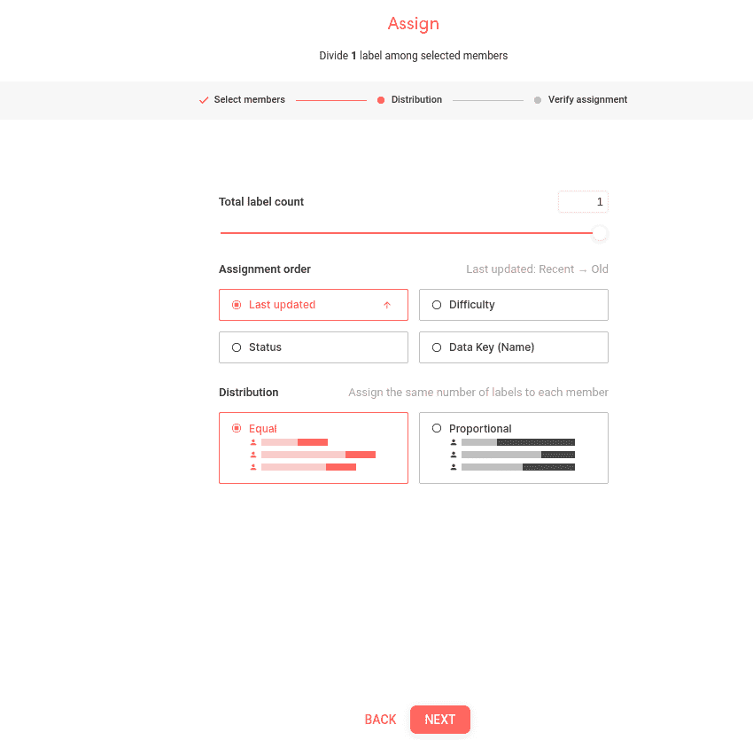

截图来自 Superb AI 的平台。

选择成员后，现在我们通过点击下一个的**进入分配选项卡。我们可以看到“分配”选项卡出现。然后单击“应用”选项卡—分配得到验证。**

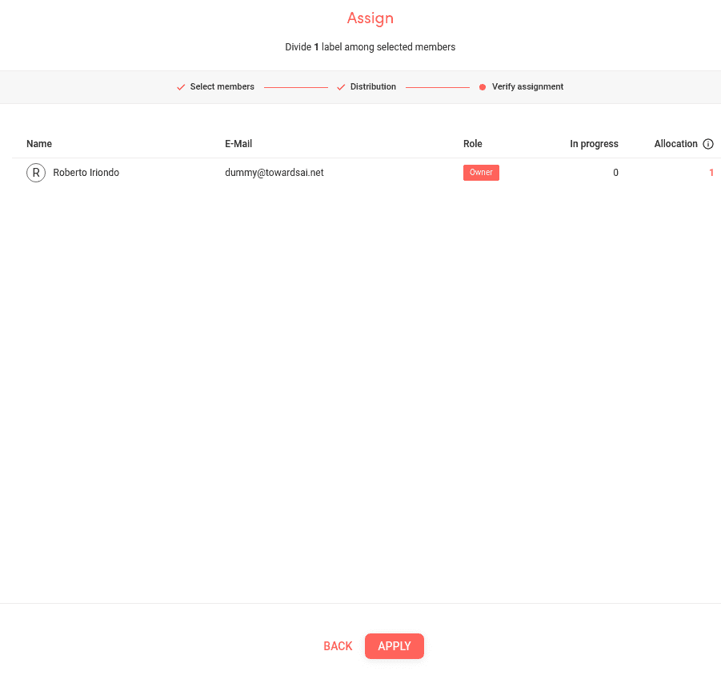

截图来自 Superb AI 的平台。

完成上述过程后，我们可以注意到标签的状态是**进行中。**

截图来自 Superb AI 的平台。

最后一步:

*   导航到**概述**选项卡，然后总体概述视图显示在仪表板上。

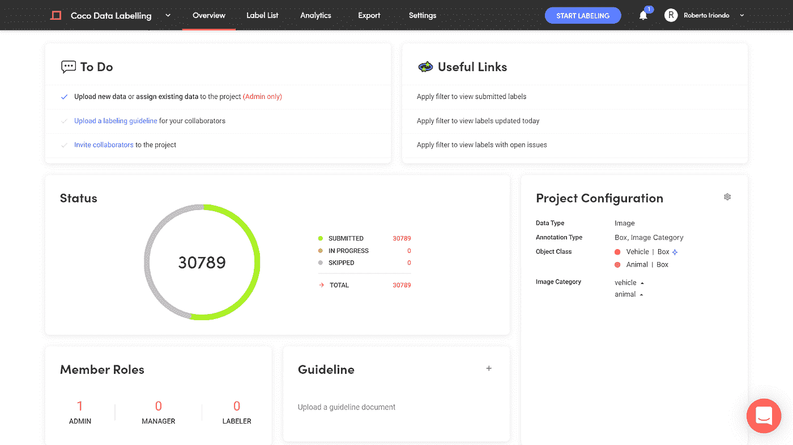

截图来自 Superb AI 的平台。

# 训练自定义自动标签(CAL)

主动学习循环的很大一部分是理解人工智能高度不确定的地方，帮助团队在分配不确定的项目供人类审查之前解决这些异常和复杂的例子。

为了利用 Superb AI 最先进的人工智能自动标签，我们首先需要导出我们的标签。为此，点击**导出**选项卡，然后如果我们点击**导出指南**，他们会给我们一个快速导出标签的方法，无论是导出所有标签还是导出所有提交的标签。

首先，我们必须选择我们想要用来训练我们的定制自动标签模型的图像(标签标签“train set”)。一旦选定图像，点击**导出选定的**导出这些图像以训练定制自动标签模型。

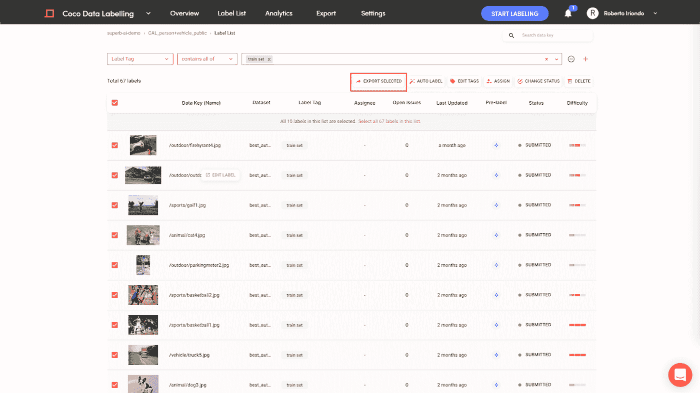

截图来自 Superb AI 的平台。

接下来，我们被定向到**导出**页面，在这里我们可以看到导出的图像。要训练我们的自定义自动标签模型，请点击**创建自定义自动标签 AI。**

在 CAL 流程中真正吸引我们眼球的是**培训的快速性，因为它不到一个小时就完成了**。

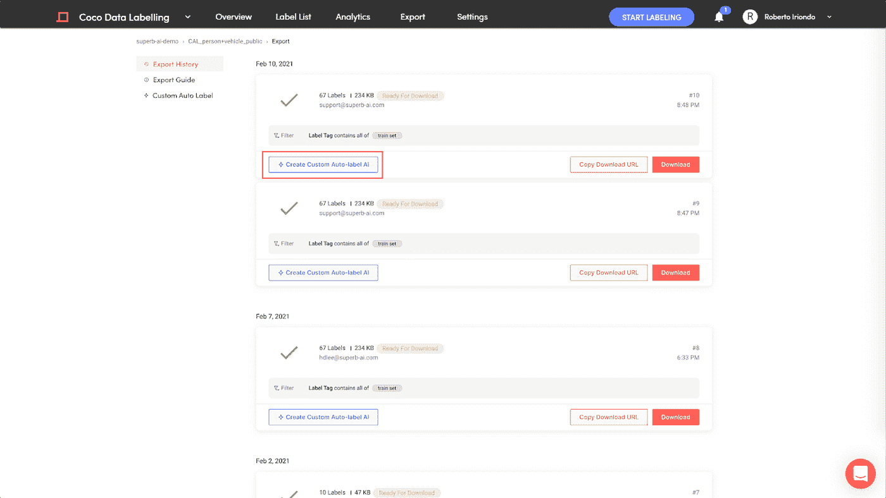

截图来自 Superb AI 的平台。

一旦定制自动标签模型被训练，我们可以通过点击左侧导航栏中的**定制自动标签**来找到它。

*   **注意**:如果我们从标签列表中选择的图像少于 10 张，套件将向我们显示一条错误消息

请注意，在培训完成后，该平台显示了定制自动贴标机与人工贴标机相比效率有多高。

截图来自 Superb AI 的平台。

接下来，返回到**标签列表**页面，使用我们的自动标签过滤我们想要标记的数据集，并选择**自动标签**，如图所示。作为参考，自动标签可以在大约 30 分钟内运行 **100，000 张图像**。

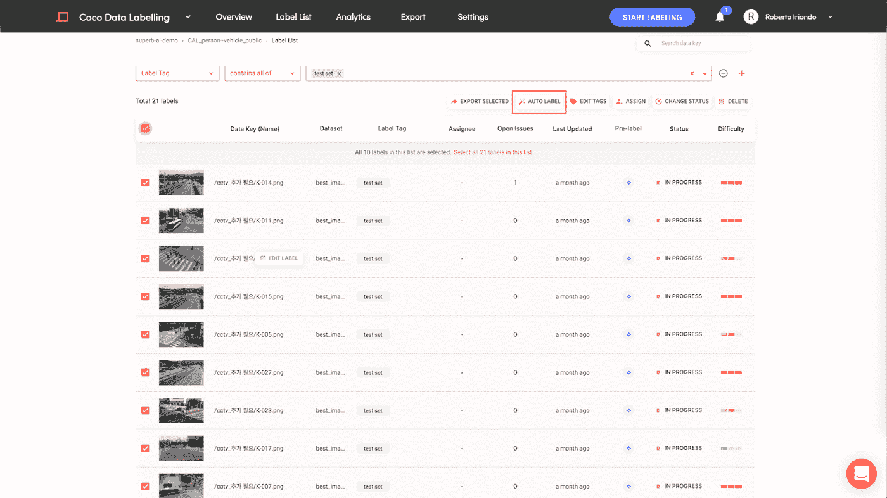

截图来自 Superb AI 的平台。

# 分析和见解

通过点击**分析**选项卡，我们可以了解我们项目分析的概况、我们标签的总量、已提交的数量、完成过程的百分比等。

高超的人工智能提供数据分发，劳动力和标签活动，注释统计都在一个平台内。

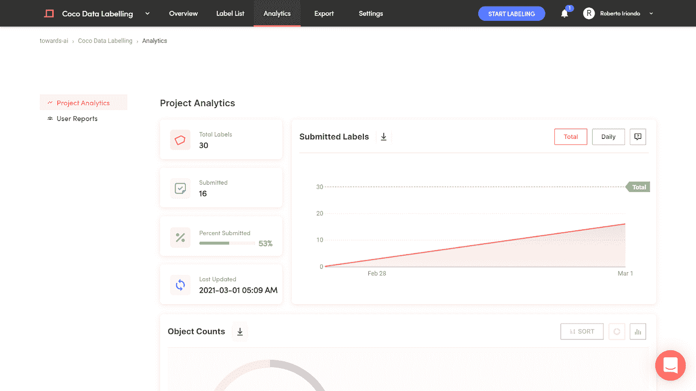

截图来自 Superb AI 的平台。

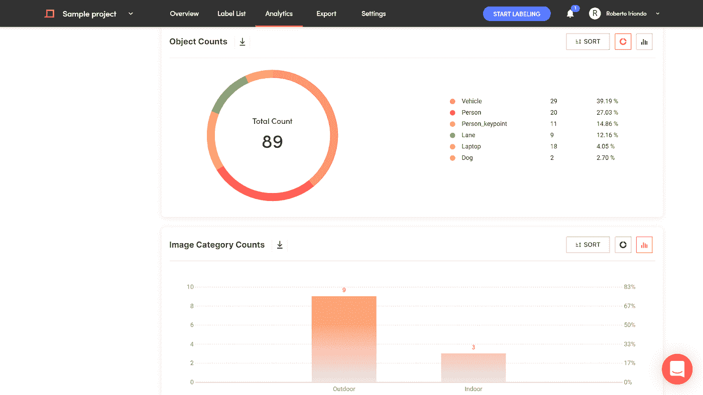

截图来自 Superb AI 的平台。

# 最后的想法

Superb AI 的套件极大地帮助管理、协作和加强了我们的 ML 开发周期。Superb AI 创建定制的数据集来满足任何项目的要求，使用 AI 来加快标记过程。

该平台还有助于减少人在回路中的时间，从而显著加快我们的机器学习工作流程。它使用专有的人工智能，特别是少数镜头、转移学习、贝叶斯经典机器学习和深度学习技术，通过将训练数据分割成更小的组成部分，帮助数据从业者更快地标记图像、视频和其他数据。

由于高超的人工智能，通过应对这些挑战，我们坚信任何人都可以轻松构建自己的人工智能系统。通过持续创新，我们有信心 Superb AI 将成为机器学习数据管理领域最好的全球 SaaS 平台。

**免责声明:**本文所表达的观点均为作者个人观点，不代表与作者(直接或间接)相关的任何公司的观点。这项工作并不打算成为最终产品，而是当前思想的反映，同时也是讨论和改进的催化剂。

**除非另有说明，所有图片均来自作者。**

经由[发布**走向 AI** 发布](https://towardsai.net/)

# 资源:

[**免费注册 Superb AI**](https://suite.superb-ai.com/auth/create)，在 [**数据标签自动化**](https://www.superb-ai.com/) 中与世界一流的领导者一起革新你的数据标签工作流程。

 [## 高超的人工智能套件文档

### 我们已经策划了学习资源，让你开始使用高超的人工智能套件。

docs.superb-ai.com](https://docs.superb-ai.com/)  [## 教程

### 该链接会将您重定向到 S3 控制台，在那里您可以看到 S3 中的存储桶列表。(注:桶名…

docs.superb-ai.com](https://docs.superb-ai.com/tutorials/integrations)  [## 公共数据集

### 我们正在聚合高质量的公共数据集以及由卓越的人工智能团队构建的数据集。使用…

www.superb-ai.com](https://www.superb-ai.com/datasets) 

# 参考资料:

[1]“冷启动(推荐系统)”。2021.*En.Wikipedia.Org*[https://en . Wikipedia . org/wiki/Cold _ start _(recommender _ systems)。](https://en.wikipedia.org/wiki/Cold_start_(recommender_systems).)

[2]“贴标签的数据”。2017.*En.Wikipedia.Org*。[https://en.wikipedia.org/wiki/Labeled_data.](https://en.wikipedia.org/wiki/Labeled_data.)

[3]“Superb AI 推出套件——Superb AI 博客”。2019.*高超的 AI 博客*。[https://blog . superb-ai . com/superb-ai-suite-machine-learning-data-platform/。](https://blog.superb-ai.com/superb-ai-suite-machine-learning-data-platform/.)