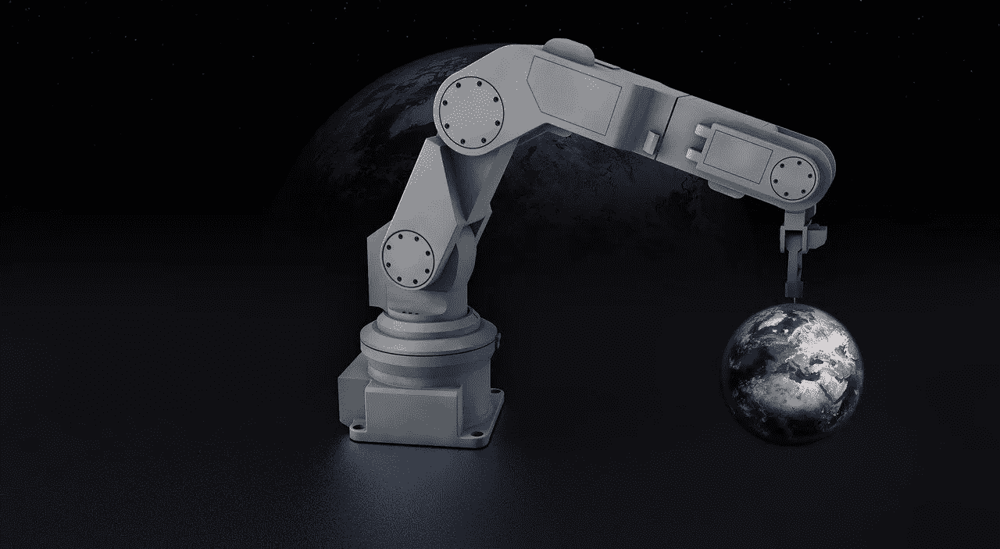

# 停止宣称人工智能是有自我意识的

> 原文：<https://pub.towardsai.net/stop-claiming-an-ai-is-self-aware-f853beb264f6?source=collection_archive---------3----------------------->

## 与其说是科学，不如说是点击诱饵

图片由 [PIRO](https://pixabay.com/users/piro4d-2707530/?utm_source=link-attribution&utm_medium=referral&utm_campaign=image&utm_content=3009602) 来自 [Pixabay](https://pixabay.com//?utm_source=link-attribution&utm_medium=referral&utm_campaign=image&utm_content=3009602)

前谷歌工程师 b .莱莫因声称艾禾正在研究的机器人变得“有知觉”后，更多相关的新闻标题出现了；他们看起来一半愚蠢，一半故意混淆，

首先，莱莫因的主张已经被彻底揭穿，正如我在之前的一篇文章中讨论过的[，那篇文章最终更多的是关于批判性思维而不是意识。](https://medium.com/predict/did-really-googles-ai-become-sentient-929483f8e084)

我在《新科学家》杂志上找到的提到了一篇最近发表的学术文章，报道了一种移动机械臂的发展。与大多数学术论文一样枯燥的文章本身，报告了使用手臂的详细几何模型，使用神经网络来预测手臂的位置，以及其他一些细节。

这有什么好争议的？机器人手臂在工业中已经使用了 30 多年，无论有没有 AI 工具。这里没有什么突破性的东西。

为了增加一点趣味，这份报告采用了作者(H. Lipson、B. Chen 和其他人)的口头陈述，他们有动力推广他们的工作。

我不得不说，有那么一会儿，我对写这封信犹豫了:最后，我提到了新闻条目、科学论文、作者……在某种程度上，我是在宣传他们！

但最后我觉得重要的是把事情说清楚，叫读者自己判断。

# 索赔

陈说，模拟运动物体占据的空间是人类非常重要的能力，我们通常认为这是理所当然的。“陈似乎在暗示，他们正在建造一种人类的能力，这表明，在某种程度上，这是一种合成的人类，或者是一种人工智能，或者是某种相关的东西。

利普森说得更有哲理性:

> “我花了很长时间试图让机器理解它们是什么，不是通过被编程来组装汽车或吸尘器，而是思考它们自己。”

这里的关键词是"*思考自己*"

再次，我们看到了机器人手臂背后的软件拟人化的解释。是软件“*思维*”吗？我们是怎么知道的？

# 它到底是什么

我给自己读发表的研究论文，这是大多数新闻记者不会做的事。这篇文章中报道的工作只是机器人手臂的详细几何模型，而不是仅仅建立执行给定任务的最小模型，例如用螺丝刀头组装两个零件。

这个想法本身并不坏，因为开箱后，手臂的模型可以独立于手头的任务使用，而不是只在手臂在工作时倾向于与某物碰撞时才建模。

因此，这篇论文的贡献(在我看来是微小的贡献)是，默认情况下，包含了机械臂的完整几何模型，并在规划或执行机械臂操作时，使用它来检查可能的碰撞。他们使用一种能够预测未来时间点手臂位置的神经网络。

我审阅许多提交发表的科学论文，并给出接受/拒绝的建议，所以我习惯于接收文章进行评估。如果我收到了这封信，我的建议会介于接受和拒绝之间，因为这份工作的贡献很小。

# 自我意识还是只是自我建模？

我认为利普森的一个令人愤慨的声明如下:

> “对我来说，这是机器人历史上第一次机器人能够创造自己的心理模型，”

我应该说，这完全是一个谎言。

很久以前(至少 40 年前)，机器人就已经包含了它们在空间中的几何形状和位置的模型。构建这些模型显然是正确执行甚至是平凡任务的需要。

在谷歌学术，我编写了查询“*机器人位置估计*”，它给了我“大约 872，000 个结果”！并非所有 872，000 篇已发表的科学论文都包括手臂几何形状和位置预测的完整模型，但即使只取其中的 1%，也是很多的。

**自我建模在机器人领域并不新奇。句号。**

# “心智模型”

然而，最让我恼火的不是谎言，而是“心智模型”这个词的使用。为什么作者称他们的几何模型为“心智的”？

“心智模型”是拟人化的，暗示一种大脑、心智或意识的形式。这是利普森想要的吗？

利普森踩下刹车，以免被称为妄想:“*我不会说机器人已经有了自我意识。*

所以机器人有“心智模型”，但没有“自我意识”是什么生物？

# 最后的想法

发表耸人听闻的声明是值得的。会有一些天真或不诚实的记者寻找 clickbait。在我们生活的“注意力经济”中，吸引眼球需要耸人听闻的标题和突出的主张。

我的印象是，李普生和陈只是在玩今天的营销规则，但我不能肯定。如果他们真的相信他们所宣称的，那么含糊的，不明确的，或者错误的陈述就会出于幸福的无知而说出。

就像莱莫因的情况一样，批判性思维从画面中消失了。技术卓越并不意味着理解科学方法，