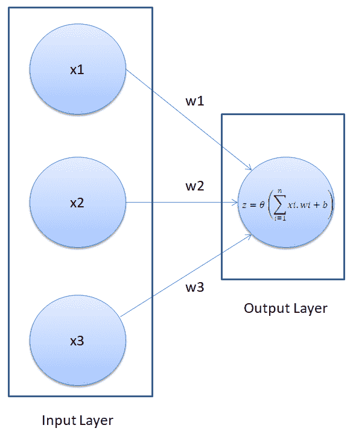
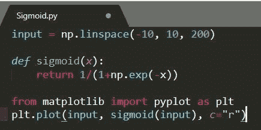
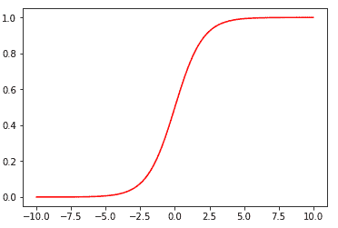

# 使用 Python 构建神经网络的可靠方法

> 原文：<https://pub.towardsai.net/surefire-tips-to-building-a-neural-network-using-python-f6320645a1a3?source=collection_archive---------3----------------------->

你有没有想过，你的网飞、YouTube 或 Instagram 账户的浏览反馈是如何如此吸引人，以至于违背你的意愿消磨掉你几个小时的时间？或者像 Youper 或 Moodpath 这样的应用程序如何进行焦虑和抑郁的治疗？所有这些问题的答案是神经网络，当只有硅片时，你会怀疑你的小玩意里有大脑。

让我们来了解一下它们是什么以及它们的基本框架。为了做到这一点，我们将使用 Python 作为主要语言，因为它有明显的好处。

**什么是神经网络？**

每当有人开始解释神经网络时，他们似乎总是以一个人脑为前提。但是我觉得任何一个为输入提供输出的系统都可以被视为类似于神经网络。这就是神经网络，它是一个数学函数，具有由独立变量组成的输入层、多个任意隐藏层、从每个隐藏层的所有选择中挑选出来的激活函数、它们各自的权重和偏差，以及最终包含因变量的输出层。

在你创建了神经网络的[框架后，你必须训练它。现在，一个系统的核心网络并不是系统中最重要的部分，因为它可能会给出输出，但它不会回答关于输出可信度的问题。因此，在所有神经网络中需要一个子网络，它可以识别误差，即实际值或期望输出与传播值之间的差异。确定误差的子网络被称为成本网络或成本函数。首先，神经网络预测一些随机值，并计算成本或误差。因此，我们的目标是降低成本，并叠加实际和宣传的价值。](https://towardsdatascience.com/nns-aynk-c34efe37f15a)

对于像这样的主题，不介绍一个例子将是直接的混淆。让我们举一个例子，其中输入是年龄、吸烟、居住区域和遗传健康史以及它们各自的权重，输出是患肺病的可能性。为了通用性，所有的输入节点都用 x 表示。w 表示每个输入节点所承载的权重，它可能会随着执行的进行而不断变化。每一步各自的偏差用 b 表示。

**通过神经网络实现**

为了执行任务，神经网络必须经过两个步骤，如下所述:

**前馈**

神经网络基于输入值及其各自的权重做出的预测由神经网络的前馈网络做出。您可能会在数据集中看到四个特征:年龄、吸烟、居住区域和遗传健康史。

神经网络中的[权重基本上是我们通过考虑误差反馈来调整的字符串，以便准确预测输出。现在你必须保持一个核心的东西，对于每个输入节点，都有一个权重。](https://hackernoon.com/everything-you-need-to-know-about-neural-networks-8988c3ee4491)

执行前馈阶段的第一步是计算输入层提供的值及其各自权重参数的点积。然后，将所有节点的点积求和，并加上偏置项 b。即使所有输入节点都带有零值，它也能通过提供输出来保证神经网络的鲁棒性。例如，如果有一个年轻人不吸烟，生活在污染物最少的地区，并且没有肺部疾病的遗传史，产出几乎为零。因此，我们引入了一个偏差项，当我们提供支持数据时，将对其进行相应的修正。

𝑿.𝐖= 𝓍1𝓌1+𝓍2𝓌2+𝓍3𝓌3+𝓍4𝓌4+b

这一步可以产生任何一组值。但是我们需要将这些从输入中得到的值与输出可以产生的值(即 0 或 1)对齐。这里激活函数开始起作用，这里作为 sigmoid 函数。它帮助我们将这些值压缩在 0 和 1 之间。

如果我们尝试输入零值，函数将返回 0.5 作为输出。如果输入是一个大的正数，它将返回值 1。显然，对于第一步传播的所有值集，输入将在 0 和 1 之间。我们也可以通过绘制 sigmoid 函数来验证这一点。

为此，我们使用 NumPy 库和 matplotlib 库。我们使用 linspace 方法在-10 和 10 之间生成 200 个线性间隔的点，并将其赋给 NumPy 库中的变量“input”。然后，我们定义 sigmoid 函数，并使用 matplotlib 库绘制 sigmoid 与输入的关系。

该脚本的输出如下:

很明显，即使输入节点在第一步后产生负值，sigmoid 函数也能帮助我们使值介于 0 和 1 之间。

这就结束了神经网络的前馈阶段。首先，对于严格的网络，我们通过它们各自的权重矩阵找到输入节点矩阵的点积。然后，我们通过激活函数传递这些值，然后我们有一组值，称为“传播值”

**反向传播**

当神经网络第一次在没有任何训练的情况下执行一项任务时，它会做出随机预测，这需要挥动一根精确的魔杖。这种精度是通过反向传播过程实现的。一旦做出预测，我们就将这些预测值与实际输出进行比较。然后，计算出的误差用于调整权重和偏差，以便在产生的输出和实际输出之间建立一致性。这个反向传播过程也称为“训练算法”这也许是让 [Python 对于 AI/ML 项目](https://blog.unboxinnovations.com/python-for-artificial-intellingence-ml/)来说真正特别的部分。

为了训练算法，我们首先需要计算预测值的成本或损失。实际产量和预测产量之间的差异越大，损失就越大。我们需要一个损失函数来执行这个。在损失函数的无数选择中，我们使用均方误差作为我们的损失函数。

一旦我们使用成本函数计算出成本，我们的目标就是通过调整权重和偏差来最小化成本。因此，反向传播阶段的这一步只不过是一个优化问题，我们需要找到函数的最小值。因此，我们可以使用许多优化技术来寻找最小成本，并通过改变权重和偏差来寻找成本的方差，并相应地设置它们的值。

**收尾:**

在本文中，讨论了基本神经网络的基本框架。虽然有太多的深度学习库可以用来在几行代码中实现神经网络，但掌握基础知识总是好的。在这里，当你为数字内容平台设计推荐系统或为青少年提供免费增值治疗的聊天机器人时，你可以亲眼看到神经网络中将要发生的不同变化。