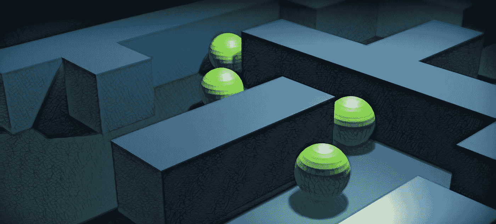
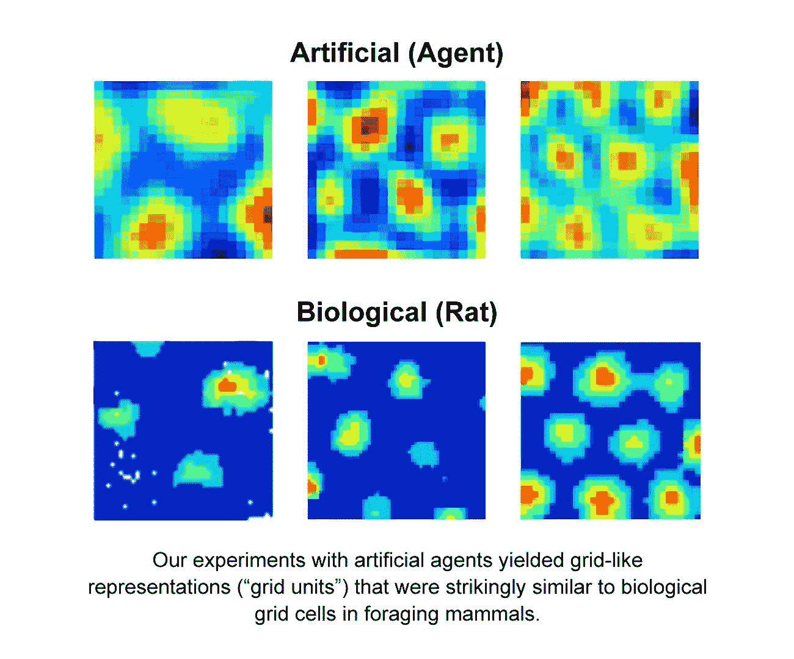
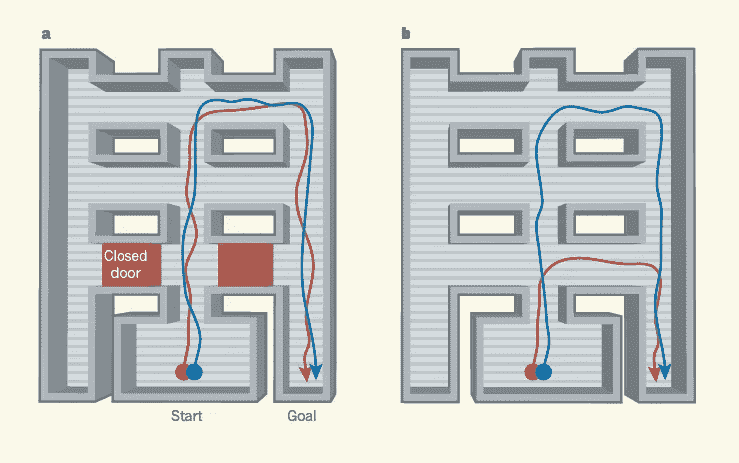

# 教神经网络像我们的大脑一样导航

> 原文：<https://pub.towardsai.net/teaching-neural-networks-to-navigate-like-our-brain-1bbfd51a0280?source=collection_archive---------1----------------------->

## [深度学习](https://towardsai.net/p/category/machine-learning/deep-learning)

## DeepMind 的新研究利用神经科学的进步来简化神经网络导航物理环境的方式。

来源:[https://magnus-engstrom . medium . com/building-an-ai-to-navigate-a-maze-899 BF 03 f 224d](https://magnus-engstrom.medium.com/building-an-ai-to-navigate-a-maze-899bf03f224d)

> 我最近创办了一份专注于人工智能的教育时事通讯，已经有超过 10 万名订户。《序列》是一份无废话(意思是没有炒作，没有新闻等)的 ML 导向时事通讯，需要 5 分钟阅读。目标是让你与机器学习项目、研究论文和概念保持同步。请通过订阅以下内容来尝试一下:

 [## 序列|克塞尼亚·塞梅诺娃|子堆栈

### 订阅人工智能世界中最相关的项目和研究论文。受到 102，000 多人的信任…

thesequence.substack.com](https://thesequence.substack.com/) 

因为我们是婴儿，我们发展了一种内在的能力，在不依赖父母或任何第三方老师的情况下驾驭任意复杂的环境。记住路径，走捷径，或者通过特定的地标来识别地点，这些认知能力对我们来说是如此的自然，以至于我们很少去思考它们。这种认知特征不是人类独有的，在大多数哺乳动物中都存在。然而，空间导航在人工智能(AI)程序中仍然具有难以置信的挑战性。最近来自 DeepMind 团队的[研究提出了一种新技术，利用神经科学研究的一些新想法，在人工智能代理中实现空间导航。](https://www.nature.com/articles/s41586-018-0102-6)

直到最近，从神经科学的角度来看，空间导航仍然是一个谜。我们的大脑有哪些特定的能力可以让人类和其他哺乳动物从一个地方导航到另一个地方，而似乎没有思考，绕过障碍，甚至找到捷径？这个谜题在 2005 年得到了部分解答，当时神经科学家迈·布里特·莫泽和爱德华·莫索尔发现，当动物探索它们的环境时，大脑的某些区域包括以惊人的规则六边形模式放电的神经元。这个点阵被认为是我们大脑中的内部坐标系统。研究确定了三种与导航能力有关的脑细胞:**位置细胞**记忆过去的位置，**头部方向细胞**感知运动和方向，**网格细胞**将空间环境划分为类似于地图上坐标系的蜂窝状六边形网格。这一发现是如此具有突破性，以至于该团队被授予了 2014 年诺贝尔生理学或医学奖，因为它揭示了空间的认知表征可能是如何工作的。13 年后，DeepMind 团队正在将网格细胞背后的一些想法应用到人工智能程序的空间导航中。

标题为[“在人工智能体中使用网格状表示的基于矢量的导航”](https://www.nature.com/articles/s41586-018-0102-6)的论文提出了一种受网格单元研究启发的技术，该技术能够在人工智能体中实现基于矢量的导航。在这项研究中，研究人员使用真实世界的数据，模拟了大量食草啮齿动物的运动轨迹，然后建立模型来学习这些运动。这些模型基于**递归神经网络(RNN)** 和**长短期记忆(LSTM)** 算法**、**，这些算法记忆代理先前的位置、方向和速度，然后将这些与历史信息相结合，以做出下一步行动。结果显示，人工智能代理的导航模式与动物的导航模式有惊人的相似之处。

来源:DeepMind

研究的下一步是将最初的“网格网络”与更大的网络架构结合起来，创建一个可以使用深度强化学习训练的人工智能代理，以在具有挑战性的虚拟现实游戏环境中导航到目标。该过程的这一步旨在验证格网单元可以支持基于矢量的导航的理论。令人震惊的是，人工智能代理的表现超出了人类的水平，超过了专业游戏玩家的能力，并展示了通常与动物相关的灵活导航类型，在可行时选择新颖的路线和捷径。

来源:DeepMind

为了量化网格细胞在人工智能代理的矢量导航能力中的相关性，DeepMind 团队使用了一种“via negativa”方法，并使神经网络中的网格细胞沉默。在这一点上，代理的导航能力受损，关键指标(如距离和目标方向)的表示变得不太准确。

来源:DeepMind

DeepMind 提出的网格导航架构可以对包括自动驾驶汽车在内的各种行业的机器人系统产生深远的影响。这项研究是 DeepMind 通过从前沿神经科学研究中汲取灵感来推进人工智能的又一个例子。