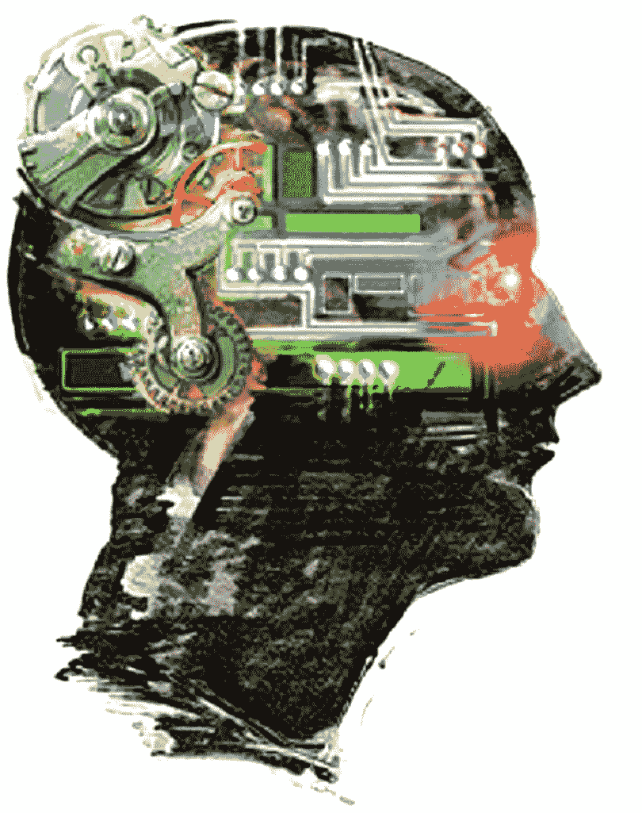

# 倡导使用人工智能的科技公司

> 原文：<https://pub.towardsai.net/tech-companies-championing-the-use-of-artificial-intelligence-ce5a81b143c1?source=collection_archive---------3----------------------->

## 科技巨头在 AI | [走向 AI](https://towardsai.net)

人工智能是科技行业最大的革命。随着各种应用跨越各个行业，人工智能开始渗透到我们生活的方方面面。然而，尽管许多人在寻找它的位置时遇到了问题，但一些公司已经能够整合它，并已经享受到了好处。也就是说，我们来看看后者，以及他们是如何让人工智能融入他们的运营的:

## **百度**

百度被称为中国的谷歌。价值 550 亿美元，总部位于北京的百度正在致力于将人工智能[与语音识别](https://tech.co/news/artificial-intelligence-change-way-work-2017-10)相结合，该项目被称为 Deep Speech 2。

## **特斯拉**

ElonMusk 的转型运输集团利用人工智能开发实用地图，这要归功于从该公司的雷达和相机获得的实时数据。通过这样做，他们能够有效地减少汽车事故的发生率，特别是他们的旗舰自动驾驶汽车减少了约 50%。现在，特斯拉汽车正在下线，自动驾驶的承诺已经成为现实。

## **字母表**

Alphabet 是谷歌所有公司的控股公司，该公司几乎在其所有的应用程序和平台中都使用了人工智能。例如，谷歌上超过 20%的搜索是语音生成的，用户使用谷歌的语音识别系统。然而，Alphabet 为人工智能带来的最大荣誉之一可能是 Deep Mind 成为世界上最杰出的围棋选手。

## **英伟达**

英伟达成名的全部本质将是“芯片上的人工智能”。其“盒子里的人工智能”的开发设定了虚拟现实程序、自动驾驶(该公司的客户特斯拉正在使用)以及无人机的更安全应用等应用。英伟达芯片使机器(如机器人和无人机)能够实时适应周围的环境，这要归功于本地处理的奇迹。

## **脸书**

脸书最近可能因为 Oculus Rift 产品而变得流行，但马克·扎克伯格拥有的公司也能够在许多努力中应用人工智能。

## **滴滴出行**

滴滴出行实际上刚刚收购了优步中国，但很多人不知道，在该公司的 5000 名员工中，有几百人在积极从事人工智能工作。该公司的运输效率系统每天能够生成 70tb 的数据，所有这些数据都来自同一时期进行的 1400 多万次乘坐(请注意，这两个数字都在稳步增长)。该公司已经能够将人工智能工作重点放在智能路由、能源优化和限制路线周围的交通拥堵上。

## **微软**

比尔·盖茨的宝宝刚刚成立了一个由大约 5000 人组成的业务部门，这个部门致力于在广泛的业务线中使用人工智能。根据塞特亚·纳德拉(微软首席执行官)的说法，人工智能将被嵌入并整合到公司提供的所有平台和体验中。

## **不大可能**

Improbable 是一个总部位于伦敦的操作系统，他们通过使用深度收入和人工智能来模拟现实。与用基于[机器学习](https://blogs.nvidia.com/blog/2016/07/29/whats-difference-artificial-intelligence-machine-learning-deep-learning-ai/)的方法为平台播种相反，不可能正在开发一种操作系统，它将允许用户编写他们现实的规则并影响这些规则。

## **博世**

这家总部位于德国的制造集团一直专注于人工智能的发展，因为他们认为这是未来利润和收入增长的途径。博世预测，通过利用基于机器学习和自我监控的预测性维护，他们将能够从下一代产品中增加 10 亿美元的收入并节省 10 亿美元的支出。

## **IBM**

IBM 似乎把他们的整个存在都押在了人工智能的发展上。

这家科技巨头可能正在与连续 17 个季度的收入下降作斗争，但该公司仍然坚定不移地追求人工智能的增长。作为这一努力的一部分，该公司收购了 Weather Company 和 Truven Health Analytics 等公司，以训练和开发其旗舰人工智能 Watson。