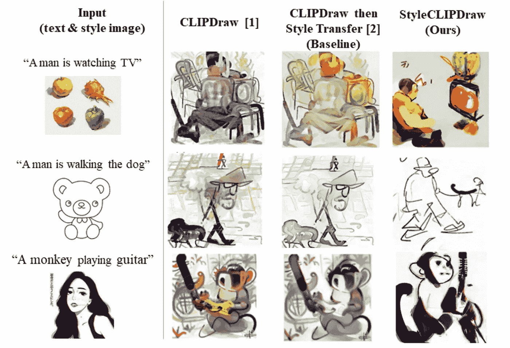
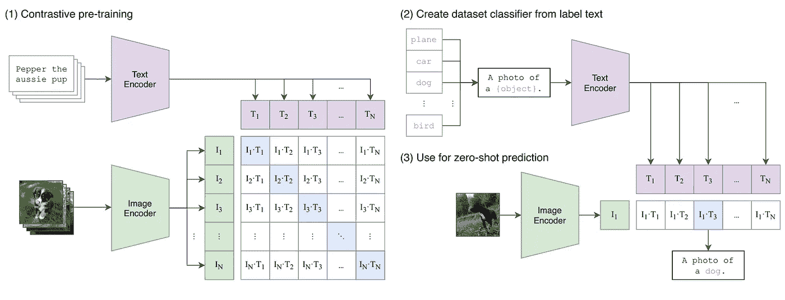
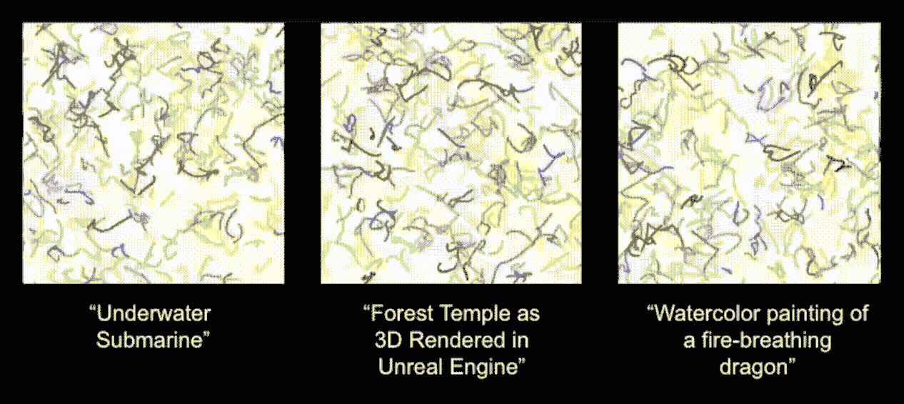
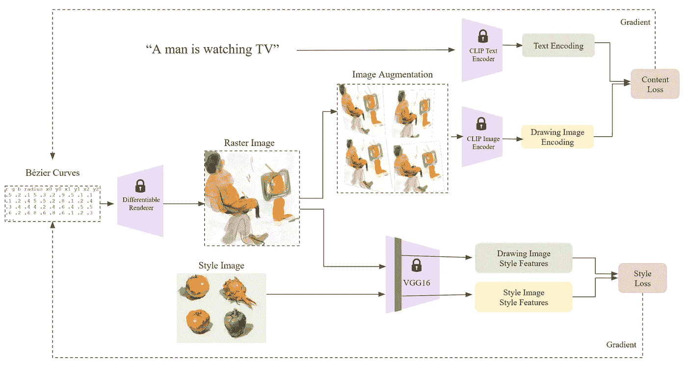

# 具有艺术控制的文本到绘图合成| CLIPDraw & StyleCLIPDraw

> 原文：<https://pub.towardsai.net/text-to-drawing-synthesis-with-artistic-control-clipdraw-styleclipdraw-dd56fa208bea?source=collection_archive---------0----------------------->

## [人工智能](https://towardsai.net/p/category/artificial-intelligence)

## 给你想要复制的风格拍张照，输入文字，算法会从中生成一张新的图片！

输入文本和样式的示例结果(左)、基线比较(中间两列)和 StyleCLIPDraw 结果(右)。图片来自[画纸](https://arxiv.org/pdf/2111.03133.pdf)。

> 最初发表于 [louisbouchard.ai](https://www.louisbouchard.ai/clipdraw/) ，前两天在[我的博客](https://www.louisbouchard.ai/clipdraw/)上看到的！

## 看视频！

你有没有梦想过采用一种图片风格，比如这种很酷的抖音绘画风格，并将其应用到你选择的新图片中？是的，我做到了，而且从来没有这么容易做到。事实上，你甚至可以只通过文本来实现这一点，现在就可以用这种新方法和他们为每个人提供的 Google Colab 笔记本来尝试。只需拍下你想要复制的样式的图片，输入你想要生成的文本，这个算法就会从中生成一张新的图片！回头看看上面的结果就知道了，这么大的进步！结果非常令人印象深刻，尤其是如果您考虑到它们是由单行文本构成的！老实说，如果你选择一个更复杂或者更乱的画风，有时候看起来会有点乱。

正如我们所说，Peter Schaldenbrand 等人的这个新模型称为 StyleCLIPDraw，它是对 Kevin Frans 等人的 CLIPDraw 的改进，它将图像和文本作为输入，并可以根据您的文本和图像中的样式生成新图像。我将快速展示如何使用它并轻松地处理他们的代码，但首先，让我们看看他们是如何做到这一点的。因此，模型必须理解文本和图像中的内容，才能正确地复制其样式。正如你可能会怀疑的那样，这是非常具有挑战性的，但是我们很幸运有很多研究人员致力于这么多不同的挑战，比如试图将文本与图像联系起来，这就是 CLIP 可以做到的。

剪辑编码系统比较文本输入与图像。图片来自 [CLIP 的博文](https://openai.com/blog/clip/)。

很快，CLIP 是 OpenAI 开发的一个模型，它基本上可以将一行文本与一幅图像相关联。文本和图像将被类似地编码，因此如果它们表示相同的东西，它们在它们被编码的新空间中将彼此非常接近。使用 CLIP，研究人员可以理解用户输入的文本，并从中生成图像。如果你还不熟悉 CLIP，我推荐你阅读[我今年早些时候和 DALL-E 一起写的关于它的文章。](/openais-dall-e-text-to-image-generation-explained-1f6fb4bb5a0a)

但是，他们是如何将一种新的风格运用到其中的呢？CLIP 只是将现有图像链接到文本。它不能创建新的图像…

事实上，我们还需要其他东西来捕捉发送的图像的纹理和形状风格。图像生成过程非常独特。它不会简单地立即生成图像。相反，它会简单地在画布上绘制，并随着时间的推移变得越来越好。它会先随机绘制线条，并创建一个初始图像，如下图所示，然后汇聚成最终图片。

CLIPDraw 从文本中合成新颖的图画。[自己玩代码库。](https://colab.research.google.com/github/%20kvfrans/clipdraw/blob/main/clipdraw.ipynb)图片归功于伟大的 [CLIPDraw 作者的博文](https://kvfrans.com/clipdraw-exploring-text-to-drawing-synthesis/)。

然后，这个新图像被发送回算法，并与样式图像和文本进行比较，这将生成另一个版本。这是一次迭代。在每一次迭代中，如上面的 gif 图所示，我们再次绘制随机曲线，由我们马上会看到的两个损失来确定方向。这个随机的过程很酷，因为它也允许每个新的测试看起来不同。所以使用相同的图像和相同的文本作为输入，你会得到不同的结果，看起来甚至更好！

StyleCLIPDraw 的模型架构。首先，我们生成一个随机线条的图像。然后，我们将它的编码与图像的样式和文本进行比较。我们利用这些信息来指导下一代，并重复这一过程，直到取得令人满意的结果。图片来自 [StyleCLIPDraw paper](https://arxiv.org/pdf/2111.03133.pdf) 。

这里你可以看到一个非常重要的步骤，叫做图像增强。它将基本上创建图像的多种变化，并允许模型收敛于人类看起来正确的结果，而不仅仅是机器的正确数值。重复这个简单的过程，直到我们对结果满意为止！

因此，整个模型通过多次迭代动态学习，优化我们在这里看到的两个损失。一个用于将图像内容与发送的文本对齐，另一个用于样式。在这里，您可以看到第一个损失是基于剪辑编码的接近程度，正如我们前面所说，剪辑基本上是判断结果，它的决定将指导下一代。第二个也很简单。我们将两幅图像都发送到一个像 VGG 一样预先训练好的卷积神经网络中，它将像 CLIP 一样对图像进行编码。然后我们比较这些编码来衡量它们之间的接近程度。这将是我们的第二个法官，也将引导下一代。这样，使用两个法官，我们可以在下一代中同时更接近文本和想要的风格。如果你不熟悉卷积神经网络和编码，我强烈建议观看我用简单的术语解释它们的短视频！这个迭代过程使得模型生成一个漂亮的图像有点慢，但是经过几百次迭代，或者换句话说，几分钟后，你就有了你的新图像！我保证等待是值得的！

现在是你期待已久的有趣部分……事实上，你现在就可以使用它，免费或至少相当便宜，使用下面参考资料中链接的 [Colab 笔记本](https://colab.research.google.com/github/pschaldenbrand/StyleCLIPDraw/blob/master/Style_ClipDraw_1_0_Refactored.ipynb)。我在运行它时遇到了一些问题，如果你想在没有任何问题的情况下使用它，我建议你购买专业版。不然遇到什么问题可以在评论里随便问我。请在 LinkedIn、Twitter 或直接在这里给我发消息！我几乎都亲自看过了。

要使用它，您只需运行所有单元(如本文顶部的视频所示)，就可以了。您可以输入新的文本或通过链接发送新的样式图像，瞧！现在调整这里的参数，看看你能做什么！如果你玩它，请在 Twitter 上把你的结果发给我，并给我贴上标签。我很想看看他们！

正如他们在论文中指出的，结果将与他们使用的模型有相同的偏差，例如 CLIP，如果你使用它，你应该考虑它。当然，这只是论文的一个简单概述，我强烈建议您阅读 CLIPDraw 和 StyleCLIPDraw，了解更多的技术细节，并尝试他们的 Colab 笔记本。两者都在下面的参考文献中链接。

感谢[重量&偏见](https://wandb.ai/site)赞助本周的视频和文章，非常感谢你一直看到最后。我希望你喜欢本周的视频！让我知道你的想法，以及你将如何使用这一新模式！

如果你喜欢我的工作，并想与人工智能保持同步，你绝对应该关注我的其他社交媒体账户( [LinkedIn](https://www.linkedin.com/in/whats-ai/) 、 [Twitter](https://twitter.com/Whats_AI) )并订阅我的每周人工智能[简讯](http://eepurl.com/huGLT5) ！

## 支持我:

*   支持我的最好方式是成为这个网站的成员，或者如果你喜欢视频格式，在 **YouTube** 上订阅我的频道。
*   在 [**中**](https://whats-ai.medium.com/) 跟我来
*   想进入 AI 或者提升技能，[看这个](https://www.louisbouchard.ai/learnai/)！

## 参考

*   2021 年，弗兰斯，k，索罗斯，L.B .和维特科夫斯基。CLIPDraw:通过语言图像编码器探索文本到绘图的合成。[https://arxiv.org/abs/2106.14843](https://arxiv.org/abs/2106.14843)
*   CLIPDraw 代码:[https://colab . research . Google . com/github/kvfrans/clip draw/blob/main/clip draw . ipynb](https://colab.research.google.com/github/kvfrans/clipdraw/blob/main/clipdraw.ipynb)
*   Schaldenbrand，p .，Liu，z .和 Oh，j .，2021。StyleCLIPDraw:文本到绘图合成中内容和样式的耦合。[https://arxiv.org/abs/2111.03133](https://arxiv.org/abs/2111.03133)
*   StyleCLIPDraw 代码:[https://github.com/pschaldenbrand/StyleCLIPDraw](https://github.com/pschaldenbrand/StyleCLIPDraw)
*   StyleCLIPDraw Colab:[https://Colab . research . Google . com/github/pschaldenbrand/StyleCLIPDraw/blob/master/Style _ clipdraw . ipynb](https://colab.research.google.com/github/pschaldenbrand/StyleCLIPDraw/blob/master/Style_ClipDraw.ipynb)