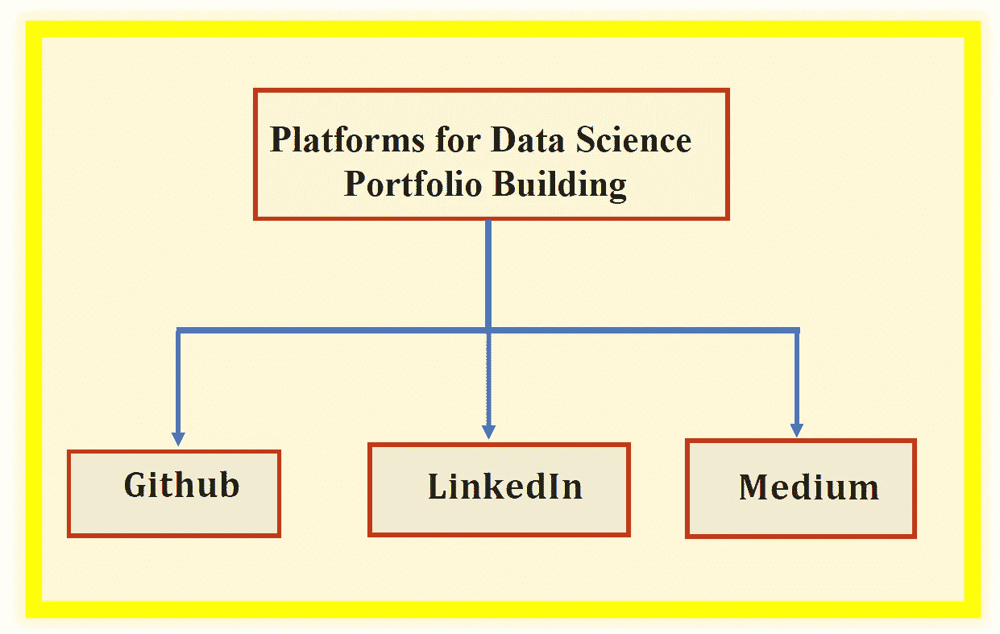

# 数据科学项目管理的 4 P

> 原文：<https://pub.towardsai.net/the-4-ps-of-data-science-project-management-f0334e52a0c1?source=collection_archive---------0----------------------->

## 规划、准备、制作和发布您的数据科学项目

图片来源:Pexels

*因失败而准备***，你因失败而准备**—富兰克林**

**T 本文将讨论数据科学项目管理的 4p:**计划**、**准备**、**产生**、**发布**。良好的计划和准备不仅会提高生产率，而且有助于避免项目执行过程中可能遇到的潜在陷阱和障碍。**

# **1.计划**

**在建立任何机器学习模型之前，认真坐下来计划你希望你的模型完成什么是很重要的。在深入研究编写代码之前，了解要解决的问题、数据集的性质、要构建的模型的类型以及如何训练、测试和评估模型是非常重要的。**

**你可以从提供一个简短的概要开始，然后是一个你想完成的一步一步的计划。例如，在构建模型之前，您可能会问自己:**

**㈠什么是预测变量？**

**㈡目标变量是什么？我的目标变量是离散的还是连续的？**

**(三)我应该使用分类还是回归分析？**

**(iv)如何处理数据集中缺失的值？**

**㈤在将变量纳入同一尺度时，我应该使用规范化还是标准化？**

**(vi)我是否应该使用主成分分析？**

**(vii)如何调整模型中的超参数？**

**(viii)如何评估我的模型以检测数据集中的偏差？**

**(ix)我是否应该使用集成方法，即使用不同的模型进行训练，然后进行集成平均，例如使用 SVM、KNN、逻辑回归等分类器，然后在 3 个模型上进行平均？**

**(x)我如何选择最终型号？**

# **2.准备**

**在执行之前，提前准备好如何着手项目是很重要的。你可能会问自己以下问题:项目的规模有多大？是个人项目吗？我需要有队友吗？什么平台最适合构建模型？应该用 R Studio 还是 Jupyter 笔记本？它是否需要使用高性能计算资源等先进的生产力工具，或者 AWS 或 Azure 等云服务？项目完成的时间表是什么？**

# **3.生产(设计、构建和执行您的模型)**

*****挑选与你的数据和想要的结果相匹配的机器学习工具。在自动化流程、图形编辑器或编码您自己的模型之间进行选择。用可用数据训练模型。*****

**在这里，您可以选择想要使用的模型，例如线性回归、逻辑回归、KNN、SVM、朴素贝叶斯、决策树、深度学习、K 均值、蒙特卡洛模拟、时间序列分析等。数据集必须分为训练集、验证集和测试集。超参数调整用于微调模型，以防止过度拟合。执行交叉验证是为了确保模型在验证集上表现良好。在微调模型参数之后，将模型应用于测试数据集。该模型在测试数据集上的性能大约等于该模型用于对未知数据进行预测时的预期性能。**

# **4.发布(实现、部署或展示您的工作)**

**在这个阶段，最终的机器学习模型被投入生产，以开始改善客户体验或提高生产率，或者决定银行是否应该批准向借款人提供信贷，等等。该模型在生产环境中进行评估，以评估其性能。这可以通过使用诸如 A/B 测试的方法将机器学习解决方案的性能与基线或控制解决方案进行比较来完成。从实验模型转换到生产线上的实际性能时遇到的任何错误都必须进行分析。然后，这可以用于微调原始模型。在一些大型项目中，数据科学家必须与其他公司官员和软件工程师合作部署模型，例如构建一个基于 web 的界面，该界面可以实时读取数据，将数据输入模型，然后使用最终模型进行预测。**

**如果该项目是一个小规模的个人项目，您可以决定使用下图所示的任何平台来展示您的作品:**

****

**Benjamin O. Tayo 的图片**

**总之，我们已经讨论了数据科学项目管理的 4 个基本步骤:计划、准备、生产和发布。良好的计划和准备不仅会提高生产率，而且有助于避免项目执行过程中可能遇到的潜在陷阱和障碍。谨记“*由失败到* ***准备*** *，你是* ***准备失败***——富兰克林。**

# **其他数据科学/机器学习资源**

**[数据科学课程](https://medium.com/towards-artificial-intelligence/data-science-curriculum-bf3bb6805576)**

**[机器学习的基本数学技能](https://medium.com/towards-artificial-intelligence/4-math-skills-for-machine-learning-12bfbc959c92)**

**[3 个最佳数据科学 MOOC 专业](https://medium.com/towards-artificial-intelligence/3-best-data-science-mooc-specializations-d58da382f628)**

**[进入数据科学的 5 个最佳学位](https://towardsdatascience.com/5-best-degrees-for-getting-into-data-science-c3eb067883b1)**

**[2020 年开始数据科学之旅的 5 个理由](https://towardsdatascience.com/5-reasons-why-you-should-begin-your-data-science-journey-in-2020-2b4a0a5e4239)**

**[数据科学的理论基础——我应该关心还是仅仅关注实践技能？](https://towardsdatascience.com/theoretical-foundations-of-data-science-should-i-care-or-simply-focus-on-hands-on-skills-c53fb0caba66)**

**[机器学习项目规划](https://towardsdatascience.com/machine-learning-project-planning-71bdb3a44349)**

**[如何组织你的数据科学项目](https://towardsdatascience.com/how-to-organize-your-data-science-project-dd6599cf000a)**

**[大型数据科学项目的生产力工具](https://medium.com/towards-artificial-intelligence/productivity-tools-for-large-scale-data-science-projects-64810dfbb971)**

**[数据科学作品集比简历更有价值](https://towardsdatascience.com/a-data-science-portfolio-is-more-valuable-than-a-resume-2d031d6ce518)**

**[使用协方差矩阵图进行特征选择和降维](https://medium.com/towards-artificial-intelligence/feature-selection-and-dimensionality-reduction-using-covariance-matrix-plot-b4c7498abd07)**

**[数据科学 101 —包含 R 和 Python 代码的中型平台短期课程](https://medium.com/towards-artificial-intelligence/data-science-101-a-short-course-on-medium-platform-with-r-and-python-code-included-3cdc9d489c6d)**

*****如有疑问和咨询，请发邮件给我*【benjaminobi@gmail.com :****