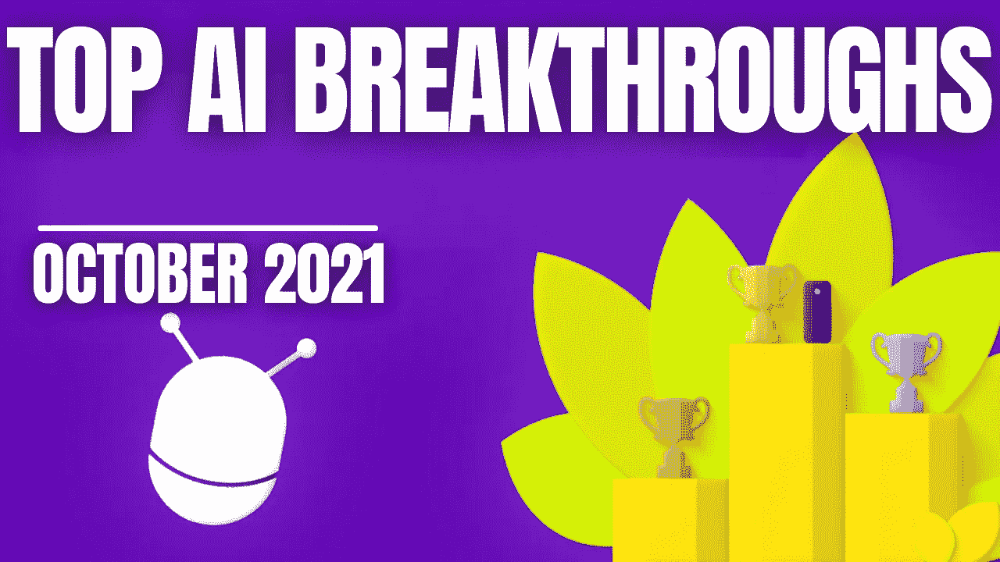

# 人工智能月度前三名—2021 年 10 月

> 原文：<https://pub.towardsai.net/the-ai-monthly-top-3-october-2021-35ad05d6fdeb?source=collection_archive---------3----------------------->

## 十月最有趣的人工智能突破，包括视频演示、短文、代码和论文参考。

> 最初发表于 [louisbouchard.ai](https://www.louisbouchard.ai/the-ai-monthly-top-3-october-2021/) ，前两天在[我的博客](https://www.louisbouchard.ai/the-ai-monthly-top-3-october-2021/)上读到的！

如果你错过了其中的任何一篇，这里有 3 篇本月最有趣的研究论文。这是一份按发布日期排列的**在人工智能和数据科学方面的最新突破列表，带有**清晰的视频解释**、**指向更深入文章的链接**，以及**代码**(如果适用)。享受阅读，如果我错过了任何重要的论文，请在评论中告诉我，或者直接在 [LinkedIn](https://www.linkedin.com/in/whats-ai/) 上联系我！**

如果你也想阅读更多的研究论文，我推荐你阅读我的文章**，在那里我分享了寻找和阅读更多研究论文的最佳技巧。**

> **关注我[中](https://whats-ai.medium.com/membership)看这个 AI 月度 top 3！**

# **论文#1:**

## **[使用雷达深度生成模式的巧妙降水临近预报【1】](https://www.nature.com/articles/s41586-021-03854-z)**

**DeepMind 刚刚发布了一个生成模型，该模型在 89%的情况下能够胜过广泛使用的临近预报方法，其准确性和实用性由 50 多位专家气象学家评估！他们的模型侧重于预测未来 2 小时的降水量，并取得了令人惊讶的好成绩。这是一个生成模型，这意味着它将生成预测，而不是简单地预测它们。它基本上利用过去的雷达数据来创建未来的雷达数据。因此，利用过去的时间和空间成分，他们可以生成它在不久的将来的样子。**

**您可以看到这与 Snapchat 滤镜一样，获取您的面部，并生成一个带有修改的新面部。为了训练这样一个生成模型，你需要来自人脸和你想要生成的人脸类型的大量数据。然后，使用经过许多小时训练的非常相似的模型，你将拥有一个强大的生成模型。这种模型通常使用 GANs 架构进行训练，然后独立使用生成器模型。如果你不熟悉生成模型或 GANs，我邀请你观看我制作的许多视频中的一个，比如这个关于动画的视频。**

## **观看视频**

## **简短阅读版本**

** [## DeepMind 使用人工智能来预测更准确的天气预报

### 50 多名专家气象学家评估 DeepMind 的新模型在 89%的情况下击败了当前的临近预报方法，因为它…

pub.towardsai.net](/artificial-intelligence-4d7b12727ac4) 

Colab 笔记本:[https://github . com/deep mind/deep mind-research/tree/master/now casting](https://github.com/deepmind/deepmind-research/tree/master/nowcasting)

**

# **论文#2:**

## **[鸡尾酒叉问题:现实世界原声的三茎音频分离[2]](https://arxiv.org/pdf/2110.09958.pdf)**

**你有没有收听过一个视频或电视节目，而演员完全听不见，或者音乐太大声？嗯，这个问题，也叫鸡尾酒会问题，可能再也不会发生了。三菱和印第安纳大学刚刚发布了一个新的模型和一个新的数据集来处理识别正确的配乐的任务。例如，如果我们把刚才播放的同一个音频片段的音乐音量调得太大，你可以简单地调高或调低音轨，让语音比音乐更重要。**

**这里的问题是从复杂的声学场景中分离出任何独立的声源，比如电影场景或 youtube 视频，其中一些声音不平衡。有时你根本听不到一些演员的声音，因为背景中有音乐、爆炸声或其他环境声音。嗯，如果你成功地隔离了一个音轨中的不同类别，这意味着你也可以只调高或调低其中一个类别，就像把音乐调低一点，以便正确地听到所有其他演员的声音。这正是研究人员所取得的成果。**

## **观看视频**

## **简短阅读版本**

** [## 用人工智能分离语音、音乐和音效

### 如果我们在播放音乐的时候声音太大，你只需要调高音量，调低音乐就可以了！

pub.towardsai.net](/separate-voice-music-and-sound-effects-with-ai-9a652f4f9cfc) 

项目页面:[https://cocktail-fork.github.io/](https://cocktail-fork.github.io/)

DnR 数据集:[https://github.com/darius522/dnr-utils#overview](https://github.com/darius522/dnr-utils#overview)

**

# **论文#3:**

## **[ADOP:近似可微分单像素点渲染[3]](https://arxiv.org/pdf/2110.06635.pdf)**

## **观看视频**

## **简短阅读版本**

** [## 人工智能从一对夫妇的图像合成流畅的视频！

### 让我们从几张照片中构建 3D 模型…

pub.towardsai.net](/ai-synthesizes-smooth-videos-from-a-couple-of-images-aeb288493b3d) 

代号:【https://github.com/darglein/ADOP ** 

**如果你喜欢我的工作，并想与人工智能保持同步，你绝对应该在我的其他社交媒体账户( [LinkedIn](https://www.linkedin.com/in/whats-ai/) 、 [Twitter](https://twitter.com/Whats_AI) )上关注我，并订阅我的每周人工智能 [**简讯**](http://eepurl.com/huGLT5) ！**

## **支持我:**

*   **支持我的最好方式是在 [**媒体**](https://whats-ai.medium.com/membership) 上关注我，或者如果你喜欢视频格式，在[**YouTube**](https://www.youtube.com/channel/UCUzGQrN-lyyc0BWTYoJM_Sg)**上订阅我的频道。****
*   ****支持我在 [**Patreon**](https://www.patreon.com/whatsai) **上的工作。******
*   ****加入我们的 [**Discord 社区:** **一起学 AI**](https://discord.gg/learnaitogether)和*分享你的项目、论文、最佳课程、寻找 Kaggle 队友等等！*****
*   ****这里是我作为一名研究科学家每天用来寻找和阅读人工智能研究论文的最有用的工具……[在这里阅读更多。](https://www.louisbouchard.ai/research-papers/)****

## ****参考****

****[1]拉武里、伦克、王绍博、坎金、拉姆、米罗夫斯基、菲茨西蒙斯、阿萨纳夏杜、卡舍姆、马奇和普鲁登，2021 年。使用雷达的深度生成模式的巧妙降水临近预报，[https://www.nature.com/articles/s41586-021-03854-z](https://www.nature.com/articles/s41586-021-03854-z)。****

****[2]彼得曼，d .，威彻恩，g .，王，z .，&鲁，J.L. (2021)。鸡尾酒叉问题:现实世界音轨的三干音频分离。[https://arxiv.org/pdf/2110.09958.pdf](https://arxiv.org/pdf/2110.09958.pdf)。****

****[3]吕克特博士、弗兰克博士和斯塔明格博士，2021 年。ADOP:近似可微分单像素点渲染。https://arxiv.org/pdf/2110.06635.pdf[。](https://arxiv.org/pdf/2110.06635.pdf)****