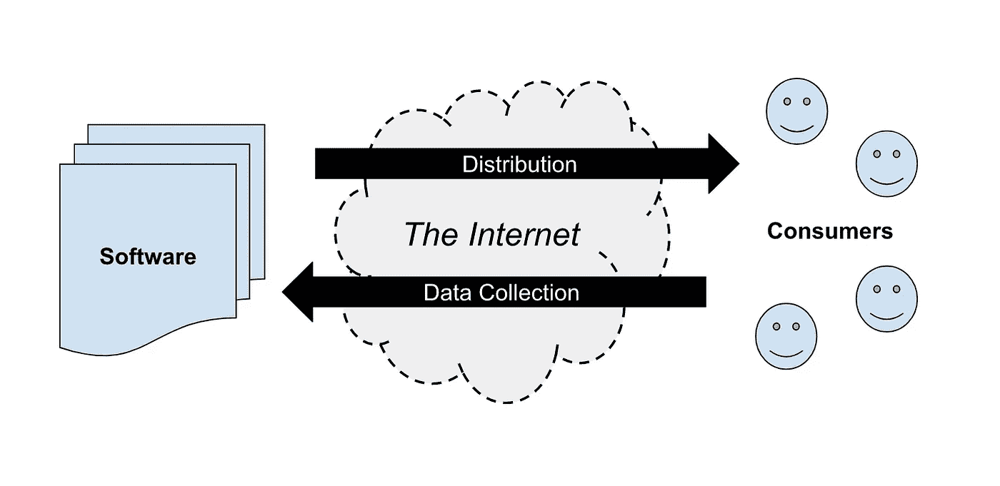

# 人工智能的美妙之处在于它生活在原子和比特之间的模糊地带

> 原文：<https://pub.towardsai.net/the-beauty-of-a-i-is-that-it-lives-in-the-twilight-zone-between-atoms-and-bits-46e99aec92c1?source=collection_archive---------3----------------------->

## 这可能也是它的主要弱点。

心智模型塑造了我们思考的方式以及我们看待周围世界的方式。这是彼得·泰尔擅长的事情。他有出色的心智模型，将比特的**世界**与原子的**世界**进行对比。

在这种二分法中，比特的世界主要是软件的世界。这是大多数创新发生的地方。而原子世界则是一切。它在创新方面落后了。

> “过去 40 年的趋势是，比特世界是未来发生的地方。”—彼得·泰尔

想想看，与你的汽车、旅行时乘坐的飞机或生病时服用的药物相比，你的智能手机在过去十年里发生了多大的变化。

很明显，一个世界比另一个世界发展得更快，但这是为什么呢？

照片由[马頔·佩丘林](https://unsplash.com/@pechka?utm_source=unsplash&utm_medium=referral&utm_content=creditCopyText)在 [Unsplash](https://unsplash.com/s/photos/secret-door?utm_source=unsplash&utm_medium=referral&utm_content=creditCopyText) 上拍摄

# 为什么比特世界成为了创新的自然栖息地，而不是原子世界？

泰尔认为，监管会减缓创新。他还发现，在一个确定性领域进行创新更容易。

## 规程

> “现实是监管经常落后于创新”——比尔·马里斯

你不需要任何人的许可来运行一个实验来为你的网站的注册按钮选择正确的颜色，但是你需要所有的许可来运行一个实验来为一种疾病选择正确的药物。

我可以不断地举出例子，证明比特的世界大多是不受管制的，而原子的世界大多是受管制的。

## 决定论

> “关于计算机的好消息是，它们会做你让它们做的事情。坏消息是他们做你让他们做的事情”——泰德·纳尔逊

当你写一个软件的时候，你可以 100%确定当给它一个特定的输入时，计算机会执行一个特定的动作。相反，当你为你的产品挂广告牌时，你不能确定看到你广告的两个人会做同样的动作。

很明显，比特的世界大部分是确定性的，而原子的世界大部分是随机的或概率性的。

# **人工智能生活在两个世界中的哪一个？**

人工智能是一种软件，这是显而易见的，人们可以假设它生活在比特世界中。但请记住我们刚刚确立的原则:

*   **比特世界:**非管制的和确定性的
*   **原子的世界:**规则的和概率的

现在，***A.I 本质上是概率性的，我们都看到大家都希望它如何被调控*** *。换句话说，它显然属于比特世界，但表现得好像属于原子世界。*

这让我思考，我该如何调和这些矛盾？

# **互联网出现之前的两个世界的故事**

在互联网出现之前，这两个世界是相当分离的。

想象一下，一家公司在 80 年代开发了一套会计软件。他们会开发出来，并把它放在磁盘上。然后，他们的销售人员会把它带到实体店，并说服店主在货架上为它腾出空间。销售人员是连接比特世界和原子世界的粘合剂。

再举一个例子，测量一个人心率或血压的医疗设备。当时，你只能通过你的医生获得这些措施。医生们被训练使用这些设备和设备上的软件。他们可以处理其次优 UX，并在将结果传达给患者之前对其进行解释。医生也是连接比特世界和原子世界的粘合剂。

比特世界和原子世界是完全分离的。软件包不需要处理用户的细微差别。软件包不需要改变自己来吸引不同的买家。他们很少需要改变自己来吸引不同的用户。软件包不需要推销自己，它们甚至不能从用户那里收集数据来学习和改进。

# 互联网之后的两个世界的故事。

互联网之后，两个世界的界限模糊了。

互联网有两个作用:(一)它改变了软件分销系统及其商业模式(二)它促进了数据收集。

来源:图片由作者提供

新的发行模式意味着软件制造商可以自动化发行过程。今天的会计软件最有可能存在于云端，并通过脸书或谷歌广告进行营销。软件生产商和广告平台都使用人工智能来扩展和优化这一过程。

在云上为新的商业模式打开了大门，比如免费增值。由于软件制造商在他们的前提下有它，他们可以很容易地免费提供一段时间，然后收费。由于他们不销售单独的版本，他们可以选择订阅模式。这意味着软件必须自我销售。它需要收集它的使用数据，从中学习，并适应让用户永远坚持。再说一次，人工智能在这里发挥了关键作用，否则我们如何才能最佳地利用用户的数据！？

> *例如，软件最细微的细节，如注册按钮，都可以根据收集的数据随时改变，以提高用户转化率。*

软件生产商也需要持续支持他们的产品，但是他们需要控制成本。再一次，人工智能需要自动化部分支持过程。它还需要使软件直观，以最大限度地减少对支持的需求。

说到可穿戴设备，现在都是外行人用。与医务人员不同，新用户不知道如何正确解读他们的心率读数。因此，新一代的联网设备不仅应该担心读数的正确性，还应该担心它们的可解释性。他们不想因为有人误解了他们刚刚在屏幕上看到的内容而被起诉。同样，人工智能结合他们收集的数据，需要使他们比 80 年代的同类产品更容易、更好、更便宜 10 倍。

## 正如你所看到的，人工智能现在生活在原子和比特之间的这个新的模糊地带。

人工智能肯定是软件，但它也扮演着以前由人类扮演的角色。人类肯定不像他们打交道的软件那样具有决定性。这就是为什么人工智能有资格扮演这个角色，因为它结合了两个世界的特点。

现在，人类以及人工智能的概率性质是可怕的。如果软件是确定性的，人们可以确保它是按照规则构建的。顺便说一下，规则本质上是确定性的，这使得用代码对它们进行编码变得很容易。但谈到人工智能，现在每个人都有发言权，可以决定如何监管它，以减轻它带来的不确定性。

## **但是不确定性似乎并没有阻碍创新**

回到彼得·泰尔的分析。人工智能似乎在进步，甚至比软件更快，不管它的概率性质如何。因此，我认为彼得·泰尔的分析在这里是不正确的。确定性与否似乎对创新影响不大。

但在监管方面，人工智能的潜力显然没有得到充分发挥。自动驾驶汽车仍然生活在实验室里，精确医疗还不是一件事。更多的例子会让人怀疑人工智能的应用是否仍然受到监管的限制，或者彼得·泰尔的分析在这里也是错误的，尽管人工智能受到监管，但它的应用注定是无处不在的。

# 同一作者的文章

 [## 机器学习&长尾悖论

### 什么时候自动化适合你的商业模式？

medium.com](https://medium.com/codex/machine-learning-the-long-tail-paradox-1cc647d4ba4b)  [## 冒险者沟通更好

### 为什么许多数据科学家无法实现他们工作的预期价值，他们如何解决这个问题

medium.com](https://medium.com/codex/risk-taking-data-scientists-communicate-better-fa47ae9d62d8)