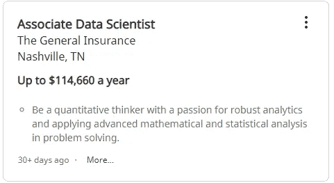
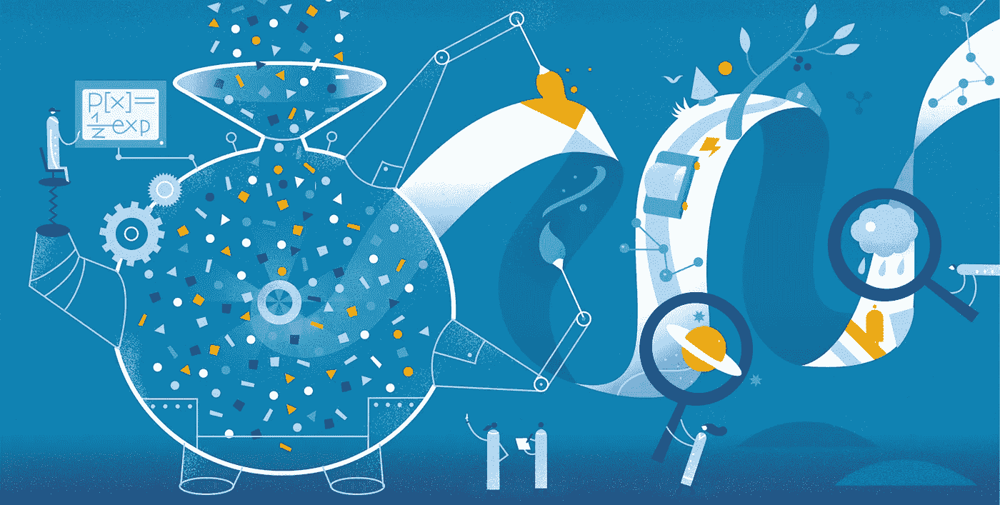
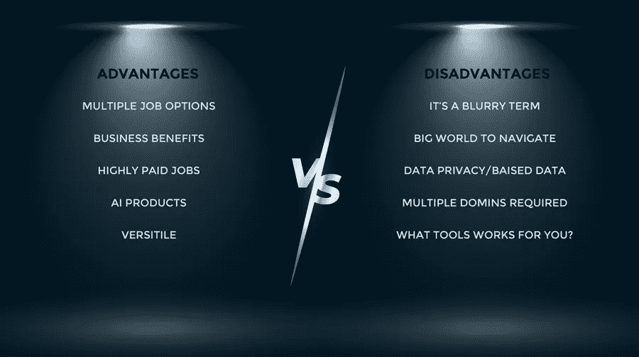

# 数据科学入门指南

> 原文：<https://pub.towardsai.net/the-beginners-guide-to-data-science-70a02f5a0ea3?source=collection_archive---------0----------------------->

## [数据科学](https://towardsai.net/p/category/data-science)

为什么数据科学如此吸引人，在开始奇妙世界的旅程之前，您需要知道哪些事情。

图片由[主演](https://www.freepik.com/starline)

# 介绍

你好👋！我的名字叫阿比德，我将是你们进入*数据科学*世界的向导。对我来说，这是一个艰难而漫长的旅程，我想让努力进入的初学者轻松一些。在告诉你如何进入之前，我想给你一个预告片，告诉你你正在进入什么领域，以及为什么你应该选择数据科学。

# 为什么是数据科学？

我的**为什么**比较个人化，和我与精神疾病的斗争有关。随着时间的推移，巴基斯坦的精神疾病越来越严重，我们年轻一代中有三分之一的人正在与抑郁症作斗争，他们没有提供任何帮助；我们没有治疗精神疾病的基础设施，当我面临同样的问题时，这让我很失望。所以，当我康复后，我把帮助这个世界的年轻一代在应对精神疾病方面获得更好的帮助作为我的使命。这就是数据科学和机器学习的由来。起初，我不知道如何编码或这些东西如何工作，但随着专注和时间的推移，我越来越了解这个世界，最近我起草了一篇关于[人工智能产品商业提案](https://medium.com/geekculture/ai-product-business-proposal-34ee3b5a2fe1)的文章，这是我朝着构建[通用人工智能](https://en.wikipedia.org/wiki/Artificial_general_intelligence)迈出的第一步，它将使用计算机视觉、文本和音频来检测精神疾病。我的教育背景与我现在所做的完全不同，所以我可以向你保证，如果我能做到，我认为任何一个有笔记本电脑的人都能做到。你需要时间和奉献，这个世界的大门会为你敞开。

激励我的第二件事是数据科学工作的高薪和福利，这个世界渴望更多的数据工程师、数据分析和数据科学家。如果你不相信我，你可以去任何本地或国际招聘网站搜索数据科学家。

信用:[玻璃门](https://www.glassdoor.com/Job/data-scientist-jobs-SRCH_KO0,14.htm)

## 薪酬分配

通过几行代码和 [Kaggle](https://www.kaggle.com/) 上公开的[数据](https://www.kaggle.com/nilimajauhari/glassdoor-analyze-gender-pay-gap)，我们可以看到数据科学家的基本工资分布。

我甚至发现了这个协理数据科学家的广告，如果你来自发展中国家，这是相当有吸引力的。甚至在我的国家，数据工程师和数据科学家的工资是医生的三倍(来源:我的两个姐姐都是医生)。

来源:indeed.com

# 什么是数据科学？

学分:[苏黎世联邦理工学院](https://ethz.ch/en/news-and-events/eth-news/news/2019/01/eth-zurich-promotes-data-science-research.html)

## 介绍

数据科学是使用现代工具和技术处理大量数据的研究领域，旨在发现看不见的模式，获取有意义的信息，并做出商业决策。数据科学使用机器学习算法建立预测模型 [(simplelearn)](https://www.simplilearn.com/tutorials/data-science-tutorial/what-is-data-science) 。简而言之，你通过使用科学工具收集数据并产生有意义的完整信息。数据科学有许多子领域，而且还在不断发展，所以不用深入，我们将了解数据科学的优点和缺点，以便更容易理解。

图片作者|元素作者 [Freepik](https://www.freepik.com/vectors/background)

## 优势

*   **多种工作选择:**在数据世界中，您可以在组织内找到多种工作机会，如数据科学家、数据分析师、研究分析师、业务分析师、分析经理，大数据工程师只是突出显示的主要工作。大多数人工智能相关的工作都非常受欢迎，每个公司都需要一名数据分析师或数据科学家来帮助他们进行商业决策。([northeastern.edu)](https://www.northeastern.edu/graduate/blog/data-science-careers-shaping-our-future/)
*   **商业利益:**当你是组织中的数据科学家时，你在解决现实世界的商业问题，你也在协助公司和其他利益相关者对产品性能做出更快、更有效的决策。商业利益的一些例子:更好的决策、更易获得的分析、自动化、预测建模、个性化、保持忠诚度&预测、优化的消息传递&解决方案，以及对活动投资回报率的准确衡量。[时代发展](https://www.tiempodev.com/blog/the-business-benefits-of-data-analytics/)
*   **高薪工作:**我已经讨论过了，我认为这是成为百万富翁的快车道，因为平均年薪超过 10 万美元。大多数员工获得了经验，并创办了自己的数据公司，最终成为百万美元的企业。[商务 Student.com](https://www.businessstudent.com/careers/highest-paying-data-science-careers/)
*   人工智能产品:人工智能产品玩起来很有趣，你可以直接帮助社区解决现实世界的问题。像犯罪控制、用水效率、预测和设计多用途药物、早期发现癌症等等。我们正在各行各业使用人工智能，做我们的工作感觉健康而有趣。你可以在内置的[上找到更多例子。](https://builtin.com/artificial-intelligence/examples-ai-in-industry)
*   **多才多艺:**我给你举个例子，因为我的专长是自然语言处理(NLP)，甚至我也不了解它的一切。NLP 只是这个大世界的一小部分，在这个子领域中还有一个全新的世界。你可以做文本分类，自动语音识别，机器翻译，文本生成，问题回答，人工智能机器人，图像到文本(OCR)，等等。有时候会觉得不知所措。因此，你将有无限的可能性来选择你的利基并为之努力。

## 不足之处

*   **这是一个模糊的术语:**数据科学是一个非常笼统的术语，没有明确的定义。很难写下数据科学家的确切定义。例如，从事 excel 工作的数据分析师可以称自己为数据科学家。现在，公司过度使用数据科学这个词来营销他们的产品，有些公司使用数据科学家这个词，但他们实际上是指前端，部署，分析师和数据工程师，集于一身。因此，你需要在求职时了解公司对数据科学的定义。
*   **一个需要探索的大世界:**数据科学中有大量的领域和子领域，有时甚至开始学习基础知识都令人害怕，因为网上有太多教授各种知识的教程。对于一个没有编程背景的人来说，很难深入这个世界，因为它太大了，不可能在一周或一个月内实现。你需要时间和努力来正确掌握基础知识，即使这样，人们仍然对自己想进入的领域和需要学习的工具感到困惑。一个有统计学背景的人可能无法在短时间内掌握计算机科学，从而让[成为一名精通数据的科学家](https://data-flair.training/blogs/how-to-become-data-scientist-infographic/)。因此，这是一个不断变化的动态领域，需要人们不断学习数据科学的各种途径。[(数据-天赋.训练)](https://data-flair.training/blogs/pros-and-cons-of-data-science/)
*   **数据隐私/数据基础:**对于很多行业来说，数据就是他们的燃料。数据科学家帮助公司做出数据驱动的决策。但是，流程中使用的数据可能会侵犯客户的隐私。 [(data-flair.training)](https://data-flair.training/blogs/pros-and-cons-of-data-science/) 任何数据架构师都有如此多的安全可变性，很难保证数据的安全和可访问性。如果我们根据来自人类的有偏见的数据训练模型，它必将产生有偏见的结果。例如，在文本生成中，我们摄取了数百万行对非洲裔美国人有负面偏见的文本数据，因此生成型 AI 会生成种族主义文本。
*   **需要多个领域:**数据科学家通常需要学习数据工程，如 MLOps (MLFlow，AirFlow)数据管道、数据接收、前端应用程序、数据治理和简化分析。这只是一个开始，在招聘过程中，公司需要数据科学领域的许多分支，如时间序列、非结构化数据、NLP、计算机视觉和其他新兴的人工智能领域。有时候，一个人需要学习和不断学习才能在公司中保持价值，这让人不知所措。
*   **什么工具对你有用:**这是初学者的困境，先学什么工具或者什么集成开发环境(IDE)最适合我，或者数据科学流行什么编程语言。我知道这很令人沮丧，唯一的出路就是使用预装的 cloud IDE。有时你开始学习一种工具，但你工作的公司更喜欢不同的工具，如 R 或 Tableau 或仪表板设计。这非常令人沮丧，因为在这个领域没有标准的工具。

# 最后的想法

我谈到了我的奋斗以及我是如何进入数据科学的，这对我是一个巨大的成就，每天我都离我的目标越来越近。在数据科学的世界里，有很多守门人，专家会要求你学习高等数学、编程、工具并获得官方学位，但这些东西在现实生活中并不重要。可以学习免费的网络课程；你可以学习编程的基础知识，你可以选择任何免费的云 IDE，如 [Google Colab](https://colab.research.google.com/) 和 [Deepnote](https://deepnote.com/) ，开始从事简单的数据科学项目。要我说，你唯一需要的两样东西就是**时间**和**奉献**去学习这些东西。

我在[数据营](https://www.datacamp.com/users/sign_in?redirect=https%3A%2F%2Flearn.datacamp.com%2F)和[代码学院](https://www.codecademy.com/catalog)开始了我的旅程。付费课程让你致力于按时完成课程，它们有一个交互式的编码环境，可以帮助你快速学习编码。这些课程还为你提供了结业证书，你可以在简历或 LinkedIn 上使用。一旦你掌握了编程的基本知识，是时候开始从事互联网上的简单项目了，随着时间的推移，你会找到适合你的工作。不要忘记在 [GitHub](https://github.com/) 或 [Medium](http://medium.com/) 上分享你的工作，因为这将增加你被聘用的机会。

# “唯一会阻止你实现梦想的是你自己。”——汤姆·布拉德利。