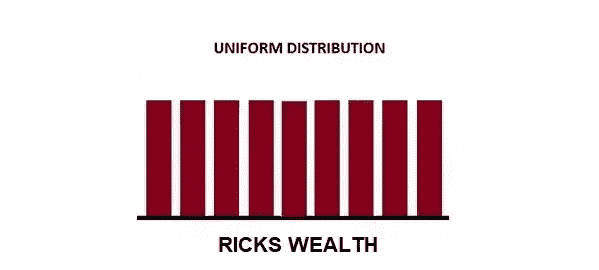
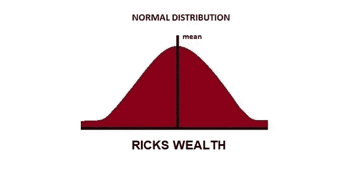
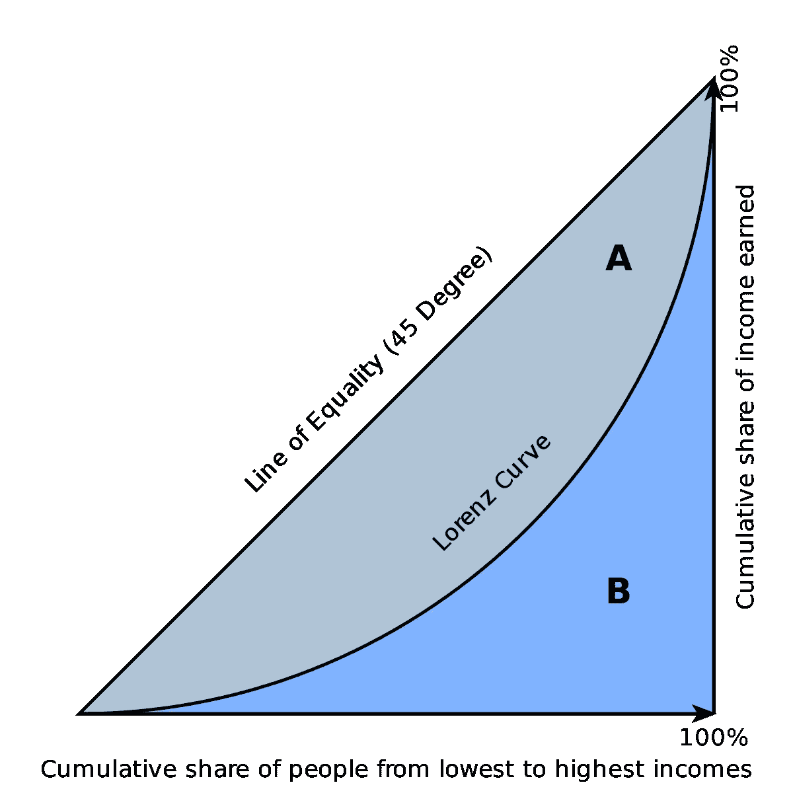
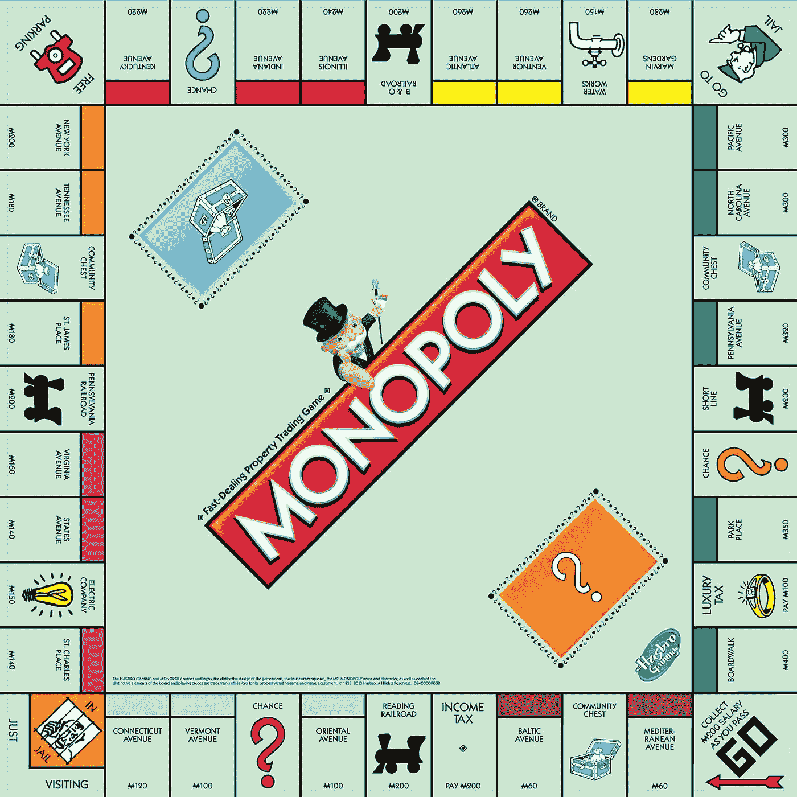

# 里克斯的城堡:不平等的帕累托分布效应

> 原文：<https://pub.towardsai.net/the-citadel-of-ricks-the-pareto-distribution-effect-on-inequality-af7923c3b4a9?source=collection_archive---------1----------------------->

## [数学](https://towardsai.net/p/category/mathematics)

## 为什么里克斯城堡显示出巨大的不平等迹象？

电视连续剧《瑞克和莫蒂》中有一个对帕累托分布最奇怪的描述。电视剧主角里克·桑切斯(Rick Sanchez)被称为宇宙中最聪明的生物。

在瑞克和莫蒂的奢侈宇宙中，银河系中存在着一个叫做瑞克城堡的城市，一个来自不同维度的瑞克可以聚集的地方:一个只属于瑞克(和莫蒂)的城市。城堡的人口仅由来自不同维度的里克斯组成，他们每个人都具有相同的智商和个性(我也可以声称里克斯城堡的人口特征存在差异，但与我们的社会可以计算的特征相比微不足道)。

尽管如此，城市中的每个里克都有不同的工作，不同的报酬，在“克隆人”社会中有不同的社会地位。

## 城堡的故事

揭示这种不平等程度的一集叫做《城堡的故事》，在第三季第七集播出。从本质上说，城市已经发展得如此之大，以至于所有的人都建立了自己的经济，他们中的每一个人都是社会中同等数量的人的参与者。像每个社会一样，这个群体中有些人被抛在后面，有些人获得了更高的地位和更高的报酬。

现在，这个模型足够精确吗？我们知道，所有的里克斯人，这个城市的顶级公民(就认知表现而言，莫提斯一点机会都没有)都具有同等的特质，使他们在市场上具有竞争力。如果我们将每一个瑞克的财富输入一个直方图，我们会得到一个均匀的分布(本质上是城堡建立时财富分布的快照)。

## 迭代博弈

现在有趣的事情是观察当社会保持增长(或只是存在)时，这种均匀分布会发生什么。社会是一个迭代游戏，每一次迭代都是由每个参与者的零和游戏组成，财富的分配在每一次迭代中都在不断变化。处于分布顶端的人赢得每一次迭代的机会更高，而处于分布末端的人则相反。均匀分布很快变成了正态分布，就 Citadel 而言，这是一种运气，因为它的所有参与者在市场上都具有同等价值。该分布将不断变化，直到最终达到帕累托分布的状态。

正如你在上面看到的，首先财富分布达到正态分布。最穷的人在底层，而最富的人在顶层。这是有道理的，因为从一开始，总体财富就不是由一小部分人控制，而是由大部分人控制。

## 帕累托分布

最后，游戏不断迭代。我们最终得到一个帕累托分布。在这种特定情况下，财富不是由普通公民的总和控制的，而是由低比例的人口控制的。帕累托试图告诉我们的是，这是一个预期有赢家和输家的全迭代系统的结果。实体经济对应的就是这种模式。

洛伦兹曲线

上面的洛伦茨曲线表明，一小部分人控制着最大的收入。不平等的程度是用基尼系数(犯罪的最高预测值)来计算的。玩垄断也有类似的规则。事实上，这是一个系统，它期望没有控制权，并期望一个赢家控制游戏中的所有资金。

